# Занятие 1. Диагностика и полный путь компиляции

> От исходного файла до исполняемого кода: карта, на которую лягут все остальные темы

[← Карта курса](../course-map.md) · [Следующее занятие](../modules/02-leaders-and-basic-blocks.md)

## Результат занятия

| **К концу обязательной части.** Ты можешь связно рассказать полный путь программы от текста до загрузки исполняемого файла и фиксируешь, на каких шагах пока теряешься. |
|-------------------------------------------------------------------------------------------------------------------------------------------------------------------------|

| **Параметр**          | **Значение**                                                              |
|-----------------------|---------------------------------------------------------------------------|
| Сложность             | Лёгкий старт                                                              |
| Обязательная нагрузка | 60–80 мин                                                                 |
| Перед началом         | Не читать литературу заранее. Нужна честная стартовая диагностика.        |
| Что подготовить      | схему стадий, таблицу по выбранному компиляторному проекту и текст/транскрипт четырёхминутного ответа |

| **Разрешённый режим.** Остановись после задачи A и устного пересказа, если устал. |
|-----------------------------------------------------------------------------------|

| **В этом занятии не требуется.** Не нужно знать форматы ELF/PE, детали ABI и алгоритмы register allocation. |
|------------------------------------------------------------------------------------------------------|

## Обязательный маршрут

| **Этап**           | **Время** | **Результат**                                           |
|--------------------|-----------|---------------------------------------------------------|
| Повторение         | 5–10 мин  | Не больше 3 коротких вопросов                           |
| Простое объяснение | 10–15 мин | Пересказать тему своими словами                         |
| Разобранный пример | 15–20 мин | Воспроизвести ключевые состояния                        |
| Задача A           | 20–25 мин | Обязательный минимум по образцу                         |
| Задача B           | 20–35 мин | Стандарт; можно завершить во второй короткой сессии     |
| Устный итог        | 5–10 мин  | 3 вопроса и самооценка светофором                       |
| Углубление         | 0–40 мин  | Задача C и профессиональные детали — только при ресурсе |

| **Когда запрашивать помощь.** После 10–15 минут честной попытки можно сразу зафиксировать точное место остановки и запросить разбор. Не нужно сначала мучительно завершать A и B. |
|----------------------------------------------------------------------------------------------------------------------------------------------------------|

## Короткое повторение

| **Когда** | **Объём**   | **Что сделать**                                  |
|-----------|-------------|--------------------------------------------------|
| Старт     | Диагностика | Нарисуй известный путь компиляции без подсказки. |

| **Ограничение.** На повторение не трать больше 10 минут. Не вспомнил — сделай попытку, посмотри ответ и верни карточку на следующее повторение. |
|-----------------------------------------------------------------------------------------------------------------------------------|

## Сначала простыми словами

Компилятор удобнее представлять не как одну огромную программу, а как цепочку переводчиков. Каждый переводчик получает представление, в котором ещё есть неудобная неопределённость, и выдаёт представление с более явными свойствами.

Frontend отвечает на вопрос «что написал программист?», middle-end — «как упростить программу, не изменив смысл?», backend — «как выразить результат командами конкретной машины?». На зачёте важна причинная цепочка, а не список названий.

### Пять терминов занятия

| **Термин** | **Моя формулировка одним предложением** |
|------------|-----------------------------------------|
| frontend   |                                         |
| middle-end |                                         |
| backend    |                                         |
| IR         |                                         |
| линковка   |                                         |

## Минимум для запоминания

- Frontend переводит текст в проверенное структурное представление; middle-end оптимизирует IR; backend понижает его к целевой машине.

- Каждая граница представлений имеет вход, выход и проверяемые гарантии.

- Объектный файл ещё требует линковки; исполняемый файл готов к загрузке ОС.

| **Не учи дословно без смысла.** Сначала объясни формулировку своими словами на маленьком примере. Точная версия нужна после понимания. |
|----------------------------------------------------------------------------------------------------------------------------------------|

## Визуальная модель

```mermaid
flowchart LR
    S[Source] --> L[Lexer / tokens] --> P[Parser / AST]
    P --> A[Name, type and effect analysis] --> I[IR]
    I --> C[Basic blocks / CFG] --> SSA[SSA and analyses]
    SSA --> O[Optimization passes] --> B[Lowering / backend]
    B --> ASM[Assembly] --> OBJ[Object file] --> LINK[Linker]
    LINK --> EXE[Executable] --> LOAD[Loader / runtime]
```

*Рабочее представление темы занятия*

## Разобранный пример — проход по шагам

<table>
<colgroup>
<col style="width: 100%" />
</colgroup>
<thead>
<tr class="header">
<th>int f(int x) { 
int y; 
if (x &gt; 0) y = x + 1; 
else y = 1 - x; 
return y * 2; 
}</th>
</tr>
</thead>
<tbody>
</tbody>
</table>

Проследи один фрагмент: токены сохраняют слова и знаки; AST выражает условие и две ветви; семантический анализ связывает оба использования x с параметром; линейный IR вводит явные переходы; CFG превращает метки и переходы в блоки и рёбра; SSA разделяет два определения y; оптимизации могут упростить выражения; backend выбирает целевые инструкции.

| **Проверка понимания.** Закрой пример и объясни не итог, а почему выполняется каждый следующий шаг. Если не можешь — зафиксируй именно этот переход и запроси разбор. |
|------------------------------------------------------------------------------------------------------------------------------------------------------|

## Обязательная практика

### Задача A — обязательная по образцу: Диагностика без подсказки

| **Параметр**     | **Значение**                                                         |
|------------------|----------------------------------------------------------------------|
| Статус           | Обязательно в этом занятии                                                  |
| Ориентир времени | 35 мин                                                               |
| Что сдать        | не менее 9 стадий; вход и выход каждой стадии; минимум 5 инвариантов |

На чистом листе нарисуй путь от файла с кодом до запуска программы. Для каждой вершины подпиши: вход, выход, одну проверяемую гарантию. После этого сравни с моделью в документе.

| **Подсказка 1.** Подпиши не названия, а пары «вход → выход»; затем добавь владельца проверки. |
|-----------------------------------------------------------------------------------------------|

## Стандартная практика

### Задача B — стандартная для закрепления: Разбор своего проекта

| **Параметр**     | **Значение**                                                                 |
|------------------|------------------------------------------------------------------------------|
| Статус           | Нужно выполнить до следующей зависимой темы; можно во второй сессии          |
| Ориентир времени | 25 мин                                                                       |
| Что сдать        | таблица «классическая стадия → компонент проекта»; 2 возможные границы для SSA |

Сопоставь классические стадии с одним реальным компиляторным проектом. Можно взять Wist2 как пример: найти Lexer, Parser, AST/Bytecode/AIR, optimizers, CIL compiler и interpreter. Для другого проекта используй его фактические представления и компоненты. Отметь места, где один компонент объединяет несколько классических ролей.

| **Подсказка 1.** Подпиши не названия, а пары «вход → выход»; затем добавь владельца проверки. |
|-----------------------------------------------------------------------------------------------|

| **Подсказка 2.** Проверь, что между объектным файлом и запуском присутствуют линкер и загрузчик. |
|--------------------------------------------------------------------------------------------------|

## Три вопроса на выходе

| **Вопрос**                           | **Результат retrieval**         |
|--------------------------------------|---------------------------------|
| Чем токен отличается от узла AST?    | □ ≤15 с □ с паузой □ не ответил |
| Зачем компилятору несколько IR?      | □ ≤15 с □ с паузой □ не ответил |
| Что является результатом middle-end? | □ ≤15 с □ с паузой □ не ответил |

## Светофор понимания

| **Состояние** | **Что это означает**                                    | **Следующее действие**                                                  |
|---------------|---------------------------------------------------------|-------------------------------------------------------------------------|
| Зелёный       | Могу объяснить и решить A/B с незначительной проверкой. | Перейти дальше; C только по желанию.                                    |
| Жёлтый        | Понимаю идею, но теряю один шаг или термин.             | Разобрать уменьшенный пример с преподавателем или свериться с эталоном; B можно закончить во второй сессии. |
| Красный       | Не могу объяснить причинную модель или начать A.        | Не переходить дальше; зафиксировать попытку и запросить разбор после 10–15 минут.                   |

| **Минимум занятия.** Занятие засчитывается, если понятна причинная модель, воспроизведён пример и выполнена задача A. Задача B должна быть закрыта до следующей темы, которая на неё опирается. |
|------------------------------------------------------------------------------------------------------------------------------------------------------------------------------------------|

## Справочник и углубление — читать по необходимости

| **Это необязательная часть первого прохода.** Открывай её, если простого объяснения недостаточно, при проверке решения или когда остались силы. Профессиональные оговорки не являются обязательным минимумом занятия. |
|--------------------------------------------------------------------------------------------------------------------------------------------------------------------------------------------------------------|

### Подробная теория

#### Сначала модель, потом детали

Компилятор удобнее понимать не как одну большую программу, а как **цепочку представлений**. Каждое представление подчёркивает одни свойства программы и скрывает другие. Исходный текст удобен человеку, AST сохраняет синтаксическую структуру, линейный IR удобен для исполнения и переписывания, CFG делает явными возможные переходы управления, SSA делает явными определения значений.

Главный инженерный вопрос на каждой границе: **какие инварианты гарантирует предыдущая стадия и что имеет право предполагать следующая**. Например, оптимизатор не должен гадать, корректен ли CFG; это должен подтверждать построитель или верификатор CFG.

#### Три крупные части компилятора

**Frontend** отвечает за понимание исходной программы: лексический анализ, синтаксический анализ, разрешение имён, проверку типов и формирование диагностик. Его результат уже не зависит от пробелов и большинства деталей записи.

**Middle-end** работает с промежуточными представлениями. Здесь строятся CFG, доминаторы, SSA, зависимости и выполняются машинно-независимые оптимизации.

**Backend** понижает программу к возможностям целевой машины: выбирает инструкции, раскладывает значения по регистрам и стеку, планирует инструкции, формирует объектный файл. Линкер объединяет объектные файлы и библиотеки, а загрузчик ОС размещает исполняемый файл и передаёт управление точке входа.

#### Что важно для зачёта

От тебя не требуется пересказывать внутренности каждой стадии одинаково подробно. Нужна **непрерывная причинная цепочка**: почему появляется следующее представление, какую проблему оно решает и какие данные сохраняет.

Отдельно проговори различие между **компиляцией**, **ассемблированием**, **линковкой** и **загрузкой**. В современных toolchain эти шаги могут быть объединены одной командой, но концептуально это разные преобразования.

### Допущения учебного IR на сегодня

- У каждого базового блока ровно один терминатор; терминатор является последней инструкцией блока.

- Деление может завершиться наблюдаемой ошибкой при нуле. Его нельзя безусловно удалять или выносить, пока не доказаны безопасность и допустимость спекуляции.

- print, store, volatile/atomic операции и неизвестный вызов имеют наблюдаемый эффект. Пометка `pure` означает отсутствие чтения/записи памяти и иных эффектов по контракту; исключения проверяются отдельно. `readonly` запрещает запись, но разрешает чтение памяти и само по себе не делает вызов чистым.

### Дополнительная задача

### Задача C — необязательный перенос: Устный ответ

| **Параметр**     | **Значение**                                                                    |
|------------------|---------------------------------------------------------------------------------|
| Статус           | Только если осталось внимание                                                   |
| Ориентир времени | 15 мин                                                                          |
| Что сдать        | связный рассказ; frontend/middle-end/backend; объектный файл, линкер, загрузчик |

Запиши голосом или проговори: «Как исходный файл превращается в исполняемый файл?» Ограничение — 4 минуты, без перечисления названий без объяснения причин.

| **Подсказка 1.** Подпиши не названия, а пары «вход → выход»; затем добавь владельца проверки. |
|-----------------------------------------------------------------------------------------------|

| **Подсказка 2.** Проверь, что между объектным файлом и запуском присутствуют линкер и загрузчик. |
|--------------------------------------------------------------------------------------------------|

### Полная устная проверка

| **Вопрос**                                           | **Результат retrieval**         |
|------------------------------------------------------|---------------------------------|
| Чем токен отличается от узла AST?                    | □ ≤15 с □ с паузой □ не ответил |
| Зачем компилятору несколько IR?                      | □ ≤15 с □ с паузой □ не ответил |
| Что является результатом middle-end?                 | □ ≤15 с □ с паузой □ не ответил |
| Чем объектный файл отличается от исполняемого?       | □ ≤15 с □ с паузой □ не ответил |
| Какую гарантию должен дать CFG последующим анализам? | □ ≤15 с □ с паузой □ не ответил |

### Журнал ошибок

| **Ошибка / сомнение** | **Первый нарушенный инвариант** | **Исправленное правило** | **Новый пример / итерация** |
|-----------------------|---------------------------------|--------------------------|-------------------------|
|                       |                                 |                          |                         |
|                       |                                 |                          |                         |
|                       |                                 |                          |                         |
|                       |                                 |                          |                         |
|                       |                                 |                          |                         |

### План повторения

| **Когда**    | **Что повторить**                                    |
|--------------|------------------------------------------------------|
| Завтра       | 3 пункта минимального блока и задача A.              |
| Через 3 дня  | Один алгоритм или стандартная задача B.              |
| Через 7 дней | Воспроизведи полный pipeline компиляции за 4 минуты. |

### Как получить обратную связь

**Сообщение для начала ежедневной сессии**

<table>
<colgroup>
<col style="width: 100%" />
</colgroup>
<thead>
<tr class="header">
<th>Я работаю по документу «Диагностика и полный путь компиляции» (версия 3.0). Я могу обратиться уже после 10–15 минут честной попытки. 
 
Моя текущая зона: зелёная / жёлтая / красная. 
Моя попытка и точное место остановки: ... 
 
Работай так: 
1. Сначала проверь мою причинную модель простым вопросом, не выдавая решение. 
2. Если модель неверна, объясни тему на одном меньшем примере и попроси меня пересказать. 
3. Найди только первую существенную ошибку: место, нарушенный инвариант и минимальный контрпример. 
4. Дай мне исправить её самостоятельно. 
5. После исправления дай одну короткую задачу на перенос. 
6. В конце назови: что я уже понимаю, что пока понимаю с подсказкой и что повторить на следующей сессии.</th>
</tr>
</thead>
<tbody>
</tbody>
</table>

## Точечное чтение

- Cooper & Torczon, Engineering a Compiler — обзор структуры компилятора и IR.

- LLVM Language Reference — разделы Abstract и Well-Formedness как пример явного IR-контракта.

| **Стоп чтения.** Прекрати чтение, когда можешь воспроизвести определение/алгоритм и решить задачу B. Дополнительные страницы не заменяют практику. |
|----------------------------------------------------------------------------------------------------------------------------------------------------|
