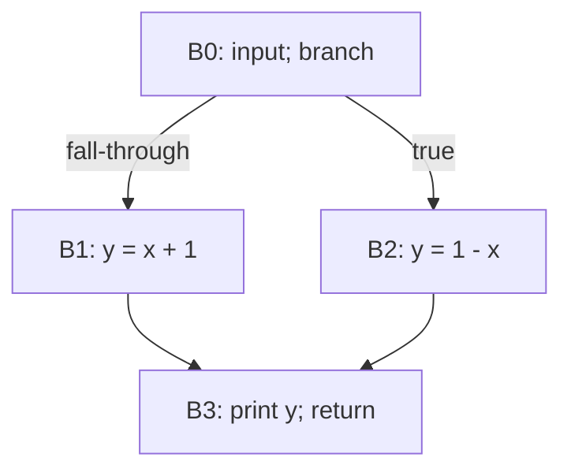

# Занятие 2. Лидеры и базовые блоки

> Как превратить линейный IR в максимальные прямолинейные участки

[← Карта курса](../course-map.md) · [Предыдущее занятие](../modules/01-pipeline-and-diagnostic.md) · [Следующее занятие](../modules/03-building-cfg.md)

## Результат занятия

| **К концу обязательной части.** Ты безошибочно находишь лидеры, границы и содержимое базовых блоков в линейном коде с условными и безусловными переходами. |
|------------------------------------------------------------------------------------------------------------------------------------------------------------|

| **Параметр**          | **Значение**                                        |
|-----------------------|-----------------------------------------------------|
| Сложность             | Лёгкий                                              |
| Обязательная нагрузка | 70–90 мин                                           |
| Перед началом         | Повтори путь компиляции за 3 минуты.                |
| Что подготовить      | разметку лидеров, таблицы блоков и два контрпримера |

| **Разрешённый режим.** Главное — научиться видеть границы, а не запоминать исключения. |
|----------------------------------------------------------------------------------------|

| **В этом занятии не требуется.** Не нужны exception edges, switch lowering и особенности пустых landing pads. |
|--------------------------------------------------------------------------------------------------------|

## Обязательный маршрут

| **Этап**           | **Время** | **Результат**                                           |
|--------------------|-----------|---------------------------------------------------------|
| Повторение         | 5–10 мин  | Не больше 3 коротких вопросов                           |
| Простое объяснение | 10–15 мин | Пересказать тему своими словами                         |
| Разобранный пример | 15–20 мин | Воспроизвести ключевые состояния                        |
| Задача A           | 20–25 мин | Обязательный минимум по образцу                         |
| Задача B           | 20–35 мин | Стандарт; можно завершить во второй короткой сессии     |
| Устный итог        | 5–10 мин  | 3 вопроса и самооценка светофором                       |
| Углубление         | 0–40 мин  | Задача C и профессиональные детали — только при ресурсе |

| **Когда запрашивать помощь.** После 10–15 минут честной попытки можно сразу зафиксировать точное место остановки и запросить разбор. Не нужно сначала мучительно завершать A и B. |
|----------------------------------------------------------------------------------------------------------------------------------------------------------|

## Короткое повторение

<table>
<colgroup>
<col style="width: 33%" />
<col style="width: 33%" />
<col style="width: 33%" />
</colgroup>
<thead>
<tr class="header">
<th><strong>Когда</strong></th>
<th><strong>Объём</strong></th>
<th><strong>Что сделать</strong></th>
</tr>
</thead>
<tbody>
<tr class="odd">
<td>Вчера</td>
<td>1–2 формулировки</td>
<td>• Frontend переводит текст в проверенное структурное представление; middle-end оптимизирует IR; backend понижает его к целевой машине. 
• Каждая граница представлений имеет вход, выход и проверяемые гарантии.</td>
</tr>
</tbody>
</table>

| **Ограничение.** На повторение не трать больше 10 минут. Не вспомнил — сделай попытку, посмотри ответ и верни карточку на следующее повторение. |
|-----------------------------------------------------------------------------------------------------------------------------------|

## Сначала простыми словами

Базовый блок — кусок линейного кода, который выполняется подряд. Если управление попало в первую инструкцию блока, оно дойдёт до его последней инструкции без прыжка в середину или выхода раньше времени.

Поэтому код режут в местах, куда можно прыгнуть, и сразу после инструкций, которые могут передать управление в другое место. Сначала найди лидеры, затем собери максимальные участки.

### Пять терминов занятия

| **Термин**     | **Моя формулировка одним предложением** |
|----------------|-----------------------------------------|
| лидер          |                                         |
| базовый блок   |                                         |
| терминатор     |                                         |
| fall-through   |                                         |
| максимальность |                                         |

## Минимум для запоминания

- Базовый блок — максимальная последовательность с входом только в первую инструкцию и выходом через терминатор последней.

- Лидеры: первая инструкция, цель перехода, инструкция после перехода.

- Терминатор всегда последний; условный терминатор может иметь несколько CFG-преемников.

| **Не учи дословно без смысла.** Сначала объясни формулировку своими словами на маленьком примере. Точная версия нужна после понимания. |
|----------------------------------------------------------------------------------------------------------------------------------------|

## Визуальная модель

*Рабочее представление темы занятия*

## Разобранный пример — проход по шагам

<table>
<colgroup>
<col style="width: 100%" />
</colgroup>
<thead>
<tr class="header">
<th>1: a = input() 
2: b = 0 
3: if a &lt; 0 goto Lneg 
4: b = a + 10 
5: goto Lend 
Lneg: 
6: b = 10 - a 
Lend: 
7: print b 
8: return</th>
</tr>
</thead>
<tbody>
</tbody>
</table>

Лидеры: инструкция 1; инструкция 4 после условного перехода; цель Lneg (6); инструкция после goto — метка Lneg, уже учтена; цель Lend (7). Получаются четыре блока: 1–3, 4–5, 6, 7–8.

| **Проверка понимания.** Закрой пример и объясни не итог, а почему выполняется каждый следующий шаг. Если не можешь — зафиксируй именно этот переход и запроси разбор. |
|------------------------------------------------------------------------------------------------------------------------------------------------------|

## Обязательная практика

### Задача A — обязательная по образцу: Разметка лидеров

| **Параметр**     | **Значение**                                                                     |
|------------------|----------------------------------------------------------------------------------|
| Статус           | Обязательно в этом занятии                                                              |
| Ориентир времени | 25 мин                                                                           |
| Что сдать        | каждый лидер обоснован одним из правил; блоки максимальны; терминаторы последние |

В примере выше выдели лидеры, подпиши основание для каждого и только затем сформируй блоки.

| **Подсказка 1.** Сначала выпиши только номера лидеров и основание для каждого. |
|--------------------------------------------------------------------------------|

## Стандартная практика

### Задача B — стандартная для закрепления: Новый линейный фрагмент

| **Параметр**     | **Значение**                                                                                      |
|------------------|---------------------------------------------------------------------------------------------------|
| Статус           | Нужно выполнить до следующей зависимой темы; можно во второй сессии                               |
| Ориентир времени | 35 мин                                                                                            |
| Что сдать        | не пропущен лидер после строки 6; указан fall-through; каждая инструкция принадлежит одному блоку |

<table>
<colgroup>
<col style="width: 100%" />
</colgroup>
<thead>
<tr class="header">
<th>Разбей на блоки: 
1: x = 0 
2: if p goto L1 
3: x = 1 
4: goto L2 
L1: 
5: x = 2 
6: if q goto L2 
7: x = 3 
L2: 
8: return x 
Составь таблицу `блок → инструкции → терминатор`.</th>
</tr>
</thead>
<tbody>
</tbody>
</table>

| **Подсказка 1.** Сначала выпиши только номера лидеров и основание для каждого. |
|--------------------------------------------------------------------------------|

| **Подсказка 2.** Инструкция после любого терминатора не может остаться в том же блоке. |
|----------------------------------------------------------------------------------------|

## Три вопроса на выходе

| **Вопрос**                                                     | **Результат retrieval**         |
|----------------------------------------------------------------|---------------------------------|
| Почему цель перехода обязана начинать блок?                    | □ ≤15 с □ с паузой □ не ответил |
| Почему инструкция после условного перехода становится лидером? | □ ≤15 с □ с паузой □ не ответил |
| Может ли в середине блока находиться метка?                    | □ ≤15 с □ с паузой □ не ответил |

## Светофор понимания

| **Состояние** | **Что это означает**                                    | **Следующее действие**                                                  |
|---------------|---------------------------------------------------------|-------------------------------------------------------------------------|
| Зелёный       | Могу объяснить и решить A/B с незначительной проверкой. | Перейти дальше; C только по желанию.                                    |
| Жёлтый        | Понимаю идею, но теряю один шаг или термин.             | Разобрать уменьшенный пример с преподавателем или свериться с эталоном; B можно закончить во второй сессии. |
| Красный       | Не могу объяснить причинную модель или начать A.        | Не переходить дальше; зафиксировать попытку и запросить разбор после 10–15 минут.                   |

| **Минимум занятия.** Занятие засчитывается, если понятна причинная модель, воспроизведён пример и выполнена задача A. Задача B должна быть закрыта до следующей темы, которая на неё опирается. |
|------------------------------------------------------------------------------------------------------------------------------------------------------------------------------------------|

## Справочник и углубление — читать по необходимости

| **Это необязательная часть первого прохода.** Открывай её, если простого объяснения недостаточно, при проверке решения или когда остались силы. Профессиональные оговорки не являются обязательным минимумом занятия. |
|--------------------------------------------------------------------------------------------------------------------------------------------------------------------------------------------------------------|

### Подробная теория

#### Модель базового блока

**Базовый блок** — максимальная последовательность инструкций, в которую управление может войти только через первую инструкцию, а покинуть последовательность — только через терминатор последней инструкции. Условный терминатор может иметь два и более CFG-преемника; «одна точка выхода» не означает «одно исходящее ребро».

Слово «максимальная» важно: нельзя произвольно дробить каждую инструкцию в отдельный блок, если задача требует классического разбиения. Такое дробление сохраняет граф, но усложняет анализ и скрывает естественные единицы преобразования.

#### Правила лидеров

Первая инструкция функции — лидер. Цель любого явного перехода — лидер. Инструкция сразу после условного или безусловного перехода — лидер, если она существует. В IR с исключениями, вызовами с особыми выходами или switch появляются дополнительные правила, но для зачёта начни с классической тройки.

После нахождения лидеров каждый блок начинается с лидера и продолжается до инструкции перед следующим лидером включительно. Последняя инструкция блока — **терминатор**: условный переход, безусловный переход, return, throw или неявный fall-through к следующему блоку.

#### Инварианты

У каждой инструкции ровно один владеющий блок. У метки, являющейся целью перехода, начало блока. Терминатор стоит последним. Инструкция после терминатора не может оставаться в том же блоке, даже если текст расположен рядом.

Пустые метки обычно схлопывают или представляют пустыми блоками в зависимости от IR-контракта. На бумаге всегда явно укажи, как ты интерпретировал последовательные метки.

## Алгоритм на одной странице

| **Поле**          | **Содержание**                                                                                     |
|-------------------|----------------------------------------------------------------------------------------------------|
| Название          | Разбиение линейного IR на базовые блоки                                                            |
| Вход              | Линейный список инструкций с метками и терминаторами.                                              |
| Результат         | Упорядоченный список максимальных базовых блоков.                                                  |
| Инвариант         | Обработанная инструкция принадлежит ровно одному блоку; новая точка входа всегда является лидером. |
| Условие остановки | Все инструкции распределены, все цели переходов начинают блок.                                     |
| Сложность         | O(N + J), где N — инструкции, J — переходы.                                                        |

1.  Отметить первую инструкцию лидером.

2.  Отметить каждую цель явного перехода.

3.  Отметить инструкцию после каждого перехода, если она существует.

4.  Начать блок в каждом лидере и закончить перед следующим лидером.

5.  Проверить, что терминатор последний и инструкции покрыты ровно один раз.

### Допущения учебного IR на сегодня

- У каждого базового блока ровно один терминатор; терминатор является последней инструкцией блока.

- Деление может завершиться наблюдаемой ошибкой при нуле. Его нельзя безусловно удалять или выносить, пока не доказаны безопасность и допустимость спекуляции.

- print, store, volatile/atomic операции и неизвестный вызов имеют наблюдаемый эффект. Вызов считается чистым только при явной пометке pure/readonly в условии.

### Дополнительная задача

### Задача C — необязательный перенос: Контрпримеры

| **Параметр**     | **Значение**                                |
|------------------|---------------------------------------------|
| Статус           | Только если осталось внимание               |
| Ориентир времени | 20 мин                                      |
| Что сдать        | 2 контрпримера; назван нарушенный инвариант |

Придумай два неправильных разбиения: одно объединяет инструкции через терминатор, другое дробит максимальный блок без причины. Объясни, какой инвариант нарушен.

| **Подсказка 1.** Сначала выпиши только номера лидеров и основание для каждого. |
|--------------------------------------------------------------------------------|

| **Подсказка 2.** Инструкция после любого терминатора не может остаться в том же блоке. |
|----------------------------------------------------------------------------------------|

### Полная устная проверка

| **Вопрос**                                                     | **Результат retrieval**         |
|----------------------------------------------------------------|---------------------------------|
| Почему цель перехода обязана начинать блок?                    | □ ≤15 с □ с паузой □ не ответил |
| Почему инструкция после условного перехода становится лидером? | □ ≤15 с □ с паузой □ не ответил |
| Может ли в середине блока находиться метка?                    | □ ≤15 с □ с паузой □ не ответил |
| Что означает максимальность блока?                             | □ ≤15 с □ с паузой □ не ответил |
| Как представить fall-through?                                  | □ ≤15 с □ с паузой □ не ответил |

### Журнал ошибок

| **Ошибка / сомнение** | **Первый нарушенный инвариант** | **Исправленное правило** | **Новый пример / итерация** |
|-----------------------|---------------------------------|--------------------------|-------------------------|
|                       |                                 |                          |                         |
|                       |                                 |                          |                         |
|                       |                                 |                          |                         |
|                       |                                 |                          |                         |
|                       |                                 |                          |                         |

### План повторения

| **Когда**    | **Что повторить**                                                         |
|--------------|---------------------------------------------------------------------------|
| Завтра       | 3 пункта минимального блока и задача A.                                   |
| Через 3 дня  | Один алгоритм или стандартная задача B.                                   |
| Через 7 дней | За 90 секунд назови три правила лидеров и точное определение basic block. |

### Как получить обратную связь

**Сообщение для начала ежедневной сессии**

<table>
<colgroup>
<col style="width: 100%" />
</colgroup>
<thead>
<tr class="header">
<th>Я работаю по документу «Лидеры и базовые блоки» (версия 3.0). Я могу обратиться уже после 10–15 минут честной попытки. 
 
Моя текущая зона: зелёная / жёлтая / красная. 
Моя попытка и точное место остановки: ... 
 
Работай так: 
1. Сначала проверь мою причинную модель простым вопросом, не выдавая решение. 
2. Если модель неверна, объясни тему на одном меньшем примере и попроси меня пересказать. 
3. Найди только первую существенную ошибку: место, нарушенный инвариант и минимальный контрпример. 
4. Дай мне исправить её самостоятельно. 
5. После исправления дай одну короткую задачу на перенос. 
6. В конце назови: что я уже понимаю, что пока понимаю с подсказкой и что повторить на следующей сессии.</th>
</tr>
</thead>
<tbody>
</tbody>
</table>

## Точечное чтение

- Cooper & Torczon — basic blocks and control-flow graphs.

| **Стоп чтения.** Прекрати чтение, когда можешь воспроизвести определение/алгоритм и решить задачу B. Дополнительные страницы не заменяют практику. |
|----------------------------------------------------------------------------------------------------------------------------------------------------|
