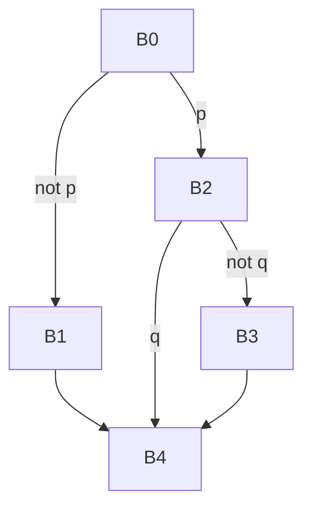

# Занятие 3. CFG и достижимость

> Граф отвечает не за расположение текста, а за возможные следующие блоки

[← Карта курса](../course-map.md) · [Предыдущее занятие](../modules/02-leaders-and-basic-blocks.md) · [Следующее занятие](../modules/04-dominators.md)

## Результат занятия

Ты строишь CFG, таблицы `pred/succ`, находишь entry, exits и недостижимые блоки.

**Перед началом:** уметь строить базовые блоки.

## Зачем это вообще нужно

Линейный порядок блоков не равен порядку выполнения. Для анализа нужна явная карта всех непосредственных переходов.

## Термины до заданий

| Термин | Простое объяснение | Точная опора |
|---|---|---|
| **CFG — control-flow graph** | граф возможных переходов управления | вершины — базовые блоки, рёбра — возможный непосредственный переход |
| **entry — вход** | первый блок функции | начальная вершина анализа достижимости |
| **exit — выход** | блок, после которого функция не продолжает обычное выполнение | обычно содержит `return`, `throw` или иной выход |
| **predecessor — предшественник** | блок с ребром в текущий блок | `u ∈ pred(v)` тогда и только тогда, когда `u → v` |
| **successor — последователь** | блок, который может выполняться следующим | `v ∈ succ(u)` тогда и только тогда, когда `u → v` |

Сначала прочитай готовые объяснения. Затем закрой таблицу и сформулируй каждый термин своими словами. Пустая формулировка ученика — это проверка после обучения, а не замена обучения.

## Первая модель

## Разобранный пример: состояние за состоянием

| Блок | succ | pred |
|---|---|---|
| B0 | B1, B2 | — |
| B1 | B4 | B0 |
| B2 | B3, B4 | B0 |
| B3 | B4 | B2 |
| B4 | — | B1, B2, B3 |

Обход от `B0`: сначала помечаем `B0`, затем добавляем `B1/B2`; из них достигаются `B3/B4`. Блок, отсутствующий в visited, недостижим независимо от места в файле.

## Формальное правило

Для каждого терминатора перечисли все возможные следующие блоки. После построения проверь симметрию: `v ∈ succ(u) ⇔ u ∈ pred(v)`. Достижимость — обычный DFS/BFS от entry по `succ`.

## Типичные ошибки

- Рисовать ребро по соседству строк после безусловного `goto`.
- Забывать ложную ветвь условного перехода.
- Считать блок достижимым только потому, что он напечатан между достижимыми блоками.

## Задача A — по образцу

Для блоков из задачи занятия 2 построй `succ` и `pred`, подпиши истинные и fall-through рёбра.

Проверка задачи A — открывать после попытки

`B0→B2(p), B0→B1(!p); B1→B4; B2→B4(q), B2→B3(!q); B3→B4`. Таблица pred получается обращением этих рёбер.

## Задача B — перенос на новый пример

Добавь блок `Dead: print 100; return`, который расположен после `goto B4`, но не является целью ни одного перехода. Проведи DFS и объясни результат.

Проверка задачи B — открывать после попытки

`Dead` не попадает в visited: линейное соседство после безусловного перехода не создаёт ребро.

## Проверка на выходе

**Что утверждает ребро CFG?**  

**Чем pred отличается от succ?**  

**Как доказать недостижимость?**  

Короткие ответы

**Что утверждает ребро CFG?**  
После выполнения источника управление может непосредственно перейти к цели.

**Чем pred отличается от succ?**  
Это одно ребро, рассматриваемое со стороны входа или выхода.

**Как доказать недостижимость?**  
Показать, что обход от entry не посещает блок; эквивалентно, пути от entry нет.

## Профессиональная граница

CFG может включать exceptional и indirect edges. Анализ корректен только относительно полного набора рёбер, заданного контрактом IR.
