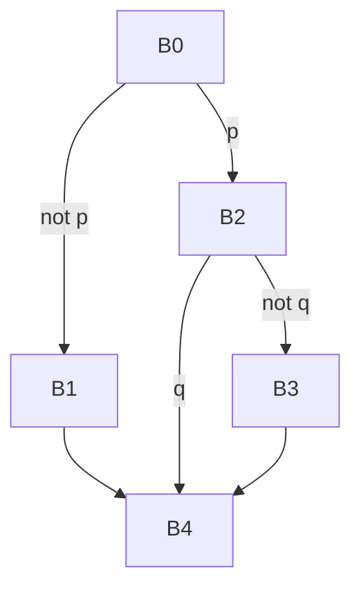

# Занятие 3. CFG и достижимость

> Граф отвечает не за расположение текста, а за возможные следующие блоки

[← Карта курса](../course-map.md) · [Предыдущее занятие](../modules/02-leaders-and-basic-blocks.md) · [Следующее занятие](../modules/04-dominators.md)

## Результат занятия

Ты строишь CFG и таблицы предшественников и последователей, находишь входной и выходные блоки, а также недостижимые участки.

**Перед началом:** уметь строить базовые блоки.

## Зачем это вообще нужно

Линейный порядок блоков не равен порядку выполнения. Для анализа нужна явная карта всех непосредственных переходов.

## Термины до заданий

| Термин | Простое объяснение | Точная опора |
|---|---|---|
| **CFG — граф потока управления** (*control-flow graph*) | показывает возможные переходы между базовыми блоками | вершины — базовые блоки, рёбра — возможные непосредственные переходы управления |
| **Входной блок** (*entry*) | первый блок функции | начальная вершина анализа достижимости |
| **Выходной блок** (*exit*) | блок, после которого обычное выполнение функции не продолжается | обычно заканчивается `return`, `throw` или другим завершением |
| **Предшественник** (*predecessor*) | блок, из которого можно непосредственно перейти в текущий | `u ∈ pred(v)` тогда и только тогда, когда существует ребро `u → v` |
| **Последователь** (*successor*) | блок, который может выполняться следующим | `v ∈ succ(u)` тогда и только тогда, когда существует ребро `u → v` |

Сначала прочитай объяснения. Затем закрой таблицу и перескажи термины своими словами. Это проверка понимания, а не попытка угадать определение.

## Ключевая схема

## Пошаговый разбор

| Блок | Последователи | Предшественники |
|---|---|---|
| B0 | B1, B2 | — |
| B1 | B4 | B0 |
| B2 | B3, B4 | B0 |
| B3 | B4 | B2 |
| B4 | — | B1, B2, B3 |

Обход от `B0`: сначала помечаем `B0`, затем добавляем `B1` и `B2`; из них достигаются `B3/B4`. Блок, которого нет во множестве посещённых вершин, недостижим независимо от его положения в файле.

## Формальное правило

Для каждого терминатора перечисли все возможные следующие блоки. После построения проверь симметрию: `v ∈ succ(u) ⇔ u ∈ pred(v)`. Достижимость вычисляется поиском в глубину или в ширину из входного блока по рёбрам к последователям.

## Типичные ошибки

- Рисовать ребро по соседству строк после безусловного `goto`.
- Забывать ложную ветвь условного перехода.
- Считать блок достижимым только потому, что он напечатан между достижимыми блоками.

## Задача A — по образцу

Для блоков из задачи занятия 2 построй множества последователей и предшественников, подпиши рёбра истинной ветви и переходы к следующему блоку.

Проверка задачи A — открывать после попытки

`B0→B2(p), B0→B1(!p); B1→B4; B2→B4(q), B2→B3(!q); B3→B4`. Множества предшественников получаются обращением этих рёбер.

## Самостоятельная задача

Добавь блок `Dead: print 100; return`, который расположен после `goto B4`, но не является целью ни одного перехода. Проведи DFS и объясни результат.

Проверка задачи B — открывать после попытки

`Dead` не попадает во множество посещённых вершин: линейное соседство после безусловного перехода не создаёт ребро.

## Проверь себя

**Что утверждает ребро CFG?**  

**Чем множество предшественников отличается от множества последователей?**  

**Как доказать недостижимость?**  

Короткие ответы

**Что утверждает ребро CFG?**  
После выполнения источника управление может непосредственно перейти к цели.

**Чем множество предшественников отличается от множества последователей?**  
Это одно ребро, рассматриваемое со стороны входа или выхода.

**Как доказать недостижимость?**  
Показать, что обход из входного блока не посещает этот блок; это равносильно отсутствию пути от входа.

## Как это устроено в промышленном компиляторе

CFG может включать рёбра исключений и косвенные переходы. Анализ корректен только относительно полного набора рёбер, заданного контрактом IR.
