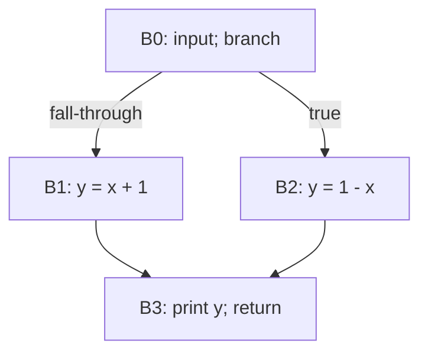

# Занятие 3. Построение CFG и достижимость

> От блоков к графу возможных путей выполнения

[← Карта курса](../course-map.md) · [Предыдущее занятие](../modules/02-leaders-and-basic-blocks.md) · [Следующее занятие](../modules/04-dominators.md)

## Сегодняшний результат

| **К концу обязательной части.** Ты строишь полный CFG, различаешь рёбра перехода и fall-through, находишь вход, выходы, предшественников, последователей и недостижимые блоки. |
|--------------------------------------------------------------------------------------------------------------------------------------------------------------------------------|

| **Параметр**          | **Значение**                                                |
|-----------------------|-------------------------------------------------------------|
| Сложность             | Средний                                                     |
| Обязательная нагрузка | 75–95 мин                                                   |
| Перед началом         | Уметь разбивать линейный IR на базовые блоки.               |
| Что подготовить      | рисунок CFG, таблицу pred/succ и трассу обхода достижимости |

| **Разрешённый режим.** Сначала строй рёбра, затем отдельно проверяй pred/succ. |
|--------------------------------------------------------------------------------|

| **В этом занятии не требуется.** Не нужны postdominators и control dependence. |
|-------------------------------------------------------------------------|

## Обязательный маршрут

| **Этап**           | **Время** | **Результат**                                           |
|--------------------|-----------|---------------------------------------------------------|
| Повторение         | 5–10 мин  | Не больше 3 коротких вопросов                           |
| Простое объяснение | 10–15 мин | Пересказать тему своими словами                         |
| Разобранный пример | 15–20 мин | Воспроизвести ключевые состояния                        |
| Задача A           | 20–25 мин | Обязательный минимум по образцу                         |
| Задача B           | 20–35 мин | Стандарт; можно завершить во второй короткой сессии     |
| Устный итог        | 5–10 мин  | 3 вопроса и самооценка светофором                       |
| Углубление         | 0–40 мин  | Задача C и профессиональные детали — только при ресурсе |

| **Когда запрашивать помощь.** После 10–15 минут честной попытки можно сразу зафиксировать точное место остановки и запросить разбор. Не нужно сначала мучительно завершать A и B. |
|----------------------------------------------------------------------------------------------------------------------------------------------------------|

## Короткое повторение

<table>
<colgroup>
<col style="width: 33%" />
<col style="width: 33%" />
<col style="width: 33%" />
</colgroup>
<thead>
<tr class="header">
<th><strong>Когда</strong></th>
<th><strong>Объём</strong></th>
<th><strong>Что сделать</strong></th>
</tr>
</thead>
<tbody>
<tr class="odd">
<td>Вчера</td>
<td>1–2 формулировки</td>
<td>• Базовый блок — максимальная последовательность с входом только в первую инструкцию и выходом через терминатор последней. 
• Лидеры: первая инструкция, цель перехода, инструкция после перехода.</td>
</tr>
</tbody>
</table>

| **Ограничение.** На повторение не трать больше 10 минут. Не вспомнил — сделай попытку, посмотри ответ и верни карточку на следующее повторение. |
|-----------------------------------------------------------------------------------------------------------------------------------|

## Сначала простыми словами

CFG — карта возможных переходов между базовыми блоками. Вершина говорит «какой прямолинейный кусок выполняется», ребро — «какой блок может быть следующим».

Строй граф буквально по терминаторам. После этого проверь две вещи: каждое возможное продолжение отражено ребром, а pred и succ описывают одни и те же рёбра с двух сторон.

### Пять терминов занятия

| **Термин**  | **Моя формулировка одним предложением** |
|-------------|-----------------------------------------|
| CFG         |                                         |
| entry       |                                         |
| exit        |                                         |
| predecessor |                                         |
| successor   |                                         |

## Минимум для запоминания

- CFG: вершины — базовые блоки, рёбра — возможная непосредственная передача управления.

- Для каждого u→v: v в succ(u) и u в pred(v).

- Достижимость доказывается путём от entry, а не текстовым положением.

| **Не учи дословно без смысла.** Сначала объясни формулировку своими словами на маленьком примере. Точная версия нужна после понимания. |
|----------------------------------------------------------------------------------------------------------------------------------------|

## Визуальная модель

*Рабочее представление темы занятия*

## Разобранный пример — проход по шагам

<table>
<colgroup>
<col style="width: 100%" />
</colgroup>
<thead>
<tr class="header">
<th>B0: 
x = input() 
if x == 0 goto B2 
B1: 
y = 10 / x 
goto B3 
B2: 
y = 0 
B3: 
print y 
return</th>
</tr>
</thead>
<tbody>
</tbody>
</table>

Рёбра: B0→B2 по истинной ветви и B0→B1 по fall-through; B1→B3; B2→B3. B3 — выход. Предшественники B3: B1, B2.

| **Проверка понимания.** Закрой пример и объясни не итог, а почему выполняется каждый следующий шаг. Если не можешь — зафиксируй именно этот переход и запроси разбор. |
|------------------------------------------------------------------------------------------------------------------------------------------------------|

## Обязательная практика

### Задача A — обязательная по образцу: CFG с таблицей рёбер

| **Параметр**     | **Значение**                                                        |
|------------------|---------------------------------------------------------------------|
| Статус           | Обязательно в этом занятии                                                 |
| Ориентир времени | 35 мин                                                              |
| Что сдать        | все переходы отражены; fall-through подписан; pred/succ симметричны |

<table>
<colgroup>
<col style="width: 100%" />
</colgroup>
<thead>
<tr class="header">
<th>Построй CFG для следующего полностью приведённого фрагмента и затем выпиши `pred/succ` каждого блока: 
1: x = 0 
2: if p goto L1 
3: x = 1 
4: goto L2 
L1: 
5: x = 2 
6: if q goto L2 
7: x = 3 
L2: 
8: return x</th>
</tr>
</thead>
<tbody>
</tbody>
</table>

| **Подсказка 1.** Для каждого терминатора отдельно выпиши возможные следующие блоки. |
|-------------------------------------------------------------------------------------|

## Стандартная практика

### Задача B — стандартная для закрепления: Достижимость

| **Параметр**     | **Значение**                                                        |
|------------------|---------------------------------------------------------------------|
| Статус           | Нужно выполнить до следующей зависимой темы; можно во второй сессии |
| Ориентир времени | 25 мин                                                              |
| Что сдать        | порядок обхода; множество visited; вывод основан на пути            |

Добавь после безусловного перехода отдельный блок Dead: z = 100; print z. Покажи обход от entry и докажи, достижим ли Dead.

| **Подсказка 1.** Для каждого терминатора отдельно выпиши возможные следующие блоки. |
|-------------------------------------------------------------------------------------|

| **Подсказка 2.** После построения рёбер проверь равенство: \`v∈succ(u)\` тогда и только тогда, когда \`u∈pred(v)\`. |
|---------------------------------------------------------------------------------------------------------------------|

## Три вопроса на выходе

| **Вопрос**                                      | **Результат retrieval**         |
|-------------------------------------------------|---------------------------------|
| Что именно означает ребро CFG?                  | □ ≤15 с □ с паузой □ не ответил |
| Чем fall-through отличается от явного goto?     | □ ≤15 с □ с паузой □ не ответил |
| Почему текстовый порядок не равен достижимости? | □ ≤15 с □ с паузой □ не ответил |

## Светофор понимания

| **Состояние** | **Что это означает**                                    | **Следующее действие**                                                  |
|---------------|---------------------------------------------------------|-------------------------------------------------------------------------|
| Зелёный       | Могу объяснить и решить A/B с незначительной проверкой. | Перейти дальше; C только по желанию.                                    |
| Жёлтый        | Понимаю идею, но теряю один шаг или термин.             | Разобрать со мной уменьшенный пример; B можно закончить второй сессией. |
| Красный       | Не могу объяснить причинную модель или начать A.        | Не читать дальше; прислать попытку после 10–15 минут.                   |

| **Минимум занятия.** Занятие засчитывается, если понятна причинная модель, воспроизведён пример и выполнена задача A. Задача B должна быть закрыта до следующей темы, которая на неё опирается. |
|------------------------------------------------------------------------------------------------------------------------------------------------------------------------------------------|

## Справочник и углубление — читать по необходимости

| **Это необязательная часть первого прохода.** Открывай её, если простого объяснения недостаточно, при проверке решения или когда остались силы. Профессиональные оговорки не являются обязательным минимумом занятия. |
|--------------------------------------------------------------------------------------------------------------------------------------------------------------------------------------------------------------|

### Подробная теория

#### CFG как множество возможных трасс

**Control-flow graph** состоит из базовых блоков и ориентированных рёбер. Ребро B → C означает: после выполнения терминатора блока B управление может непосредственно перейти к первой инструкции C.

CFG не утверждает, что переход обязательно произойдёт на конкретном вводе. Он описывает **возможность**. Поэтому обе ветви условного перехода присутствуют, пока условие не доказано константным.

#### Как строить рёбра

Для безусловного goto L добавь одно ребро к блоку метки L. Для условного перехода добавь ребро к цели и ребро fall-through к следующему блоку. Для return рёбер к обычным блокам нет. Иногда добавляют синтетический exit, чтобы все возвраты сходились в одну вершину.

После построения полезно независимо заполнить succ и вывести из него pred, а не вести две структуры вручную без проверки. Симметрия множеств предшественников и последователей — простой верификатор графа.

#### Достижимость

Блок достижим, если существует путь от entry. Обход DFS/BFS по CFG находит достижимое множество. Текстовое расположение после входа не доказывает достижимость: безусловный переход может перепрыгнуть через код.

Недостижимый блок не обязательно сразу удалять при построении CFG. Часто построитель сохраняет его, а отдельный UCE-pass удаляет. Но анализы должны явно определить, учитывают ли они недостижимые вершины.

#### Частые ошибки

Забыто fall-through ребро; добавлено ребро после return; метка соединена с предыдущим блоком несмотря на безусловный переход; условие перепутано с направлением рёбер; недостижимость объявлена «на глаз» без обхода.

## Алгоритм на одной странице

| **Поле**          | **Содержание**                                                            |
|-------------------|---------------------------------------------------------------------------|
| Название          | Построение CFG                                                            |
| Вход              | Список базовых блоков и их терминаторы.                                   |
| Результат         | Множество вершин и рёбер, таблицы pred/succ, множество достижимых блоков. |
| Инвариант         | Каждое ребро объясняется семантикой терминатора.                          |
| Условие остановки | Все терминаторы обработаны, обход завершён, симметрия выполнена.          |
| Сложность         | O(V+E).                                                                   |

1.  Создать вершину на каждый блок.

2.  Для каждого терминатора добавить явные target-рёбра.

3.  Добавить fall-through, если он разрешён и терминатор его допускает.

4.  Одновременно заполнить pred и succ.

5.  Обойти граф от entry для reachability.

6.  Проверить симметрию pred/succ.

### Допущения учебного IR на сегодня

- У каждого базового блока ровно один терминатор; терминатор является последней инструкцией блока.

- Деление может завершиться наблюдаемой ошибкой при нуле. Его нельзя безусловно удалять или выносить, пока не доказаны безопасность и допустимость спекуляции.

- print, store, volatile/atomic операции и неизвестный вызов имеют наблюдаемый эффект. Вызов считается чистым только при явной пометке pure/readonly в условии.

### Дополнительная задача

### Задача C — необязательный перенос: Обратное восстановление

| **Параметр**     | **Значение**                                         |
|------------------|------------------------------------------------------|
| Статус           | Только если осталось внимание                        |
| Ориентир времени | 20 мин                                               |
| Что сдать        | терминатор каждого блока; минимум 2 линейных порядка |

По готовому CFG придумай допустимые терминаторы блоков. Обсуди, какие разные линейные порядки блоков кодируют тот же граф.

| **Подсказка 1.** Для каждого терминатора отдельно выпиши возможные следующие блоки. |
|-------------------------------------------------------------------------------------|

| **Подсказка 2.** После построения рёбер проверь равенство: \`v∈succ(u)\` тогда и только тогда, когда \`u∈pred(v)\`. |
|---------------------------------------------------------------------------------------------------------------------|

### Полная устная проверка

| **Вопрос**                                      | **Результат retrieval**         |
|-------------------------------------------------|---------------------------------|
| Что именно означает ребро CFG?                  | □ ≤15 с □ с паузой □ не ответил |
| Чем fall-through отличается от явного goto?     | □ ≤15 с □ с паузой □ не ответил |
| Почему текстовый порядок не равен достижимости? | □ ≤15 с □ с паузой □ не ответил |
| Как проверить согласованность pred/succ?        | □ ≤15 с □ с паузой □ не ответил |
| Зачем синтетический exit?                       | □ ≤15 с □ с паузой □ не ответил |

### Журнал ошибок

| **Ошибка / сомнение** | **Первый нарушенный инвариант** | **Исправленное правило** | **Новый пример / итерация** |
|-----------------------|---------------------------------|--------------------------|-------------------------|
|                       |                                 |                          |                         |
|                       |                                 |                          |                         |
|                       |                                 |                          |                         |
|                       |                                 |                          |                         |
|                       |                                 |                          |                         |

### План повторения

| **Когда**    | **Что повторить**                            |
|--------------|----------------------------------------------|
| Завтра       | 3 пункта минимального блока и задача A.      |
| Через 3 дня  | Один алгоритм или стандартная задача B.      |
| Через 7 дней | Для ромба \`A→B,C; B,C→D\` выпиши pred/succ. |

### Как получить обратную связь

**Сообщение для начала ежедневной сессии**

<table>
<colgroup>
<col style="width: 100%" />
</colgroup>
<thead>
<tr class="header">
<th>Я работаю по документу «Построение CFG и проверка достижимости» (версия 3.0). Я могу обратиться уже после 10–15 минут честной попытки. 
 
Моя текущая зона: зелёная / жёлтая / красная. 
Моя попытка и точное место остановки: ... 
 
Работай так: 
1. Сначала проверь мою причинную модель простым вопросом, не выдавая решение. 
2. Если модель неверна, объясни тему на одном меньшем примере и попроси меня пересказать. 
3. Найди только первую существенную ошибку: место, нарушенный инвариант и минимальный контрпример. 
4. Дай мне исправить её самостоятельно. 
5. После исправления дай одну короткую задачу на перенос. 
6. В конце назови: что я уже понимаю, что пока понимаю с подсказкой и что повторить на следующей сессии.</th>
</tr>
</thead>
<tbody>
</tbody>
</table>

## Точечное чтение

- Cooper & Torczon — CFG construction and reachability.

| **Стоп чтения.** Прекрати чтение, когда можешь воспроизвести определение/алгоритм и решить задачу B. Дополнительные страницы не заменяют практику. |
|----------------------------------------------------------------------------------------------------------------------------------------------------|
