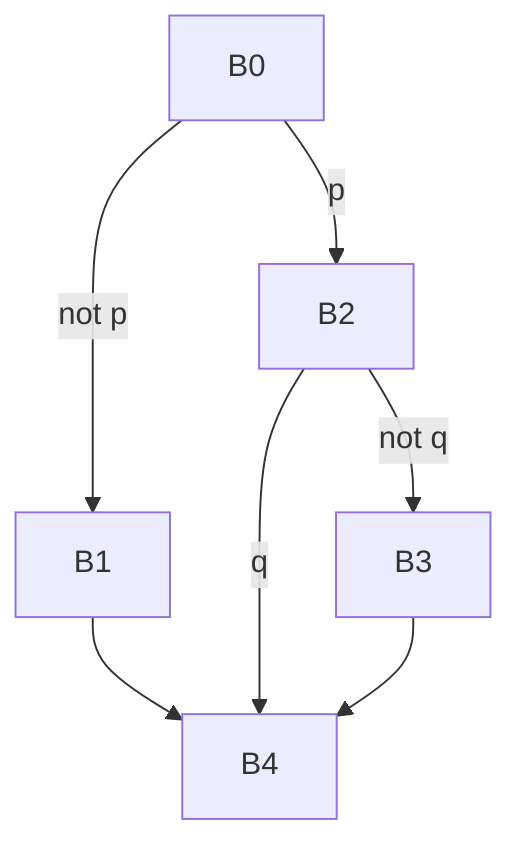

# Занятие 3. CFG и достижимость

> Граф отвечает не за расположение текста, а за возможные следующие блоки

[← Карта курса](../course-map.md) · [Предыдущее занятие](../modules/02-leaders-and-basic-blocks.md) · [Следующее занятие](../modules/04-dominators.md)

## Результат занятия

Ты строишь нормализованный CFG, таблицы предшественников и последователей, находишь входной и выходные блоки, а также недостижимые участки.

**Перед началом:** уметь строить и нормализовать базовые блоки. Используется [контракт учебного IR](../ir-contract.md#cfg).

## Зачем это вообще нужно

Линейный порядок блоков не равен порядку выполнения. Для анализа нужна явная карта всех непосредственных переходов. Поэтому сначала каждый неявный переход линейной записи заменяется `jump`, и только затем вычисляются `pred`, `succ` и достижимость.

## Термины до заданий

| Термин | Простое объяснение | Точная опора |
|---|---|---|
| **CFG — граф потока управления** (*control-flow graph*) | показывает возможные переходы между базовыми блоками | вершины — нормализованные базовые блоки, рёбра — цели их терминаторов |
| **Входной блок** (*entry*) | первый блок функции | начальная вершина анализа достижимости |
| **Выходной блок** (*exit*) | блок, после которого обычное выполнение функции не продолжается | заканчивается `return`, `unreachable` или другим терминатором без обычного продолжения |
| **Предшественник** (*predecessor*) | блок, из которого можно непосредственно перейти в текущий | `u ∈ pred(v)` тогда и только тогда, когда существует ребро `u → v` |
| **Последователь** (*successor*) | блок, который может выполняться следующим | `v ∈ succ(u)` тогда и только тогда, когда существует ребро `u → v` |

Сначала прочитай объяснения. Затем закрой таблицу и перескажи термины своими словами. Это проверка понимания, а не попытка угадать определение.

## Ключевая схема

Все шесть рёбер следуют из терминаторов нормализованных блоков. Положение блоков в файле больше не создаёт неявных рёбер.

## Пошаговый разбор

| Блок | Терминатор | Последователи | Предшественники |
|---|---|---|---|
| B0 | `branch p, B2, B1` | B1, B2 | — |
| B1 | `jump B4` | B4 | B0 |
| B2 | `branch q, B4, B3` | B3, B4 | B0 |
| B3 | `jump B4` | B4 | B2 |
| B4 | `return` | — | B1, B2, B3 |

Обход от `B0`: сначала помечаем `B0`, затем посещаем `B1` и `B2`; из них достигаются `B3` и `B4`. Блок, которого нет во множестве посещённых вершин, недостижим независимо от его положения в файле.

## Формальное правило

1. Для каждого нормализованного блока прочитай его терминатор.
2. Добавь ровно по одному ребру к каждой перечисленной цели.
3. Построй `succ` непосредственно по рёбрам.
4. Построй `pred` обращением тех же рёбер.
5. Проверь симметрию: `v ∈ succ(u) ⇔ u ∈ pred(v)`.
6. Выполни DFS или BFS из входного блока по `succ`; посещённые вершины и только они достижимы.

Не добавляй ребро только потому, что два блока расположены рядом. Соседство уже было учтено на этапе нормализации через явный `jump`.

## Типичные ошибки

- Рисовать ребро по соседству строк после безусловного `jump`.
- Забывать ложную ветвь условного перехода.
- Строить CFG до преобразования неявных переходов в явные.
- Считать блок достижимым только потому, что он напечатан между достижимыми блоками.

## Задача A — по образцу

Для нормализованных блоков из задачи занятия 2 построй множества последователей и предшественников, подпиши истинные и ложные ветви.

Проверка задачи A — открывать после попытки

`B0→B2(p), B0→B1(!p); B1→B4; B2→B4(q), B2→B3(!q); B3→B4`.

| Блок | `succ` | `pred` |
|---|---|---|
| B0 | {B1,B2} | ∅ |
| B1 | {B4} | {B0} |
| B2 | {B3,B4} | {B0} |
| B3 | {B4} | {B2} |
| B4 | ∅ | {B1,B2,B3} |

## Самостоятельная задача

Добавь нормализованный блок `Dead: print 100; return`, на который не ссылается ни один терминатор. Проведи DFS и объясни результат. Затем расположи `Dead` между B2 и B3 в тексте и проверь, изменился ли CFG.

Проверка задачи B — открывать после попытки

`Dead` не попадает во множество посещённых вершин: ни один терминатор достижимого блока не ведёт в него. Перестановка текста после нормализации не меняет рёбра CFG.

## Проверь себя

**Что утверждает ребро CFG?**  

**Откуда после нормализации берутся все рёбра?**  

**Как доказать недостижимость?**

Короткие ответы

**Что утверждает ребро CFG?**  
После выполнения источника управление может непосредственно перейти к цели.

**Откуда берутся рёбра?**  
Из целей единственного терминатора каждого нормализованного блока.

**Как доказать недостижимость?**  
Показать, что обход из входного блока не посещает этот блок; это равносильно отсутствию пути от входа.

## Как это устроено в промышленном компиляторе

CFG может включать рёбра исключений и косвенные переходы. Анализ корректен только относительно полного набора рёбер, заданного контрактом IR. Если исключительное управление является частью семантики IR, оно не может быть молча исключено из графа.
