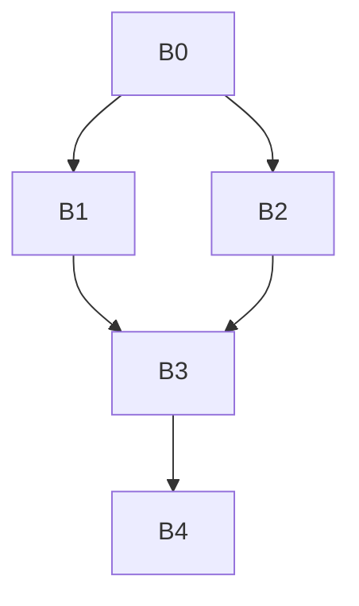

# Занятие 4. Доминирование

> Обязательные контрольные точки на всех путях от entry

[← Карта курса](../course-map.md) · [Предыдущее занятие](../modules/03-building-cfg.md) · [Следующее занятие](../modules/05-idom-tree-and-df.md)

## Результат занятия

Ты определяешь доминирование через пути и вычисляешь множества доминаторов до неподвижной точки.

**Перед началом:** CFG, pred и достижимость.

## Зачем это вообще нужно

Оптимизатору нужно знать, гарантированно ли определение выполнено раньше использования. Близость на рисунке этого не доказывает; нужна характеристика всех путей.

## Термины до заданий

| Термин | Простое объяснение | Точная опора |
|---|---|---|
| **доминирование** | блок нельзя обойти по пути к другой вершине | `D dom B`, если каждый путь от entry к B содержит D |
| **строгое доминирование** | доминирование другого блока, не самого себя | `D sdom B`, если D dom B и D ≠ B |
| **путь** | последовательность связанных рёбрами вершин | начинается в entry для определения доминирования |
| **неподвижная точка** | состояние, которое следующая итерация уже не меняет | остановка итерационного data-flow алгоритма |
| **контрпуть** | один путь, обходящий кандидата | достаточен, чтобы опровергнуть доминирование |

Сначала прочитай готовые объяснения. Затем закрой таблицу и сформулируй каждый термин своими словами. Пустая формулировка ученика — это проверка после обучения, а не замена обучения.

## Первая модель



`B0` доминирует всё. `B1` не доминирует `B3`, потому что есть путь `B0→B2→B3`.

## Разобранный пример: состояние за состоянием

Инициализация для достижимых блоков `R={B0,B1,B2,B3,B4}`:

| Итерация | Dom(B0) | Dom(B1) | Dom(B2) | Dom(B3) | Dom(B4) |
|---|---|---|---|---|---|
| 0 | {B0} | R | R | R | R |
| 1 | {B0} | {B0,B1} | {B0,B2} | {B0,B3} | {B0,B3,B4} |
| 2 | без изменений | без изменений | без изменений | без изменений | без изменений |

Для `B3`: пересекаем `Dom(B1)` и `Dom(B2)`, остаётся `{B0}`, затем добавляем сам `B3`.

## Формальное правило

```text
Dom(entry) = {entry}
Dom(B) = {B} ∪ ⋂ Dom(P),  P ∈ pred(B)
```

Для остальных блоков начни с множества всех достижимых вершин и повторяй пересчёт, пока ни одно множество не меняется.

## Типичные ошибки

- Использовать объединение вместо пересечения.
- Включать недостижимые вершины в универсальное множество.
- Забывать, что блок доминирует сам себя.
- Доказывать истинность одним путём: один путь годится только для опровержения.

## Задача A — по образцу

Воспроизведи таблицу выше без подглядывания и объясни каждое удаление из `Dom(B3)`.

<details>
<summary>Проверка задачи A — открывать после попытки</summary>

`B1` удаляется из-за predecessor `B2`, `B2` — из-за predecessor `B1`; общим остаётся `B0`, затем добавляется `B3`.

</details>

## Задача B — перенос на новый пример

Добавь ребро `B4→B3`. Пересчитай Dom и объясни, почему `B4` всё равно не доминирует `B3`.

<details>
<summary>Проверка задачи B — открывать после попытки</summary>

Множества не меняются. Первый вход в `B3` возможен через `B1` или `B2` до посещения `B4`; контрпуть `B0→B1→B3` обходит `B4`.

</details>

## Проверка на выходе

**Почему в формуле пересечение?**  


**Доминирует ли блок сам себя?**  


**Как быстро опровергнуть доминирование?**  


<details>
<summary>Короткие ответы</summary>

**Почему в формуле пересечение?**  
Доминатор обязан присутствовать для каждого predecessor и, следовательно, на всех входящих путях.

**Доминирует ли блок сам себя?**  
Да, каждый путь к блоку содержит сам блок в конце.

**Как быстро опровергнуть доминирование?**  
Предъявить один путь от entry к цели, который не проходит через кандидата.

</details>

## Профессиональная граница

Промышленные компиляторы используют более быстрые алгоритмы, но итерационная версия лучше показывает смысл уравнений и неподвижной точки.
