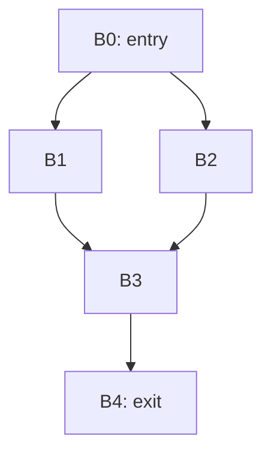

# Занятие 4. Доминирование

> Какие блоки неизбежно встречаются на пути к данной точке

[← Карта курса](../course-map.md) · [Предыдущее занятие](../modules/03-building-cfg.md) · [Следующее занятие](../modules/05-idom-tree-and-df.md)

## Сегодняшний результат

| **К концу обязательной части.** Ты объясняешь доминирование через пути и вручную вычисляешь множества доминаторов итерационным алгоритмом. |
|--------------------------------------------------------------------------------------------------------------------------------------------|

| **Параметр**          | **Значение**                                                        |
|-----------------------|---------------------------------------------------------------------|
| Сложность             | Средний+                                                            |
| Обязательная нагрузка | 80–100 мин                                                          |
| Перед началом         | Уверенно строить CFG и находить достижимые вершины.                 |
| Что подготовить      | таблицу итераций Dom и доказательства/контрпримеры для заданных пар |

| **Разрешённый режим.** Не угадывай по рисунку: проверяй все пути. |
|-------------------------------------------------------------------|

| **В этом занятии не требуется.** Не нужно доказывать теоремы о решётках и оптимальности алгоритмов dominators. |
|---------------------------------------------------------------------------------------------------------|

## Обязательный маршрут

| **Этап**           | **Время** | **Результат**                                           |
|--------------------|-----------|---------------------------------------------------------|
| Повторение         | 5–10 мин  | Не больше 3 коротких вопросов                           |
| Простое объяснение | 10–15 мин | Пересказать тему своими словами                         |
| Разобранный пример | 15–20 мин | Воспроизвести ключевые состояния                        |
| Задача A           | 20–25 мин | Обязательный минимум по образцу                         |
| Задача B           | 20–35 мин | Стандарт; можно завершить во второй короткой сессии     |
| Устный итог        | 5–10 мин  | 3 вопроса и самооценка светофором                       |
| Углубление         | 0–40 мин  | Задача C и профессиональные детали — только при ресурсе |

| **Когда запрашивать помощь.** После 10–15 минут честной попытки можно сразу зафиксировать точное место остановки и запросить разбор. Не нужно сначала мучительно завершать A и B. |
|----------------------------------------------------------------------------------------------------------------------------------------------------------|

## Короткое повторение

<table>
<colgroup>
<col style="width: 33%" />
<col style="width: 33%" />
<col style="width: 33%" />
</colgroup>
<thead>
<tr class="header">
<th><strong>Когда</strong></th>
<th><strong>Объём</strong></th>
<th><strong>Что сделать</strong></th>
</tr>
</thead>
<tbody>
<tr class="odd">
<td>Вчера</td>
<td>1–2 формулировки</td>
<td>• CFG: вершины — базовые блоки, рёбра — возможная непосредственная передача управления. 
• Для каждого u→v: v в succ(u) и u в pred(v).</td>
</tr>
<tr class="even">
<td>3 дня назад</td>
<td>1 формулировка</td>
<td>Frontend переводит текст в проверенное структурное представление; middle-end оптимизирует IR; backend понижает его к целевой машине.</td>
</tr>
</tbody>
</table>

| **Ограничение.** На повторение не трать больше 10 минут. Не вспомнил — сделай попытку, посмотри ответ и верни карточку на следующее повторение. |
|-----------------------------------------------------------------------------------------------------------------------------------|

## Сначала простыми словами

Блок A доминирует блок B, если до B нельзя добраться, минуя A. Представь A как обязательный пропускной пункт на всех маршрутах от входа к B.

Доминирование нельзя надёжно определять «по картинке». Для каждого кандидата мысленно убери его: если остаётся путь от entry к B, кандидат не доминирует B.

### Пять терминов занятия

| **Термин**            | **Моя формулировка одним предложением** |
|-----------------------|-----------------------------------------|
| доминирование         |                                         |
| строгое доминирование |                                         |
| путь                  |                                         |
| неподвижная точка     |                                         |
| достижимость          |                                         |

## Минимум для запоминания

- A доминирует B, если A лежит на каждом пути от entry к B.

- Dom(entry)={entry}; для остальных Dom(B)={B}∪пересечение Dom(pred).

- Итерации продолжаются до неподвижной точки.

| **Не учи дословно без смысла.** Сначала объясни формулировку своими словами на маленьком примере. Точная версия нужна после понимания. |
|----------------------------------------------------------------------------------------------------------------------------------------|

## Визуальная модель

*Рабочее представление темы занятия*

## Разобранный пример — проход по шагам

<table>
<colgroup>
<col style="width: 100%" />
</colgroup>
<thead>
<tr class="header">
<th>CFG: 
B0 -&gt; B1, B2 
B1 -&gt; B3 
B2 -&gt; B3 
B3 -&gt; B4</th>
</tr>
</thead>
<tbody>
</tbody>
</table>

Dom(B1)={B0,B1}, Dom(B2)={B0,B2}. Для B3 пересечение доминаторов B1 и B2 даёт только B0, поэтому Dom(B3)={B0,B3}. Далее Dom(B4)={B0,B3,B4}.

1.  1\. Запиши все пути от entry к выбранному блоку или используй итерационную таблицу.

2.  2\. Для entry оставь только entry. Для остальных сначала предположи множество всех достижимых блоков.

3.  3\. На каждой итерации пересекай множества доминаторов всех predecessors и добавляй сам блок.

4.  4\. Остановись, когда ни одно множество не изменилось.

5.  5\. Проверь каждый неожиданный доминатор контрмаршрутом.

| **Проверка понимания.** Закрой пример и объясни не итог, а почему выполняется каждый следующий шаг. Если не можешь — зафиксируй именно этот переход и запроси разбор. |
|------------------------------------------------------------------------------------------------------------------------------------------------------|

## Обязательная практика

### Задача A — обязательная по образцу: Таблица итераций

| **Параметр**     | **Значение**                                                               |
|------------------|----------------------------------------------------------------------------|
| Статус           | Обязательно в этом занятии                                                        |
| Ориентир времени | 40 мин                                                                     |
| Что сдать        | инициализация; минимум один полный проход; явно отмечена неподвижная точка |

Для CFG из примера выпиши начальную таблицу Dom, затем каждый проход до стабилизации. Не перескакивай сразу к ответу.

| **Подсказка 1.** Начни с максимальной инициализации Dom для всех не-entry блоков. |
|-----------------------------------------------------------------------------------|

## Стандартная практика

### Задача B — стандартная для закрепления: Проверка через пути

| **Параметр**     | **Значение**                                                             |
|------------------|--------------------------------------------------------------------------|
| Статус           | Нужно выполнить до следующей зависимой темы; можно во второй сессии      |
| Ориентир времени | 25 мин                                                                   |
| Что сдать        | для ложного утверждения дан путь; для истинного рассмотрены все варианты |

Для каждой пары B0 dom B4, B1 dom B3, B3 dom B4 либо докажи доминирование, либо предъяви путь-контрпример.

| **Подсказка 1.** Начни с максимальной инициализации Dom для всех не-entry блоков. |
|-----------------------------------------------------------------------------------|

| **Подсказка 2.** Спорную пару проверяй одним путём, который может обойти предполагаемый доминатор. |
|----------------------------------------------------------------------------------------------------|

## Три вопроса на выходе

| **Вопрос**                                           | **Результат retrieval**         |
|------------------------------------------------------|---------------------------------|
| Достаточно ли одного пути через D для доминирования? | □ ≤15 с □ с паузой □ не ответил |
| Почему используется пересечение, а не объединение?   | □ ≤15 с □ с паузой □ не ответил |
| Доминирует ли блок сам себя?                         | □ ≤15 с □ с паузой □ не ответил |

## Светофор понимания

| **Состояние** | **Что это означает**                                    | **Следующее действие**                                                  |
|---------------|---------------------------------------------------------|-------------------------------------------------------------------------|
| Зелёный       | Могу объяснить и решить A/B с незначительной проверкой. | Перейти дальше; C только по желанию.                                    |
| Жёлтый        | Понимаю идею, но теряю один шаг или термин.             | Разобрать со мной уменьшенный пример; B можно закончить второй сессией. |
| Красный       | Не могу объяснить причинную модель или начать A.        | Не читать дальше; прислать попытку после 10–15 минут.                   |

| **Минимум занятия.** Занятие засчитывается, если понятна причинная модель, воспроизведён пример и выполнена задача A. Задача B должна быть закрыта до следующей темы, которая на неё опирается. |
|------------------------------------------------------------------------------------------------------------------------------------------------------------------------------------------|

## Справочник и углубление — читать по необходимости

| **Это необязательная часть первого прохода.** Открывай её, если простого объяснения недостаточно, при проверке решения или когда остались силы. Профессиональные оговорки не являются обязательным минимумом занятия. |
|--------------------------------------------------------------------------------------------------------------------------------------------------------------------------------------------------------------|

### Подробная теория

#### Причинная модель

Блок D **доминирует** блок B, если каждый путь от входа функции к B проходит через D. Это утверждение не о близости на рисунке и не о том, кто расположен выше, а обо **всех возможных путях**.

Каждый достижимый блок доминирует сам себя. Entry доминирует все достижимые блоки. Если существует хотя бы один путь к B, обходящий D, то D не доминирует B.

#### Итерационное вычисление

Инициализация: Dom(entry) = {entry}. Для остальных достижимых блоков сначала можно взять множество всех достижимых блоков. Затем повторять: Dom(B) = {B} ∪ пересечение Dom(P) по всем предшественникам P.

Пересечение выражает неизбежность: блок сохраняется в Dom(B), только если присутствует на каждом входящем пути. Алгоритм заканчивается, когда очередной проход не меняет ни одного множества.

#### Строгое доминирование

D строго доминирует B, если D доминирует B и D ≠ B. Это различие понадобится для непосредственного доминатора и дерева доминаторов.

На недостижимых блоках определение требует отдельного соглашения. Для бумажных задач обычно сначала удаляют или игнорируют недостижимую часть и работают с графом, достижимым из entry.

#### Проверки здравого смысла

Dom(B) всегда содержит B; Dom(entry) не содержит ничего кроме entry; по мере итераций множества только уменьшаются; у блока после слияния ветвей обычно исчезают доминаторы, принадлежавшие только одной ветви.

## Алгоритм на одной странице

| **Поле**          | **Содержание**                                                                                   |
|-------------------|--------------------------------------------------------------------------------------------------|
| Название          | Итерационное вычисление доминаторов                                                              |
| Вход              | Достижимый CFG с entry.                                                                          |
| Результат         | Dom(n) для каждого блока.                                                                        |
| Инвариант         | Множества только уменьшаются и всегда содержат сам блок.                                         |
| Условие остановки | Полный проход не изменил ни одного множества.                                                    |
| Сложность         | Учебная bitset-реализация — обычно O(V·E) или близко; точная оценка зависит от структуры данных. |

6.  Инициализировать Dom(entry)={entry}; остальные — всеми достижимыми блоками.

7.  Обходить все не-entry блоки.

8.  Пересчитать Dom(n)={n}∪intersection Dom(p).

9.  Повторять проходы, пока ни одно множество не изменится.

10. Проверить спорные пары путём-контрпримером.

### Допущения учебного IR на сегодня

- У каждого базового блока ровно один терминатор; терминатор является последней инструкцией блока.

- Деление может завершиться наблюдаемой ошибкой при нуле. Его нельзя безусловно удалять или выносить, пока не доказаны безопасность и допустимость спекуляции.

- print, store, volatile/atomic операции и неизвестный вызов имеют наблюдаемый эффект. Вызов считается чистым только при явной пометке pure/readonly в условии.

### Дополнительная задача

### Задача C — необязательный перенос: Граф с циклом

| **Параметр**     | **Значение**                                       |
|------------------|----------------------------------------------------|
| Статус           | Только если осталось внимание                      |
| Ориентир времени | 20 мин                                             |
| Что сдать        | новая таблица; объяснение через первый вход в цикл |

Добавь ребро B4→B3. Пересчитай доминаторы и объясни, почему обратное ребро не заставляет B4 доминировать B3.

| **Подсказка 1.** Начни с максимальной инициализации Dom для всех не-entry блоков. |
|-----------------------------------------------------------------------------------|

| **Подсказка 2.** Спорную пару проверяй одним путём, который может обойти предполагаемый доминатор. |
|----------------------------------------------------------------------------------------------------|

### Полная устная проверка

| **Вопрос**                                           | **Результат retrieval**         |
|------------------------------------------------------|---------------------------------|
| Достаточно ли одного пути через D для доминирования? | □ ≤15 с □ с паузой □ не ответил |
| Почему используется пересечение, а не объединение?   | □ ≤15 с □ с паузой □ не ответил |
| Доминирует ли блок сам себя?                         | □ ≤15 с □ с паузой □ не ответил |
| Как циклы влияют на определение?                     | □ ≤15 с □ с паузой □ не ответил |
| Как опровергнуть доминирование?                      | □ ≤15 с □ с паузой □ не ответил |

### Журнал ошибок

| **Ошибка / сомнение** | **Первый нарушенный инвариант** | **Исправленное правило** | **Новый пример / итерация** |
|-----------------------|---------------------------------|--------------------------|-------------------------|
|                       |                                 |                          |                         |
|                       |                                 |                          |                         |
|                       |                                 |                          |                         |
|                       |                                 |                          |                         |
|                       |                                 |                          |                         |

### План повторения

| **Когда**    | **Что повторить**                                                  |
|--------------|--------------------------------------------------------------------|
| Завтра       | 3 пункта минимального блока и задача A.                            |
| Через 3 дня  | Один алгоритм или стандартная задача B.                            |
| Через 7 дней | Для пары блоков придумай путь-контрпример к ложному доминированию. |

### Как получить обратную связь

**Сообщение для начала ежедневной сессии**

<table>
<colgroup>
<col style="width: 100%" />
</colgroup>
<thead>
<tr class="header">
<th>Я работаю по документу «Доминирование: смысл и вычисление» (версия 3.0). Я могу обратиться уже после 10–15 минут честной попытки. 
 
Моя текущая зона: зелёная / жёлтая / красная. 
Моя попытка и точное место остановки: ... 
 
Работай так: 
1. Сначала проверь мою причинную модель простым вопросом, не выдавая решение. 
2. Если модель неверна, объясни тему на одном меньшем примере и попроси меня пересказать. 
3. Найди только первую существенную ошибку: место, нарушенный инвариант и минимальный контрпример. 
4. Дай мне исправить её самостоятельно. 
5. После исправления дай одну короткую задачу на перенос. 
6. В конце назови: что я уже понимаю, что пока понимаю с подсказкой и что повторить на следующей сессии.</th>
</tr>
</thead>
<tbody>
</tbody>
</table>

## Точечное чтение

- Cooper & Torczon — dominance; Cytron et al. (1991) — dominators as foundation for SSA.

| **Стоп чтения.** Прекрати чтение, когда можешь воспроизвести определение/алгоритм и решить задачу B. Дополнительные страницы не заменяют практику. |
|----------------------------------------------------------------------------------------------------------------------------------------------------|
