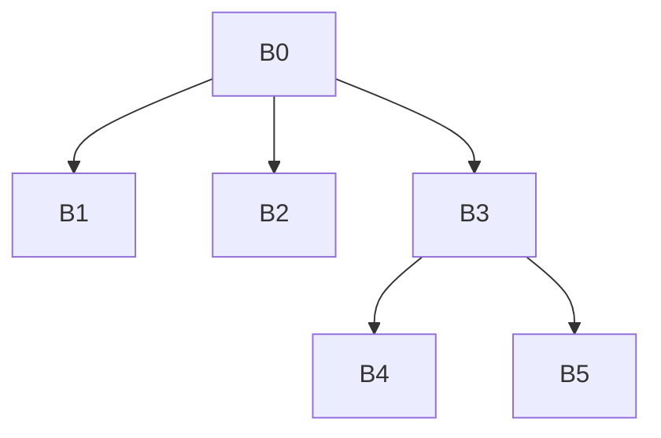

# Занятие 5. IDom, дерево доминаторов и DF

> От отношения доминирования к структуре размещения φ-функций

[← Карта курса](../course-map.md) · [Предыдущее занятие](../modules/04-dominators.md) · [Следующее занятие](../modules/06-ssa-and-phi.md)

## Результат занятия

| **К концу обязательной части.** Ты строишь \`idom\`, дерево доминаторов и dominance frontier, а также объясняешь, почему DF указывает точки слияния определений. |
|------------------------------------------------------------------------------------------------------------------------------------------------------------------|

| **Параметр**          | **Значение**                                                                 |
|-----------------------|------------------------------------------------------------------------------|
| Сложность             | Сложный                                                                      |
| Обязательная нагрузка | 90–120 мин или 2 сессии                                                      |
| Перед началом         | Уметь вычислять множества Dom.                                               |
| Что подготовить      | дерево доминаторов, таблицу DF и расчёт точек φ для двух наборов определений |

| **Разрешённый режим.** Раздели день: сначала idom, затем DF. Это нормально. |
|-----------------------------------------------------------------------------|

| **В этом занятии не требуется.** Не нужно реализовывать Lengauer–Tarjan и вычислять pruned SSA. |
|------------------------------------------------------------------------------------------|

## Обязательный маршрут

| **Этап**           | **Время** | **Результат**                                           |
|--------------------|-----------|---------------------------------------------------------|
| Повторение         | 5–10 мин  | Не больше 3 коротких вопросов                           |
| Простое объяснение | 10–15 мин | Пересказать тему своими словами                         |
| Разобранный пример | 15–20 мин | Воспроизвести ключевые состояния                        |
| Задача A           | 20–25 мин | Обязательный минимум по образцу                         |
| Задача B           | 20–35 мин | Стандарт; можно завершить во второй короткой сессии     |
| Устный итог        | 5–10 мин  | 3 вопроса и самооценка светофором                       |
| Углубление         | 0–40 мин  | Задача C и профессиональные детали — только при ресурсе |

| **Когда запрашивать помощь.** После 10–15 минут честной попытки можно сразу зафиксировать точное место остановки и запросить разбор. Не нужно сначала мучительно завершать A и B. |
|----------------------------------------------------------------------------------------------------------------------------------------------------------|

## Короткое повторение

<table>
<colgroup>
<col style="width: 33%" />
<col style="width: 33%" />
<col style="width: 33%" />
</colgroup>
<thead>
<tr class="header">
<th><strong>Когда</strong></th>
<th><strong>Объём</strong></th>
<th><strong>Что сделать</strong></th>
</tr>
</thead>
<tbody>
<tr class="odd">
<td>Вчера</td>
<td>1–2 формулировки</td>
<td>• A доминирует B, если A лежит на каждом пути от entry к B. 
• Dom(entry)={entry}; для остальных Dom(B)={B}∪пересечение Dom(pred).</td>
</tr>
<tr class="even">
<td>3 дня назад</td>
<td>1 формулировка</td>
<td>Базовый блок — максимальная последовательность с входом только в первую инструкцию и выходом через терминатор последней.</td>
</tr>
</tbody>
</table>

| **Ограничение.** На повторение не трать больше 10 минут. Не вспомнил — сделай попытку, посмотри ответ и верни карточку на следующее повторение. |
|-----------------------------------------------------------------------------------------------------------------------------------|

## Сначала простыми словами

Непосредственный доминатор — ближайший обязательный пропускной пункт перед блоком. Из этих ближайших связей получается дерево доминаторов.

Dominance frontier показывает место, где гарантия доминирования перестаёт быть полной: блок A доминирует хотя бы одного предшественника точки Y, но не доминирует саму Y строго. Именно в таких точках встречаются определения из разных путей.

### Пять терминов занятия

| **Термин**         | **Моя формулировка одним предложением** |
|--------------------|-----------------------------------------|
| idom               |                                         |
| дерево доминаторов |                                         |
| join               |                                         |
| dominance frontier |                                         |
| runner             |                                         |

## Минимум для запоминания

- idom(B) — ближайший строгий доминатор B.

- Дерево доминаторов строится рёбрами idom(B)→B.

- Y входит в DF(X), если X доминирует predecessor Y, но не доминирует Y строго.

| **Не учи дословно без смысла.** Сначала объясни формулировку своими словами на маленьком примере. Точная версия нужна после понимания. |
|----------------------------------------------------------------------------------------------------------------------------------------|

## Визуальная модель

*Рабочее представление темы занятия*

## Разобранный пример — проход по шагам

<table>
<colgroup>
<col style="width: 100%" />
</colgroup>
<thead>
<tr class="header">
<th>CFG: 
B0 -&gt; B1, B2 
B1 -&gt; B3 
B2 -&gt; B3 
B3 -&gt; B4, B5 
B4 -&gt; B3</th>
</tr>
</thead>
<tbody>
</tbody>
</table>

idom(B1)=B0, idom(B2)=B0, idom(B3)=B0, idom(B4)=B3, idom(B5)=B3. В ромбе B3 ∈ DF(B1) и B3 ∈ DF(B2). Из-за обратного ребра B3 ∈ DF(B4); заголовок цикла также может входить в собственный DF.

1. Из готовых Dom-множеств найди для каждого блока ближайший строгий доминатор.

2. Нарисуй дерево idom и проверь, что у каждого не-entry блока один родитель.

3. Для каждого join Y возьми каждого predecessor P.

4. Поднимай runner=P по idom, пока runner не равен idom(Y); на каждом шаге добавляй Y в DF(runner).

5. Отдельно проверь DF на ромбе и на цикле.

| **Проверка понимания.** Закрой пример и объясни не итог, а почему выполняется каждый следующий шаг. Если не можешь — зафиксируй именно этот переход и запроси разбор. |
|------------------------------------------------------------------------------------------------------------------------------------------------------|

## Обязательная практика

### Задача A — обязательная по образцу: Построение дерева

| **Параметр**     | **Значение**                                                                            |
|------------------|-----------------------------------------------------------------------------------------|
| Статус           | Обязательно в этом занятии                                                                     |
| Ориентир времени | 35 мин                                                                                  |
| Что сдать        | один idom у каждого блока кроме entry; предки дерева совпадают со строгими доминаторами |

<table>
<colgroup>
<col style="width: 100%" />
</colgroup>
<thead>
<tr class="header">
<th>Для CFG 
B0→B1, B2; B1→B3; B2→B3; B3→B4; B4 не имеет successors 
используй рассчитанные множества Dom, найди `idom` каждого блока и нарисуй дерево доминаторов отдельно от CFG.</th>
</tr>
</thead>
<tbody>
</tbody>
</table>

| **Подсказка 1.** Сначала найди idom и только потом DF; не смешивай CFG и dominator tree. |
|------------------------------------------------------------------------------------------|

## Стандартная практика

### Задача B — стандартная для закрепления: Фронты

| **Параметр**     | **Значение**                                                                               |
|------------------|--------------------------------------------------------------------------------------------|
| Статус           | Нужно выполнить до следующей зависимой темы; можно во второй сессии                        |
| Ориентир времени | 40 мин                                                                                     |
| Что сдать        | указан доминируемый predecessor; проверено отсутствие строгого доминирования самой вершины |

Вычисли DF для всех блоков графа с ромбом и обратным ребром. Для каждого ненулевого элемента приведи проверку формального условия.

| **Подсказка 1.** Сначала найди idom и только потом DF; не смешивай CFG и dominator tree. |
|------------------------------------------------------------------------------------------|

| **Подсказка 2.** Для join с несколькими predecessors поднимай runner от каждого predecessor к idom(join). |
|-----------------------------------------------------------------------------------------------------------|

## Три вопроса на выходе

| **Вопрос**                                 | **Результат retrieval**         |
|--------------------------------------------|---------------------------------|
| Почему idom единственный?                  | □ ≤15 с □ с паузой □ не ответил |
| Почему дерево доминаторов не является CFG? | □ ≤15 с □ с паузой □ не ответил |
| Как формально определить DF(X)?            | □ ≤15 с □ с паузой □ не ответил |

## Светофор понимания

| **Состояние** | **Что это означает**                                    | **Следующее действие**                                                  |
|---------------|---------------------------------------------------------|-------------------------------------------------------------------------|
| Зелёный       | Могу объяснить и решить A/B с незначительной проверкой. | Перейти дальше; C только по желанию.                                    |
| Жёлтый        | Понимаю идею, но теряю один шаг или термин.             | Разобрать уменьшенный пример с преподавателем или свериться с эталоном; B можно закончить во второй сессии. |
| Красный       | Не могу объяснить причинную модель или начать A.        | Не переходить дальше; зафиксировать попытку и запросить разбор после 10–15 минут.                   |

| **Минимум занятия.** Занятие засчитывается, если понятна причинная модель, воспроизведён пример и выполнена задача A. Задача B должна быть закрыта до следующей темы, которая на неё опирается. |
|------------------------------------------------------------------------------------------------------------------------------------------------------------------------------------------|

## Справочник и углубление — читать по необходимости

| **Это необязательная часть первого прохода.** Открывай её, если простого объяснения недостаточно, при проверке решения или когда остались силы. Профессиональные оговорки не являются обязательным минимумом занятия. |
|--------------------------------------------------------------------------------------------------------------------------------------------------------------------------------------------------------------|

### Подробная теория

#### Непосредственный доминатор

idom(B) — ближайший строгий доминатор B: он строго доминирует B, а между ним и B нет другого строгого доминатора. У каждого достижимого блока кроме entry ровно один непосредственный доминатор.

Рёбра idom(B) → B образуют **дерево доминаторов**. Предки блока в этом дереве — его строгие доминаторы. Обрати внимание: дерево доминаторов не обязано совпадать с рёбрами CFG.

#### Фронт доминирования

Блок Y принадлежит DF(X), если X доминирует некоторого предшественника Y, но не строго доминирует сам Y. Интуитивно это первая граница, где пути, контролируемые X, встречаются с путём, который может обойти X.

В ромбе ветвления блоки обеих ветвей имеют в своём DF блок слияния. Именно там разные определения переменной впервые могут встретиться, поэтому dominance frontier используется для расстановки φ-функций.

#### Локальный и восходящий вклад

Практический способ: локально добавить в DF(X) каждого successor Y, для которого idom(Y) != X. Затем пройти детей Z в дереве доминаторов и перенести Y ∈ DF(Z), если idom(Y) != X.

Для ручной работы можно применять формальное определение напрямую, но алгоритмическая схема помогает не пропускать фронты в сложных графах и циклах.

#### Iterated DF

Если переменная определяется в нескольких блоках, φ в первом фронте сама создаёт новое определение. Поэтому процесс продолжают по **итерированному фронту доминирования** до неподвижной точки.

#### Пошаговая таблица DF

Для ручного расчёта сначала вычисли idom. Для каждого join-блока y с двумя и более predecessors поднимай runner от каждого predecessor к idom(y), добавляя y в DF(runner). В таблице обязательно фиксируй тройку join → predecessor → путь runner.

## Алгоритм на одной странице

| **Поле**          | **Содержание**                                                                        |
|-------------------|---------------------------------------------------------------------------------------|
| Название          | IDom, дерево и DF                                                                     |
| Вход              | CFG и множества доминаторов/дерево доминаторов.                                       |
| Результат         | idom каждого блока, dominator tree и DF.                                              |
| Инвариант         | Runner поднимается только по idom; каждый элемент DF подтверждает формальное условие. |
| Условие остановки | Все join-блоки обработаны, worklist φ пуст.                                           |
| Сложность         | Зависит от алгоритма; учебный runner-подход пропорционален сумме подъёмов по дереву.  |

6.  Для n≠entry выбрать строгий доминатор, не доминируемый другим строгим доминатором n: это idom(n).

7.  Построить дерево по рёбрам idom.

8.  Для блоков с несколькими predecessors пройти runner от каждого predecessor к idom(join), добавляя join в DF(runner).

9.  Для φ выполнить iterated DF worklist от блоков definitions.

### Допущения учебного IR на сегодня

- У каждого базового блока ровно один терминатор; терминатор является последней инструкцией блока.

- Деление может завершиться наблюдаемой ошибкой при нуле. Его нельзя безусловно удалять или выносить, пока не доказаны безопасность и допустимость спекуляции.

- print, store, volatile/atomic операции и неизвестный вызов имеют наблюдаемый эффект. Вызов считается чистым только при явной пометке pure/readonly в условии.

### Дополнительная задача

### Задача C — необязательный перенос: Подготовка к SSA

| **Параметр**     | **Значение**                                    |
|------------------|-------------------------------------------------|
| Статус           | Только если осталось внимание                   |
| Ориентир времени | 20 мин                                          |
| Что сдать        | рабочее множество; точки φ до неподвижной точки |

Пусть переменная x определяется в B1 и B2. Найди множество блоков для φ через iterated DF. Затем повтори для определения в B4 внутри цикла.

| **Подсказка 1.** Сначала найди idom и только потом DF; не смешивай CFG и dominator tree. |
|------------------------------------------------------------------------------------------|

| **Подсказка 2.** Для join с несколькими predecessors поднимай runner от каждого predecessor к idom(join). |
|-----------------------------------------------------------------------------------------------------------|

### Полная устная проверка

| **Вопрос**                                             | **Результат retrieval**         |
|--------------------------------------------------------|---------------------------------|
| Почему idom единственный?                              | □ ≤15 с □ с паузой □ не ответил |
| Почему дерево доминаторов не является CFG?             | □ ≤15 с □ с паузой □ не ответил |
| Как формально определить DF(X)?                        | □ ≤15 с □ с паузой □ не ответил |
| Почему заголовок цикла может входить в собственный DF? | □ ≤15 с □ с паузой □ не ответил |
| Зачем нужен iterated DF?                               | □ ≤15 с □ с паузой □ не ответил |

### Журнал ошибок

| **Ошибка / сомнение** | **Первый нарушенный инвариант** | **Исправленное правило** | **Новый пример / итерация** |
|-----------------------|---------------------------------|--------------------------|-------------------------|
|                       |                                 |                          |                         |
|                       |                                 |                          |                         |
|                       |                                 |                          |                         |
|                       |                                 |                          |                         |
|                       |                                 |                          |                         |

### План повторения

| **Когда**    | **Что повторить**                              |
|--------------|------------------------------------------------|
| Завтра       | 3 пункта минимального блока и задача A.        |
| Через 3 дня  | Один алгоритм или стандартная задача B.        |
| Через 7 дней | Для простого ромба назови idom и ненулевые DF. |

### Как получить обратную связь

**Сообщение для начала ежедневной сессии**

<table>
<colgroup>
<col style="width: 100%" />
</colgroup>
<thead>
<tr class="header">
<th>Я работаю по документу «Непосредственные доминаторы, дерево и фронт доминирования» (версия 3.0). Я могу обратиться уже после 10–15 минут честной попытки. 
 
Моя текущая зона: зелёная / жёлтая / красная. 
Моя попытка и точное место остановки: ... 
 
Работай так: 
1. Сначала проверь мою причинную модель простым вопросом, не выдавая решение. 
2. Если модель неверна, объясни тему на одном меньшем примере и попроси меня пересказать. 
3. Найди только первую существенную ошибку: место, нарушенный инвариант и минимальный контрпример. 
4. Дай мне исправить её самостоятельно. 
5. После исправления дай одну короткую задачу на перенос. 
6. В конце назови: что я уже понимаю, что пока понимаю с подсказкой и что повторить на следующей сессии.</th>
</tr>
</thead>
<tbody>
</tbody>
</table>

## Точечное чтение

- Cytron et al., “Efficiently Computing Static Single Assignment Form and the Control Dependence Graph” — dominance frontier and φ placement.

| **Стоп чтения.** Прекрати чтение, когда можешь воспроизвести определение/алгоритм и решить задачу B. Дополнительные страницы не заменяют практику. |
|----------------------------------------------------------------------------------------------------------------------------------------------------|
