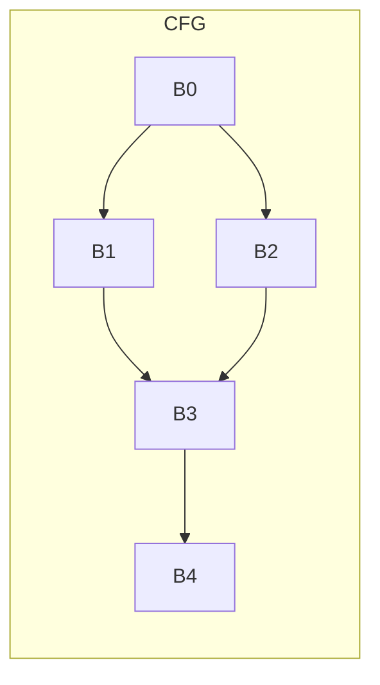
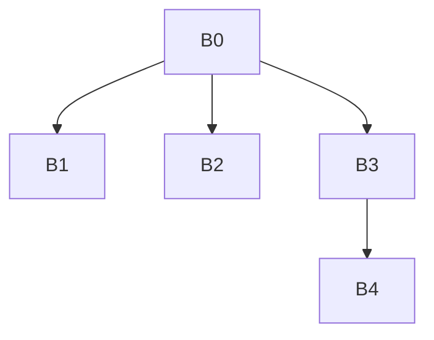

# Занятие 5. `idom`, дерево доминаторов и фронт доминирования

> От множеств доминаторов к ближайшему обязательному предку и точкам слияния путей

[← Карта курса](../course-map.md) · [Предыдущее занятие](04-dominators.md) · [Следующее занятие](06-ssa-and-phi.md)

## Результат занятия

Ты находишь непосредственные доминаторы, отдельно строишь дерево доминаторов и вычисляешь фронт доминирования по определению и с помощью подъёма по цепочке `idom`.

**Перед началом:** готовые множества `Dom` из занятия 4.

## Зачем это вообще нужно

Полное множество `Dom(B)` отвечает, какие блоки обязательны до `B`, но для обхода и SSA нужна компактная структура. `idom(B)` оставляет только ближайший обязательный блок, а фронт доминирования показывает, где управление из области доминирования встречается с другим путём.

## Термины до заданий

| Термин | Простое объяснение | Точная опора |
|---|---|---|
| **Непосредственный доминатор** (*idom*) | ближайший строгий доминатор блока | единственный строгий доминатор `D`, который доминируется всеми остальными строгими доминаторами блока |
| **Дерево доминаторов** (*dominator tree*) | дерево ближайших обязательных предков | ребро `idom(B) → B`; предки `B` совпадают с его строгими доминаторами |
| **Точка слияния** (*join*) | блок, в который приходят несколько путей | обычно имеет несколько достижимых предшественников, но этого недостаточно для определения DF |
| **Фронт доминирования** (*dominance frontier*) | граница области полного доминирования | `Y ∈ DF(X)`, если `X` доминирует некоторого предшественника `Y`, но не строго доминирует `Y` |
| **Текущий узел подъёма** (*runner*) | узел, который последовательно заменяют его `idom` | при вычислении DF точка слияния добавляется каждому текущему узлу до `idom` самой точки слияния |

Сначала прочитай объяснения. Затем закрой таблицу и перескажи термины своими словами. Это проверка понимания, а не попытка угадать определение.

## Ключевая схема

Для ромба `B0→B1,B2; B1,B2→B3; B3→B4` дерево доминаторов и CFG различаются:

`B3` не является ребёнком `B1` или `B2`: ни один из них не обязателен на всех путях к `B3`.

## Пошаговый разбор

Для CFG `B0→B1,B2; B1,B2→B3; B3→B4,B5; B4→B3`:

| Блок | Строгие доминаторы | Почему выбран `idom` |
|---|---|---|
| B1 | {B0} | единственный кандидат B0 |
| B2 | {B0} | единственный кандидат B0 |
| B3 | {B0} | ветви B1/B2 сливаются, поэтому ближайший B0 |
| B4 | {B0,B3} | B3 доминируется B0 и ближе к B4 |
| B5 | {B0,B3} | B3 доминируется B0 и ближе к B5 |

Трасса подъёма для точки слияния `B3`, `idom(B3)=B0`:

| Предшественник | Текущий узел подъёма | Действие | Следующий узел |
|---|---|---|---|
| B1 | B1 | добавить B3 в DF(B1) | B0 — стоп |
| B2 | B2 | добавить B3 в DF(B2) | B0 — стоп |
| B4 | B4 | добавить B3 в DF(B4) | B3 |
| B4 | B3 | добавить B3 в DF(B3) | B0 — стоп |

Итог: `DF(B1)=DF(B2)=DF(B3)=DF(B4)={B3}`.

## Формальное правило

`idom(B)` — такой строгий доминатор `D`, что каждый другой строгий доминатор `B` доминирует `D`.

`Y ∈ DF(X)` тогда и только тогда, когда существует `P ∈ pred(Y)`, для которого `X dom P`, и при этом `X` не строго доминирует `Y`.

Подъём по цепочке `idom` — способ вычисления этого множества, а не отдельное определение.

## Типичные ошибки

- Выбирать самый верхний строгий доминатор вместо ближайшего.
- Рисовать CFG и дерево доминаторов одной схемой.
- Считать любую точку слияния элементом DF каждого предшественника без проверки доминирования.
- Запрещать `X ∈ DF(X)`: в цикле блок может входить в собственный фронт доминирования.
- Смешивать обозначения `IDom`, `Idom` и `idom`; в формулах курса используется `idom(B)`.

## Задача A — по образцу

Для простого ромба вычисли `idom` всех блоков и нарисуй дерево доминаторов отдельно от CFG.

Проверка задачи A

`idom(B1)=B0`, `idom(B2)=B0`, `idom(B3)=B0`, `idom(B4)=B3`. В дереве у `B0` дети `B1,B2,B3`, у `B3` ребёнок `B4`.

## Самостоятельная задача

Для графа с обратным ребром из разбора выполни трассу подъёма по цепочке `idom` и объясни, почему `B3 ∈ DF(B3)`.

Проверка задачи B

Предшественник `B4` доминируется `B3`, но сам `B3` не строго доминирует себя. При подъёме от `B4` текущим узлом становится `B3`, поэтому точка слияния `B3` добавляется в `DF(B3)`.

## Проверь себя

**Как отличить CFG от дерева доминаторов?**  
**Как выбрать `idom` по множеству `Dom`?**  
**Может ли блок входить в собственный DF?**

Короткие ответы

CFG хранит возможные переходы управления, дерево — отношение ближайшего доминирования. `idom` — самый глубокий строгий доминатор, доминируемый остальными строгими доминаторами. Да, собственный DF возникает, например, у заголовка цикла.

## Как это устроено в промышленном компиляторе

Промышленные компиляторы используют более быстрые алгоритмы доминаторов и инкрементальное обновление после изменения CFG. Здесь важнее сначала сделать определение пригодным для пошагового вычисления и проверки.
