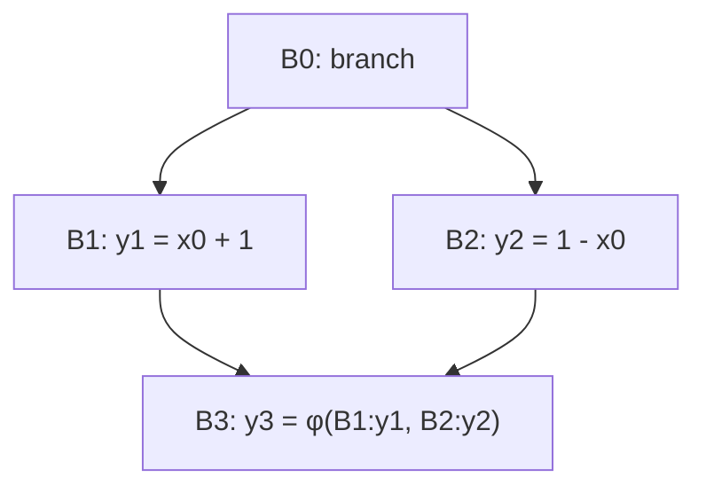

# Занятие 6. SSA и расстановка φ-функций

> Разделяем изменяемую переменную на однократно определённые значения

[← Карта курса](../course-map.md) · [Предыдущее занятие](05-idom-tree-and-df.md) · [Следующее занятие](07-ssa-renaming.md)

## Результат занятия

Ты различаешь binding, storage и SSA-value, объясняешь edge-семантику φ и размещаешь φ до неподвижной точки iterated DF.

**Перед началом:** раздел [Binding, storage и value](../prerequisites.md#binding-storage-и-value), DF и predecessors.

## Зачем это вообще нужно

В обычном IR имя `x` может означать разные значения в разные моменты. Анализу приходится гадать, какое определение достигает использования. SSA даёт каждому вычисленному значению отдельное имя, а встречи разных путей делает явными через φ.

## Термины до заданий

| Термин | Простое объяснение | Точная опора |
|---|---|---|
| **SSA — static single assignment** | форма IR с одним определением каждого SSA-имени | повторные присваивания исходной переменной получают новые версии |
| **SSA-value — SSA-значение** | результат одной конкретной инструкции | имеет единственный def и набор uses; не равно storage-слоту |
| **φ-функция** | выбирает вход по ребру, по которому пришло управление | один подписанный operand на каждый predecessor блока |
| **definition block** | блок, создающий новую версию переменной | обычный def или уже вставленная φ считаются определениями |
| **iterated DF — итерационный фронт** | достижимость от definition blocks по отношению DF | worklist добавляет новые φ-блоки до неподвижной точки |

## Первая модель



`φ` находится в `B3`, но её вход `[B1:y1]` концептуально используется на ребре `B1→B3`.

## Разобранный пример: состояние за состоянием

Пусть `a` определяется в `B0`, `B1`, `B4`, а `DF(B0)=∅`, `DF(B1)={B3}`, `DF(B4)={B3}`, `DF(B3)={B3}`.

| Шаг | worklist | извлечён блок | новые φ | новые definition blocks |
|---|---|---|---|---|
| 0 | [B0,B1,B4] | — | ∅ | {B0,B1,B4} |
| 1 | [B1,B4] | B0 | ∅ | без изменений |
| 2 | [B4,B3] | B1 | φ(a) в B3 | добавить B3 |
| 3 | [B3] | B4 | B3 уже обработан | без изменений |
| 4 | [] | B3 | B3 уже содержит φ | неподвижная точка |

Placement отвечает только **где** нужна φ. Имена входов появятся на следующем занятии во время renaming.

## Формальное правило

Начни worklist с блоков обычных определений переменной. Для каждого извлечённого `X` рассмотри `Y ∈ DF(X)`. Если φ ещё нет в `Y`, вставь её; новый φ является определением, поэтому `Y` также добавляется в worklist. Остановись, когда новых φ нет.

Для каждой φ после построения CFG должно выполняться:

```text
множество меток входов φ == множество predecessors блока
```

## Типичные ошибки

- Объединять source binding, runtime storage и SSA-value одним идентификатором.
- Считать φ обычным условным выражением внутри блока.
- Заполнять имена operands уже на фазе placement и путать её с renaming.
- Забывать, что вставленная φ сама расширяет worklist.

## Задача A — по образцу

Для ромба с определениями `y` в `B1` и `B2` размести φ и подпиши её predecessor-контракт.

<details>
<summary>Проверка задачи A</summary>

Одна φ в начале `B3`: `y3 = φ[B1:y1, B2:y2]`. Метки входов `{B1,B2}` совпадают с `pred(B3)`.

</details>

## Задача B — перенос на новый пример

Повтори worklist-трассу из разбора для определений `a` в `B1` и `B4`. Отдельно укажи, почему собственный `DF(B3)` не создаёт бесконечное число φ.

<details>
<summary>Проверка задачи B</summary>

Первая встреча `B3` вставляет единственную φ и добавляет `B3` в worklist. При обработке `DF(B3)={B3}` алгоритм видит, что φ уже есть, и ничего не добавляет.

</details>

## Проверка на выходе

**Что именно определяется один раз в SSA?**  
**Когда выполняется φ-выбор?**  
**Почему вставленная φ снова влияет на worklist?**

<details>
<summary>Короткие ответы</summary>

Один раз определяется SSA-имя, а не исходная переменная или storage. φ выбирает operand по входящему ребру. Её результат — новое определение и может встретиться с другими определениями дальше по DF.

</details>

## Профессиональная граница

Minimal SSA может содержать мёртвые φ. Pruned SSA дополнительно использует liveness. В обязательной части сначала строится корректная minimal SSA, чтобы не смешивать два анализа.
