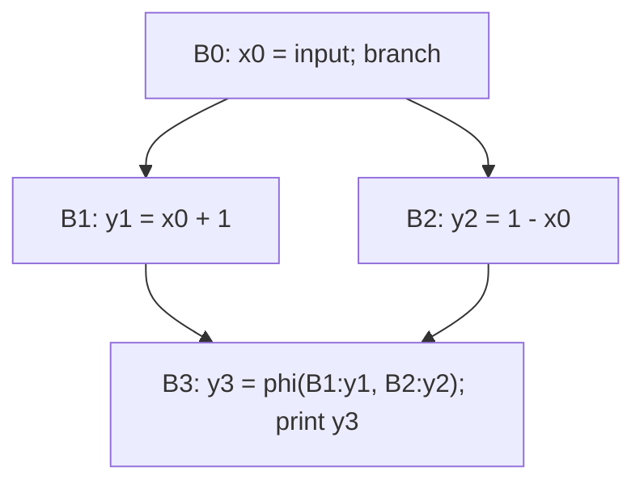

# Занятие 6. SSA и расстановка φ-функций

> Как заменить изменяемую переменную семейством однократно определённых значений

[← Карта курса](../course-map.md) · [Предыдущее занятие](../modules/05-idom-tree-and-df.md) · [Следующее занятие](../modules/07-ssa-renaming.md)

## Результат занятия

| **К концу обязательной части.** Ты различаешь переменную, storage и SSA-value; корректно размещаешь φ-функции с привязкой операндов к предшественникам. |
|---------------------------------------------------------------------------------------------------------------------------------------------------------|

| **Параметр**          | **Значение**                                                       |
|-----------------------|--------------------------------------------------------------------|
| Сложность             | Сложный                                                            |
| Обязательная нагрузка | 90–120 мин или 2 сессии                                            |
| Перед началом         | Дерево доминаторов и dominance frontier.                           |
| Что подготовить      | таблицу сущностей, расчёт точек φ и проверку predecessor-контракта |

| **Разрешённый режим.** Сначала ромб, только потом цикл. |
|---------------------------------------------------------|

| **В этом занятии не требуется.** Не нужны Memory SSA и промышленная оптимизация числа φ. |
|-----------------------------------------------------------------------------------|

## Обязательный маршрут

| **Этап**           | **Время** | **Результат**                                           |
|--------------------|-----------|---------------------------------------------------------|
| Повторение         | 5–10 мин  | Не больше 3 коротких вопросов                           |
| Простое объяснение | 10–15 мин | Пересказать тему своими словами                         |
| Разобранный пример | 15–20 мин | Воспроизвести ключевые состояния                        |
| Задача A           | 20–25 мин | Обязательный минимум по образцу                         |
| Задача B           | 20–35 мин | Стандарт; можно завершить во второй короткой сессии     |
| Устный итог        | 5–10 мин  | 3 вопроса и самооценка светофором                       |
| Углубление         | 0–40 мин  | Задача C и профессиональные детали — только при ресурсе |

| **Когда запрашивать помощь.** После 10–15 минут честной попытки можно сразу зафиксировать точное место остановки и запросить разбор. Не нужно сначала мучительно завершать A и B. |
|----------------------------------------------------------------------------------------------------------------------------------------------------------|

## Короткое повторение

<table>
<colgroup>
<col style="width: 33%" />
<col style="width: 33%" />
<col style="width: 33%" />
</colgroup>
<thead>
<tr class="header">
<th><strong>Когда</strong></th>
<th><strong>Объём</strong></th>
<th><strong>Что сделать</strong></th>
</tr>
</thead>
<tbody>
<tr class="odd">
<td>Вчера</td>
<td>1–2 формулировки</td>
<td>• idom(B) — ближайший строгий доминатор B. 
• Дерево доминаторов строится рёбрами idom(B)→B.</td>
</tr>
<tr class="even">
<td>3 дня назад</td>
<td>1 формулировка</td>
<td>CFG: вершины — базовые блоки, рёбра — возможная непосредственная передача управления.</td>
</tr>
</tbody>
</table>

| **Ограничение.** На повторение не трать больше 10 минут. Не вспомнил — сделай попытку, посмотри ответ и верни карточку на следующее повторение. |
|-----------------------------------------------------------------------------------------------------------------------------------|

## Сначала простыми словами

В SSA каждое имя определяется ровно один раз. Поэтому два присваивания переменной в разных ветвях получают разные версии.

В точке слияния нужно явно сказать, какая версия пришла по какому ребру. Это делает φ: она не вычисляет обычное выражение, а выбирает значение в зависимости от входящего ребра.

### Пять терминов занятия

| **Термин**      | **Моя формулировка одним предложением** |
|-----------------|-----------------------------------------|
| SSA             |                                         |
| версия значения |                                         |
| φ-функция       |                                         |
| входящее ребро  |                                         |
| определение     |                                         |

## Минимум для запоминания

- В SSA каждое имя определяется ровно один раз.

- φ выбирает значение по входящему ребру CFG.

- φ ставится там, где определения одной переменной могут встретиться.

| **Не учи дословно без смысла.** Сначала объясни формулировку своими словами на маленьком примере. Точная версия нужна после понимания. |
|----------------------------------------------------------------------------------------------------------------------------------------|

## Визуальная модель

*Рабочее представление темы занятия*

## Разобранный пример — проход по шагам

<table>
<colgroup>
<col style="width: 100%" />
</colgroup>
<thead>
<tr class="header">
<th>B0: 
x = input() 
if x &gt; 0 goto B1 else B2 
B1: 
y = x + 1 
goto B3 
B2: 
y = 1 - x 
goto B3 
B3: 
print y</th>
</tr>
</thead>
<tbody>
</tbody>
</table>

После переименования вход — x0. В ветвях появляются y1 и y2. В B3 нужно y3 = phi \[B1:y1, B2:y2\], затем print y3.

1. Найди блоки, где переменная определяется.

2. По iterated DF расставь кандидаты φ.

3. Для ромба подпиши: вход из левой ветви несёт одну версию, из правой — другую.

4. Для цикла в header встречаются initial value из preheader и updated value из latch.

5. После расстановки φ только начинается renaming — не смешивай два этапа.

| **Проверка понимания.** Закрой пример и объясни не итог, а почему выполняется каждый следующий шаг. Если не можешь — зафиксируй именно этот переход и запроси разбор. |
|------------------------------------------------------------------------------------------------------------------------------------------------------|

## Обязательная практика

### Задача A — обязательная по образцу: Разделение сущностей

| **Параметр**     | **Значение**                                      |
|------------------|---------------------------------------------------|
| Статус           | Обязательно в этом занятии                               |
| Ориентир времени | 20 мин                                            |
| Что сдать        | 4 сущности; разные жизненные циклы; риск смешения |

Для выбранного компиляторного проекта приведи по одному примеру source binding, runtime local/storage, IR temporary и SSA value. Wist2 можно использовать как готовый case study с AIR. Объясни, почему эти сущности нельзя объединять одним идентификатором.

| **Подсказка 1.** Составь множество definition blocks отдельно для каждой переменной. |
|--------------------------------------------------------------------------------------|

## Стандартная практика

### Задача B — стандартная для закрепления: Расстановка φ

| **Параметр**     | **Значение**                                                        |
|------------------|---------------------------------------------------------------------|
| Статус           | Нужно выполнить до следующей зависимой темы; можно во второй сессии |
| Ориентир времени | 40 мин                                                              |
| Что сдать        | worklist; итерации DF; φ в начале блоков                            |

<table>
<colgroup>
<col style="width: 100%" />
</colgroup>
<thead>
<tr class="header">
<th>Для CFG 
B0→B1,B2; B1→B3; B2→B3; B3→B4,B5; B4→B3 
переменная `a` определяется в `B0`, `B1` и `B4`, а используется в `B3` и `B5`. Вычисли DF и размести φ до неподвижной точки. Пока не выполняй renaming.</th>
</tr>
</thead>
<tbody>
</tbody>
</table>

| **Подсказка 1.** Составь множество definition blocks отдельно для каждой переменной. |
|--------------------------------------------------------------------------------------|

| **Подсказка 2.** Каждый вставленный φ считается новым definition и может снова попасть в worklist. |
|----------------------------------------------------------------------------------------------------|

## Три вопроса на выходе

| **Вопрос**                             | **Результат retrieval**         |
|----------------------------------------|---------------------------------|
| Что именно назначается один раз в SSA? | □ ≤15 с □ с паузой □ не ответил |
| Почему φ является edge-sensitive?      | □ ≤15 с □ с паузой □ не ответил |
| Где физически располагаются φ?         | □ ≤15 с □ с паузой □ не ответил |

## Светофор понимания

| **Состояние** | **Что это означает**                                    | **Следующее действие**                                                  |
|---------------|---------------------------------------------------------|-------------------------------------------------------------------------|
| Зелёный       | Могу объяснить и решить A/B с незначительной проверкой. | Перейти дальше; C только по желанию.                                    |
| Жёлтый        | Понимаю идею, но теряю один шаг или термин.             | Разобрать уменьшенный пример с преподавателем или свериться с эталоном; B можно закончить во второй сессии. |
| Красный       | Не могу объяснить причинную модель или начать A.        | Не переходить дальше; зафиксировать попытку и запросить разбор после 10–15 минут.                   |

| **Минимум занятия.** Занятие засчитывается, если понятна причинная модель, воспроизведён пример и выполнена задача A. Задача B должна быть закрыта до следующей темы, которая на неё опирается. |
|------------------------------------------------------------------------------------------------------------------------------------------------------------------------------------------|

## Справочник и углубление — читать по необходимости

| **Это необязательная часть первого прохода.** Открывай её, если простого объяснения недостаточно, при проверке решения или когда остались силы. Профессиональные оговорки не являются обязательным минимумом занятия. |
|--------------------------------------------------------------------------------------------------------------------------------------------------------------------------------------------------------------|

### Подробная теория

#### Зачем SSA

В обычном IR имя x может означать разные значения в разные моменты. Анализу приходится вычислять множество достигающих определений. В **Static Single Assignment** каждое SSA-значение имеет ровно одно определение, поэтому def-use связь становится явной.

SSA не означает, что программа перестаёт изменять память. Это дисциплина имён для значений. Ячейки памяти, массивы и поля требуют отдельного моделирования эффектов или Memory SSA.

#### Переменная и значение

Исходная переменная x, runtime storage и SSA-значение x3 — разные сущности. x3 обозначает результат одного определения, а не «третью версию ячейки» в физической памяти.

Важный инвариант: определение обычного SSA-значения доминирует все его использования. Для операнда φ использование концептуально находится на входящем ребре, поэтому определение должно быть доступно на соответствующем predecessor.

#### Семантика φ

x3 = phi \[B1: x1, B2: x2\] означает: если управление пришло из B1, результатом является x1; если из B2 — x2. φ не вычисляет оба значения и не выбирает их по условию внутри блока.

Операнды должны быть подписаны predecessor-блоками. Запись phi(x1,x2) без меток зависит от порядка списка предшественников и легко ломается после перестройки CFG.

#### Расстановка φ

Для каждой исходной переменной собери блоки её определений. Добавляй φ в их dominance frontier. Новый φ сам считается определением, поэтому добавленный блок помещается в рабочую очередь; процесс идёт до неподвижной точки.

Минимальная SSA может содержать мёртвые φ. Pruned SSA использует live-in информацию, чтобы не вставлять φ там, где значение не используется после слияния. Для зачёта сначала уверенно владей классическим минимальным алгоритмом.

#### Два обязательных шаблона

**Ромб:** два definitions в ветвях встречаются в join, поэтому φ появляется в join. **Цикл:** начальное значение из preheader и обновлённое значение из latch встречаются в header, поэтому φ обычно появляется в header. Эти два шаблона нужно уметь строить без подсказки.

## Алгоритм на одной странице

| **Поле**          | **Содержание**                                           |
|-------------------|----------------------------------------------------------|
| Название          | Расстановка φ                                            |
| Вход              | CFG, DF и блоки definitions одной исходной переменной.   |
| Результат         | Блоки с φ для этой переменной.                           |
| Инвариант         | Каждый блок получает не более одной φ данной переменной. |
| Условие остановки | Worklist пуст; closure по DF достигнута.                 |
| Сложность         | Пропорциональна посещённым элементам DF.                 |

6.  Поместить все definition blocks в worklist.

7.  Извлечь block x.

8.  Для каждого y∈DF(x), если φ ещё нет — вставить φ в начало y.

9.  Если y не был исходным definition block, добавить y в worklist.

10. Продолжить до пустой очереди.

### Допущения учебного IR на сегодня

- У каждого базового блока ровно один терминатор; терминатор является последней инструкцией блока.

- Деление может завершиться наблюдаемой ошибкой при нуле. Его нельзя безусловно удалять или выносить, пока не доказаны безопасность и допустимость спекуляции.

- print, store, volatile/atomic операции и неизвестный вызов имеют наблюдаемый эффект. Пометка `pure` означает отсутствие чтения/записи памяти и иных эффектов по контракту; исключения проверяются отдельно. `readonly` запрещает запись, но разрешает чтение памяти и само по себе не делает вызов чистым.

### Дополнительная задача

### Задача C — необязательный перенос: Проверка φ-контракта

| **Параметр**     | **Значение**                                                                       |
|------------------|------------------------------------------------------------------------------------|
| Статус           | Только если осталось внимание                                                      |
| Ориентир времени | 20 мин                                                                             |
| Что сдать        | один вход на predecessor; подписанные операнды; ошибка verifier при несоответствии |

Для каждой φ выпиши список predecessor и убедись, что число входов совпадает. Добавь к одному блоку новое входящее ребро и опиши, что должен потребовать verifier.

| **Подсказка 1.** Составь множество definition blocks отдельно для каждой переменной. |
|--------------------------------------------------------------------------------------|

| **Подсказка 2.** Каждый вставленный φ считается новым definition и может снова попасть в worklist. |
|----------------------------------------------------------------------------------------------------|

### Полная устная проверка

| **Вопрос**                                | **Результат retrieval**         |
|-------------------------------------------|---------------------------------|
| Что именно назначается один раз в SSA?    | □ ≤15 с □ с паузой □ не ответил |
| Почему φ является edge-sensitive?         | □ ≤15 с □ с паузой □ не ответил |
| Где физически располагаются φ?            | □ ≤15 с □ с паузой □ не ответил |
| Почему φ тоже добавляет блок в worklist?  | □ ≤15 с □ с паузой □ не ответил |
| Чем minimal SSA отличается от pruned SSA? | □ ≤15 с □ с паузой □ не ответил |

### Журнал ошибок

| **Ошибка / сомнение** | **Первый нарушенный инвариант** | **Исправленное правило** | **Новый пример / итерация** |
|-----------------------|---------------------------------|--------------------------|-------------------------|
|                       |                                 |                          |                         |
|                       |                                 |                          |                         |
|                       |                                 |                          |                         |
|                       |                                 |                          |                         |
|                       |                                 |                          |                         |

### План повторения

| **Когда**    | **Что повторить**                                    |
|--------------|------------------------------------------------------|
| Завтра       | 3 пункта минимального блока и задача A.              |
| Через 3 дня  | Один алгоритм или стандартная задача B.              |
| Через 7 дней | Поставь одну φ в ромбе и подпиши оба incoming edges. |

### Как получить обратную связь

**Сообщение для начала ежедневной сессии**

<table>
<colgroup>
<col style="width: 100%" />
</colgroup>
<thead>
<tr class="header">
<th>Я работаю по документу «SSA: определения значений и расстановка φ-функций» (версия 3.0). Я могу обратиться уже после 10–15 минут честной попытки. 
 
Моя текущая зона: зелёная / жёлтая / красная. 
Моя попытка и точное место остановки: ... 
 
Работай так: 
1. Сначала проверь мою причинную модель простым вопросом, не выдавая решение. 
2. Если модель неверна, объясни тему на одном меньшем примере и попроси меня пересказать. 
3. Найди только первую существенную ошибку: место, нарушенный инвариант и минимальный контрпример. 
4. Дай мне исправить её самостоятельно. 
5. После исправления дай одну короткую задачу на перенос. 
6. В конце назови: что я уже понимаю, что пока понимаю с подсказкой и что повторить на следующей сессии.</th>
</tr>
</thead>
<tbody>
</tbody>
</table>

## Точечное чтение

- Cytron et al. (1991) — SSA construction; LLVM LangRef — phi instruction semantics.

| **Стоп чтения.** Прекрати чтение, когда можешь воспроизвести определение/алгоритм и решить задачу B. Дополнительные страницы не заменяют практику. |
|----------------------------------------------------------------------------------------------------------------------------------------------------|
