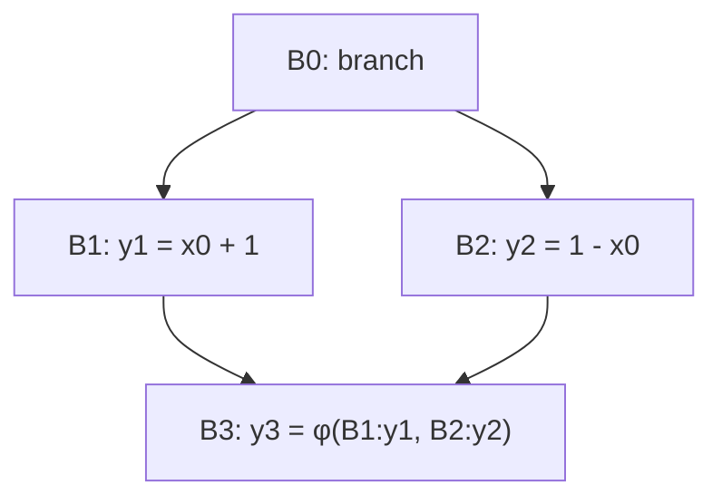

# Занятие 6. SSA и расстановка φ-функций

> Разделяем изменяемую переменную на однократно определённые значения

[← Карта курса](../course-map.md) · [Предыдущее занятие](05-idom-tree-and-df.md) · [Следующее занятие](07-ssa-renaming.md)

## Результат занятия

Ты различаешь привязку имени, хранилище и SSA-значение, объясняешь семантику входов φ-функции и размещаешь φ-функции до неподвижной точки итерационного DF.

**Перед началом:** раздел [Привязка имени, хранилище и значение](../prerequisites.md#привязка-имени-хранилище-и-значение), DF и множества предшественников.

## Зачем это вообще нужно

В обычном IR одно имя `x` может обозначать разные значения в разные моменты. Без дополнительного анализа неясно, какое определение достигает конкретного использования. SSA даёт каждому вычисленному значению отдельное имя, а встречи разных путей делает явными через φ.

## Термины до заданий

| Термин | Простое объяснение | Точная опора |
|---|---|---|
| **SSA — форма единственного присваивания** (*static single assignment*) | каждое SSA-имя определяется ровно один раз | повторные присваивания исходной переменной получают разные версии |
| **SSA-значение** (*SSA value*) | результат одной конкретной инструкции | имеет единственное определение и набор использований; не является изменяемым хранилищем |
| **φ-функция** | выбирает значение по входящему ребру | имеет ровно один подписанный операнд для каждого предшественника блока |
| **Блок определения** (*definition block*) | блок, создающий новую версию значения | обычное определение и вставленная φ-функция оба считаются определениями |
| **Итерационный фронт доминирования** (*iterated DF*) | повторное применение отношения DF к блокам определений | рабочая очередь добавляет новые блоки с φ-функциями до неподвижной точки |

Сначала прочитай объяснения. Затем закрой таблицу и перескажи термины своими словами. Это проверка понимания, а не попытка угадать определение.

## Ключевая схема



`φ` находится в `B3`, но её вход `[B1:y1]` концептуально используется на ребре `B1→B3`.

## Пошаговый разбор

Пусть `a` определяется в `B0`, `B1`, `B4`, а `DF(B0)=∅`, `DF(B1)={B3}`, `DF(B4)={B3}`, `DF(B3)={B3}`.

| Шаг | Рабочая очередь | Извлечённый блок | Новые φ-функции | Новые блоки определений |
|---|---|---|---|---|
| 0 | [B0,B1,B4] | — | ∅ | {B0,B1,B4} |
| 1 | [B1,B4] | B0 | ∅ | без изменений |
| 2 | [B4,B3] | B1 | φ(a) в B3 | добавить B3 |
| 3 | [B3] | B4 | B3 уже обработан | без изменений |
| 4 | [] | B3 | B3 уже содержит φ | неподвижная точка |

Расстановка отвечает только на вопрос, **где** нужна φ-функция. Имена её входов появятся на следующем занятии во время переименования.

## Формальное правило

Заполни рабочую очередь блоками с обычными определениями переменной. Для каждого извлечённого `X` рассмотри `Y ∈ DF(X)`. Если φ ещё нет в `Y`, вставь её; новый φ является определением, поэтому `Y` также добавляется в рабочую очередь. Остановись, когда новых φ нет.

Для каждой φ после построения CFG должно выполняться:

```text
множество меток входов φ-функции = множество предшественников блока
```

## Типичные ошибки

- Считать привязку имени, хранилище времени выполнения и SSA-значение одной сущностью.
- Считать φ обычным условным выражением внутри блока.
- Заполнять имена операндов уже при расстановке φ-функций и путать её с переименованием.
- Забывать, что вставленная φ-функция сама расширяет рабочую очередь.

## Задача A — по образцу

Для ромба с определениями `y` в `B1` и `B2` размести φ и подпиши контракт её входов по предшественникам.

<details>
<summary>Проверка задачи A</summary>

Одна φ в начале `B3`: `y3 = φ[B1:y1, B2:y2]`. Метки входов `{B1,B2}` совпадают с `pred(B3)`.

</details>

## Самостоятельная задача

Повтори трассу рабочей очереди из разбора для определений `a` в `B1` и `B4`. Отдельно укажи, почему собственный `DF(B3)` не создаёт бесконечное число φ.

<details>
<summary>Проверка задачи B</summary>

Первая встреча `B3` вставляет единственную φ и добавляет `B3` в рабочую очередь. При обработке `DF(B3)={B3}` алгоритм видит, что φ уже есть, и ничего не добавляет.

</details>

## Проверь себя

**Что именно определяется один раз в SSA?**  
**Когда выполняется φ-выбор?**  
**Почему вставленная φ-функция снова влияет на рабочую очередь?**

<details>
<summary>Короткие ответы</summary>

Ровно один раз определяется каждое SSA-имя, а не исходная переменная или изменяемое хранилище. φ-функция выбирает операнд по входящему ребру. Результат φ-функции является новым определением и может встретиться с другими определениями дальше по DF.

</details>

## Как это устроено в промышленном компиляторе

Минимальная SSA может содержать мёртвые φ-функции. Прореженная SSA (*pruned SSA*) дополнительно использует анализ живости. В обязательной части сначала строится корректная минимальная SSA, чтобы не смешивать два анализа.
