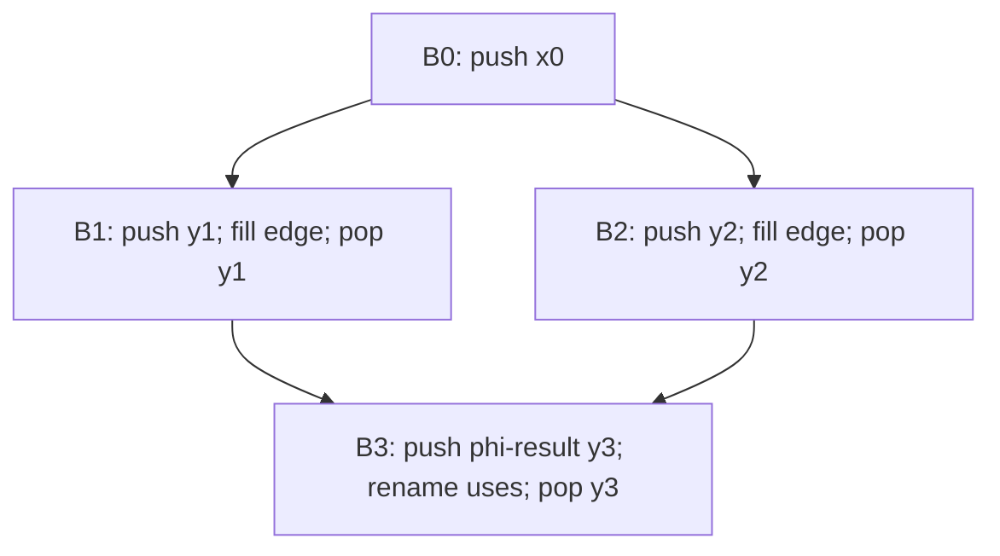

# Занятие 7. SSA-переименование и проверка

> Стек текущих определений и обход дерева доминаторов

[← Карта курса](../course-map.md) · [Предыдущее занятие](../modules/06-ssa-and-phi.md) · [Следующее занятие](../modules/08-dependencies-and-lvn.md)

## Результат занятия

| **К концу обязательной части.** Ты выполняешь фазу renaming по дереву доминаторов, заполняешь входы φ и проверяешь dominance/unique-definition инварианты. |
|------------------------------------------------------------------------------------------------------------------------------------------------------------|

| **Параметр**          | **Значение**                                       |
|-----------------------|----------------------------------------------------|
| Сложность             | Сложный                                            |
| Обязательная нагрузка | 90–120 мин или 2 сессии                            |
| Перед началом         | Уметь размещать φ-функции.                         |
| Что подготовить      | трассу стеков, SSA-версию цикла и таблицу verifier |

| **Разрешённый режим.** Следи за состоянием стеков; не пытайся держать всё в голове. |
|-------------------------------------------------------------------------------------|

| **В этом занятии не требуется.** Не нужна реализация компилятора; достаточно ручной трассы стеков. |
|---------------------------------------------------------------------------------------------|

## Обязательный маршрут

| **Этап**           | **Время** | **Результат**                                           |
|--------------------|-----------|---------------------------------------------------------|
| Повторение         | 5–10 мин  | Не больше 3 коротких вопросов                           |
| Простое объяснение | 10–15 мин | Пересказать тему своими словами                         |
| Разобранный пример | 15–20 мин | Воспроизвести ключевые состояния                        |
| Задача A           | 20–25 мин | Обязательный минимум по образцу                         |
| Задача B           | 20–35 мин | Стандарт; можно завершить во второй короткой сессии     |
| Устный итог        | 5–10 мин  | 3 вопроса и самооценка светофором                       |
| Углубление         | 0–40 мин  | Задача C и профессиональные детали — только при ресурсе |

| **Когда запрашивать помощь.** После 10–15 минут честной попытки можно сразу зафиксировать точное место остановки и запросить разбор. Не нужно сначала мучительно завершать A и B. |
|----------------------------------------------------------------------------------------------------------------------------------------------------------|

## Короткое повторение

<table>
<colgroup>
<col style="width: 33%" />
<col style="width: 33%" />
<col style="width: 33%" />
</colgroup>
<thead>
<tr class="header">
<th><strong>Когда</strong></th>
<th><strong>Объём</strong></th>
<th><strong>Что сделать</strong></th>
</tr>
</thead>
<tbody>
<tr class="odd">
<td>Вчера</td>
<td>1–2 формулировки</td>
<td>• В SSA каждое имя определяется ровно один раз. 
• φ выбирает значение по входящему ребру CFG.</td>
</tr>
<tr class="even">
<td>3 дня назад</td>
<td>1 формулировка</td>
<td>A доминирует B, если A лежит на каждом пути от entry к B.</td>
</tr>
</tbody>
</table>

| **Ограничение.** На повторение не трать больше 10 минут. Не вспомнил — сделай попытку, посмотри ответ и верни карточку на следующее повторение. |
|-----------------------------------------------------------------------------------------------------------------------------------|

## Сначала простыми словами

Переименование SSA — это аккуратное ведение «текущей версии» каждой переменной вдоль дерева доминаторов. Для каждой переменной удобно иметь стек версий.

Входя в блок, мы создаём версии для его определений, используем верхушки стеков в выражениях и заполняем φ-аргументы преемников. Выходя из поддерева, снимаем версии, созданные в этом блоке.

### Пять терминов занятия

| **Термин**          | **Моя формулировка одним предложением** |
|---------------------|-----------------------------------------|
| dominator-tree walk |                                         |
| стек версий         |                                         |
| push                |                                         |
| pop                 |                                         |
| φ-аргумент          |                                         |

## Минимум для запоминания

- Текущая версия переменной хранится на вершине её стека.

- Порядок: φ-defs → uses → ordinary defs → φ-inputs successors → дети дерева → pop.

- После выхода из блока нужно снять ровно созданные в нём версии.

| **Не учи дословно без смысла.** Сначала объясни формулировку своими словами на маленьком примере. Точная версия нужна после понимания. |
|----------------------------------------------------------------------------------------------------------------------------------------|

## Визуальная модель

*Рабочее представление темы занятия*

## Разобранный пример — проход по шагам

<table>
<colgroup>
<col style="width: 100%" />
</colgroup>
<thead>
<tr class="header">
<th>pre: 
i = 0 
goto head 
head: 
if i &gt;= n goto exit 
body: 
sum = sum + a[i] 
i = i + 1 
goto head 
exit: 
return sum</th>
</tr>
</thead>
<tbody>
</tbody>
</table>

Для i и sum в head нужны φ, потому что к заголовку приходят значения из preheader и latch. После renaming каждый шаг итерации образует новое SSA-value, хотя на бумаге цикл конечным числом имён представляется через обратные φ-связи.

1. Создай пустой стек и счётчик для каждой исходной переменной.

2. В блоке сначала дай новые версии результатам φ и push их.

3. Замени uses текущими вершинами стеков.

4. Для обычных definitions создай версии и push.

5. Для каждого successor заполни соответствующий φ-input текущей версией.

6. Обойди детей dominator tree.

7. На выходе pop все версии, созданные именно в текущем блоке.

| **Проверка понимания.** Закрой пример и объясни не итог, а почему выполняется каждый следующий шаг. Если не можешь — зафиксируй именно этот переход и запроси разбор. |
|------------------------------------------------------------------------------------------------------------------------------------------------------|

## Обязательная практика

### Задача A — обязательная по образцу: Трасса стеков

| **Параметр**     | **Значение**                                                               |
|------------------|----------------------------------------------------------------------------|
| Статус           | Обязательно в этом занятии                                                        |
| Ориентир времени | 45 мин                                                                     |
| Что сдать        | φ-def обрабатывается первым; uses читают вершину; после ветви выполнен pop |

<table>
<colgroup>
<col style="width: 100%" />
</colgroup>
<thead>
<tr class="header">
<th>Выполни renaming для ромба: 
B0: x = input(); branch x&gt;0, B1, B2 
B1: y = x+1; goto B3 
B2: y = 1-x; goto B3 
B3: y = phi [B1:y, B2:y]; print y 
После каждого блока запиши состояния стеков `x` и `y`, а также список значений, которые будут pop.</th>
</tr>
</thead>
<tbody>
</tbody>
</table>

| **Подсказка 1.** Нарисуй dominator tree и подготовь отдельный стек для каждой исходной переменной. |
|----------------------------------------------------------------------------------------------------|

## Стандартная практика

### Задача B — стандартная для закрепления: SSA цикла

| **Параметр**     | **Значение**                                                        |
|------------------|---------------------------------------------------------------------|
| Статус           | Нужно выполнить до следующей зависимой темы; можно во второй сессии |
| Ориентир времени | 40 мин                                                              |
| Что сдать        | φ для i и sum; одно определение на имя; обратные входы из latch     |

Переведи пример с i и sum в SSA. Явно подпиши φ-входы pre и latch. Начальное значение sum добавь самостоятельно.

| **Подсказка 1.** Нарисуй dominator tree и подготовь отдельный стек для каждой исходной переменной. |
|----------------------------------------------------------------------------------------------------|

| **Подсказка 2.** Заполняй φ successor после обычных definitions текущего блока, но до рекурсии в children. |
|------------------------------------------------------------------------------------------------------------|

## Три вопроса на выходе

| **Вопрос**                                 | **Результат retrieval**         |
|--------------------------------------------|---------------------------------|
| Почему нельзя просто идти по CFG?          | □ ≤15 с □ с паузой □ не ответил |
| Когда заполняются входы φ successor-блока? | □ ≤15 с □ с паузой □ не ответил |
| Зачем pop после поддерева?                 | □ ≤15 с □ с паузой □ не ответил |

## Светофор понимания

| **Состояние** | **Что это означает**                                    | **Следующее действие**                                                  |
|---------------|---------------------------------------------------------|-------------------------------------------------------------------------|
| Зелёный       | Могу объяснить и решить A/B с незначительной проверкой. | Перейти дальше; C только по желанию.                                    |
| Жёлтый        | Понимаю идею, но теряю один шаг или термин.             | Разобрать уменьшенный пример с преподавателем или свериться с эталоном; B можно закончить во второй сессии. |
| Красный       | Не могу объяснить причинную модель или начать A.        | Не переходить дальше; зафиксировать попытку и запросить разбор после 10–15 минут.                   |

| **Минимум занятия.** Занятие засчитывается, если понятна причинная модель, воспроизведён пример и выполнена задача A. Задача B должна быть закрыта до следующей темы, которая на неё опирается. |
|------------------------------------------------------------------------------------------------------------------------------------------------------------------------------------------|

## Справочник и углубление — читать по необходимости

| **Это необязательная часть первого прохода.** Открывай её, если простого объяснения недостаточно, при проверке решения или когда остались силы. Профессиональные оговорки не являются обязательным минимумом занятия. |
|--------------------------------------------------------------------------------------------------------------------------------------------------------------------------------------------------------------|

### Подробная теория

#### Почему обходится дерево доминаторов

Если блок D доминирует B, определения из D доступны при входе в B, пока их не перекрыло новое определение. Поэтому переименование естественно выполнять DFS по **дереву доминаторов**, поддерживая стек актуальных SSA-имён для каждой исходной переменной.

Обход по текстовому порядку или обычному DFS CFG не гарантирует, что после возврата из одной ветви текущим не останется определение, недоступное в другой ветви.

#### Порядок действий в блоке

Сначала создать новые имена для результатов φ блока и push их в соответствующие стеки. Затем заменить обычные uses вершинами стеков. После этого создать свежие имена для обычных definitions и push. Затем для каждого successor заполнить его φ-операнд, подписанный текущим блоком. После обработки детей в дереве доминаторов pop все определения, созданные в текущем блоке.

Именно pop восстанавливает среду родителя. Без него определения из законченной ветви «протекут» в соседнюю.

#### SSA verifier

Проверки: одно определение на value; все uses ссылаются на существующие values той же функции; обычное определение доминирует блок использования; для φ-операнда определение доступно на соответствующем входящем ребре; число и метки входов φ совпадают с predecessor.

После любого прохода, меняющего CFG, defs или uses, полезно снова запускать verifier. На бумаге выполняй тот же ритуал: список определений, список использований и проверка доминирования.

#### Цикл в SSA

В заголовке цикла φ объединяет начальное значение из preheader и значение следующей итерации из latch. Например, i1 = phi \[pre:i0, latch:i2\]; в теле используется i1; в latch определяется i2 = i1 + 1.

## Алгоритм на одной странице

| **Поле**          | **Содержание**                                                          |
|-------------------|-------------------------------------------------------------------------|
| Название          | SSA renaming                                                            |
| Вход              | CFG, dominator tree и уже вставленные φ.                                |
| Результат         | Полностью именованный SSA и заполненные φ-входы.                        |
| Инвариант         | Вершина стека — определение, доступное по текущему dominator-tree пути. |
| Условие остановки | Обработаны все достижимые блоки; стеки восстановлены.                   |
| Сложность         | O(number of instructions + phi operands).                               |

8.  DFS по dominator tree.

9.  В текущем блоке присвоить свежие имена результатам φ и push.

10. Заменить обычные uses вершинами стеков; свежо именовать definitions и push.

11. Для каждого successor записать в его φ вход, соответствующий текущему predecessor.

12. Рекурсивно обработать детей dominator tree.

13. Pop все имена, созданные блоком.

### Допущения учебного IR на сегодня

- У каждого базового блока ровно один терминатор; терминатор является последней инструкцией блока.

- Деление может завершиться наблюдаемой ошибкой при нуле. Его нельзя безусловно удалять или выносить, пока не доказаны безопасность и допустимость спекуляции.

- print, store, volatile/atomic операции и неизвестный вызов имеют наблюдаемый эффект. Пометка `pure` означает отсутствие чтения/записи памяти и иных эффектов по контракту; исключения проверяются отдельно. `readonly` запрещает запись, но разрешает чтение памяти и само по себе не делает вызов чистым.

### Дополнительная задача

### Задача C — необязательный перенос: Ручной verifier

| **Параметр**     | **Значение**                                      |
|------------------|---------------------------------------------------|
| Статус           | Только если осталось внимание                     |
| Ориентир времени | 20 мин                                            |
| Что сдать        | все values перечислены; φ uses проверены на ребре |

Составь таблицу SSA value → block определения → uses. Для каждого use поставь отметку dominance OK/ошибка.

| **Подсказка 1.** Нарисуй dominator tree и подготовь отдельный стек для каждой исходной переменной. |
|----------------------------------------------------------------------------------------------------|

| **Подсказка 2.** Заполняй φ successor после обычных definitions текущего блока, но до рекурсии в children. |
|------------------------------------------------------------------------------------------------------------|

### Полная устная проверка

| **Вопрос**                                          | **Результат retrieval**         |
|-----------------------------------------------------|---------------------------------|
| Почему нельзя просто идти по CFG?                   | □ ≤15 с □ с паузой □ не ответил |
| Когда заполняются входы φ successor-блока?          | □ ≤15 с □ с паузой □ не ответил |
| Зачем pop после поддерева?                          | □ ≤15 с □ с паузой □ не ответил |
| Как проверяется φ-use?                              | □ ≤15 с □ с паузой □ не ответил |
| Почему цикл не требует бесконечного числа SSA-имён? | □ ≤15 с □ с паузой □ не ответил |

### Журнал ошибок

| **Ошибка / сомнение** | **Первый нарушенный инвариант** | **Исправленное правило** | **Новый пример / итерация** |
|-----------------------|---------------------------------|--------------------------|-------------------------|
|                       |                                 |                          |                         |
|                       |                                 |                          |                         |
|                       |                                 |                          |                         |
|                       |                                 |                          |                         |
|                       |                                 |                          |                         |

### План повторения

| **Когда**    | **Что повторить**                                                  |
|--------------|--------------------------------------------------------------------|
| Завтра       | 3 пункта минимального блока и задача A.                            |
| Через 3 дня  | Один алгоритм или стандартная задача B.                            |
| Через 7 дней | Покажи push/pop для одной переменной в двух ветвях dominator tree. |

### Как получить обратную связь

**Сообщение для начала ежедневной сессии**

<table>
<colgroup>
<col style="width: 100%" />
</colgroup>
<thead>
<tr class="header">
<th>Я работаю по документу «SSA: переименование и проверка корректности» (версия 3.0). Я могу обратиться уже после 10–15 минут честной попытки. 
 
Моя текущая зона: зелёная / жёлтая / красная. 
Моя попытка и точное место остановки: ... 
 
Работай так: 
1. Сначала проверь мою причинную модель простым вопросом, не выдавая решение. 
2. Если модель неверна, объясни тему на одном меньшем примере и попроси меня пересказать. 
3. Найди только первую существенную ошибку: место, нарушенный инвариант и минимальный контрпример. 
4. Дай мне исправить её самостоятельно. 
5. После исправления дай одну короткую задачу на перенос. 
6. В конце назови: что я уже понимаю, что пока понимаю с подсказкой и что повторить на следующей сессии.</th>
</tr>
</thead>
<tbody>
</tbody>
</table>

## Точечное чтение

- Cytron et al. (1991) — renaming; LLVM LangRef — verifier/well-formedness.

| **Стоп чтения.** Прекрати чтение, когда можешь воспроизвести определение/алгоритм и решить задачу B. Дополнительные страницы не заменяют практику. |
|----------------------------------------------------------------------------------------------------------------------------------------------------|
