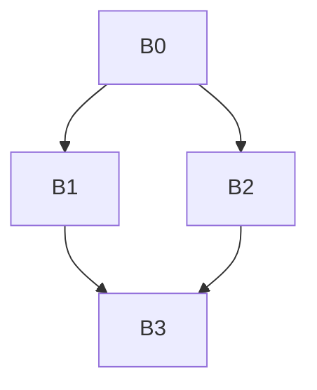
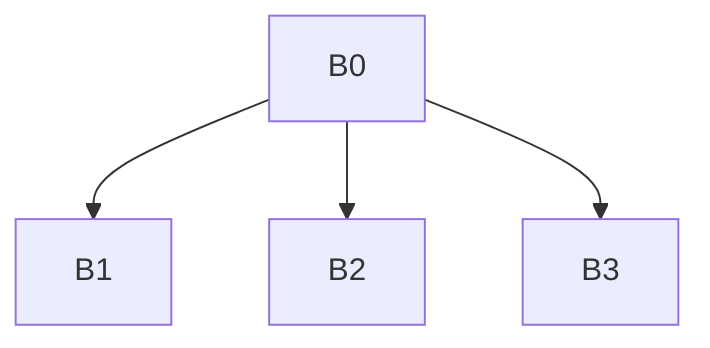

# Занятие 7. Переименование в SSA и проверка результата

> Обход дерева доминаторов со стеками текущих версий

[← Карта курса](../course-map.md) · [Предыдущее занятие](../modules/06-ssa-and-phi.md) · [Следующее занятие](../modules/08-dependencies-and-lvn.md)

## Результат занятия

Ты пошагово выполняешь переименование, заполняешь φ-входы и проверяешь единственность определений и доминирование использований.

**Перед началом:** расставленные φ-функции и дерево доминаторов.

## Зачем это вообще нужно

После расстановки φ имена всё ещё повторяются. Нужно выбрать текущую версию каждой переменной так, чтобы ветви не загрязняли состояние друг друга.

## Термины до заданий

| Термин | Простое объяснение | Точная опора |
|---|---|---|
| **Обход дерева доминаторов** (*dominator-tree walk*) | обрабатывает определение раньше всех доминируемых использований | родитель дерева посещается до его потомков |
| **Стек версий** | хранит доступные версии одной исходной переменной | верхняя версия используется при чтении |
| **Добавление в стек** (*push*) | делает новое определение текущей версией | выполняется для результата φ-функции и обычного определения |
| **Удаление из стека** (*pop*) | убирает версии, созданные в покидаемом блоке | восстанавливает состояние для соседнего поддерева |
| **Аргумент φ-функции** | значение на конкретном входящем ребре | заполняется текущей верхней версией в блоке-предшественнике |

Сначала прочитай объяснения. Затем закрой таблицу и перескажи термины своими словами. Это проверка понимания, а не попытка угадать определение.

## Ключевая схема

CFG ромба:



Дерево доминаторов того же графа:



Эти два графа нельзя смешивать.

## Пошаговый разбор

Исходный IR после расстановки φ-функций:

```text
B0: x = input; branch B1,B2
B1: y = x + 1; goto B3
B2: y = 1 - x; goto B3
B3: y = φ(B1:y, B2:y); print y
```

| Событие | Стек `x` | Стек `y` | Результат |
|---|---|---|---|
| вход в B0, определение x | [x0] | [] | `x0=input` |
| вход в B1, определение y | [x0] | [y1] | `y1=x0+1` |
| ребро B1→B3 | [x0] | [y1] | φ-вход `[B1:y1]` |
| выход из B1 | [x0] | [] | удалить y1 из стека |
| вход в B2, определение y | [x0] | [y2] | `y2=1-x0` |
| ребро B2→B3 | [x0] | [y2] | φ-вход `[B2:y2]` |
| выход из B2 | [x0] | [] | удалить y2 из стека |
| вход в B3, определение φ-функцией | [x0] | [y3] | `y3=φ(...)`; `print y3` |
| выход из B3 и затем B0 | [] | [] | удалить y3, затем x0 |

## Формальное правило

Порядок внутри блока:

1. создать версии результатов φ-функций;
2. переименовать использования;
3. создать версии обычных определений;
4. заполнить входы φ-функций в блоках-последователях;
5. рекурсивно обойти детей дерева доминаторов;
6. удалить из стеков ровно те версии, которые созданы в этом блоке.

## Типичные ошибки

- Обходить CFG вместо дерева доминаторов и бесконечно возвращаться по циклу.
- Не удалять версию из стека после одной ветви, из-за чего она становится видна в соседней.
- Заполнять вход φ-функции значением из самого блока слияния.
- Не инициализировать входные параметры и начальные значения.

## Задача A — по образцу

Повтори таблицу трассы ромба и выпиши число добавлений в стек и удалений из него для `x` и `y` в каждом блоке.

<details>
<summary>Проверка задачи A — открывать после попытки</summary>

B0: добавить `x0` в стек и удалить его после всего поддерева. B1 и B2: добавить и затем удалить `y1` и `y2`. B3: добавить и удалить результат φ-функции `y3`. Входы φ-функции заполняются в B1 и B2 до удаления версий из стеков.

</details>

## Самостоятельная задача

Переведи цикл `i=0; sum=0; while(i<n){sum+=a[i]; i++;}` в SSA, подпиши входы φ-функций из предвходного и замыкающего блоков.

<details>
<summary>Проверка задачи B — открывать после попытки</summary>

```text
pre: i0=0; sum0=0; goto head
head:
  i1=φ(pre:i0, latch:i2)
  sum1=φ(pre:sum0, latch:sum2)
  branch i1<n, body, exit
body: v1=load a[i1]; sum2=sum1+v1; goto latch
latch: i2=i1+1; goto head
exit: return sum1
```

</details>

## Проверь себя

**Почему нужно дерево доминаторов?**  


**Когда заполняется вход φ-функции?**  


**Зачем удалять версии из стека?**  


<details>
<summary>Короткие ответы</summary>

**Почему нужно дерево доминаторов?**  
Оно гарантирует, что доступное определение обработано до всех доминируемых использований и позволяет корректно восстановить состояние между поддеревьями.

**Когда заполняется вход φ-функции?**  
В блоке-предшественнике после его обычных определений и перед выходом из блока.

**Зачем удалять версии из стека?**  
Чтобы определение одной ветви не стало видимым в соседнем поддереве.

</details>

## Как это устроено в промышленном компиляторе

Проверка инвариантов должна отдельно учитывать обычные использования и использования операндов φ-функции на входящих рёбрах. Это разные точки доступности значения.
