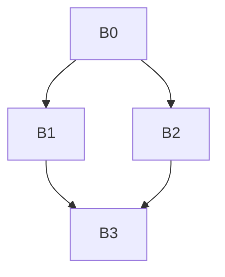
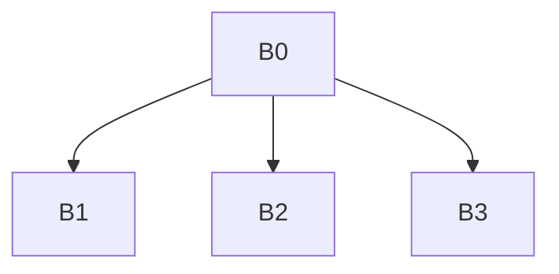

# Занятие 7. SSA-renaming и verifier

> Обход дерева доминаторов со стеками текущих версий

[← Карта курса](../course-map.md) · [Предыдущее занятие](../modules/06-ssa-and-phi.md) · [Следующее занятие](../modules/08-dependencies-and-lvn.md)

## Результат занятия

Ты пошагово выполняешь переименование, заполняешь φ-входы и проверяешь unique-definition/dominance.

**Перед началом:** расставленные φ и dominator tree.

## Зачем это вообще нужно

После расстановки φ имена всё ещё повторяются. Нужно выбрать текущую версию каждой переменной так, чтобы ветви не загрязняли состояние друг друга.

## Термины до заданий

| Термин | Простое объяснение | Точная опора |
|---|---|---|
| **dominator-tree walk** | обход дерева доминаторов | родитель обрабатывается до всех блоков, которые он доминирует |
| **стек версий** | текущие доступные SSA-имена одной исходной переменной | верхушка используется при чтении |
| **push** | положить новое определение на стек | выполняется при φ-def и обычном def |
| **pop** | снять определения, созданные в покидаемом блоке | восстанавливает состояние для соседнего поддерева |
| **φ-аргумент** | значение на конкретном входящем ребре | заполняется из верхушки стека в predecessor |

Сначала прочитай готовые объяснения. Затем закрой таблицу и сформулируй каждый термин своими словами. Пустая формулировка ученика — это проверка после обучения, а не замена обучения.

## Первая модель

CFG ромба:



Dominator tree того же графа:



Эти два графа нельзя смешивать.

## Разобранный пример: состояние за состоянием

Исходный IR после φ-placement:

```text
B0: x = input; branch B1,B2
B1: y = x + 1; goto B3
B2: y = 1 - x; goto B3
B3: y = φ(B1:y, B2:y); print y
```

| Событие | stack(x) | stack(y) | Запись |
|---|---|---|---|
| вход B0, def x | [x0] | [] | `x0=input` |
| вход B1, def y | [x0] | [y1] | `y1=x0+1` |
| ребро B1→B3 | [x0] | [y1] | φ-вход `[B1:y1]` |
| выход B1 | [x0] | [] | pop y1 |
| вход B2, def y | [x0] | [y2] | `y2=1-x0` |
| ребро B2→B3 | [x0] | [y2] | φ-вход `[B2:y2]` |
| выход B2 | [x0] | [] | pop y2 |
| вход B3, φ-def | [x0] | [y3] | `y3=φ(...)`; `print y3` |
| выход B3/B0 | [] | [] | pop y3, затем x0 |

## Формальное правило

Порядок внутри блока: создать версии результатов φ → переименовать uses → создать версии обычных defs → заполнить φ-inputs successors → рекурсивно обойти детей dominator tree → pop ровно созданные здесь версии.

## Типичные ошибки

- Обходить CFG вместо dominator tree и бесконечно ходить по циклу.
- Не делать pop после одной ветви, из-за чего её версия видна в соседней.
- Заполнять φ-вход значением из самого join-блока.
- Не инициализировать входные параметры и начальные значения.

## Задача A — по образцу

Повтори таблицу трассы ромба и выпиши количество push/pop для `x` и `y` в каждом блоке.

<details>
<summary>Проверка задачи A — открывать после попытки</summary>

B0: push x0, pop x0 после всего поддерева. B1: push/pop y1. B2: push/pop y2. B3: push/pop φ-result y3. φ-входы заполняются в B1/B2 до pop.

</details>

## Задача B — перенос на новый пример

Переведи цикл `i=0; sum=0; while(i<n){sum+=a[i]; i++;}` в SSA, подпиши входы φ из preheader и latch.

<details>
<summary>Проверка задачи B — открывать после попытки</summary>

```text
pre: i0=0; sum0=0; goto head
head:
  i1=φ(pre:i0, latch:i2)
  sum1=φ(pre:sum0, latch:sum2)
  branch i1<n, body, exit
body: v1=load a[i1]; sum2=sum1+v1; goto latch
latch: i2=i1+1; goto head
exit: return sum1
```

</details>

## Проверка на выходе

**Почему нужен dominator tree?**  


**Когда заполняется φ-input?**  


**Зачем pop?**  


<details>
<summary>Короткие ответы</summary>

**Почему нужен dominator tree?**  
Он гарантирует, что доступное определение обработано до всех доминируемых uses и позволяет корректно восстановить состояние между поддеревьями.

**Когда заполняется φ-input?**  
В predecessor после его обычных definitions, перед выходом из блока.

**Зачем pop?**  
Чтобы определение одной ветви не стало видимым в соседнем поддереве.

</details>

## Профессиональная граница

Verifier должен отдельно проверять обычные uses и edge-sensitive uses φ. Это разные точки доступности значения.
