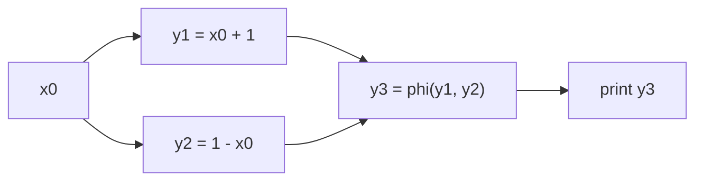

# Занятие 8. Зависимости и Local Value Numbering

> От control flow к тому, какие вычисления действительно зависят друг от друга

[← Карта курса](../course-map.md) · [Предыдущее занятие](../modules/07-ssa-renaming.md) · [Следующее занятие](../modules/09-constants.md)

## Результат занятия

| **К концу обязательной части.** Ты строишь граф зависимостей по SSA и выполняешь локальную value numbering с учётом коммутативности и побочных эффектов. |
|----------------------------------------------------------------------------------------------------------------------------------------------------------|

| **Параметр**          | **Значение**                                                   |
|-----------------------|----------------------------------------------------------------|
| Сложность             | Средний+                                                       |
| Обязательная нагрузка | 80–105 мин                                                     |
| Перед началом         | Корректная SSA-форма и def-use связи.                          |
| Что подготовить      | граф зависимостей, таблицу LVN и анализ влияния вызова на load |

| **Разрешённый режим.** Не смешивай CFG, def-use и таблицу VN. |
|---------------------------------------------------------------|

| **В этом занятии не требуется.** Не нужно глубоко изучать alias analysis и Memory SSA; только понимать границу применимости. |
|-----------------------------------------------------------------------------------------------------------------------|

## Обязательный маршрут

| **Этап**           | **Время** | **Результат**                                           |
|--------------------|-----------|---------------------------------------------------------|
| Повторение         | 5–10 мин  | Не больше 3 коротких вопросов                           |
| Простое объяснение | 10–15 мин | Пересказать тему своими словами                         |
| Разобранный пример | 15–20 мин | Воспроизвести ключевые состояния                        |
| Задача A           | 20–25 мин | Обязательный минимум по образцу                         |
| Задача B           | 20–35 мин | Стандарт; можно завершить во второй короткой сессии     |
| Устный итог        | 5–10 мин  | 3 вопроса и самооценка светофором                       |
| Углубление         | 0–40 мин  | Задача C и профессиональные детали — только при ресурсе |

| **Когда запрашивать помощь.** После 10–15 минут честной попытки можно сразу зафиксировать точное место остановки и запросить разбор. Не нужно сначала мучительно завершать A и B. |
|----------------------------------------------------------------------------------------------------------------------------------------------------------|

## Короткое повторение

<table>
<colgroup>
<col style="width: 33%" />
<col style="width: 33%" />
<col style="width: 33%" />
</colgroup>
<thead>
<tr class="header">
<th><strong>Когда</strong></th>
<th><strong>Объём</strong></th>
<th><strong>Что сделать</strong></th>
</tr>
</thead>
<tbody>
<tr class="odd">
<td>Вчера</td>
<td>1–2 формулировки</td>
<td>• Текущая версия переменной хранится на вершине её стека. 
• Порядок: φ-defs → uses → ordinary defs → φ-inputs successors → дети дерева → pop.</td>
</tr>
<tr class="even">
<td>3 дня назад</td>
<td>1 формулировка</td>
<td>idom(B) — ближайший строгий доминатор B.</td>
</tr>
<tr class="odd">
<td>7 дней назад</td>
<td>1 мини-задача</td>
<td>Воспроизведи полный pipeline компиляции за 4 минуты.</td>
</tr>
</tbody>
</table>

| **Ограничение.** На повторение не трать больше 10 минут. Не вспомнил — сделай попытку, посмотри ответ и верни карточку на следующее повторение. |
|-----------------------------------------------------------------------------------------------------------------------------------|

## Сначала простыми словами

CFG отвечает, куда может пойти управление. Граф зависимостей отвечает, какое значение нужно для вычисления другого значения. Это разные графы.

Value numbering присваивает одинаковым чистым выражениям один номер значения. Если новый оператор имеет тот же канонический ключ, результат можно заменить уже вычисленным значением.

### Пять терминов занятия

| **Термин**        | **Моя формулировка одним предложением** |
|-------------------|-----------------------------------------|
| def-use           |                                         |
| data dependence   |                                         |
| value number      |                                         |
| канонический ключ |                                         |
| побочный эффект   |                                         |

## Минимум для запоминания

- CFG описывает управление; def-use graph — зависимости значений.

- Ключ VN включает операцию и номера operands; для коммутативных операций operands канонизируются.

- Неизвестные эффекты памяти запрещают бездоказательную замену.

| **Не учи дословно без смысла.** Сначала объясни формулировку своими словами на маленьком примере. Точная версия нужна после понимания. |
|----------------------------------------------------------------------------------------------------------------------------------------|

## Визуальная модель

*Рабочее представление темы занятия*

## Разобранный пример — проход по шагам

<table>
<colgroup>
<col style="width: 100%" />
</colgroup>
<thead>
<tr class="header">
<th>a = input() 
b = input() 
t1 = a + b 
t2 = b + a 
t3 = t1 * 2 
t4 = t2 * 2 
print t3, t4</th>
</tr>
</thead>
<tbody>
</tbody>
</table>

Если + коммутативно в данной семантике, t1 и t2 получают один номер. Тогда t3 и t4 тоже совпадают. Второе вычисление можно заменить ссылкой на первое значение.

| **Проверка понимания.** Закрой пример и объясни не итог, а почему выполняется каждый следующий шаг. Если не можешь — зафиксируй именно этот переход и запроси разбор. |
|------------------------------------------------------------------------------------------------------------------------------------------------------|

## Обязательная практика

### Задача A — обязательная по образцу: Граф зависимостей

| **Параметр**     | **Значение**                                                                           |
|------------------|----------------------------------------------------------------------------------------|
| Статус           | Обязательно в этом занятии                                                                    |
| Ориентир времени | 30 мин                                                                                 |
| Что сдать        | узел на каждое определение; 2 входа у бинарной операции; не смешаны control/data edges |

Для примера нарисуй узлы определений и рёбра от операндов к результатам. Отдельно пометь, какие рёбра не являются CFG-рёбрами.

| **Подсказка 1.** Сначала назначь VN входам и константам, затем записывай canonical key. |
|-----------------------------------------------------------------------------------------|

## Стандартная практика

### Задача B — стандартная для закрепления: Таблица LVN

| **Параметр**     | **Значение**                                                              |
|------------------|---------------------------------------------------------------------------|
| Статус           | Нужно выполнить до следующей зависимой темы; можно во второй сессии       |
| Ориентир времени | 40 мин                                                                    |
| Что сдать        | канонизация только для коммутативных; копии/повторы заменены; типы учтены |

Проведи LVN для блока с выражениями a+b, b+a, a-b, a+b, 2\*(a+b). Таблица: инструкция, canonical key, value number, replacement.

| **Подсказка 1.** Сначала назначь VN входам и константам, затем записывай canonical key. |
|-----------------------------------------------------------------------------------------|

| **Подсказка 2.** Не сортируй operands для subtraction/division и не переноси memory fact через unknown call. |
|--------------------------------------------------------------------------------------------------------------|

## Три вопроса на выходе

| **Вопрос**                                | **Результат retrieval**         |
|-------------------------------------------|---------------------------------|
| Чем CFG отличается от графа зависимостей? | □ ≤15 с □ с паузой □ не ответил |
| Из чего состоит ключ value numbering?     | □ ≤15 с □ с паузой □ не ответил |
| Когда можно сортировать операнды?         | □ ≤15 с □ с паузой □ не ответил |

## Светофор понимания

| **Состояние** | **Что это означает**                                    | **Следующее действие**                                                  |
|---------------|---------------------------------------------------------|-------------------------------------------------------------------------|
| Зелёный       | Могу объяснить и решить A/B с незначительной проверкой. | Перейти дальше; C только по желанию.                                    |
| Жёлтый        | Понимаю идею, но теряю один шаг или термин.             | Разобрать уменьшенный пример с преподавателем или свериться с эталоном; B можно закончить во второй сессии. |
| Красный       | Не могу объяснить причинную модель или начать A.        | Не переходить дальше; зафиксировать попытку и запросить разбор после 10–15 минут.                   |

| **Минимум занятия.** Занятие засчитывается, если понятна причинная модель, воспроизведён пример и выполнена задача A. Задача B должна быть закрыта до следующей темы, которая на неё опирается. |
|------------------------------------------------------------------------------------------------------------------------------------------------------------------------------------------|

## Справочник и углубление — читать по необходимости

| **Это необязательная часть первого прохода.** Открывай её, если простого объяснения недостаточно, при проверке решения или когда остались силы. Профессиональные оговорки не являются обязательным минимумом занятия. |
|--------------------------------------------------------------------------------------------------------------------------------------------------------------------------------------------------------------|

### Подробная теория

#### CFG и граф зависимостей отвечают на разные вопросы

CFG отвечает «куда может перейти управление». **Граф зависимостей данных** отвечает «какое значение необходимо для вычисления другого». В SSA узел-определение естественно соединяется с uses, поэтому зависимость становится почти явной.

Для инструкции z3 = add x1, y2 существуют зависимости x1 → z3 и y2 → z3. Управляющая зависимость — отдельное понятие; не смешивай её с data dependency.

#### Какое значение имеет термин «граф зависимостей»

В этом комплекте по умолчанию строится **SSA def-use/data-dependence graph**: ребро идёт от определения operand-value к определению результата. Зависимости памяти требуют alias/effect model или Memory SSA, а control dependence — postdominance/control-dependence analysis. Перед зачётом уточни у преподавателя, ожидается ли только def-use graph или более широкий PDG.

#### Value numbering

Нумерация значений присваивает одинаковый номер выражениям, доказанно вычисляющим одно значение. В **local value numbering** анализ ограничен базовым блоком, поэтому не требуется соединять информацию по разным путям.

Ключ выражения обычно включает opcode, value numbers операндов, тип и значимые флаги семантики. Для коммутативных операций операнды можно канонизировать: ключи a+b и b+a совпадут. Для вычитания или деления порядок менять нельзя.

#### Константы, копии и алгебра

Константы получают стабильные номера. Копия b = a может наследовать номер a. Простая constant folding может выполняться вместе с LVN, но важно отличать «одинаковое выражение» от алгебраического доказательства более высокого уровня.

Выражения разных типов или с разными правилами переполнения не обязательно эквивалентны. Например, signed overflow semantics могут влиять на допустимость преобразований.

#### Память и эффекты

Два load p нельзя автоматически считать одинаковыми, если между ними мог быть store или вызов с побочными эффектами. Нужны alias/effect факты или версия памяти. Аналогично два вызова функции объединяются только при доказанной чистоте и одинаковых аргументах.

## Алгоритм на одной странице

| **Поле**          | **Содержание**                                                    |
|-------------------|-------------------------------------------------------------------|
| Название          | Local Value Numbering                                             |
| Вход              | Один базовый блок и semantic/effect contract.                     |
| Результат         | VN каждой инструкции и замены повторных чистых выражений.         |
| Инвариант         | Один key означает доказанно одинаковое значение в пределах блока. |
| Условие остановки | Все инструкции блока обработаны один раз.                         |
| Сложность         | Ожидаемо O(N) с hash table.                                       |

1.  Назначить номера входам и константам.

2.  Преобразовать operands к их VN.

3.  Канонизировать operands только для commutative opcode.

4.  Сформировать key=(opcode,type,flags,VNs).

5.  Если key уже есть — заменить результат существующим value; иначе выделить новый VN.

6.  На memory/effect barrier применить контракт или инвалидировать memory facts.

### Допущения учебного IR на сегодня

- У каждого базового блока ровно один терминатор; терминатор является последней инструкцией блока.

- Деление может завершиться наблюдаемой ошибкой при нуле. Его нельзя безусловно удалять или выносить, пока не доказаны безопасность и допустимость спекуляции.

- print, store, volatile/atomic операции и неизвестный вызов имеют наблюдаемый эффект. Вызов считается чистым только при явной пометке pure/readonly в условии.

### Дополнительная задача

### Задача C — необязательный перенос: Эффекты

| **Параметр**     | **Значение**                                            |
|------------------|---------------------------------------------------------|
| Статус           | Только если осталось внимание                           |
| Ориентир времени | 25 мин                                                  |
| Что сдать        | консервативный вариант; условия безопасного объединения |

Добавь два load p и между ними неизвестный call f(). Объясни два варианта: без effect summary и при доказанной pure/readonly функции.

| **Подсказка 1.** Сначала назначь VN входам и константам, затем записывай canonical key. |
|-----------------------------------------------------------------------------------------|

| **Подсказка 2.** Не сортируй operands для subtraction/division и не переноси memory fact через unknown call. |
|--------------------------------------------------------------------------------------------------------------|

### Полная устная проверка

| **Вопрос**                                | **Результат retrieval**         |
|-------------------------------------------|---------------------------------|
| Чем CFG отличается от графа зависимостей? | □ ≤15 с □ с паузой □ не ответил |
| Из чего состоит ключ value numbering?     | □ ≤15 с □ с паузой □ не ответил |
| Когда можно сортировать операнды?         | □ ≤15 с □ с паузой □ не ответил |
| Почему load требует memory facts?         | □ ≤15 с □ с паузой □ не ответил |
| Что даёт SSA для построения def-use?      | □ ≤15 с □ с паузой □ не ответил |

### Журнал ошибок

| **Ошибка / сомнение** | **Первый нарушенный инвариант** | **Исправленное правило** | **Новый пример / итерация** |
|-----------------------|---------------------------------|--------------------------|-------------------------|
|                       |                                 |                          |                         |
|                       |                                 |                          |                         |
|                       |                                 |                          |                         |
|                       |                                 |                          |                         |
|                       |                                 |                          |                         |

### План повторения

| **Когда**    | **Что повторить**                                      |
|--------------|--------------------------------------------------------|
| Завтра       | 3 пункта минимального блока и задача A.                |
| Через 3 дня  | Один алгоритм или стандартная задача B.                |
| Через 7 дней | Составь LVN key для \`add i32 a,b\` и \`sub i32 a,b\`. |

### Как получить обратную связь

**Сообщение для начала ежедневной сессии**

<table>
<colgroup>
<col style="width: 100%" />
</colgroup>
<thead>
<tr class="header">
<th>Я работаю по документу «Граф зависимостей и локальная нумерация значений» (версия 3.0). Я могу обратиться уже после 10–15 минут честной попытки. 
 
Моя текущая зона: зелёная / жёлтая / красная. 
Моя попытка и точное место остановки: ... 
 
Работай так: 
1. Сначала проверь мою причинную модель простым вопросом, не выдавая решение. 
2. Если модель неверна, объясни тему на одном меньшем примере и попроси меня пересказать. 
3. Найди только первую существенную ошибку: место, нарушенный инвариант и минимальный контрпример. 
4. Дай мне исправить её самостоятельно. 
5. После исправления дай одну короткую задачу на перенос. 
6. В конце назови: что я уже понимаю, что пока понимаю с подсказкой и что повторить на следующей сессии.</th>
</tr>
</thead>
<tbody>
</tbody>
</table>

## Точечное чтение

- Keith Cooper / Linda Torczon — local value numbering; LLVM MemorySSA docs for separation of register and memory dependencies.

| **Стоп чтения.** Прекрати чтение, когда можешь воспроизвести определение/алгоритм и решить задачу B. Дополнительные страницы не заменяют практику. |
|----------------------------------------------------------------------------------------------------------------------------------------------------|
