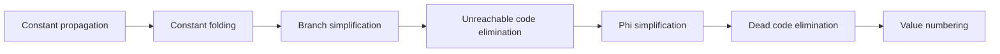

# Занятие 9. Свёртка и распространение констант

> Как факты о значениях превращают вычисления и ветвления в более простой IR

[← Карта курса](../course-map.md) · [Предыдущее занятие](../modules/08-dependencies-and-lvn.md) · [Следующее занятие](../modules/10-dce-uce-and-pass-order.md)

## Сегодняшний результат

| **К концу обязательной части.** Ты различаешь folding и propagation, распространяешь константы через SSA/φ и упрощаешь условные переходы до неподвижной точки. |
|----------------------------------------------------------------------------------------------------------------------------------------------------------------|

| **Параметр**          | **Значение**                                                          |
|-----------------------|-----------------------------------------------------------------------|
| Сложность             | Средний+                                                              |
| Обязательная нагрузка | 80–105 мин                                                            |
| Перед началом         | SSA, φ-семантика, def-use и рабочие списки.                           |
| Что подготовить      | таблицу lattice states, набор исполнимых рёбер и собственный тест CFG |

| **Разрешённый режим.** Обязателен простой propagation; SCCP — только после него. |
|----------------------------------------------------------------------------------|

| **В этом занятии не требуется.** SCCP с полной lattice/worklist-механикой — углубление после обычного propagation. |
|-------------------------------------------------------------------------------------------------------------|

## Обязательный маршрут

| **Этап**           | **Время** | **Результат**                                           |
|--------------------|-----------|---------------------------------------------------------|
| Повторение         | 5–10 мин  | Не больше 3 коротких вопросов                           |
| Простое объяснение | 10–15 мин | Пересказать тему своими словами                         |
| Разобранный пример | 15–20 мин | Воспроизвести ключевые состояния                        |
| Задача A           | 20–25 мин | Обязательный минимум по образцу                         |
| Задача B           | 20–35 мин | Стандарт; можно завершить во второй короткой сессии     |
| Устный итог        | 5–10 мин  | 3 вопроса и самооценка светофором                       |
| Углубление         | 0–40 мин  | Задача C и профессиональные детали — только при ресурсе |

| **Когда запрашивать помощь.** После 10–15 минут честной попытки можно сразу зафиксировать точное место остановки и запросить разбор. Не нужно сначала мучительно завершать A и B. |
|----------------------------------------------------------------------------------------------------------------------------------------------------------|

## Короткое повторение

<table>
<colgroup>
<col style="width: 33%" />
<col style="width: 33%" />
<col style="width: 33%" />
</colgroup>
<thead>
<tr class="header">
<th><strong>Когда</strong></th>
<th><strong>Объём</strong></th>
<th><strong>Что сделать</strong></th>
</tr>
</thead>
<tbody>
<tr class="odd">
<td>Вчера</td>
<td>1–2 формулировки</td>
<td>• CFG описывает управление; def-use graph — зависимости значений. 
• Ключ VN включает операцию и номера operands; для коммутативных операций operands канонизируются.</td>
</tr>
<tr class="even">
<td>3 дня назад</td>
<td>1 формулировка</td>
<td>В SSA каждое имя определяется ровно один раз.</td>
</tr>
<tr class="odd">
<td>7 дней назад</td>
<td>1 мини-задача</td>
<td>За 90 секунд назови три правила лидеров и точное определение basic block.</td>
</tr>
</tbody>
</table>

| **Ограничение.** На повторение не трать больше 10 минут. Не вспомнил — сделай попытку, посмотри ответ и верни карточку на следующее повторение. |
|-----------------------------------------------------------------------------------------------------------------------------------|

## Сначала простыми словами

Начни с простого: constant folding вычисляет выражение, состоящее из известных констант; propagation подставляет известную константу в её использования.

SCCP добавляет ещё один слой: он отслеживает, какие рёбра CFG вообще исполнимы. Это полезно, но не обязательно понимать раньше обычного распространения констант.

### Пять терминов занятия

| **Термин**           | **Моя формулировка одним предложением** |
|----------------------|-----------------------------------------|
| constant folding     |                                         |
| constant propagation |                                         |
| unknown              |                                         |
| constant             |                                         |
| overdefined          |                                         |

## Минимум для запоминания

- Folding вычисляет константное выражение; propagation распространяет известное значение.

- В SCCP значение имеет состояния unknown/constant/overdefined, а рёбра — исполнимость.

- После константного branch нужны UCE, исправление φ и DCE.

| **Не учи дословно без смысла.** Сначала объясни формулировку своими словами на маленьком примере. Точная версия нужна после понимания. |
|----------------------------------------------------------------------------------------------------------------------------------------|

## Визуальная модель

*Рабочее представление темы занятия*

## Разобранный пример — проход по шагам

<table>
<colgroup>
<col style="width: 100%" />
</colgroup>
<thead>
<tr class="header">
<th>B0: 
c0 = 1 
branch c0 == 1, B1, B2 
B1: 
x1 = 5 
goto B3 
B2: 
x2 = 9 
goto B3 
B3: 
x3 = phi [B1:x1, B2:x2] 
y1 = x3 + 2</th>
</tr>
</thead>
<tbody>
</tbody>
</table>

Условие истинно, ребро B0→B2 не исполнимо. Поэтому у φ остаётся достижимый вход x1=5, x3=5, затем y1=7. После этого B2 может быть удалён UCE.

1.  1\. Сначала выполни только folding внутри одной инструкции.

2.  2\. Затем распространи известные constants по uses.

3.  3\. Если условие стало константным, пометь только одно ребро исполнимым.

4.  4\. Удали недостижимый блок, исправь φ и после этого запусти DCE.

5.  5\. Только затем сравни с SCCP-lattice, если она нужна.

| **Проверка понимания.** Закрой пример и объясни не итог, а почему выполняется каждый следующий шаг. Если не можешь — зафиксируй именно этот переход и запроси разбор. |
|------------------------------------------------------------------------------------------------------------------------------------------------------|

## Обязательная практика

### Задача A — обязательная по образцу: Lattice trace

| **Параметр**     | **Значение**                                                                           |
|------------------|----------------------------------------------------------------------------------------|
| Статус           | Обязательно в этом занятии                                                                    |
| Ориентир времени | 40 мин                                                                                 |
| Что сдать        | unknown/constant/overdefined; учтена достижимость входов φ; показана очередь изменений |

Для примера составь таблицу состояний всех SSA-values по шагам и список исполнимых рёбер.

| **Подсказка 1.** Веди две таблицы: value states и executable edges. |
|---------------------------------------------------------------------|

## Стандартная практика

### Задача B — стандартная для закрепления: Циклический пример

| **Параметр**     | **Значение**                                                              |
|------------------|---------------------------------------------------------------------------|
| Статус           | Нужно выполнить до следующей зависимой темы; можно во второй сессии       |
| Ориентир времени | 35 мин                                                                    |
| Что сдать        | обратный вход; переход к overdefined; нет ошибочного бесконечного folding |

Проанализируй i = phi(0, i+1) в цикле. Объясни, почему i не является одной константой, хотя первый вход равен 0.

| **Подсказка 1.** Веди две таблицы: value states и executable edges. |
|---------------------------------------------------------------------|

| **Подсказка 2.** При анализе φ игнорируй входы с ещё неисполняемых рёбер. |
|---------------------------------------------------------------------------|

## Три вопроса на выходе

| **Вопрос**                             | **Результат retrieval**         |
|----------------------------------------|---------------------------------|
| Чем folding отличается от propagation? | □ ≤15 с □ с паузой □ не ответил |
| Что означает overdefined?              | □ ≤15 с □ с паузой □ не ответил |
| Как φ объединяет константы?            | □ ≤15 с □ с паузой □ не ответил |

## Светофор понимания

| **Состояние** | **Что это означает**                                    | **Следующее действие**                                                  |
|---------------|---------------------------------------------------------|-------------------------------------------------------------------------|
| Зелёный       | Могу объяснить и решить A/B с незначительной проверкой. | Перейти дальше; C только по желанию.                                    |
| Жёлтый        | Понимаю идею, но теряю один шаг или термин.             | Разобрать со мной уменьшенный пример; B можно закончить второй сессией. |
| Красный       | Не могу объяснить причинную модель или начать A.        | Не читать дальше; прислать попытку после 10–15 минут.                   |

| **Минимум занятия.** Занятие засчитывается, если понятна причинная модель, воспроизведён пример и выполнена задача A. Задача B должна быть закрыта до следующей темы, которая на неё опирается. |
|------------------------------------------------------------------------------------------------------------------------------------------------------------------------------------------|

## Справочник и углубление — читать по необходимости

| **Это необязательная часть первого прохода.** Открывай её, если простого объяснения недостаточно, при проверке решения или когда остались силы. Профессиональные оговорки не являются обязательным минимумом занятия. |
|--------------------------------------------------------------------------------------------------------------------------------------------------------------------------------------------------------------|

### Подробная теория

#### Два разных действия

**Constant folding** вычисляет операцию, когда её операнды уже известны: 3\*4 → 12. **Constant propagation** переносит факт от определения к uses: если x1=3, то y2=x1+4 становится кандидатом на folding.

Они часто работают вместе, но различие полезно для объяснения алгоритма и отладки прохода.

#### Три уровня, которые нельзя смешивать

1\) локальный **folding** одной инструкции; 2) распространение факта по def-use; 3) **SCCP**, который дополнительно моделирует исполнимость CFG-рёбер. В ответе всегда называй, на каком уровне работает твоя процедура.

#### Решётка значений

Удобная модель для SSA: unknown — значение ещё не исследовано; конкретная constant(c); overdefined — не одна фиксированная константа. Переходы монотонны: информация движется от unknown к константе или overdefined, но не скачет обратно.

Для φ: если все достижимые входы дают одну и ту же константу, результат константен; разные константы или overdefined дают overdefined; недостижимые входы не должны разрушать факт.

#### Sparse conditional propagation

Условность важна: если branch доказан, один successor становится недостижимым. Тогда φ в точке слияния может потерять спорный вход и стать константой. Поэтому SCCP одновременно ведёт worklist SSA-значений и исполнимых CFG-рёбер.

На зачёте может быть достаточно ручного глобального распространения по SSA, но сильный ответ объясняет, почему достижимость и value facts взаимно усиливают друг друга.

#### Неподвижная точка

Однократного прохода сверху вниз недостаточно при φ и циклах. После изменения значения нужно пересмотреть его uses; после открытия нового ребра — φ и инструкции successor; процесс заканчивается, когда worklist пуст.

## Алгоритм на одной странице

| **Поле**          | **Содержание**                                                                          |
|-------------------|-----------------------------------------------------------------------------------------|
| Название          | SCCP в учебной форме                                                                    |
| Вход              | SSA CFG.                                                                                |
| Результат         | Lattice state values, executable edges и упрощённый IR.                                 |
| Инвариант         | States не становятся менее определёнными; φ учитывает только executable incoming edges. |
| Условие остановки | Обе очереди пусты.                                                                      |
| Сложность         | Sparse worklist; зависит от числа def-use и CFG edges.                                  |

6.  Инициализировать states unknown; entry executable.

7.  Обрабатывать executable blocks/instructions и менять states монотонно.

8.  При изменении value добавить uses в worklist.

9.  Для branch открыть только доказанные executable edges или оба при overdefined.

10. При открытии edge пересчитать φ successor по executable inputs.

11. После fixed point заменить constants и удалить impossible edges/blocks отдельными passes.

### Допущения учебного IR на сегодня

- У каждого базового блока ровно один терминатор; терминатор является последней инструкцией блока.

- Деление может завершиться наблюдаемой ошибкой при нуле. Его нельзя безусловно удалять или выносить, пока не доказаны безопасность и допустимость спекуляции.

- print, store, volatile/atomic операции и неизвестный вызов имеют наблюдаемый эффект. Вызов считается чистым только при явной пометке pure/readonly в условии.

### Дополнительная задача

### Задача C — необязательный перенос: Собственный тест

| **Параметр**     | **Значение**                                      |
|------------------|---------------------------------------------------|
| Статус           | Только если осталось внимание                     |
| Ориентир времени | 20 мин                                            |
| Что сдать        | две ветви; доказанное условие; итоговая константа |

Придумай CFG, где удаление недостижимой ветви превращает φ с двумя разными константами в одну константу.

| **Подсказка 1.** Веди две таблицы: value states и executable edges. |
|---------------------------------------------------------------------|

| **Подсказка 2.** При анализе φ игнорируй входы с ещё неисполняемых рёбер. |
|---------------------------------------------------------------------------|

### Полная устная проверка

| **Вопрос**                             | **Результат retrieval**         |
|----------------------------------------|---------------------------------|
| Чем folding отличается от propagation? | □ ≤15 с □ с паузой □ не ответил |
| Что означает overdefined?              | □ ≤15 с □ с паузой □ не ответил |
| Как φ объединяет константы?            | □ ≤15 с □ с паузой □ не ответил |
| Почему SCCP отслеживает рёбра?         | □ ≤15 с □ с паузой □ не ответил |
| Почему нужен worklist?                 | □ ≤15 с □ с паузой □ не ответил |

### Журнал ошибок

| **Ошибка / сомнение** | **Первый нарушенный инвариант** | **Исправленное правило** | **Новый пример / итерация** |
|-----------------------|---------------------------------|--------------------------|-------------------------|
|                       |                                 |                          |                         |
|                       |                                 |                          |                         |
|                       |                                 |                          |                         |
|                       |                                 |                          |                         |
|                       |                                 |                          |                         |

### План повторения

| **Когда**    | **Что повторить**                                           |
|--------------|-------------------------------------------------------------|
| Завтра       | 3 пункта минимального блока и задача A.                     |
| Через 3 дня  | Один алгоритм или стандартная задача B.                     |
| Через 7 дней | Объедини lattice states двух входов φ: 3/3, 3/4, unknown/3. |

### Как получить обратную связь

**Сообщение для начала ежедневной сессии**

<table>
<colgroup>
<col style="width: 100%" />
</colgroup>
<thead>
<tr class="header">
<th>Я работаю по документу «Свёртка и глобальное распространение констант в SSA» (версия 3.0). Я могу обратиться уже после 10–15 минут честной попытки. 
 
Моя текущая зона: зелёная / жёлтая / красная. 
Моя попытка и точное место остановки: ... 
 
Работай так: 
1. Сначала проверь мою причинную модель простым вопросом, не выдавая решение. 
2. Если модель неверна, объясни тему на одном меньшем примере и попроси меня пересказать. 
3. Найди только первую существенную ошибку: место, нарушенный инвариант и минимальный контрпример. 
4. Дай мне исправить её самостоятельно. 
5. После исправления дай одну короткую задачу на перенос. 
6. В конце назови: что я уже понимаю, что пока понимаю с подсказкой и что повторить на следующей сессии.</th>
</tr>
</thead>
<tbody>
</tbody>
</table>

## Точечное чтение

- Cooper & Torczon — sparse conditional constant propagation.

| **Стоп чтения.** Прекрати чтение, когда можешь воспроизвести определение/алгоритм и решить задачу B. Дополнительные страницы не заменяют практику. |
|----------------------------------------------------------------------------------------------------------------------------------------------------|
