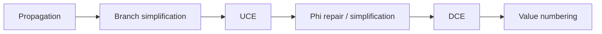

# Занятие 10. DCE, UCE и порядок проходов

> Почему DCE и UCE решают разные задачи и усиливают другие проходы

[← Карта курса](../course-map.md) · [Предыдущее занятие](../modules/09-constants.md) · [Следующее занятие](../modules/11-inlining.md)

## Результат занятия

| **К концу обязательной части.** Ты различаешь dead instruction и unreachable block, удаляешь только операции без наблюдаемых эффектов и поддерживаешь φ/CFG после UCE. |
|------------------------------------------------------------------------------------------------------------------------------------------------------------------------|

| **Параметр**          | **Значение**                                                       |
|-----------------------|--------------------------------------------------------------------|
| Сложность             | Средний                                                            |
| Обязательная нагрузка | 75–95 мин                                                          |
| Перед началом         | Константное упрощение ветвлений и def-use.                         |
| Что подготовить      | таблицу эффектов, последовательность IR-версий и трассу mark-sweep |

| **Разрешённый режим.** Запоминай порядок проходов на одном коротком примере. |
|------------------------------------------------------------------------------|

| **В этом занятии не требуется.** Не нужны aggressive DCE, postdominance и control dependence. |
|----------------------------------------------------------------------------------------|

## Обязательный маршрут

| **Этап**           | **Время** | **Результат**                                           |
|--------------------|-----------|---------------------------------------------------------|
| Повторение         | 5–10 мин  | Не больше 3 коротких вопросов                           |
| Простое объяснение | 10–15 мин | Пересказать тему своими словами                         |
| Разобранный пример | 15–20 мин | Воспроизвести ключевые состояния                        |
| Задача A           | 20–25 мин | Обязательный минимум по образцу                         |
| Задача B           | 20–35 мин | Стандарт; можно завершить во второй короткой сессии     |
| Устный итог        | 5–10 мин  | 3 вопроса и самооценка светофором                       |
| Углубление         | 0–40 мин  | Задача C и профессиональные детали — только при ресурсе |

| **Когда запрашивать помощь.** После 10–15 минут честной попытки можно сразу зафиксировать точное место остановки и запросить разбор. Не нужно сначала мучительно завершать A и B. |
|----------------------------------------------------------------------------------------------------------------------------------------------------------|

## Короткое повторение

<table>
<colgroup>
<col style="width: 33%" />
<col style="width: 33%" />
<col style="width: 33%" />
</colgroup>
<thead>
<tr class="header">
<th><strong>Когда</strong></th>
<th><strong>Объём</strong></th>
<th><strong>Что сделать</strong></th>
</tr>
</thead>
<tbody>
<tr class="odd">
<td>Вчера</td>
<td>1–2 формулировки</td>
<td>• Folding вычисляет константное выражение; propagation распространяет известное значение. 
• В SCCP значение имеет состояния unknown/constant/overdefined, а рёбра — исполнимость.</td>
</tr>
<tr class="even">
<td>3 дня назад</td>
<td>1 формулировка</td>
<td>Текущая версия переменной хранится на вершине её стека.</td>
</tr>
<tr class="odd">
<td>7 дней назад</td>
<td>1 мини-задача</td>
<td>Для ромба `A→B,C; B,C→D` выпиши pred/succ.</td>
</tr>
</tbody>
</table>

| **Ограничение.** На повторение не трать больше 10 минут. Не вспомнил — сделай попытку, посмотри ответ и верни карточку на следующее повторение. |
|-----------------------------------------------------------------------------------------------------------------------------------|

## Сначала простыми словами

Недостижимый код не может выполниться ни на одном пути. Мёртвая инструкция может находиться в достижимом блоке, но её результат никому не нужен и у неё нет наблюдаемого эффекта.

Часто сначала константа упрощает условие, затем исчезает ветвь, после этого исправляются φ, и только затем удаляются ставшие мёртвыми вычисления.

### Пять терминов занятия

| **Термин**         | **Моя формулировка одним предложением** |
|--------------------|-----------------------------------------|
| DCE                |                                         |
| UCE                |                                         |
| живое значение     |                                         |
| наблюдаемый эффект |                                         |
| упрощение φ        |                                         |

## Минимум для запоминания

- UCE удаляет недостижимые блоки; DCE — ненужные чистые инструкции.

- Инструкцию с наблюдаемым эффектом нельзя удалить только из-за неиспользуемого результата.

- Типичный порядок: propagation → branch simplification → UCE → φ cleanup → DCE.

| **Не учи дословно без смысла.** Сначала объясни формулировку своими словами на маленьком примере. Точная версия нужна после понимания. |
|----------------------------------------------------------------------------------------------------------------------------------------|

## Визуальная модель

*Рабочее представление темы занятия*

## Разобранный пример — проход по шагам

<table>
<colgroup>
<col style="width: 100%" />
</colgroup>
<thead>
<tr class="header">
<th>x1 = 4 
y1 = x1 + 1 ; результат нигде не используется 
call log(x1) ; результат не нужен, но есть эффект 
branch true, B1, B2 
B2: 
z1 = expensive() 
goto B3</th>
</tr>
</thead>
<tbody>
</tbody>
</table>

y1 можно удалить как чистое мёртвое вычисление. call log сохраняется. B2 недостижим после упрощения branch и удаляется UCE; вместе с ним исчезает expensive, даже если анализ эффектов вызова консервативен, потому что путь невозможен.

| **Проверка понимания.** Закрой пример и объясни не итог, а почему выполняется каждый следующий шаг. Если не можешь — зафиксируй именно этот переход и запроси разбор. |
|------------------------------------------------------------------------------------------------------------------------------------------------------|

## Обязательная практика

### Задача A — обязательная по образцу: Классификация

| **Параметр**     | **Значение**                                                         |
|------------------|----------------------------------------------------------------------|
| Статус           | Обязательно в этом занятии                                                  |
| Ориентир времени | 30 мин                                                               |
| Что сдать        | эффект/исключение отдельно; нет безусловочного удаления unknown call |

Для списка операций add, load, volatile load, store, pure call, unknown call, division укажи, можно ли удалить неиспользуемый результат и какие семантические условия нужны.

| **Подсказка 1.** Не запускай DCE до исправления reachability и φ. |
|-------------------------------------------------------------------|

## Стандартная практика

### Задача B — стандартная для закрепления: Полный цикл очистки

| **Параметр**     | **Значение**                                                         |
|------------------|----------------------------------------------------------------------|
| Статус           | Нужно выполнить до следующей зависимой темы; можно во второй сессии  |
| Ориентир времени | 45 мин                                                               |
| Что сдать        | отдельная версия после каждого pass; pred/succ обновлены; φ упрощена |

<table>
<colgroup>
<col style="width: 100%" />
</colgroup>
<thead>
<tr class="header">
<th>Для SSA-CFG 
B0: c0=1; branch c0==1, B1, B2 
B1: x1=5; goto B3 
B2: x2=9; goto B3 
B3: x3=phi[B1:x1,B2:x2]; y1=x3+2; print y1 
выполни: branch simplification → UCE → корректировка φ → folding → DCE. Покажи IR после каждого шага.</th>
</tr>
</thead>
<tbody>
</tbody>
</table>

| **Подсказка 1.** Не запускай DCE до исправления reachability и φ. |
|-------------------------------------------------------------------|

| **Подсказка 2.** Отдельно отметь операции, которые являются roots из-за effects, даже при unused result. |
|----------------------------------------------------------------------------------------------------------|

## Три вопроса на выходе

| **Вопрос**                                     | **Результат retrieval**         |
|------------------------------------------------|---------------------------------|
| Чем dead code отличается от unreachable code?  | □ ≤15 с □ с паузой □ не ответил |
| Почему неизвестный call нельзя удалить?        | □ ≤15 с □ с паузой □ не ответил |
| Что происходит с φ после удаления predecessor? | □ ≤15 с □ с паузой □ не ответил |

## Светофор понимания

| **Состояние** | **Что это означает**                                    | **Следующее действие**                                                  |
|---------------|---------------------------------------------------------|-------------------------------------------------------------------------|
| Зелёный       | Могу объяснить и решить A/B с незначительной проверкой. | Перейти дальше; C только по желанию.                                    |
| Жёлтый        | Понимаю идею, но теряю один шаг или термин.             | Разобрать уменьшенный пример с преподавателем или свериться с эталоном; B можно закончить во второй сессии. |
| Красный       | Не могу объяснить причинную модель или начать A.        | Не переходить дальше; зафиксировать попытку и запросить разбор после 10–15 минут.                   |

| **Минимум занятия.** Занятие засчитывается, если понятна причинная модель, воспроизведён пример и выполнена задача A. Задача B должна быть закрыта до следующей темы, которая на неё опирается. |
|------------------------------------------------------------------------------------------------------------------------------------------------------------------------------------------|

## Справочник и углубление — читать по необходимости

| **Это необязательная часть первого прохода.** Открывай её, если простого объяснения недостаточно, при проверке решения или когда остались силы. Профессиональные оговорки не являются обязательным минимумом занятия. |
|--------------------------------------------------------------------------------------------------------------------------------------------------------------------------------------------------------------|

### Подробная теория

#### DCE: бесполезные значения

Инструкция мертва, если её результат не нужен ни одной живой операции и сама инструкция не имеет наблюдаемого побочного эффекта. В SSA это удобно: от корней живости можно пройти назад по operands, а неиспользуемые чистые defs удалить.

Корни: return, вывод, stores, volatile/atomic операции, потенциально бросающие исключение действия — в зависимости от семантики языка. Нельзя судить только по отсутствию uses результата: вызов может быть нужен ради эффекта.

#### UCE: невозможные пути

Блок недостижим, если от entry нет пути. UCE удаляет целые блоки и рёбра независимо от того, были ли результаты их инструкций использованы внутри этой недостижимой области.

Удаление predecessor требует удалить соответствующий вход из каждой φ successor-блока. φ с одним входом заменяется этим значением; φ без входов означает нарушение контракта или недостижимый блок.

#### Mark-sweep DCE

Сначала пометь критические/эффектные инструкции. Затем рекурсивно пометь definitions всех используемых ими values. После стабилизации удали непомеченные чистые инструкции. Для control-dependent DCE существуют более сложные варианты; на зачёте обычно достаточно data-based DCE над уже упрощённым CFG.

#### Порядок проходов

Константное распространение может сделать условие известным; упрощение branch создаёт недостижимую ветвь; UCE убирает её и упрощает φ; это создаёт новые константы и мёртвые defs; DCE очищает остатки. Поэтому проходы часто запускаются в pipeline или повторяются до практической стабилизации.

## Алгоритм на одной странице

| **Поле**          | **Содержание**                                                              |
|-------------------|-----------------------------------------------------------------------------|
| Название          | Очистка после констант                                                      |
| Вход              | SSA CFG после value simplification.                                         |
| Результат         | CFG без unreachable blocks и IR без dead pure instructions.                 |
| Инвариант         | Ни один observable root не удаляется; φ соответствует текущим predecessors. |
| Условие остановки | Нет unreachable blocks и непомеченных чистых инструкций.                    |
| Сложность         | O(V+E+I) для одного цикла очистки.                                          |

1.  Упростить branch по известным условиям.

2.  Пересчитать reachability и удалить unreachable blocks.

3.  Удалить соответствующие φ-incomings, упростить φ с одним входом.

4.  Выбрать observable roots и выполнить обратную mark-фазу по operands.

5.  Удалить непомеченные pure instructions.

6.  Проверить CFG и SSA.

### Допущения учебного IR на сегодня

- У каждого базового блока ровно один терминатор; терминатор является последней инструкцией блока.

- Деление может завершиться наблюдаемой ошибкой при нуле. Его нельзя безусловно удалять или выносить, пока не доказаны безопасность и допустимость спекуляции.

- print, store, volatile/atomic операции и неизвестный вызов имеют наблюдаемый эффект. Пометка `pure` означает отсутствие чтения/записи памяти и иных эффектов по контракту; исключения проверяются отдельно. `readonly` запрещает запись, но разрешает чтение памяти и само по себе не делает вызов чистым.

### Дополнительная задача

### Задача C — необязательный перенос: Mark-sweep

| **Параметр**     | **Значение**                             |
|------------------|------------------------------------------|
| Статус           | Только если осталось внимание            |
| Ориентир времени | 20 мин                                   |
| Что сдать        | worklist живых defs; каскадная мёртвость |

На небольшом SSA-графе выбери корни живости и выполни обратную маркировку. Объясни, почему use-count=0 недостаточно для каскадного удаления.

| **Подсказка 1.** Не запускай DCE до исправления reachability и φ. |
|-------------------------------------------------------------------|

| **Подсказка 2.** Отдельно отметь операции, которые являются roots из-за effects, даже при unused result. |
|----------------------------------------------------------------------------------------------------------|

### Полная устная проверка

| **Вопрос**                                     | **Результат retrieval**         |
|------------------------------------------------|---------------------------------|
| Чем dead code отличается от unreachable code?  | □ ≤15 с □ с паузой □ не ответил |
| Почему неизвестный call нельзя удалить?        | □ ≤15 с □ с паузой □ не ответил |
| Что происходит с φ после удаления predecessor? | □ ≤15 с □ с паузой □ не ответил |
| Откуда начинается mark-sweep DCE?              | □ ≤15 с □ с паузой □ не ответил |
| Почему порядок passes имеет значение?          | □ ≤15 с □ с паузой □ не ответил |

### Журнал ошибок

| **Ошибка / сомнение** | **Первый нарушенный инвариант** | **Исправленное правило** | **Новый пример / итерация** |
|-----------------------|---------------------------------|--------------------------|-------------------------|
|                       |                                 |                          |                         |
|                       |                                 |                          |                         |
|                       |                                 |                          |                         |
|                       |                                 |                          |                         |
|                       |                                 |                          |                         |

### План повторения

| **Когда**    | **Что повторить**                                                  |
|--------------|--------------------------------------------------------------------|
| Завтра       | 3 пункта минимального блока и задача A.                            |
| Через 3 дня  | Один алгоритм или стандартная задача B.                            |
| Через 7 дней | Назови правильный порядок cleanup passes после доказанного branch. |

### Как получить обратную связь

**Сообщение для начала ежедневной сессии**

<table>
<colgroup>
<col style="width: 100%" />
</colgroup>
<thead>
<tr class="header">
<th>Я работаю по документу «Удаление мёртвого и недостижимого кода» (версия 3.0). Я могу обратиться уже после 10–15 минут честной попытки. 
 
Моя текущая зона: зелёная / жёлтая / красная. 
Моя попытка и точное место остановки: ... 
 
Работай так: 
1. Сначала проверь мою причинную модель простым вопросом, не выдавая решение. 
2. Если модель неверна, объясни тему на одном меньшем примере и попроси меня пересказать. 
3. Найди только первую существенную ошибку: место, нарушенный инвариант и минимальный контрпример. 
4. Дай мне исправить её самостоятельно. 
5. После исправления дай одну короткую задачу на перенос. 
6. В конце назови: что я уже понимаю, что пока понимаю с подсказкой и что повторить на следующей сессии.</th>
</tr>
</thead>
<tbody>
</tbody>
</table>

## Точечное чтение

- Cooper & Torczon — dead code elimination; LLVM Passes — CFG/loop cleanup examples.

| **Стоп чтения.** Прекрати чтение, когда можешь воспроизвести определение/алгоритм и решить задачу B. Дополнительные страницы не заменяют практику. |
|----------------------------------------------------------------------------------------------------------------------------------------------------|
