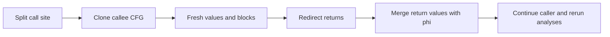

# Занятие 11. Inlining

> Преобразование CFG, параметров, возвратов и SSA-имён

[← Карта курса](../course-map.md) · [Предыдущее занятие](../modules/10-dce-uce-and-pass-order.md) · [Следующее занятие](../modules/12-checkpoint-1.md)

## Сегодняшний результат

| **К концу обязательной части.** Ты вручную подставляешь простую функцию в call site, соединяешь CFG, заменяешь параметры/return и объясняешь legality и profitability. |
|------------------------------------------------------------------------------------------------------------------------------------------------------------------------|

| **Параметр**          | **Значение**                                                                                 |
|-----------------------|----------------------------------------------------------------------------------------------|
| Сложность             | Средний                                                                                      |
| Обязательная нагрузка | 75–100 мин                                                                                   |
| Перед началом         | CFG, SSA, переименование и verifier.                                                         |
| Что подготовить      | новый CFG после inline, оптимизированную версию для константного аргумента и таблицу решений |

| **Разрешённый режим.** Не углубляйся в промышленную эвристику стоимости. |
|--------------------------------------------------------------------------|

| **В этом занятии не требуется.** Не нужны сложные cost models, devirtualization и межмодульный inline. |
|-------------------------------------------------------------------------------------------------|

## Обязательный маршрут

| **Этап**           | **Время** | **Результат**                                           |
|--------------------|-----------|---------------------------------------------------------|
| Повторение         | 5–10 мин  | Не больше 3 коротких вопросов                           |
| Простое объяснение | 10–15 мин | Пересказать тему своими словами                         |
| Разобранный пример | 15–20 мин | Воспроизвести ключевые состояния                        |
| Задача A           | 20–25 мин | Обязательный минимум по образцу                         |
| Задача B           | 20–35 мин | Стандарт; можно завершить во второй короткой сессии     |
| Устный итог        | 5–10 мин  | 3 вопроса и самооценка светофором                       |
| Углубление         | 0–40 мин  | Задача C и профессиональные детали — только при ресурсе |

| **Когда запрашивать помощь.** После 10–15 минут честной попытки можно сразу зафиксировать точное место остановки и запросить разбор. Не нужно сначала мучительно завершать A и B. |
|----------------------------------------------------------------------------------------------------------------------------------------------------------|

## Короткое повторение

<table>
<colgroup>
<col style="width: 33%" />
<col style="width: 33%" />
<col style="width: 33%" />
</colgroup>
<thead>
<tr class="header">
<th><strong>Когда</strong></th>
<th><strong>Объём</strong></th>
<th><strong>Что сделать</strong></th>
</tr>
</thead>
<tbody>
<tr class="odd">
<td>Вчера</td>
<td>1–2 формулировки</td>
<td>• UCE удаляет недостижимые блоки; DCE — ненужные чистые инструкции. 
• Инструкцию с наблюдаемым эффектом нельзя удалить только из-за неиспользуемого результата.</td>
</tr>
<tr class="even">
<td>3 дня назад</td>
<td>1 формулировка</td>
<td>CFG описывает управление; def-use graph — зависимости значений.</td>
</tr>
<tr class="odd">
<td>7 дней назад</td>
<td>1 мини-задача</td>
<td>Для пары блоков придумай путь-контрпример к ложному доминированию.</td>
</tr>
</tbody>
</table>

| **Ограничение.** На повторение не трать больше 10 минут. Не вспомнил — сделай попытку, посмотри ответ и верни карточку на следующее повторение. |
|-----------------------------------------------------------------------------------------------------------------------------------|

## Сначала простыми словами

Inlining заменяет вызов функции её телом. Это открывает новые возможности оптимизации, потому что аргументы и код вызываемой функции оказываются в одном IR.

Но нужно сохранить смысл: связать параметры с аргументами, переименовать значения, перенаправить return и не спутать локальные имена. Решение «выгодно ли» отделяется от «законно ли».

### Пять терминов занятия

| **Термин**         | **Моя формулировка одним предложением** |
|--------------------|-----------------------------------------|
| inline             |                                         |
| call site          |                                         |
| formal parameter   |                                         |
| actual argument    |                                         |
| continuation block |                                         |

## Минимум для запоминания

- Inlining связывает параметры с аргументами и заменяет call телом функции.

- Return callee переводится в continuation caller, а имена переименовываются.

- Законность и выгодность inline — разные решения.

| **Не учи дословно без смысла.** Сначала объясни формулировку своими словами на маленьком примере. Точная версия нужна после понимания. |
|----------------------------------------------------------------------------------------------------------------------------------------|

## Визуальная модель

*Рабочее представление темы занятия*

## Разобранный пример — проход по шагам

<table>
<colgroup>
<col style="width: 100%" />
</colgroup>
<thead>
<tr class="header">
<th>callee inc_abs(a): 
if a &gt;= 0 goto P else N 
P: r1 = a + 1; return r1 
N: r2 = 1 - a; return r2 
 
caller: 
x0 = input() 
y0 = call inc_abs(x0) 
z0 = y0 * 2</th>
</tr>
</thead>
<tbody>
</tbody>
</table>

Call site разделяется на блок до вызова и continuation. Клонированные P/N получают свежие имена. Оба return переходят в continuation, где y1 = phi \[Pclone:r1c, Nclone:r2c\], после чего вычисляется z0.

| **Проверка понимания.** Закрой пример и объясни не итог, а почему выполняется каждый следующий шаг. Если не можешь — зафиксируй именно этот переход и запроси разбор. |
|------------------------------------------------------------------------------------------------------------------------------------------------------|

## Обязательная практика

### Задача A — обязательная по образцу: Механическая подстановка

| **Параметр**     | **Значение**                                                                |
|------------------|-----------------------------------------------------------------------------|
| Статус           | Обязательно в этом занятии                                                         |
| Ориентир времени | 45 мин                                                                      |
| Что сдать        | fresh block/value names; аргумент сопоставлен параметру; оба return сведены |

Выполни inline примера. Нарисуй новый CFG и SSA-IR, включая continuation и φ возврата.

| **Подсказка 1.** Сначала разрежь caller block на before-call и continuation. |
|------------------------------------------------------------------------------|

## Стандартная практика

### Задача B — стандартная для закрепления: Оптимизация после inline

| **Параметр**     | **Значение**                                                        |
|------------------|---------------------------------------------------------------------|
| Статус           | Нужно выполнить до следующей зависимой темы; можно во второй сессии |
| Ориентир времени | 30 мин                                                              |
| Что сдать        | известное условие; удалённая ветвь; итоговое выражение              |

Пусть фактический аргумент равен константе 3. Покажи, какие ветви и вычисления исчезнут после propagation + UCE + DCE.

| **Подсказка 1.** Сначала разрежь caller block на before-call и continuation. |
|------------------------------------------------------------------------------|

| **Подсказка 2.** Каждый return callee должен вести в continuation; при нескольких return values понадобится φ. |
|----------------------------------------------------------------------------------------------------------------|

## Три вопроса на выходе

| **Вопрос**                       | **Результат retrieval**         |
|----------------------------------|---------------------------------|
| Почему inline меняет CFG?        | □ ≤15 с □ с паузой □ не ответил |
| Как обработать несколько return? | □ ≤15 с □ с паузой □ не ответил |
| Почему нужны свежие SSA IDs?     | □ ≤15 с □ с паузой □ не ответил |

## Светофор понимания

| **Состояние** | **Что это означает**                                    | **Следующее действие**                                                  |
|---------------|---------------------------------------------------------|-------------------------------------------------------------------------|
| Зелёный       | Могу объяснить и решить A/B с незначительной проверкой. | Перейти дальше; C только по желанию.                                    |
| Жёлтый        | Понимаю идею, но теряю один шаг или термин.             | Разобрать со мной уменьшенный пример; B можно закончить второй сессией. |
| Красный       | Не могу объяснить причинную модель или начать A.        | Не читать дальше; прислать попытку после 10–15 минут.                   |

| **Минимум занятия.** Занятие засчитывается, если понятна причинная модель, воспроизведён пример и выполнена задача A. Задача B должна быть закрыта до следующей темы, которая на неё опирается. |
|------------------------------------------------------------------------------------------------------------------------------------------------------------------------------------------|

## Справочник и углубление — читать по необходимости

| **Это необязательная часть первого прохода.** Открывай её, если простого объяснения недостаточно, при проверке решения или когда остались силы. Профессиональные оговорки не являются обязательным минимумом занятия. |
|--------------------------------------------------------------------------------------------------------------------------------------------------------------------------------------------------------------|

### Подробная теория

#### Что реально делает inline

Inlining не просто заменяет строку вызова текстом. Нужно клонировать тело callee, сопоставить формальные параметры фактическим аргументам, дать свежие имена значениям и блокам, направить вход call site в клон, а возвраты — в continuation.

Если у callee несколько return, результирующее значение вызова объединяется φ в continuation-блоке.

#### Зачем это нужно

После inline становятся видны константные аргументы, маленькие выражения, недостижимые ветви callee и повторные вычисления. Это открывает возможности propagation, DCE, value numbering и специализации.

Цена — рост кода, увеличение давления на instruction cache и регистры, более дорогие последующие анализы. Поэтому реальный inliner использует эвристику выгоды и бюджета размера.

#### Безопасность

Подстановка должна сохранять порядок вычисления аргументов, эффекты, исключения, calling semantics, рекурсию и ABI-наблюдаемое поведение. Для виртуальных вызовов нужно доказать конкретную цель или использовать guarded devirtualization.

После изменения CFG старые dominators, loop info и некоторые analyses инвалидируются. Pass manager обязан это знать.

#### SSA-детали

Все definitions клона получают свежие IDs. Аргументы можно заменить значениями caller. Возвращаемый value заменяет call-result. φ внутри callee сохраняют predecessor labels, обновлённые на клонированные блоки.

## Алгоритм на одной странице

| **Поле**          | **Содержание**                                                               |
|-------------------|------------------------------------------------------------------------------|
| Название          | Inlining одного call site                                                    |
| Вход              | Caller CFG, callee CFG и call instruction.                                   |
| Результат         | Caller CFG с клоном callee вместо вызова.                                    |
| Инвариант         | Клонированные имена уникальны, каждый путь возврата приходит в continuation. |
| Условие остановки | Call удалён, CFG well-formed, uses результата переподключены.                |
| Сложность         | O(size of cloned callee) плюс обновление анализов.                           |

1.  Разделить call block на before-call и continuation.

2.  Клонировать blocks/values callee со свежими IDs.

3.  Заменить formal parameters фактическими arguments.

4.  Соединить before-call с cloned entry.

5.  Направить каждый return в continuation; объединить return values φ при необходимости.

6.  Пересчитать CFG analyses/SSA или выполнить repair.

### Допущения учебного IR на сегодня

- У каждого базового блока ровно один терминатор; терминатор является последней инструкцией блока.

- Деление может завершиться наблюдаемой ошибкой при нуле. Его нельзя безусловно удалять или выносить, пока не доказаны безопасность и допустимость спекуляции.

- print, store, volatile/atomic операции и неизвестный вызов имеют наблюдаемый эффект. Вызов считается чистым только при явной пометке pure/readonly в условии.

### Дополнительная задача

### Задача C — необязательный перенос: Решение об inline

| **Параметр**     | **Значение**                                                        |
|------------------|---------------------------------------------------------------------|
| Статус           | Только если осталось внимание                                       |
| Ориентир времени | 20 мин                                                              |
| Что сдать        | legality отдельно от profitability; кодовый размер; контекст вызова |

Для функций: маленький getter, большая функция в цикле, рекурсивная функция, pure helper с константным аргументом — оцени выгоду и риск.

| **Подсказка 1.** Сначала разрежь caller block на before-call и continuation. |
|------------------------------------------------------------------------------|

| **Подсказка 2.** Каждый return callee должен вести в continuation; при нескольких return values понадобится φ. |
|----------------------------------------------------------------------------------------------------------------|

### Полная устная проверка

| **Вопрос**                                | **Результат retrieval**         |
|-------------------------------------------|---------------------------------|
| Почему inline меняет CFG?                 | □ ≤15 с □ с паузой □ не ответил |
| Как обработать несколько return?          | □ ≤15 с □ с паузой □ не ответил |
| Почему нужны свежие SSA IDs?              | □ ≤15 с □ с паузой □ не ответил |
| Какие analyses инвалидируются?            | □ ≤15 с □ с паузой □ не ответил |
| Чем legality отличается от profitability? | □ ≤15 с □ с паузой □ не ответил |

### Журнал ошибок

| **Ошибка / сомнение** | **Первый нарушенный инвариант** | **Исправленное правило** | **Новый пример / итерация** |
|-----------------------|---------------------------------|--------------------------|-------------------------|
|                       |                                 |                          |                         |
|                       |                                 |                          |                         |
|                       |                                 |                          |                         |
|                       |                                 |                          |                         |
|                       |                                 |                          |                         |

### План повторения

| **Когда**    | **Что повторить**                                          |
|--------------|------------------------------------------------------------|
| Завтра       | 3 пункта минимального блока и задача A.                    |
| Через 3 дня  | Один алгоритм или стандартная задача B.                    |
| Через 7 дней | Нарисуй continuation после inline функции с двумя returns. |

### Как получить обратную связь

**Сообщение для начала ежедневной сессии**

<table>
<colgroup>
<col style="width: 100%" />
</colgroup>
<thead>
<tr class="header">
<th>Я работаю по документу «Inlining: подстановка тела функции» (версия 3.0). Я могу обратиться уже после 10–15 минут честной попытки. 
 
Моя текущая зона: зелёная / жёлтая / красная. 
Моя попытка и точное место остановки: ... 
 
Работай так: 
1. Сначала проверь мою причинную модель простым вопросом, не выдавая решение. 
2. Если модель неверна, объясни тему на одном меньшем примере и попроси меня пересказать. 
3. Найди только первую существенную ошибку: место, нарушенный инвариант и минимальный контрпример. 
4. Дай мне исправить её самостоятельно. 
5. После исправления дай одну короткую задачу на перенос. 
6. В конце назови: что я уже понимаю, что пока понимаю с подсказкой и что повторить на следующей сессии.</th>
</tr>
</thead>
<tbody>
</tbody>
</table>

## Точечное чтение

- Cooper & Torczon — procedure integration / inlining.

| **Стоп чтения.** Прекрати чтение, когда можешь воспроизвести определение/алгоритм и решить задачу B. Дополнительные страницы не заменяют практику. |
|----------------------------------------------------------------------------------------------------------------------------------------------------|
