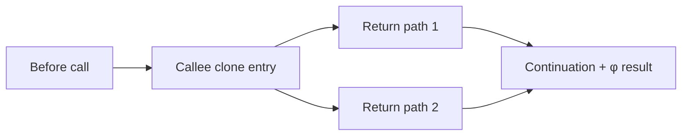

# Занятие 11. Inlining

> Встраивание — это CFG/SSA rewrite, а не текстовая подстановка

[← Карта курса](../course-map.md) · [Предыдущее занятие](10-dce-uce-and-pass-order.md) · [Следующее занятие](12-checkpoint-1.md)

## Результат занятия

Ты механически встраиваешь функцию с несколькими return, сохраняешь CFG и SSA и отдельно оцениваешь legality и profitability.

**Перед началом:** CFG, φ, renaming, UCE/DCE.

## Зачем это вообще нужно

Пока функция скрыта за `call`, оптимизатор не видит её ветви и локальные вычисления вместе с фактическими аргументами. Inlining открывает эти возможности, но требует клонировать граф и не столкнуть идентичности двух функций.

## Термины до заданий

| Термин | Простое объяснение | Точная опора |
|---|---|---|
| **call site — место вызова** | инструкция вызова вместе с окружающим блоком | блок обычно делится на before-call и continuation |
| **callee — вызываемая функция** | функция, тело которой клонируется | её параметры, блоки и значения получают отображение в caller |
| **formal/actual — параметр и аргумент** | имя в callee и значение в call site | каждый formal заменяется соответствующим actual SSA-value |
| **continuation block — продолжение** | блок после встроенного вызова | все return клона переходят сюда |
| **profitability — выгодность** | оценка пользы и стоимости | не влияет на semantic legality, но ограничивает рост кода |

## Первая модель



## Разобранный пример: состояние за состоянием

```text
callee abs1(a):
  branch a>=0, P, N
P: r1=a+1; return r1
N: r2=1-a; return r2

caller:
  x0=input()
  y0=call abs1(x0)
  z0=y0*2
```

| Шаг | Rewrite | Инвариант |
|---|---|---|
| 1 | разделить caller на `before` и `cont` | после call ничего не потеряно |
| 2 | клонировать entry/P/N | исходный callee не изменён |
| 3 | заменить formal `a` на actual `x0` | типы и порядок аргументов совпадают |
| 4 | дать свежие IDs блокам и values | ни одного столкновения имён |
| 5 | заменить оба return на `goto cont` | каждый путь продолжает caller |
| 6 | в `cont` вставить `y1=φ[P':r1',N':r2']` | один вход на predecessor |
| 7 | заменить use `y0` на `y1` и запустить verifier | SSA и CFG корректны |

## Формальное правило

Inlining законен, если клонирование сохраняет семантику вызова: calling convention, исключения, эффекты, рекурсию/деоптимизацию и видимость локальных сущностей. После rewrite пересчитываются все анализы, зависящие от CFG или SSA.

Profitability отвечает на другой вопрос: окупят ли открывшиеся оптимизации рост размера, compile time и register pressure.

## Типичные ошибки

- Вставлять строки тела без разрезания блока вызова.
- Использовать старые block/value IDs.
- Оставлять `return` внутри caller.
- Смешивать «можно встроить» и «выгодно встроить».

## Задача A — по образцу

Выполни шесть шагов разбора и запиши итоговый CFG/SSA для `abs1`.

<details>
<summary>Проверка задачи A</summary>

`before` вычисляет `x0` и идёт в clone entry; clone ветвится в `P'`/`N'`; оба идут в `cont`; `cont` содержит `y1=φ[P':r1',N':r2']` и `z0=y1*2`.

</details>

## Задача B — перенос на новый пример

Пусть actual argument равен `3`. Покажи последовательность propagation → branch simplification → UCE → φ cleanup → DCE.

<details>
<summary>Проверка задачи B</summary>

Условие `3>=0` истинно; путь `N'` удаляется; φ с одним входом заменяется `r1'=4`; итог `z0=8`; мёртвые branch/копии удаляются.

</details>

## Проверка на выходе

**Почему call site надо разделить?**  
**Как объединяются несколько return values?**  
**Почему profitability не доказывает legality?**

<details>
<summary>Короткие ответы</summary>

Continuation сохраняет инструкции после call. Значения return объединяются φ в continuation. Выгода ничего не говорит о сохранении поведения программы.

</details>

## Профессиональная граница

Промышленный inliner учитывает recursion depth, profile data, cold paths, devirtualization, exceptions, debug info и бюджеты размера. Учебный пример фиксирует архитектурно обязательный CFG/SSA rewrite.
