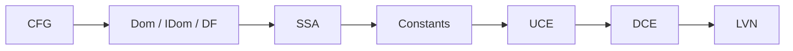

# Занятие 12. Комплексная работа №1

> Линейный IR → CFG → доминирование → SSA → ациклические оптимизации

[← Карта курса](../course-map.md) · [Предыдущее занятие](../modules/11-inlining.md) · [Следующее занятие](../modules/13-loop-concepts.md)

## Результат занятия

| **К концу обязательной части.** Ты выполняешь полный сквозной процесс и находишь конкретные слабые места, а не оцениваешь готовность по ощущению. |
|---------------------------------------------------------------------------------------------------------------------------------------------------|

| **Параметр**          | **Значение**                                                         |
|-----------------------|----------------------------------------------------------------------|
| Сложность             | Контрольный                                                          |
| Обязательная нагрузка | 120–160 мин                                                          |
| Перед началом         | Все темы занятия 2–11. Работать без подсказок первые 100 минут.        |
| Что подготовить      | полное решение комплексной работы, оценку по рубрике и журнал ошибок |

| **Разрешённый режим.** Можно разбить на две части: построение IR и оптимизации. |
|---------------------------------------------------------------------------------|

| **В этом занятии не требуется.** Не добавляй новые оптимизации сверх указанного порядка. |
|-----------------------------------------------------------------------------------|

## Обязательный маршрут

| **Этап**   | **Время** | **Результат**                                        |
|------------|-----------|------------------------------------------------------|
| Подготовка | 10 мин    | Выписать порядок артефактов и таймбокс               |
| Часть 1    | 55–75 мин | CFG, dominance, SSA; можно сделать отдельной сессией |
| Пауза      | 10–20 мин | Не читать теорию; восстановить внимание              |
| Часть 2    | 55–75 мин | Оптимизации и проверка legality                      |
| Разбор     | 15–25 мин | Найти первый неверный инвариант                      |

| **Когда запрашивать помощь.** После 10–15 минут честной попытки можно сразу зафиксировать точное место остановки и запросить разбор. Не нужно сначала мучительно завершать A и B. |
|----------------------------------------------------------------------------------------------------------------------------------------------------------|

## Короткое повторение

<table>
<colgroup>
<col style="width: 33%" />
<col style="width: 33%" />
<col style="width: 33%" />
</colgroup>
<thead>
<tr class="header">
<th><strong>Когда</strong></th>
<th><strong>Объём</strong></th>
<th><strong>Что сделать</strong></th>
</tr>
</thead>
<tbody>
<tr class="odd">
<td>Вчера</td>
<td>1–2 формулировки</td>
<td>• Inlining связывает параметры с аргументами и заменяет call телом функции. 
• Return callee переводится в continuation caller, а имена переименовываются.</td>
</tr>
<tr class="even">
<td>3 дня назад</td>
<td>1 формулировка</td>
<td>Folding вычисляет константное выражение; propagation распространяет известное значение.</td>
</tr>
<tr class="odd">
<td>7 дней назад</td>
<td>1 мини-задача</td>
<td>Для простого ромба назови idom и ненулевые DF.</td>
</tr>
</tbody>
</table>

| **Ограничение.** На повторение не трать больше 10 минут. Не вспомнил — сделай попытку, посмотри ответ и верни карточку на следующее повторение. |
|-----------------------------------------------------------------------------------------------------------------------------------|

## Сначала простыми словами

Комплексная работа проверяет не отдельные определения, а цепочку. Ошибка в CFG неизбежно испортит доминирование, SSA и оптимизации.

Решай по фиксированному порядку и сохраняй промежуточные версии. Если что-то не сходится, ищи первый неверный артефакт, а не исправляй финальный IR на глаз.

### Пять терминов занятия

| **Термин**             | **Моя формулировка одним предложением** |
|------------------------|-----------------------------------------|
| промежуточный артефакт |                                         |
| порядок проходов       |                                         |
| верификация            |                                         |
| инвариант              |                                         |
| первичная ошибка       |                                         |

## Минимум для запоминания

- Каждый этап использует только проверенный результат предыдущего.

- Сохраняются CFG, Dom/idom/DF, SSA и IR после каждого pass.

- Ищи первый неверный инвариант, а не исправляй финал на глаз.

| **Не учи дословно без смысла.** Сначала объясни формулировку своими словами на маленьком примере. Точная версия нужна после понимания. |
|----------------------------------------------------------------------------------------------------------------------------------------|

## Визуальная модель

*Рабочее представление темы занятия*

## Разобранный пример — проход по шагам

<table>
<colgroup>
<col style="width: 100%" />
</colgroup>
<thead>
<tr class="header">
<th>1: a = input() 
2: x = 2 
3: if a &lt;= 0 goto Lneg 
4: x = a + 2 
5: t = x * 4 
6: goto Ljoin 
Lneg: 
7: x = 2 
8: t = x * 4 
Ljoin: 
9: q = x * 4 
10: if false goto Ldead 
11: print q 
12: return 
Ldead: 
13: print t 
14: return</th>
</tr>
</thead>
<tbody>
</tbody>
</table>

Это и есть основная работа. Не ищи готовый ответ в тексте: выполни все стадии и сохраняй промежуточные версии.

| **Проверка понимания.** Закрой пример и объясни не итог, а почему выполняется каждый следующий шаг. Если не можешь — зафиксируй именно этот переход и запроси разбор. |
|------------------------------------------------------------------------------------------------------------------------------------------------------|

## Обязательная практика

### Задача A — обязательная по образцу: Часть A — графы

| **Параметр**     | **Значение**                                                   |
|------------------|----------------------------------------------------------------|
| Статус           | Обязательно в этом занятии                                            |
| Ориентир времени | 55 мин                                                         |
| Что сдать        | leaders обоснованы; pred/succ; таблица Dom до стабилизации; DF |

Разбей IR на блоки, построй CFG, найди достижимые блоки, Dom, idom, дерево и DF.

| **Подсказка 1.** Не переходи к SSA, пока таблицы pred/succ и Dom не проверены. |
|--------------------------------------------------------------------------------|

## Стандартная практика

### Задача B — стандартная для закрепления: Часть B — SSA

| **Параметр**     | **Значение**                                                        |
|------------------|---------------------------------------------------------------------|
| Статус           | Нужно выполнить до следующей зависимой темы; можно во второй сессии |
| Ориентир времени | 40 мин                                                              |
| Что сдать        | подписанные φ-входы; одно определение; dominance checks             |

Размести φ для x и t, выполни renaming, составь краткую verifier-таблицу.

| **Подсказка 1.** Не переходи к SSA, пока таблицы pred/succ и Dom не проверены. |
|--------------------------------------------------------------------------------|

| **Подсказка 2.** Сохраняй IR после каждого pass; это позволит найти первый расходящийся шаг. |
|----------------------------------------------------------------------------------------------|

## Три вопроса на выходе

| **Вопрос**                                 | **Результат retrieval**         |
|--------------------------------------------|---------------------------------|
| Где ты потратил больше всего времени?      | □ ≤15 с □ с паузой □ не ответил |
| Какая первая ошибка повлекла последующие?  | □ ≤15 с □ с паузой □ не ответил |
| После какого pass нужно было обновить CFG? | □ ≤15 с □ с паузой □ не ответил |

## Светофор понимания

| **Состояние** | **Что это означает**                                    | **Следующее действие**                                                  |
|---------------|---------------------------------------------------------|-------------------------------------------------------------------------|
| Зелёный       | Могу объяснить и решить A/B с незначительной проверкой. | Перейти дальше; C только по желанию.                                    |
| Жёлтый        | Понимаю идею, но теряю один шаг или термин.             | Разобрать уменьшенный пример с преподавателем или свериться с эталоном; B можно закончить во второй сессии. |
| Красный       | Не могу объяснить причинную модель или начать A.        | Не переходить дальше; зафиксировать попытку и запросить разбор после 10–15 минут.                   |

| **Минимум занятия.** Занятие засчитывается, если понятна причинная модель, воспроизведён пример и выполнена задача A. Задача B должна быть закрыта до следующей темы, которая на неё опирается. |
|------------------------------------------------------------------------------------------------------------------------------------------------------------------------------------------|

## Справочник и углубление — читать по необходимости

| **Это необязательная часть первого прохода.** Открывай её, если простого объяснения недостаточно, при проверке решения или когда остались силы. Профессиональные оговорки не являются обязательным минимумом занятия. |
|--------------------------------------------------------------------------------------------------------------------------------------------------------------------------------------------------------------|

### Подробная теория

#### Экзаменационный алгоритм

Перед вычислениями выпиши порядок: разметка leaders → blocks → CFG → reachability → Dom/idom/DF → φ-placement → renaming → verifier → passes в заданном порядке. Это защищает от потери промежуточных состояний.

После каждого изменения CFG заново проверь pred/succ и φ. После каждого изменения defs/uses проверь SSA. Не пытайся «держать всё в голове».

#### Как оформлять

Используй отдельные листы или разделы: исходный IR; таблица блоков; CFG; таблица Dom; дерево/DF; SSA; версия после каждого pass. Стрелками помечай причину удаления или замены.

Если не знаешь точное правило, явно зафиксируй допущение. Неправильное, но обозначенное допущение легче проверить, чем молчаливое изменение семантики.

### Допущения учебного IR на сегодня

- У каждого базового блока ровно один терминатор; терминатор является последней инструкцией блока.

- Деление может завершиться наблюдаемой ошибкой при нуле. Его нельзя безусловно удалять или выносить, пока не доказаны безопасность и допустимость спекуляции.

- print, store, volatile/atomic операции и неизвестный вызов имеют наблюдаемый эффект. Пометка `pure` означает отсутствие чтения/записи памяти и иных эффектов по контракту; исключения проверяются отдельно. `readonly` запрещает запись, но разрешает чтение памяти и само по себе не делает вызов чистым.

### Дополнительная задача

### Задача C — необязательный перенос: Часть C — оптимизации

| **Параметр**     | **Значение**                                                           |
|------------------|------------------------------------------------------------------------|
| Статус           | Только если осталось внимание                                          |
| Ориентир времени | 45 мин                                                                 |
| Что сдать        | не перепрыгнуты состояния; эффекты сохранены; итоговый print корректен |

В порядке: propagation/folding → branch simplification → UCE → φ simplification → LVN → DCE. Покажи каждую версию IR.

| **Подсказка 1.** Не переходи к SSA, пока таблицы pred/succ и Dom не проверены. |
|--------------------------------------------------------------------------------|

| **Подсказка 2.** Сохраняй IR после каждого pass; это позволит найти первый расходящийся шаг. |
|----------------------------------------------------------------------------------------------|

### Полная устная проверка

| **Вопрос**                                       | **Результат retrieval**         |
|--------------------------------------------------|---------------------------------|
| Где ты потратил больше всего времени?            | □ ≤15 с □ с паузой □ не ответил |
| Какая первая ошибка повлекла последующие?        | □ ≤15 с □ с паузой □ не ответил |
| После какого pass нужно было обновить CFG?       | □ ≤15 с □ с паузой □ не ответил |
| Какие φ оказались лишними?                       | □ ≤15 с □ с паузой □ не ответил |
| Какой инвариант ты проверял после каждого этапа? | □ ≤15 с □ с паузой □ не ответил |

### Журнал ошибок

| **Ошибка / сомнение** | **Первый нарушенный инвариант** | **Исправленное правило** | **Новый пример / итерация** |
|-----------------------|---------------------------------|--------------------------|-------------------------|
|                       |                                 |                          |                         |
|                       |                                 |                          |                         |
|                       |                                 |                          |                         |
|                       |                                 |                          |                         |
|                       |                                 |                          |                         |

### План повторения

| **Когда**    | **Что повторить**                                        |
|--------------|----------------------------------------------------------|
| Завтра       | 3 пункта минимального блока и задача A.                  |
| Через 3 дня  | Один алгоритм или стандартная задача B.                  |
| Через 7 дней | Напиши полный pipeline комплексной задачи без подсказки. |

### Как получить обратную связь

**Сообщение для начала ежедневной сессии**

<table>
<colgroup>
<col style="width: 100%" />
</colgroup>
<thead>
<tr class="header">
<th>Я работаю по документу «Комплексная работа №1» (версия 3.0). Я могу обратиться уже после 10–15 минут честной попытки. 
 
Моя текущая зона: зелёная / жёлтая / красная. 
Моя попытка и точное место остановки: ... 
 
Работай так: 
1. Сначала проверь мою причинную модель простым вопросом, не выдавая решение. 
2. Если модель неверна, объясни тему на одном меньшем примере и попроси меня пересказать. 
3. Найди только первую существенную ошибку: место, нарушенный инвариант и минимальный контрпример. 
4. Дай мне исправить её самостоятельно. 
5. После исправления дай одну короткую задачу на перенос. 
6. В конце назови: что я уже понимаю, что пока понимаю с подсказкой и что повторить на следующей сессии.</th>
</tr>
</thead>
<tbody>
</tbody>
</table>

## Точечное чтение

- Повтори материалы дней 2–11; новые главы сегодня не нужны.

| **Стоп чтения.** Прекрати чтение, когда можешь воспроизвести определение/алгоритм и решить задачу B. Дополнительные страницы не заменяют практику. |
|----------------------------------------------------------------------------------------------------------------------------------------------------|
