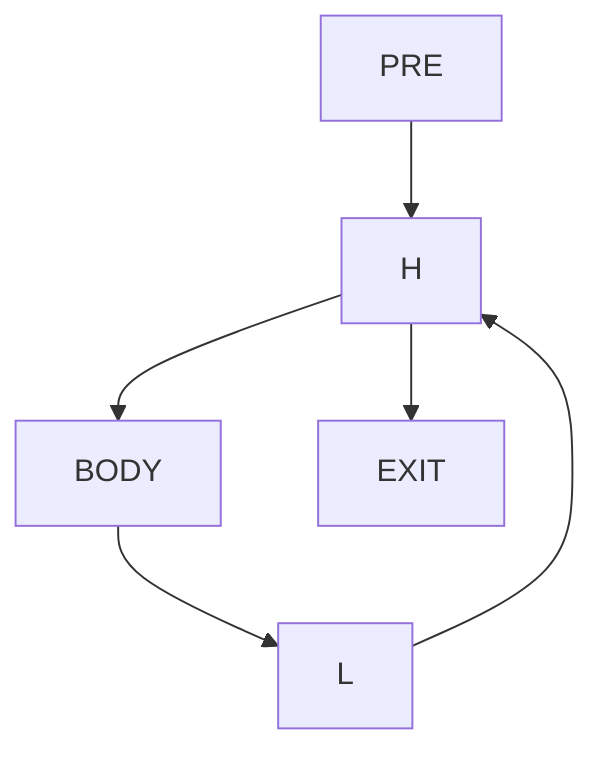
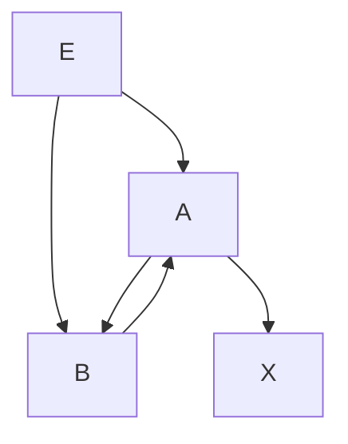

# Занятие 13. Циклы в CFG

> Back edge, natural loop и многовходовая irreducible region

[← Карта курса](../course-map.md) · [Предыдущее занятие](../modules/12-checkpoint-1.md) · [Следующее занятие](../modules/14-havlak-and-loop-tree.md)

## Результат занятия

Ты находишь natural loops и отдельно распознаёшь циклические области с несколькими входами.

**Перед началом:** dominance и раздел предпосылок про DFS/SCC.

## Зачем это вообще нужно

Стрелка, нарисованная вверх, не является формальным циклом. Для безопасных loop passes нужна структура: header, latch, входы и выходы.

## Термины до заданий

| Термин | Простое объяснение | Точная опора |
|---|---|---|
| **back edge** | ребро из latch обратно в header | `n→h` является back edge для natural loop, если `h dom n` |
| **header** | единая контролирующая точка входа natural loop | доминирует все блоки natural loop |
| **latch** | блок, содержащий back edge в header | может быть несколько latch blocks |
| **preheader** | выделенный внешний блок перед header | единственный внешний predecessor canonical header |
| **irreducible region** | циклическая область с несколькими независимыми входами | не представляется одним natural loop с доминирующим header |

Сначала прочитай готовые объяснения. Затем закрой таблицу и сформулируй каждый термин своими словами. Пустая формулировка ученика — это проверка после обучения, а не замена обучения.

## Первая модель

Natural loop:

Irreducible region:

У цикла `A↔B` два входа из `E`; ни A, ни B не доминирует всю область.

## Разобранный пример: состояние за состоянием

Для `pre→head; head→body,exit; body→latch; latch→head`:

1. Проверяем `head dom latch`.
2. Начинаем множество `{head,latch}`.
3. Worklist содержит `latch`.
4. Добавляем predecessor `body`.
5. Из `body` доходим назад до `head`; сам header дальше не разворачиваем.
6. Получаем `{head,body,latch}`; `pre` не входит.

## Формальное правило

Natural loop back edge `n→h` содержит `h`, `n` и все вершины, из которых можно дойти до `n` назад по predecessors, не проходя наружу через `h`. Irreducibility удобно подтверждать SCC с несколькими входящими рёбрами из-за пределов SCC.

## Типичные ошибки

- Определять back edge по геометрии или одному DFS-цвету.
- Включать preheader в тело natural loop.
- Считать любую SCC natural loop.
- Не различать exit edge и exit block.

## Задача A — по образцу

Для `A→B; B→C,D; C→E; E→B; D→X` вычисли Dom, найди back edge и natural loop.

Проверка задачи A — открывать после попытки

`B dom E`, поэтому `E→B` — back edge. Обратный сбор даёт `{B,C,E}`; D и X не входят.

## Задача B — перенос на новый пример

Для многовходового графа `E→A,B; A→B,X; B→A` найди SCC и объясни, почему это irreducible region.

Проверка задачи B — открывать после попытки

SCC `{A,B}` имеет два внешних входа `E→A` и `E→B`. Ни A, ни B не доминирует другую на всех путях, поэтому единого natural-loop header нет.

## Проверка на выходе

**Как формально проверить back edge?**  

**Почему preheader не тело цикла?**  

**Как увидеть irreducibility?**  

Короткие ответы

**Как формально проверить back edge?**  
Header должен доминировать источник ребра.

**Почему preheader не тело цикла?**  
Он выполняется до входа и не лежит на циклическом пути, замыкаемом latch.

**Как увидеть irreducibility?**  
Найти циклическую SCC с несколькими внешними входами и отсутствием единого доминирующего header.

## Профессиональная граница

Canonical loop form дополнительно требует единственный latch, dedicated exits и иногда LCSSA. Эти формы упрощают последующие passes.
