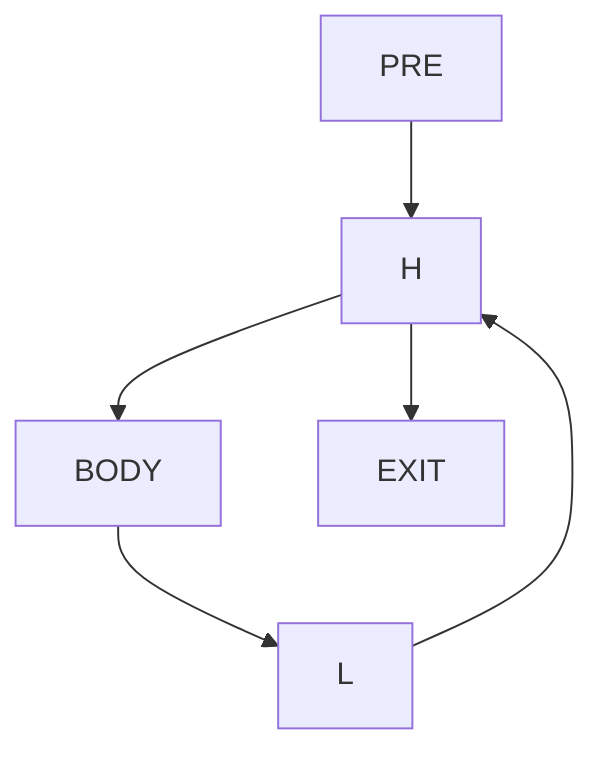
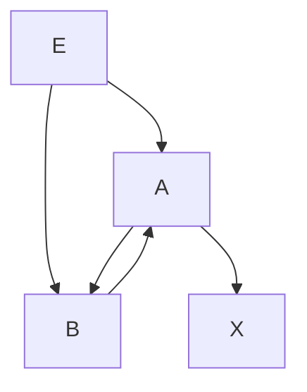

# Занятие 13. Циклы в CFG

> Обратное ребро, естественный цикл и несводимая область с несколькими независимыми входами

[← Карта курса](../course-map.md) · [Предыдущее занятие](../modules/12-checkpoint-1.md) · [Следующее занятие](../modules/14-havlak-and-loop-tree.md)

## Результат занятия

Ты находишь естественные циклы и отдельно распознаёшь циклические области, в которые можно войти через разные вершины без единого доминирующего заголовка.

**Перед началом:** доминирование и раздел предпосылок про DFS и SCC.

## Зачем это вообще нужно

Стрелка, нарисованная вверх, не является формальным циклом. Для безопасных преобразований нужны явные заголовок, замыкающий блок, тело, входные рёбра и рёбра выхода. Сильносвязность показывает наличие циклического пути, но сама по себе не доказывает существование естественного цикла.

## Термины до заданий

| Термин | Простое объяснение | Точная опора |
|---|---|---|
| **Обратное ребро** (*back edge*) | ребро из замыкающего блока в заголовок естественного цикла | `n→h` является таким ребром, если `h` доминирует `n` |
| **Заголовок цикла** (*header*) | единая контролирующая точка входа в естественный цикл | доминирует все блоки этого цикла |
| **Замыкающий блок** (*latch*) | блок, из которого идёт обратное ребро в заголовок | у одного естественного цикла может быть несколько замыкающих блоков |
| **Предвходной блок** (*preheader*) | отдельный внешний блок перед заголовком | является единственным внешним предшественником заголовка после канонизации |
| **Несводимая область** (*irreducible region*) | циклическая область без единого доминирующего входа | содержит не менее двух различных входных вершин из внешней части CFG, и ни одна вершина области не доминирует всю область как заголовок |

Сначала прочитай объяснения. Затем закрой таблицу и перескажи термины своими словами. Это проверка понимания, а не попытка угадать определение.

## Ключевая схема

Естественный цикл:

Несводимая область:

У области `A↔B` две различные входные вершины: внешнее управление может впервые попасть как в `A`, так и в `B`. Поэтому ни `A`, ни `B` не доминирует всю область.

Важно: два внешних ребра, оба ведущие только в `A`, ещё не доказывают несводимость. В таком случае `A` всё ещё может быть единым заголовком.

## Пошаговый разбор

Для графа `PRE→H; H→BODY,EXIT; BODY→L; L→H`:

1. Проверяем, что `H` доминирует источник ребра `L`.
2. Значит, `L→H` — обратное ребро естественного цикла.
3. Начинаем множество цикла с `{H,L}`.
4. Помещаем `L` в рабочую очередь.
5. Добавляем предшественника `BODY`.
6. Из `BODY` доходим назад до `H`; внешних предшественников самого `H` не добавляем.
7. Получаем `{H,BODY,L}`; `PRE` не входит в тело цикла.

Для области `A↔B`:

1. SCC равна `{A,B}`.
2. Внешние рёбра входят в разные вершины: `E→A` и `E→B`.
3. Путь `E→B` обходит `A`, а путь `E→A` обходит `B`.
4. Ни одна вершина не доминирует всю SCC, поэтому естественного цикла с единым заголовком нет.

## Формальное правило

Естественный цикл для ребра `n→h` существует, если `h dom n`. Он содержит `h`, `n` и все вершины, из которых можно обратным обходом по `pred` дойти до `n`, не продолжая обход через внешний предшественник `h`.

Для доказательства несводимости недостаточно найти SCC или посчитать внешние рёбра. Нужно показать одновременно:

1. область циклическая;
2. внешнее управление может впервые войти как минимум в две различные вершины области;
3. не существует вершины области, которая доминирует все остальные её вершины и служит единым заголовком.

## Типичные ошибки

- Определять обратное ребро по направлению стрелки или только по цвету DFS.
- Включать предвходной блок в тело естественного цикла.
- Считать любую SCC естественным циклом.
- Называть область несводимой только потому, что в неё входят два ребра, не проверив, ведут ли они в разные вершины.
- Не различать ребро выхода из цикла и блок, в который оно ведёт.

## Задача A — по образцу

Для `A→B; B→C,D; C→E; E→B; D→X` вычисли Dom, найди обратное ребро и естественный цикл.

Проверка задачи A — открывать после попытки

`B dom E`, поэтому `E→B` — обратное ребро. Обратный сбор даёт `{B,C,E}`; `A`, `D` и `X` не входят.

## Самостоятельная задача

Сравни два графа:

1. `E→A`, `F→A`, `A→B`, `B→A`;
2. `E→A`, `E→B`, `A→B`, `B→A`.

Для каждого найди SCC, входные вершины области и реши, доказана ли несводимость.

Проверка задачи B — открывать после попытки

В обоих графах SCC равна `{A,B}`.

В первом графе оба внешних ребра входят только в `A`. `A` может доминировать всю циклическую область и служить единым заголовком; одного количества входящих рёбер недостаточно для вывода о несводимости.

Во втором графе внешнее управление входит через разные вершины `A` и `B`. Путь `E→B` обходит `A`, поэтому единого доминирующего заголовка нет; область несводима.

## Проверь себя

**Как формально проверить обратное ребро естественного цикла?**  

**Почему число внешних рёбер не равно числу независимых входов?**  

**Как доказать несводимость циклической области?**

Короткие ответы

**Как проверить обратное ребро?**  
Заголовок должен доминировать источник ребра.

**Почему рёбер недостаточно?**  
Несколько внешних рёбер могут вести в одну и ту же входную вершину, не разрушая единый заголовок.

**Как доказать несводимость?**  
Показать циклическую SCC, не менее двух различных входных вершин и отсутствие вершины, доминирующей всю область.

## Как это устроено в промышленном компиляторе

Каноническая форма цикла дополнительно может требовать единственный замыкающий блок, предвходной блок, отдельные блоки выхода и LCSSA. Несводимые области либо обрабатываются консервативно, либо предварительно преобразуются; нельзя молча применять к ним проход, рассчитанный на естественный цикл.
