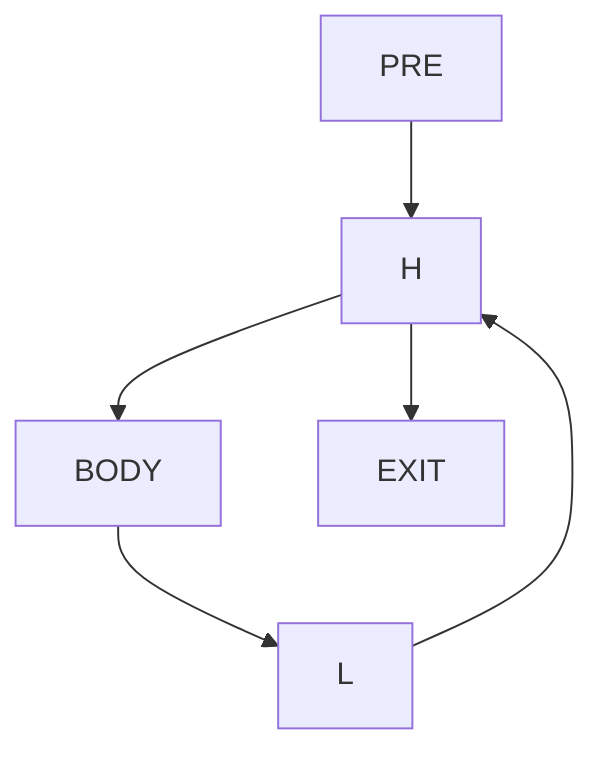
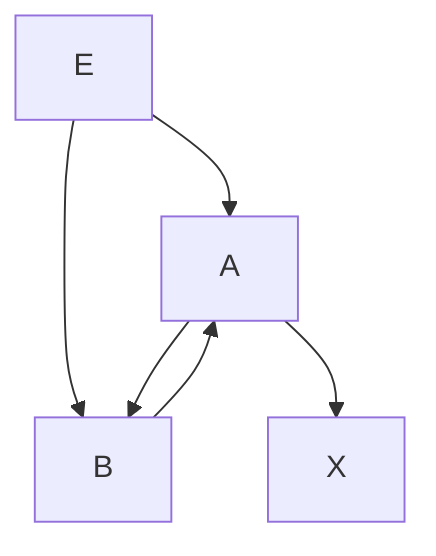

# Занятие 13. Циклы в CFG

> Обратное ребро, естественный цикл и несводимая область с несколькими входами

[← Карта курса](../course-map.md) · [Предыдущее занятие](../modules/12-checkpoint-1.md) · [Следующее занятие](../modules/14-havlak-and-loop-tree.md)

## Результат занятия

Ты находишь естественные циклы и отдельно распознаёшь циклические области с несколькими входами.

**Перед началом:** доминирование и раздел предпосылок про DFS и SCC.

## Зачем это вообще нужно

Стрелка, нарисованная вверх, не является формальным циклом. Для безопасных преобразований цикла нужны явные заголовок, замыкающий блок, входы и выходы.

## Термины до заданий

| Термин | Простое объяснение | Точная опора |
|---|---|---|
| **Обратное ребро** (*back edge*) | ребро из замыкающего блока в заголовок цикла | `n→h` является обратным ребром естественного цикла, если `h` доминирует `n` |
| **Заголовок цикла** (*header*) | единая контролирующая точка входа в естественный цикл | доминирует все блоки этого цикла |
| **Замыкающий блок** (*latch*) | блок, из которого идёт обратное ребро в заголовок | у одного цикла может быть несколько замыкающих блоков |
| **Предвходной блок** (*preheader*) | отдельный внешний блок перед заголовком | является единственным внешним предшественником канонического заголовка |
| **Несводимая область** (*irreducible region*) | циклическая область с несколькими независимыми входами | не представляется одним естественным циклом с доминирующим заголовком |

Сначала прочитай объяснения. Затем закрой таблицу и перескажи термины своими словами. Это проверка понимания, а не попытка угадать определение.

## Ключевая схема

Естественный цикл:

Несводимая область:

У цикла `A↔B` два входа из `E`; ни A, ни B не доминирует всю область.

## Пошаговый разбор

Для графа `PRE→H; H→BODY,EXIT; BODY→L; L→H`:

1. Проверяем, что заголовок `H` доминирует замыкающий блок `L`.
2. Начинаем с множества `{H,L}`.
3. Помещаем замыкающий блок `L` в рабочую очередь.
4. Добавляем предшественника `BODY`.
5. Из `BODY` доходим назад до `H`; предшественников заголовка за пределами цикла не добавляем.
6. Получаем `{H,BODY,L}`; предвходной блок `PRE` не входит в тело цикла.

## Формальное правило

Естественный цикл для обратного ребра `n→h` содержит `h`, `n` и все вершины, из которых можно добраться до `n` обратным обходом по предшественникам, не переходя наружу через `h`. Несводимость удобно подтверждать сильносвязной компонентой с несколькими внешними входящими рёбрами.

## Типичные ошибки

- Определять обратное ребро по направлению стрелки или только по цвету DFS.
- Включать предвходной блок в тело естественного цикла.
- Считать любую SCC естественным циклом.
- Не различать ребро выхода из цикла и блок, в который оно ведёт.

## Задача A — по образцу

Для `A→B; B→C,D; C→E; E→B; D→X` вычисли Dom, найди обратное ребро и естественный цикл.

Проверка задачи A — открывать после попытки

`B dom E`, поэтому `E→B` — обратное ребро. Обратный сбор даёт `{B,C,E}`; D и X не входят.

## Самостоятельная задача

Для многовходового графа `E→A,B; A→B,X; B→A` найди сильносвязную компоненту и объясни, почему это несводимая область.

Проверка задачи B — открывать после попытки

Сильносвязная компонента `{A,B}` имеет два внешних входа `E→A` и `E→B`. Ни A, ни B не доминирует другую на всех путях, поэтому единого доминирующего заголовка естественного цикла нет.

## Проверь себя

**Как формально проверить обратное ребро?**  

**Почему предвходной блок не входит в тело цикла?**  

**Как обнаружить несводимость?**  

Короткие ответы

**Как формально проверить обратное ребро?**  
Заголовок цикла должен доминировать источник ребра.

**Почему предвходной блок не входит в тело цикла?**  
Он выполняется до входа и не лежит на циклическом пути, замыкаемом замыкающим блоком.

**Как обнаружить несводимость?**  
Найти циклическую сильносвязную компоненту с несколькими внешними входами и отсутствием единого доминирующего заголовка.

## Как это устроено в промышленном компиляторе

Каноническая форма цикла дополнительно может требовать единственный замыкающий блок, отдельные блоки выхода и LCSSA. Эти формы упрощают последующие проходы.
