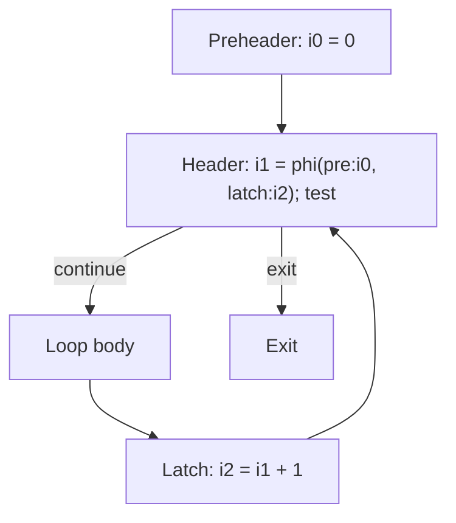

# Занятие 13. Циклы в CFG

> Структура, которую оптимизатор должен распознать до преобразований

[← Карта курса](../course-map.md) · [Предыдущее занятие](../modules/12-checkpoint-1.md) · [Следующее занятие](../modules/14-havlak-and-loop-tree.md)

## Результат занятия

| **К концу обязательной части.** Ты находишь back edges и natural loops, называешь header/latch/preheader/exits и различаешь reducible и irreducible regions. |
|--------------------------------------------------------------------------------------------------------------------------------------------------------------|

| **Параметр**          | **Значение**                                                                     |
|-----------------------|----------------------------------------------------------------------------------|
| Сложность             | Средний                                                                          |
| Обязательная нагрузка | 75–100 мин                                                                       |
| Перед началом         | CFG, dominance, SCC. Если комплексная работа ниже 70%, сначала 30 минут ремонта. |
| Что подготовить      | размеченные CFG, расчёт natural loop и объяснение irreducibility                 |

| **Разрешённый режим.** Сначала anatomy natural loop, потом irreducible. |
|-------------------------------------------------------------------------|

| **В этом занятии не требуется.** Не нужно доказывать все свойства reducible CFG. |
|---------------------------------------------------------------------------|

## Обязательный маршрут

| **Этап**           | **Время** | **Результат**                                           |
|--------------------|-----------|---------------------------------------------------------|
| Повторение         | 5–10 мин  | Не больше 3 коротких вопросов                           |
| Простое объяснение | 10–15 мин | Пересказать тему своими словами                         |
| Разобранный пример | 15–20 мин | Воспроизвести ключевые состояния                        |
| Задача A           | 20–25 мин | Обязательный минимум по образцу                         |
| Задача B           | 20–35 мин | Стандарт; можно завершить во второй короткой сессии     |
| Устный итог        | 5–10 мин  | 3 вопроса и самооценка светофором                       |
| Углубление         | 0–40 мин  | Задача C и профессиональные детали — только при ресурсе |

| **Когда запрашивать помощь.** После 10–15 минут честной попытки можно сразу зафиксировать точное место остановки и запросить разбор. Не нужно сначала мучительно завершать A и B. |
|----------------------------------------------------------------------------------------------------------------------------------------------------------|

## Короткое повторение

<table>
<colgroup>
<col style="width: 33%" />
<col style="width: 33%" />
<col style="width: 33%" />
</colgroup>
<thead>
<tr class="header">
<th><strong>Когда</strong></th>
<th><strong>Объём</strong></th>
<th><strong>Что сделать</strong></th>
</tr>
</thead>
<tbody>
<tr class="odd">
<td>Вчера</td>
<td>1–2 формулировки</td>
<td>• Каждый этап использует только проверенный результат предыдущего. 
• Сохраняются CFG, Dom/idom/DF, SSA и IR после каждого pass.</td>
</tr>
<tr class="even">
<td>3 дня назад</td>
<td>1 формулировка</td>
<td>UCE удаляет недостижимые блоки; DCE — ненужные чистые инструкции.</td>
</tr>
<tr class="odd">
<td>7 дней назад</td>
<td>1 мини-задача</td>
<td>Поставь одну φ в ромбе и подпиши оба incoming edges.</td>
</tr>
</tbody>
</table>

| **Ограничение.** На повторение не трать больше 10 минут. Не вспомнил — сделай попытку, посмотри ответ и верни карточку на следующее повторение. |
|-----------------------------------------------------------------------------------------------------------------------------------|

## Сначала простыми словами

Естественный цикл возникает вокруг обратного ребра latch → header, если header доминирует latch. Header — единая точка входа в такой цикл.

Несводимая циклическая область имеет несколько входов и не укладывается в один natural loop. Сначала уверенно разбирай сводимые циклы; irreducible — отдельный случай.

### Пять терминов занятия

| **Термин**   | **Моя формулировка одним предложением** |
|--------------|-----------------------------------------|
| back edge    |                                         |
| header       |                                         |
| latch        |                                         |
| preheader    |                                         |
| natural loop |                                         |

## Минимум для запоминания

- Back edge n→h образует natural loop, если h доминирует n.

- Header, latch, body, exits и preheader — разные части цикла.

- Irreducible region имеет несколько входов и не является обычным natural loop.

| **Не учи дословно без смысла.** Сначала объясни формулировку своими словами на маленьком примере. Точная версия нужна после понимания. |
|----------------------------------------------------------------------------------------------------------------------------------------|

## Визуальная модель

*Рабочее представление темы занятия*

## Разобранный пример — проход по шагам

<table>
<colgroup>
<col style="width: 100%" />
</colgroup>
<thead>
<tr class="header">
<th>pre -&gt; head 
head -&gt; body, exit 
body -&gt; latch 
latch -&gt; head</th>
</tr>
</thead>
<tbody>
</tbody>
</table>

latch→head — back edge, если head доминирует latch. Natural loop: {head, body, latch}. pre может стать preheader, если это единственный внешний predecessor header.

1. Найди back edge n→h.

2. Проверь, что h доминирует n.

3. Начни множество loop с {h,n}.

4. Иди назад по predecessors от n, пока новые блоки не перестанут добавляться; h не разворачивай дальше.

5. Отдельно подпиши header, latch, exits и возможный preheader.

| **Проверка понимания.** Закрой пример и объясни не итог, а почему выполняется каждый следующий шаг. Если не можешь — зафиксируй именно этот переход и запроси разбор. |
|------------------------------------------------------------------------------------------------------------------------------------------------------|

## Обязательная практика

### Задача A — обязательная по образцу: Анатомия цикла

| **Параметр**     | **Значение**                                                   |
|------------------|----------------------------------------------------------------|
| Статус           | Обязательно в этом занятии                                            |
| Ориентир времени | 30 мин                                                         |
| Что сдать        | внешние predecessors перенаправлены; семантика входа сохранена |

Для диаграммы подпиши header, latch, back edge, body, preheader, exit edge и exit block. Затем убери выделенный preheader и предложи преобразование, которое его создаёт.

| **Подсказка 1.** Back edge определяется не DFS-цветом, а dominance header над latch. |
|--------------------------------------------------------------------------------------|

## Стандартная практика

### Задача B — стандартная для закрепления: Natural loop

| **Параметр**     | **Значение**                                                        |
|------------------|---------------------------------------------------------------------|
| Статус           | Нужно выполнить до следующей зависимой темы; можно во второй сессии |
| Ориентир времени | 40 мин                                                              |
| Что сдать        | доказано B dom E; worklist обратного сбора; тело цикла              |

Для CFG A→B, B→C,D, C→E, E→B, D→X вычисли dominators, найди back edge и собери natural loop обратным обходом predecessors.

| **Подсказка 1.** Back edge определяется не DFS-цветом, а dominance header над latch. |
|--------------------------------------------------------------------------------------|

| **Подсказка 2.** Natural loop собирается обратным обходом predecessors от latch до header. |
|--------------------------------------------------------------------------------------------|

## Три вопроса на выходе

| **Вопрос**                          | **Результат retrieval**         |
|-------------------------------------|---------------------------------|
| Как формально определить back edge? | □ ≤15 с □ с паузой □ не ответил |
| Из чего строится natural loop?      | □ ≤15 с □ с паузой □ не ответил |
| Чем preheader отличается от header? | □ ≤15 с □ с паузой □ не ответил |

## Светофор понимания

| **Состояние** | **Что это означает**                                    | **Следующее действие**                                                  |
|---------------|---------------------------------------------------------|-------------------------------------------------------------------------|
| Зелёный       | Могу объяснить и решить A/B с незначительной проверкой. | Перейти дальше; C только по желанию.                                    |
| Жёлтый        | Понимаю идею, но теряю один шаг или термин.             | Разобрать уменьшенный пример с преподавателем или свериться с эталоном; B можно закончить во второй сессии. |
| Красный       | Не могу объяснить причинную модель или начать A.        | Не переходить дальше; зафиксировать попытку и запросить разбор после 10–15 минут.                   |

| **Минимум занятия.** Занятие засчитывается, если понятна причинная модель, воспроизведён пример и выполнена задача A. Задача B должна быть закрыта до следующей темы, которая на неё опирается. |
|------------------------------------------------------------------------------------------------------------------------------------------------------------------------------------------|

## Справочник и углубление — читать по необходимости

| **Это необязательная часть первого прохода.** Открывай её, если простого объяснения недостаточно, при проверке решения или когда остались силы. Профессиональные оговорки не являются обязательным минимумом занятия. |
|--------------------------------------------------------------------------------------------------------------------------------------------------------------------------------------------------------------|

### Подробная теория

#### Цикл — не просто ребро назад на рисунке

В структурированном CFG **back edge** n → h определяется тем, что h доминирует n. Тогда h — header, n — latch, а естественный цикл состоит из h, n и всех блоков, из которых можно дойти до n, не проходя через h заранее.

Геометрическое направление стрелки на рисунке не является определением. Перестановка вершин не меняет цикл.

#### Части цикла

**Header** — точка входа, доминирующая тело естественного цикла. **Latch** содержит back edge к header. **Preheader** — выделенный блок перед header, через который проходят входы снаружи; он удобен для LICM. **Exit edge** ведёт из тела наружу, **exit block** — его цель.

У цикла могут быть несколько latch и несколько exits. Preheader может отсутствовать и быть создан преобразованием CFG.

#### Сводимость

Граф сводим, если циклические области можно представить структурированными циклами с единственным доминирующим входом. Несводимый регион обычно имеет несколько входов в SCC, и ни одна вершина не доминирует все остальные как единый header.

Естественные циклы по back edges хорошо работают для reducible CFG, но недостаточны для полного распознавания irreducible loops. Поэтому алгоритмы вроде Хавлака объединяют dominance и SCC-подобную обработку.

#### Вложенность

Циклы могут быть вложены, последовательны или частично перекрыты в сложном CFG. Loop tree/forest хранит отношение вложенности и позволяет проходам сначала обрабатывать внутренние циклы.

## Алгоритм на одной странице

| **Поле**          | **Содержание**                                                             |
|-------------------|----------------------------------------------------------------------------|
| Название          | Natural loop для back edge                                                 |
| Вход              | CFG, dominance и back edge latch→header.                                   |
| Результат         | Множество блоков natural loop.                                             |
| Инвариант         | Каждый добавленный блок способен достичь latch внутри собираемого региона. |
| Условие остановки | Worklist пуст.                                                             |
| Сложность         | O(V+E) в просмотренном регионе.                                            |

6.  Инициализировать set={header,latch}; worklist=\[latch\].

7.  Извлекать x и просматривать predecessors.

8.  Добавлять unseen predecessor p, кроме уже обработанного header, в set/worklist.

9.  Продолжать, пока очередь не опустеет.

10. Проверить, что header доминирует все блоки loop.

### Допущения учебного IR на сегодня

- У каждого базового блока ровно один терминатор; терминатор является последней инструкцией блока.

- Деление может завершиться наблюдаемой ошибкой при нуле. Его нельзя безусловно удалять или выносить, пока не доказаны безопасность и допустимость спекуляции.

- print, store, volatile/atomic операции и неизвестный вызов имеют наблюдаемый эффект. Вызов считается чистым только при явной пометке pure/readonly в условии.

### Дополнительная задача

### Задача C — необязательный перенос: Несводимый регион

| **Параметр**     | **Значение**                                         |
|------------------|------------------------------------------------------|
| Статус           | Только если осталось внимание                        |
| Ориентир времени | 25 мин                                               |
| Что сдать        | два входа; dominance-контрпример; SCC ≠ natural loop |

Рассмотри SCC с двумя входами E→A и E→B, циклическими связями через C. Объясни, почему SCC есть, но единственного естественного header может не быть.

| **Подсказка 1.** Back edge определяется не DFS-цветом, а dominance header над latch. |
|--------------------------------------------------------------------------------------|

| **Подсказка 2.** Natural loop собирается обратным обходом predecessors от latch до header. |
|--------------------------------------------------------------------------------------------|

### Полная устная проверка

| **Вопрос**                                      | **Результат retrieval**         |
|-------------------------------------------------|---------------------------------|
| Как формально определить back edge?             | □ ≤15 с □ с паузой □ не ответил |
| Из чего строится natural loop?                  | □ ≤15 с □ с паузой □ не ответил |
| Чем preheader отличается от header?             | □ ≤15 с □ с паузой □ не ответил |
| Что делает цикл несводимым?                     | □ ≤15 с □ с паузой □ не ответил |
| Почему SCC и естественный цикл не одно и то же? | □ ≤15 с □ с паузой □ не ответил |

### Журнал ошибок

| **Ошибка / сомнение** | **Первый нарушенный инвариант** | **Исправленное правило** | **Новый пример / итерация** |
|-----------------------|---------------------------------|--------------------------|-------------------------|
|                       |                                 |                          |                         |
|                       |                                 |                          |                         |
|                       |                                 |                          |                         |
|                       |                                 |                          |                         |
|                       |                                 |                          |                         |

### План повторения

| **Когда**    | **Что повторить**                        |
|--------------|------------------------------------------|
| Завтра       | 3 пункта минимального блока и задача A.  |
| Через 3 дня  | Один алгоритм или стандартная задача B.  |
| Через 7 дней | Собери natural loop по одному back edge. |

### Как получить обратную связь

**Сообщение для начала ежедневной сессии**

<table>
<colgroup>
<col style="width: 100%" />
</colgroup>
<thead>
<tr class="header">
<th>Я работаю по документу «Циклы в CFG: естественные, сводимые и несводимые» (версия 3.0). Я могу обратиться уже после 10–15 минут честной попытки. 
 
Моя текущая зона: зелёная / жёлтая / красная. 
Моя попытка и точное место остановки: ... 
 
Работай так: 
1. Сначала проверь мою причинную модель простым вопросом, не выдавая решение. 
2. Если модель неверна, объясни тему на одном меньшем примере и попроси меня пересказать. 
3. Найди только первую существенную ошибку: место, нарушенный инвариант и минимальный контрпример. 
4. Дай мне исправить её самостоятельно. 
5. После исправления дай одну короткую задачу на перенос. 
6. В конце назови: что я уже понимаю, что пока понимаю с подсказкой и что повторить на следующей сессии.</th>
</tr>
</thead>
<tbody>
</tbody>
</table>

## Точечное чтение

- Cooper & Torczon — loop discovery and natural loops; LLVM Loop Terminology.

| **Стоп чтения.** Прекрати чтение, когда можешь воспроизвести определение/алгоритм и решить задачу B. Дополнительные страницы не заменяют практику. |
|----------------------------------------------------------------------------------------------------------------------------------------------------|
