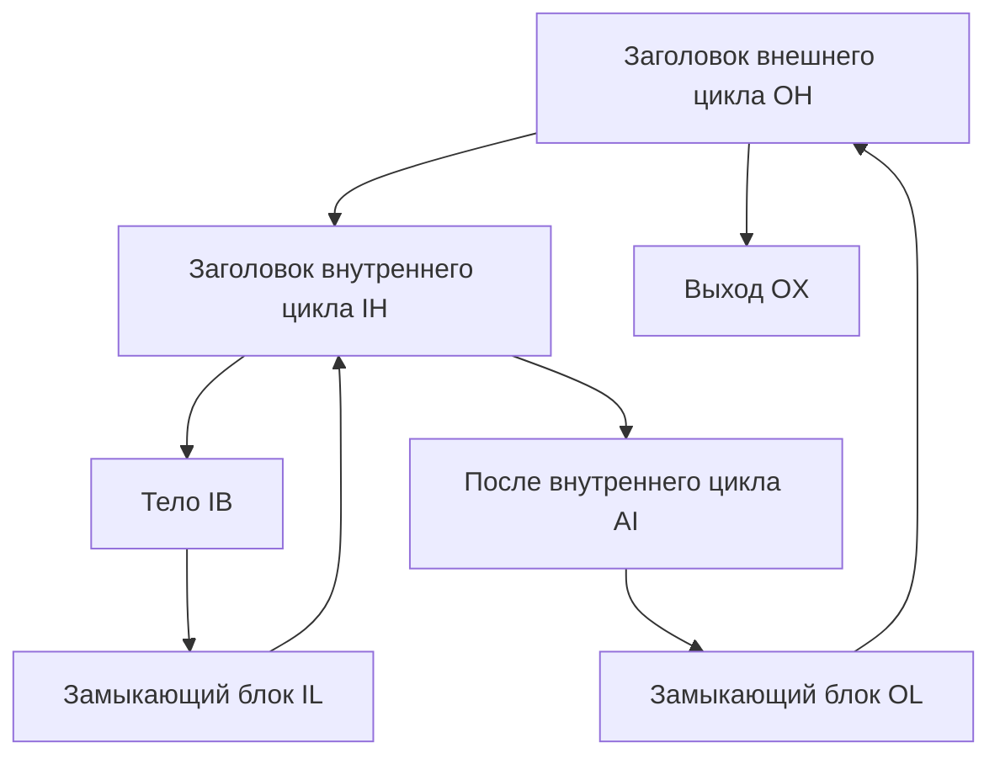

# Занятие 14. Идея алгоритма Хавлака и дерево циклов

> Сначала свернуть внутренний цикл, затем рассматривать его как один узел внешнего цикла

[← Карта курса](../course-map.md) · [Предыдущее занятие](13-loop-concepts.md) · [Следующее занятие](15-induction-variables.md)

## Результат занятия

Ты понимаешь, зачем семейство алгоритмов Хавлака сворачивает найденные области. На небольшом сводимом CFG ты читаешь состояния рабочей очереди и строишь дерево вложенности циклов.

Полная самостоятельная реализация конкретного варианта алгоритма в обязательный результат этого занятия не входит.

**Перед началом:** [DFS и SCC](../prerequisites.md#dfs-и-scc), доминирование и естественные циклы.

## Зачем это вообще нужно

По одному обратному ребру можно собрать отдельный естественный цикл. Но этого недостаточно, если циклы вложены друг в друга.

Представь внешний цикл, внутри которого есть ещё один цикл. Сначала алгоритм находит внутренний. Затем временно заменяет всю внутреннюю область одним представителем. После этого внешний цикл можно искать так, будто внутренний состоит из одного узла.

Этот урок объясняет именно эту механику. Лабораторная реализация должна дополнительно закрепить точный вариант алгоритма и граничные случаи тестами.

## Термины до заданий

| Термин | Простое объяснение | Точная опора |
|---|---|---|
| **Номер DFS-обхода** (*DFS number*) | номер первого посещения вершины | вместе с родителем задаёт дерево DFS и порядок обработки |
| **Кандидат заголовка** | вершина, вокруг которой ищут циклическую область | внутренние кандидаты обрабатываются раньше внешних |
| **Рабочее множество** (*worklist*) | очередь ещё не разобранных вершин и областей | после каждого извлечения в неё могут добавиться предшественники |
| **Представитель области** | один узел, который временно обозначает всю свёрнутую область | `find(v)` возвращает представителя, а `union` объединяет узлы |
| **Дерево вложенности циклов** (*loop nesting tree*) | показывает, какой цикл находится внутри какого | внутренний цикл становится ребёнком внешнего |

Сначала прочитай объяснения. Затем закрой таблицу и перескажи термины своими словами. Это проверка понимания, а не попытка угадать определение.

## Ключевая схема



Рёбра графа:

```text
OH → IH, OX
IH → IB, AI
IB → IL
IL → IH
AI → OL
OL → OH
```

Порядок DFS задан условием:

```text
OH=0, IH=1, IB=2, IL=3, AI=4, OL=5, OX=6
```

Другой порядок обхода может дать другие номера. Поэтому реализация должна фиксировать порядок просмотра рёбер.

## Пошаговый разбор

### Шаг 1. Найти внутреннюю область

Ребро `IL→IH` возвращает управление в заголовок внутреннего цикла.

| Шаг | Рабочее множество | Извлечённый узел | Действие | Результат |
|---:|---|---|---|---|
| 0 | `{IL}` | — | начать с источника ребра `IL→IH` | кандидат `IH` |
| 1 | `∅` | `IL` | добавить предшественника `IB` | `{IB}` |
| 2 | `∅` | `IB` | остановиться у границы `IH` | область `{IH,IB,IL}` |
| 3 | — | — | выполнить `union(IB,IH)` и `union(IL,IH)` | представитель области — `IH` |

После объединения:

```text
find(IB) = IH
find(IL) = IH
```

### Шаг 2. Найти внешнюю область

Теперь внутренняя область обозначается одним представителем `IH`.

| Шаг | Рабочее множество | Извлечённый узел | Действие | Результат |
|---:|---|---|---|---|
| 0 | `{OL}` | — | начать с источника ребра `OL→OH` | кандидат `OH` |
| 1 | `∅` | `OL` | добавить `AI` | `{AI}` |
| 2 | `∅` | `AI` | перейти к представителю внутренней области | `{IH}` |
| 3 | `∅` | `IH` | включить свёрнутую область целиком | `IH` — ребёнок `OH` |
| 4 | — | — | объединить внешнюю область с `OH` | корень дерева — `OH` |

Ключевой результат:

```text
OH
└── IH
```

Внутренний цикл нужно обработать раньше внешнего. После `union` нужно обращаться к `find(node)`, а не считать старую вершину отдельной областью.

## Формальное правило

Учебная модель состоит из восьми действий:

1. Выполни DFS и сохрани номер и родителя каждой вершины.
2. Обрабатывай возможные заголовки от внутренних к внешним.
3. Для заголовка найди рёбра, которые возвращаются в его область.
4. Добавь источники этих рёбер в рабочее множество.
5. Поднимайся по предшественникам и каждый раз используй текущего представителя `find(node)`.
6. Если путь входит в область в обход заголовка, отметь область как несводимую.
7. Иначе объедини найденные узлы с заголовком.
8. Уже свёрнутые внутренние циклы добавь как дочерние узлы дерева.

Это **не полный псевдокод Хавлака**. Для реализации нужно отдельно зафиксировать вариант алгоритма, классификацию рёбер, несколько замыкающих блоков, несводимые области, самопетли и повторно встреченные представители.

## Типичные ошибки

- Называть учебную модель полной реализацией.
- Считать любое обратное ребро DFS ребром естественного цикла без проверки доминирования.
- После объединения продолжать работу со старой вершиной вместо `find(node)`.
- Искать внешний цикл раньше внутреннего.
- Показывать только итоговое множество без состояний рабочей очереди.

## Задача A — по образцу

Воспроизведи разбор внутреннего цикла:

1. начальное рабочее множество;
2. два извлечения;
3. два объединения;
4. значения `find(IB)` и `find(IL)` после каждого этапа.

<details>
<summary>Проверка задачи A</summary>

Сначала `find(IB)=IB` и `find(IL)=IL`. Рабочее множество начинается с `{IL}`. При обработке `IL` в него добавляется `IB`.

После `union(IB,IH)` и `union(IL,IH)` оба узла имеют представителя `IH`.

</details>

## Самостоятельная задача

Добавь внешнее ребро `X→IB`, где `X` достижим из входа в обход `IH`.

Ответь на три вопроса:

1. через какие две вершины теперь можно войти в область;
2. какой путь опровергает `IH dom IB`;
3. почему область нельзя свернуть как обычный естественный цикл.

<details>
<summary>Проверка задачи B</summary>

В область можно войти через `IH` и через `IB`. Путь из входа через `X→IB` обходит `IH`, поэтому `IH` не доминирует всю область.

Единого заголовка естественного цикла нет. Область нужно отметить как несводимую.

</details>

## Проверь себя

**Зачем внутренние кандидаты обрабатывать раньше внешних?**  
**Почему после объединения нужен `find(node)`?**  
**Чего не хватает учебной модели для реализации?**

<details>
<summary>Короткие ответы</summary>

Внутренний цикл сначала превращается в один объект. `find(node)` возвращает этот объект после объединения. Для реализации нужны точный вариант алгоритма, все переходы состояния и тесты граничных случаев.

</details>

## Как это устроено в промышленном компиляторе

Промышленный анализ возвращает стабильную иерархию циклов и отдельно отмечает несводимые области.

Его тестируют на вложенных циклах, нескольких входах, самопетлях и нескольких замыкающих блоках. Красивая схема без точного контракта и тестов не считается реализацией.
