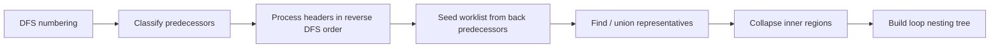

# Занятие 14. Алгоритм Хавлака и дерево циклов

> Концептуальная схема распознавания reducible и irreducible loop regions

[← Карта курса](../course-map.md) · [Предыдущее занятие](../modules/13-loop-concepts.md) · [Следующее занятие](../modules/15-induction-variables.md)

## Результат занятия

| **К концу обязательной части.** Ты можешь объяснить цель и основные фазы алгоритма Хавлака, классифицировать рёбра/узлы и собрать иерархию циклов без требования помнить реализационные детали построчно. |
|-----------------------------------------------------------------------------------------------------------------------------------------------------------------------------------------------------------|

| **Параметр**          | **Значение**                                                              |
|-----------------------|---------------------------------------------------------------------------|
| Сложность             | Очень сложный                                                             |
| Обязательная нагрузка | 90–130 мин или 2 сессии                                                   |
| Перед началом         | Dominance, DFS, SCC и понятия циклов.                                     |
| Что подготовить      | карточки фаз, DFS/loop tree и объяснение точки обнаружения irreducibility |

| **Уровень точности.** Занятие фиксирует инварианты и фазы Хавлака, но не выдаёт учебную схему за готовую промышленную реализацию. |
|-----------------------------------------------------------------------------------------------------|

| **В этом занятии не требуется.** Не заучивай псевдокод построчно: требуется уметь восстановить состояния DFS, worklist, Union-Find и loop tree. |
|----------------------------------------------------------------------------------------|

## Обязательный маршрут

| **Этап**           | **Время** | **Результат**                                           |
|--------------------|-----------|---------------------------------------------------------|
| Повторение         | 5–10 мин  | Не больше 3 коротких вопросов                           |
| Простое объяснение | 10–15 мин | Пересказать тему своими словами                         |
| Разобранный пример | 15–20 мин | Воспроизвести ключевые состояния                        |
| Задача A           | 20–25 мин | Обязательный минимум по образцу                         |
| Задача B           | 20–35 мин | Стандарт; можно завершить во второй короткой сессии     |
| Устный итог        | 5–10 мин  | 3 вопроса и самооценка светофором                       |
| Углубление         | 0–40 мин  | Задача C и профессиональные детали — только при ресурсе |

| **Когда запрашивать помощь.** После 10–15 минут честной попытки можно сразу зафиксировать точное место остановки и запросить разбор. Не нужно сначала мучительно завершать A и B. |
|----------------------------------------------------------------------------------------------------------------------------------------------------------|

## Короткое повторение

<table>
<colgroup>
<col style="width: 33%" />
<col style="width: 33%" />
<col style="width: 33%" />
</colgroup>
<thead>
<tr class="header">
<th><strong>Когда</strong></th>
<th><strong>Объём</strong></th>
<th><strong>Что сделать</strong></th>
</tr>
</thead>
<tbody>
<tr class="odd">
<td>Вчера</td>
<td>1–2 формулировки</td>
<td>• Back edge n→h образует natural loop, если h доминирует n. 
• Header, latch, body, exits и preheader — разные части цикла.</td>
</tr>
<tr class="even">
<td>3 дня назад</td>
<td>1 формулировка</td>
<td>Inlining связывает параметры с аргументами и заменяет call телом функции.</td>
</tr>
<tr class="odd">
<td>7 дней назад</td>
<td>1 мини-задача</td>
<td>Покажи push/pop для одной переменной в двух ветвях dominator tree.</td>
</tr>
</tbody>
</table>

| **Ограничение.** На повторение не трать больше 10 минут. Не вспомнил — сделай попытку, посмотри ответ и верни карточку на следующее повторение. |
|-----------------------------------------------------------------------------------------------------------------------------------|

## Сначала простыми словами

Идея Хавлака: пройти CFG DFS, найти кандидаты на заголовки, собрать принадлежащие им циклические регионы и сворачивать внутренние регионы раньше внешних.

Union-Find нужен, чтобы после свёртки обращаться к целому найденному региону как к одному представителю. На первом проходе достаточно понимать состояние алгоритма и одну маленькую трассу, а не заучивать псевдокод целиком.

### Пять терминов занятия

| **Термин**        | **Моя формулировка одним предложением** |
|-------------------|-----------------------------------------|
| DFS number        |                                         |
| back predecessor  |                                         |
| worklist          |                                         |
| Union-Find        |                                         |
| loop nesting tree |                                         |

## Минимум для запоминания

- Хавлак использует DFS-нумерацию, классификацию predecessors и свёртку регионов.

- Внутренние циклы обрабатываются раньше внешних.

- Union-Find представляет уже свёрнутый регион одним представителем.

| **Не учи дословно без смысла.** Сначала объясни формулировку своими словами на маленьком примере. Точная версия нужна после понимания. |
|----------------------------------------------------------------------------------------------------------------------------------------|

## Визуальная модель

*Рабочее представление темы занятия*

## Разобранный пример — проход по шагам

<table>
<colgroup>
<col style="width: 100%" />
</colgroup>
<thead>
<tr class="header">
<th>outer_head -&gt; inner_head, outer_exit 
inner_head -&gt; inner_body, after_inner 
inner_body -&gt; inner_latch 
inner_latch -&gt; inner_head 
after_inner -&gt; outer_latch 
outer_latch -&gt; outer_head</th>
</tr>
</thead>
<tbody>
</tbody>
</table>

Сначала распознаётся внутренний цикл с inner_head, затем его регион можно схлопнуть. После этого распознаётся внешний цикл с outer_head; в loop tree внутренний становится ребёнком внешнего.

1. Выполни DFS и запиши number/parent.

2. Раздели predecessors каждой вершины на back и non-back относительно DFS tree.

3. Рассматривай возможные headers в обратном DFS-порядке.

4. Начальный pool — представители источников back edges в header.

5. Расширяй pool через non-back predecessors; внешний вход указывает на irreducible region.

6. Объедини найденный регион с header в Union-Find.

7. Свяжи уже найденные внутренние loop nodes как children нового loop node.

| **Проверка понимания.** Закрой пример и объясни не итог, а почему выполняется каждый следующий шаг. Если не можешь — зафиксируй именно этот переход и запроси разбор. |
|------------------------------------------------------------------------------------------------------------------------------------------------------|

## Обязательная практика

### Задача A — обязательная по образцу: Карточки фаз

| **Параметр**     | **Значение**                                                      |
|------------------|-------------------------------------------------------------------|
| Статус           | Обязательно в этом занятии                                               |
| Ориентир времени | 30 мин                                                            |
| Что сдать        | для каждой фазы указан вход/выход; понятна причина следующей фазы |

Сделай 6 карточек: DFS; классификация predecessors; обратный порядок; worklist региона; проверка dominance/irreducibility; union и parent relation. Перемешай и восстанови порядок.

| **Подсказка 1.** Внутренний loop должен быть распознан раньше внешнего благодаря reverse DFS order. |
|-----------------------------------------------------------------------------------------------------|

## Стандартная практика

### Задача B — стандартная для закрепления: Вложенный пример

| **Параметр**     | **Значение**                                                        |
|------------------|---------------------------------------------------------------------|
| Статус           | Нужно выполнить до следующей зависимой темы; можно во второй сессии |
| Ориентир времени | 40 мин                                                              |
| Что сдать        | DFS numbers; два loop descriptors; parent-child                     |

Построй DFS-дерево и loop tree для примера. Не требуется точная union-find трасса; требуется обосновать порядок распознавания внутренних и внешних циклов.

| **Подсказка 1.** Внутренний loop должен быть распознан раньше внешнего благодаря reverse DFS order. |
|-----------------------------------------------------------------------------------------------------|

| **Подсказка 2.** При расширении pool следи не за исходным node, а за Union-Find representative. |
|-------------------------------------------------------------------------------------------------|

## Три вопроса на выходе

| **Вопрос**                                    | **Результат retrieval**         |
|-----------------------------------------------|---------------------------------|
| Почему natural-loop алгоритм недостаточен?    | □ ≤15 с □ с паузой □ не ответил |
| Зачем DFS-нумерация?                          | □ ≤15 с □ с паузой □ не ответил |
| Почему обработка идёт в обратном DFS-порядке? | □ ≤15 с □ с паузой □ не ответил |

## Светофор понимания

| **Состояние** | **Что это означает**                                    | **Следующее действие**                                                  |
|---------------|---------------------------------------------------------|-------------------------------------------------------------------------|
| Зелёный       | Могу объяснить и решить A/B с незначительной проверкой. | Перейти дальше; C только по желанию.                                    |
| Жёлтый        | Понимаю идею, но теряю один шаг или термин.             | Разобрать уменьшенный пример с преподавателем или свериться с эталоном; B можно закончить во второй сессии. |
| Красный       | Не могу объяснить причинную модель или начать A.        | Не переходить дальше; зафиксировать попытку и запросить разбор после 10–15 минут.                   |

| **Минимум занятия.** Занятие засчитывается, если понятна причинная модель, воспроизведён пример и выполнена задача A. Задача B должна быть закрыта до следующей темы, которая на неё опирается. |
|------------------------------------------------------------------------------------------------------------------------------------------------------------------------------------------|

## Справочник и углубление — читать по необходимости

| **Это необязательная часть первого прохода.** Открывай её, если простого объяснения недостаточно, при проверке решения или когда остались силы. Профессиональные оговорки не являются обязательным минимумом занятия. |
|--------------------------------------------------------------------------------------------------------------------------------------------------------------------------------------------------------------|

### Подробная теория

#### Что строит алгоритм

Алгоритм Хавлака строит loop nesting tree для произвольного CFG и расширяет идеи Тарьяна на несводимые области. В irreducible CFG конкретное дерево может зависеть от выбранного DFS spanning tree. При переносе в код зафиксируй вариант классификации рёбер, представление Union-Find и правила построения loop tree, а затем сверь их с канонической статьёй Хавлака из раздела источников.

#### Состояние алгоритма

Для каждой CFG-вершины нужны DFS number и parent; множества back/non-back predecessors; Union-Find representative; классификация региона; ссылка на loop node. После свёртки внутренний цикл выступает единым представителем при анализе внешнего.

#### Обратный DFS-порядок

Кандидаты header рассматриваются от поздних DFS-номеров к ранним. Поэтому вложенные циклы распознаются и сворачиваются раньше содержащих их внешних циклов. Начальный pool формируется из представителей источников back edges в header.

#### Расширение региона

Из worklist извлекается representative x. Для каждого non-back predecessor y берётся find(y). Если representative не является DFS-descendant текущего header, обнаружен внешний вход и регион irreducible. Иначе новый representative добавляется в pool/worklist.

#### Свёртка и дерево

После стабилизации pool его представители объединяются с header. Создаётся loop node; loop nodes, уже принадлежащие сворачиваемым представителям, становятся children. Полученное parent relation и есть дерево/лес вложенности циклов.

## Алгоритм на одной странице

| **Поле**          | **Содержание**                                                                                       |
|-------------------|------------------------------------------------------------------------------------------------------|
| Название          | Учебная трасса Хавлака                                                                               |
| Вход              | Достижимый CFG.                                                                                      |
| Результат         | Loop nesting tree с reducible/irreducible classification.                                            |
| Инвариант         | При обработке header внутренние регионы уже свернуты Union-Find и представлены одним representative. |
| Условие остановки | Обработаны все DFS nodes; каждый распознанный loop имеет parent или root.                            |
| Сложность         | Почти линейная в классической постановке с Union-Find; детали зависят от варианта алгоритма.         |

8.  Построить DFS tree: preorder number, parent, descendant intervals.

9.  Для каждого node w разделить входящие edges на back predecessors и non-back predecessors относительно DFS tree.

10. Обрабатывать w в обратном DFS preorder.

11. Начать pool/worklist с Union-Find representatives back predecessors w.

12. Расширять region через non-back predecessors элементов pool.

13. Если representative predecessor не является DFS-descendant w — отметить irreducible region.

14. Создать loop node, объединить region под representative w и связать уже найденные nested loops как children.

### Допущения учебного IR на сегодня

- У каждого базового блока ровно один терминатор; терминатор является последней инструкцией блока.

- Деление может завершиться наблюдаемой ошибкой при нуле. Его нельзя безусловно удалять или выносить, пока не доказаны безопасность и допустимость спекуляции.

- print, store, volatile/atomic операции и неизвестный вызов имеют наблюдаемый эффект. Пометка `pure` означает отсутствие чтения/записи памяти и иных эффектов по контракту; исключения проверяются отдельно. `readonly` запрещает запись, но разрешает чтение памяти и само по себе не делает вызов чистым.

### Дополнительная задача

### Задача C — необязательный перенос: Несводимость

| **Параметр**     | **Значение**                                                                |
|------------------|-----------------------------------------------------------------------------|
| Статус           | Только если осталось внимание                                               |
| Ориентир времени | 25 мин                                                                      |
| Что сдать        | конкретный non-back predecessor; проверка dominance; маркировка irreducible |

<table>
<colgroup>
<col style="width: 100%" />
</colgroup>
<thead>
<tr class="header">
<th>Рассмотри CFG с двумя входами в SCC: 
E→A, E→B, A→C, B→C, C→A, C→B, C→X. 
Выбери DFS tree с `E` как root и укажи, на каком шаге учебной схемы Хавлака обнаружится predecessor-представитель, который не является DFS-потомком предполагаемого header.</th>
</tr>
</thead>
<tbody>
</tbody>
</table>

| **Подсказка 1.** Внутренний loop должен быть распознан раньше внешнего благодаря reverse DFS order. |
|-----------------------------------------------------------------------------------------------------|

| **Подсказка 2.** При расширении pool следи не за исходным node, а за Union-Find representative. |
|-------------------------------------------------------------------------------------------------|

### Полная устная проверка

| **Вопрос**                                    | **Результат retrieval**         |
|-----------------------------------------------|---------------------------------|
| Почему natural-loop алгоритм недостаточен?    | □ ≤15 с □ с паузой □ не ответил |
| Зачем DFS-нумерация?                          | □ ≤15 с □ с паузой □ не ответил |
| Почему обработка идёт в обратном DFS-порядке? | □ ≤15 с □ с паузой □ не ответил |
| Зачем union-find?                             | □ ≤15 с □ с паузой □ не ответил |
| Как в алгоритме проявляется irreducibility?   | □ ≤15 с □ с паузой □ не ответил |

### Журнал ошибок

| **Ошибка / сомнение** | **Первый нарушенный инвариант** | **Исправленное правило** | **Новый пример / итерация** |
|-----------------------|---------------------------------|--------------------------|-------------------------|
|                       |                                 |                          |                         |
|                       |                                 |                          |                         |
|                       |                                 |                          |                         |
|                       |                                 |                          |                         |
|                       |                                 |                          |                         |

### План повторения

| **Когда**    | **Что повторить**                            |
|--------------|----------------------------------------------|
| Завтра       | 3 пункта минимального блока и задача A.      |
| Через 3 дня  | Один алгоритм или стандартная задача B.      |
| Через 7 дней | Восстанови восемь фаз учебной схемы Хавлака. |

### Как получить обратную связь

**Сообщение для начала ежедневной сессии**

<table>
<colgroup>
<col style="width: 100%" />
</colgroup>
<thead>
<tr class="header">
<th>Я работаю по документу «Алгоритм Хавлака и дерево циклов» (версия 3.0). Я могу обратиться уже после 10–15 минут честной попытки. 
 
Моя текущая зона: зелёная / жёлтая / красная. 
Моя попытка и точное место остановки: ... 
 
Работай так: 
1. Сначала проверь мою причинную модель простым вопросом, не выдавая решение. 
2. Если модель неверна, объясни тему на одном меньшем примере и попроси меня пересказать. 
3. Найди только первую существенную ошибку: место, нарушенный инвариант и минимальный контрпример. 
4. Дай мне исправить её самостоятельно. 
5. После исправления дай одну короткую задачу на перенос. 
6. В конце назови: что я уже понимаю, что пока понимаю с подсказкой и что повторить на следующей сессии.</th>
</tr>
</thead>
<tbody>
</tbody>
</table>

## Точечное чтение

- Paul Havlak, “Nesting of Reducible and Irreducible Loops” (TOPLAS 1997). Выбранная каноническая спецификация является источником истины для терминологии зачёта.

| **Стоп чтения.** Прекрати чтение, когда можешь воспроизвести определение/алгоритм и решить задачу B. Дополнительные страницы не заменяют практику. |
|----------------------------------------------------------------------------------------------------------------------------------------------------|
