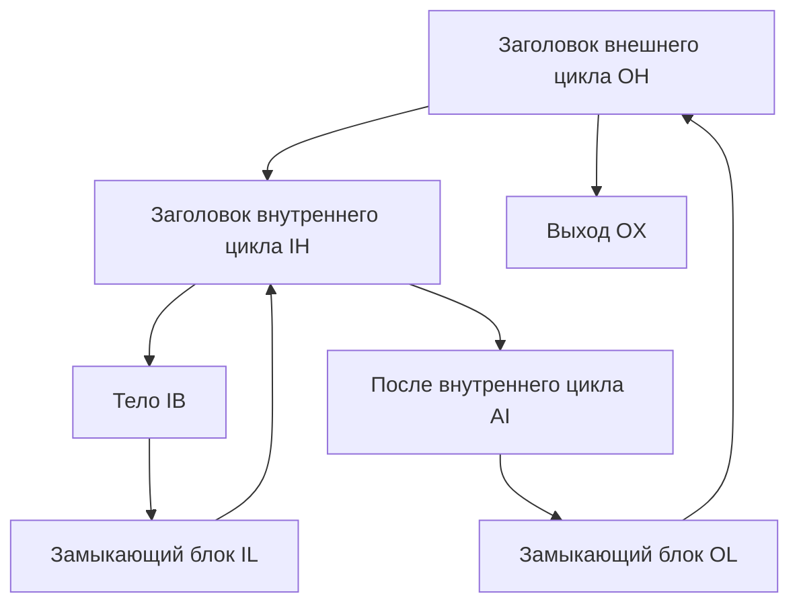

# Занятие 14. Идея алгоритма Хавлака и дерево циклов

> Как внутренние циклические области сворачиваются раньше внешних и зачем нужен представитель Union–Find

[← Карта курса](../course-map.md) · [Предыдущее занятие](13-loop-concepts.md) · [Следующее занятие](15-induction-variables.md)

## Результат занятия

Ты объясняешь назначение алгоритма Хавлака, читаешь состояние учебной трассы свёртки вложенных циклов и строишь дерево вложенности для небольшого сводимого CFG. Полная самостоятельная реализация конкретного варианта алгоритма в обязательный результат этого занятия не входит.

**Перед началом:** [DFS и SCC](../prerequisites.md#dfs-и-scc), доминирование и строение естественного цикла.

## Зачем это вообще нужно

Поиск естественного цикла по одному обратному ребру хорошо работает для отдельного сводимого цикла, но не создаёт общую иерархию вложенности и не описывает несводимые области. Алгоритмы семейства Хавлака рассматривают кандидатов снизу вверх, сворачивают уже найденные области и используют их представителей как единые объекты.

Важно различать два результата:

- **этот урок** даёт проверяемую причинную модель свёртки;
- **лабораторная реализация** должна закрепить конкретный вариант алгоритма, структуры данных и все граничные случаи тестами.

## Термины до заданий

| Термин | Простое объяснение | Точная опора |
|---|---|---|
| **Номер DFS-обхода** (*DFS number*) | номер первого посещения вершины поиском в глубину | вместе с родителем задаёт дерево DFS и порядок обработки кандидатов |
| **Кандидат заголовка** | вершина, относительно которой проверяется циклическая область | обрабатывается после потенциальных внутренних заголовков |
| **Рабочее множество** (*worklist*) | представители вершин и уже свёрнутых областей, которые ещё нужно исследовать | изменяется после каждого извлечения и добавления предшественников |
| **Структура непересекающихся множеств** (*Union–Find*) | хранит текущего представителя свёрнутой области | `find(v)` возвращает представителя, `union` объединяет область с заголовком |
| **Дерево вложенности циклов** (*loop nesting tree*) | показывает отношения «внутренний цикл находится во внешнем» | после свёртки внутренний цикл становится дочерним узлом внешнего |

Сначала прочитай объяснения. Затем закрой таблицу и перескажи термины своими словами. Это проверка понимания, а не попытка угадать определение.

## Ключевая схема



Полный список рёбер учебного графа:

```text
OH → IH, OX
IH → IB, AI
IB → IL
IL → IH
AI → OL
OL → OH
```

Порядок DFS фиксирован условием: `OH=0, IH=1, IB=2, IL=3, AI=4, OL=5, OX=6`. Другой допустимый порядок DFS может изменить промежуточные номера, поэтому в реализации он должен быть детерминирован порядком обхода рёбер.

## Пошаговый разбор

### Внутренняя область

| Шаг | Рабочее множество | Извлечённый представитель | Наблюдение | Новое состояние |
|---:|---|---|---|---|
| 0 | `{IL}` | — | `IL→IH` замыкает внутренний цикл | кандидат `IH` |
| 1 | `∅` | `IL` | предшественник `IB` ещё не свёрнут | добавить `IB` |
| 2 | `∅` | `IB` | дальнейший обратный путь достигает границы `IH` | область `{IH,IB,IL}` |
| 3 | — | — | `union(IB,IH)`, `union(IL,IH)` | `find(IB)=find(IL)=IH` |

### Внешняя область

После свёртки внутренний цикл рассматривается через одного представителя `IH`.

| Шаг | Рабочее множество | Извлечённый представитель | Наблюдение | Новое состояние |
|---:|---|---|---|---|
| 0 | `{OL}` | — | `OL→OH` замыкает внешний цикл | кандидат `OH` |
| 1 | `∅` | `OL` | предшественник `AI` принадлежит внешней области | добавить `AI` |
| 2 | `∅` | `AI` | один из предшественников ведёт к `find(IH)=IH` | добавить представителя `IH` |
| 3 | `∅` | `IH` | внутренняя область уже свёрнута и включается целиком | связать `IH` как дочерний цикл `OH` |
| 4 | — | — | объединить представителей внешней области с `OH` | корень дерева — `OH`, ребёнок — `IH` |

Эта трасса объясняет две ключевые причины алгоритма: внутренние области нужно обработать раньше внешних, а после объединения нужно обращаться к `find(node)`, а не к старой вершине как к самостоятельной области.

## Формальное правило

Учебная модель свёртки:

1. выполнить детерминированный DFS и сохранить номер и родителя каждой вершины;
2. выделить кандидатов заголовков и обрабатывать их в обратном порядке DFS;
3. заполнить рабочее множество представителями источников циклических входов к кандидату;
4. извлекать только текущие представители `find(node)`;
5. расширять область через предшественников, не переходя за доказанную границу заголовка;
6. проверить, существует ли единый доминирующий заголовок; иначе отметить область как несводимую;
7. объединить найденную область с заголовком;
8. добавить уже свёрнутые внутренние циклы как дочерние узлы дерева вложенности.

Это **не полный псевдокод Хавлака**. Для реализации нужно отдельно зафиксировать вариант алгоритма, классификацию рёбер, обработку нескольких замыкающих блоков, несводимых областей, самопетель и уже объединённых представителей.

## Типичные ошибки

- Называть эту учебную схему полной реализацией алгоритма.
- Считать любое обратное ребро DFS обратным ребром естественного цикла без проверки доминирования.
- Продолжать работу со старой вершиной вместо `find(node)` после объединения.
- Обрабатывать внешний цикл раньше внутреннего.
- Показывать только финальное множество без состояний рабочей очереди и представителей.

## Задача A — по образцу

Воспроизведи таблицу внутреннего цикла: начальное рабочее множество, два извлечения и два объединения. После каждого шага выпиши `find(IB)` и `find(IL)`.

<details>
<summary>Проверка задачи A</summary>

До объединения `find(IB)=IB`, `find(IL)=IL`. Рабочее множество начинается с `{IL}`, затем при обработке `IL` добавляется `IB`. После `union(IB,IH)` и `union(IL,IH)` оба представителя равны `IH`.

</details>

## Самостоятельная задача

Добавь внешнее ребро `X→IB`, где `X` достижим из входа в обход `IH`. Отдельно ответь:

1. какие две различные вершины становятся входными для циклической области;
2. какой путь опровергает `IH dom IB`;
3. почему учебная модель должна отметить область несводимой, а не объединить её как обычный естественный цикл.

<details>
<summary>Проверка задачи B</summary>

В область можно войти через `IH` по обычному пути и через `IB` по ребру `X→IB`. Путь из входа через `X→IB` обходит `IH`, поэтому `IH` не доминирует всю область. Единого заголовка естественного цикла нет; область должна быть отмечена как несводимая.

</details>

## Проверь себя

**Зачем нужен обратный порядок DFS?**  
**Почему после объединения нужен представитель?**  
**Что ещё требуется, чтобы превратить учебную модель в реализацию?**

<details>
<summary>Короткие ответы</summary>

Внутренние кандидаты должны быть свёрнуты раньше внешних. Представитель позволяет рассматривать найденную область как один объект. Для реализации нужно закрепить точный вариант алгоритма, структуры данных, все переходы состояния и тесты для сводимых и несводимых случаев.

</details>

## Как это устроено в промышленном компиляторе

Промышленный анализ циклов имеет точный машинно проверяемый контракт. Он не ограничивается красивой схемой: реализация должна возвращать стабильную иерархию, корректно классифицировать несводимые области и проходить набор графов с вложенностью, несколькими входами, самопетлями и несколькими замыкающими блоками.
