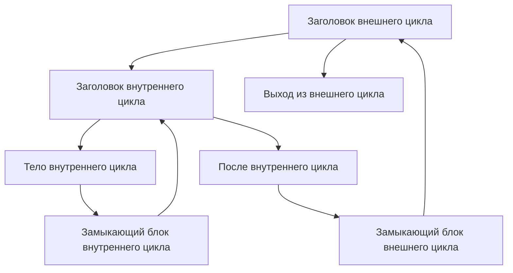

# Занятие 14. Хавлак и дерево циклов

> Полный пошаговый разбор на небольшом графе вместо списка загадочных названий

[← Карта курса](../course-map.md) · [Предыдущее занятие](13-loop-concepts.md) · [Следующее занятие](15-induction-variables.md)

## Результат занятия

Ты объясняешь, почему анализа естественных циклов недостаточно, читаешь состояния DFS и SCC и вручную выполняешь учебную трассу Хавлака на вложенном сводимом CFG.

**Перед началом:** [DFS и SCC](../prerequisites.md#dfs-и-scc), доминирование и строение естественного цикла.

## Зачем это вообще нужно

Одно обратное ребро удобно описывает сводимый естественный цикл, но реальный CFG может содержать вложенные циклы и области с несколькими входами. Нужен анализ, который строит иерархию и явно отмечает несводимые области.

## Термины до заданий

| Термин | Простое объяснение | Точная опора |
|---|---|---|
| **Номер DFS-обхода** (*DFS number*) | номер первого посещения вершины поиском в глубину | задаёт родителя и обратный порядок обработки кандидатов |
| **Обратный предшественник** (*back predecessor*) | источник ребра к предку в DFS | начальный участник рабочего множества возможного заголовка цикла |
| **Необратный предшественник** (*non-back predecessor*) | остальной предшественник рассматриваемой области | через такие рёбра рабочее множество расширяется к уже свёрнутым областям |
| **Union–Find — непересекающиеся множества** (*Union-Find*) | хранит представителя свёрнутой области | `find(v)` возвращает представителя, а `union` объединяет области |
| **Дерево вложенности циклов** (*loop nesting tree*) | показывает родительские отношения найденных циклов | внутренний цикл становится дочерним узлом внешнего |

Сначала прочитай объяснения. Затем закрой таблицу и перескажи термины своими словами. Это проверка понимания, а не попытка угадать определение.

## Ключевая схема

## Пошаговый разбор

Предположим следующий порядок DFS: `OH=0, IH=1, IB=2, IL=3, AI=4, OL=5, OX=6`.

| Фаза | Заголовок | Рабочее множество и представители | Результат |
|---|---|---|---|
| классификация | IH | обратный предшественник `IL` | кандидат внутреннего цикла |
| обратный порядок | IH | `{find(IL)=IL}` | обработать внутренний цикл раньше внешнего |
| расширение | IH | IL → IB; IH служит границей | регион `{IH,IB,IL}` |
| объединение | IH | `union(IB,IH)`, `union(IL,IH)` | представителем внутренней области становится IH |
| внешний заголовок | OH | обратный предшественник `OL` | начать построение внешней области |
| расширение | OH | `OL→AI→find(IH)` | вложенная область включена через одного представителя |
| объединение и дерево | OH | объединить найденные вершины с OH | внутренний цикл становится дочерним узлом внешнего |

Несводимость фиксируется, когда область получает внешний вход, который обходит единый доминирующий заголовок. Это не просто «стрелка сбоку»: вход проверяется относительно представителей свёрнутых областей, DFS и доминирования.

## Формальное правило

Учебная схема:

1. выполнить DFS и сохранить номер и родителя каждой вершины;
2. классифицировать предшественников кандидатов;
3. рассматривать заголовки в обратном порядке DFS;
4. заполнить рабочее множество представителями обратных предшественников;
5. расширять рабочее множество через необратных предшественников и представителей уже свёрнутых областей;
6. классифицировать область как сводимую или несводимую;
7. объединить область с заголовком и построить родительские связи дерева циклов.

Это схема, фиксирующая основные инварианты алгоритма, а не обещание побитовой совместимости с конкретной промышленной реализацией.

## Типичные ошибки

- Считать любое обратное ребро DFS обратным ребром естественного цикла без проверки доминирования.
- Продолжать обход от старой вершины вместо её представителя `find(node)` после объединения.
- Обрабатывать внешний цикл раньше внутреннего.
- Считать перечисление фаз полноценной трассой без состояний рабочего множества и представителей.

## Задача A — по образцу

Воспроизведи таблицу внутреннего цикла: номера DFS, обратного предшественника, рабочее множество, расширение и два объединения.

Проверка задачи A

Для IH рабочее множество начинается с IL; через предшественника IL добавляется IB; IH не разворачивается наружу; после объединения `find(IB)=find(IL)=IH`.

## Самостоятельная задача

Добавь внешнее ребро `X→IB`, где `X` достижим в обход IH. Объясни, какое свойство единого заголовка нарушено и почему модели естественного цикла недостаточно.

Проверка задачи B

В циклическую область `{IH,IB,IL}` теперь можно войти через IB, минуя IH. IH не доминирует всю область; регион имеет несколько входов и классифицируется как несводимый.

## Проверь себя

**Зачем нужен обратный порядок DFS?**  
**Почему после объединения нужен представитель?**  
**Как распознать нарушение единого входа?**

Короткие ответы

Чтобы сворачивать внутренние регионы до внешних. Представитель позволяет рассматривать уже найденную область как один объект. Внешний путь входит в циклическую область, минуя предполагаемый заголовок.

## Как это устроено в промышленном компиляторе

Для реализации нужно выбрать конкретный вариант алгоритма Хавлака и зафиксировать структуры данных, классификацию рёбер и обработку несводимых случаев тестами. Здесь цель — прозрачное изменение состояния на каждом шаге.
