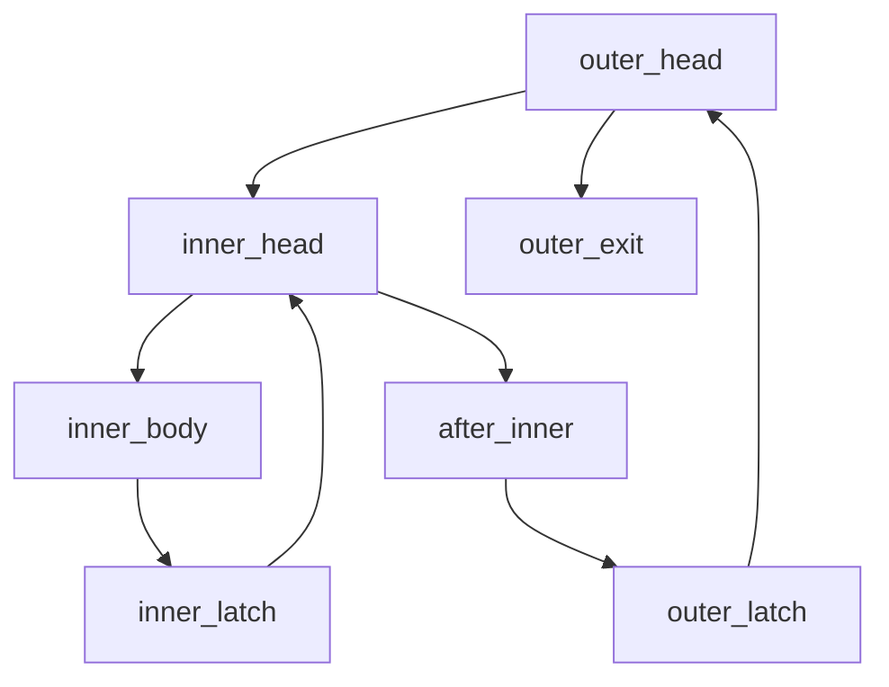

# Занятие 14. Хавлак и дерево циклов

> Полная маленькая трасса фаз вместо списка загадочных названий

[← Карта курса](../course-map.md) · [Предыдущее занятие](13-loop-concepts.md) · [Следующее занятие](15-induction-variables.md)

## Результат занятия

Ты объясняешь, зачем natural-loop анализа недостаточно, читаешь DFS/SCC состояния и вручную трассируешь учебную схему Хавлака на вложенном reducible CFG.

**Перед началом:** [DFS и SCC](../prerequisites.md#dfs-и-scc), dominance и anatomy natural loop.

## Зачем это вообще нужно

Один back edge удобно описывает reducible natural loop, но реальный CFG может содержать вложенные регионы и циклические области с несколькими входами. Нужен анализ, который строит иерархию и явно отмечает irreducible regions.

## Термины до заданий

| Термин | Простое объяснение | Точная опора |
|---|---|---|
| **DFS number — номер обхода** | порядок первого посещения вершины DFS | задаёт parent relation и обратный порядок обработки кандидатов |
| **back predecessor** | источник ребра к DFS-предку-кандидату | начальное содержимое pool возможного loop header |
| **non-back predecessor** | остальные predecessors региона | через них pool расширяется к представителям уже свёрнутых областей |
| **Union-Find — непересекающиеся множества** | хранит представитель свёрнутого региона | `find(v)` возвращает текущего представителя, `union` объединяет регионы |
| **loop nesting tree — дерево вложенности** | родительские отношения найденных loop regions | внутренний loop становится ребёнком внешнего |

## Первая модель

## Разобранный пример: состояние за состоянием

Предположим DFS-порядок: `OH=0, IH=1, IB=2, IL=3, AI=4, OL=5, OX=6`.

| Фаза | Header | pool / представители | Результат |
|---|---|---|---|
| классификация | IH | back predecessor IL | кандидат внутреннего цикла |
| reverse order | IH | `{find(IL)=IL}` | начать раньше OH |
| расширение | IH | IL → IB; IH служит границей | регион `{IH,IB,IL}` |
| union | IH | `union(IB,IH)`, `union(IL,IH)` | представитель внутреннего региона IH |
| внешний header | OH | back predecessor OL | начать внешний регион |
| расширение | OH | OL→AI→find(IH) | вложенный регион включён одним представителем |
| union/tree | OH | объединить найденных участников с OH | inner-loop child of outer-loop |

Irreducibility фиксируется, когда region получает внешний вход, не подчиняющийся единому header/dominance условию. Это не просто «стрелка нарисована сбоку» — вход проверяется относительно представителей и DFS/dominance модели.

## Формальное правило

Учебная схема:

1. выполнить DFS и сохранить number/parent;
2. классифицировать predecessors кандидатов;
3. рассматривать headers в обратном DFS-порядке;
4. заполнить pool представителями back predecessors;
5. расширять pool через non-back predecessors и уже свёрнутые representatives;
6. классифицировать reducible/irreducible region;
7. объединить регион с header и построить parent-child связи loop tree.

Это инвариантная схема чтения алгоритма, а не обещание побитовой совместимости с конкретной промышленной реализацией.

## Типичные ошибки

- Называть любое DFS-back edge natural-loop back edge без dominance.
- Продолжать обход по старому node вместо `find(node)` после union.
- Обрабатывать внешний цикл раньше внутреннего.
- Считать перечисление фаз полноценной трассой без состояний pool и representatives.

## Задача A — по образцу

Воспроизведи таблицу внутреннего цикла: DFS numbers, back predecessor, pool, расширение и два union.

Проверка задачи A

Для IH pool начинается с IL; через predecessor IL добавляется IB; IH не разворачивается наружу; после объединения `find(IB)=find(IL)=IH`.

## Задача B — перенос на новый пример

Добавь внешнее ребро `X→IB`, где `X` достижим в обход IH. Объясни, какое свойство единого header нарушено и почему natural-loop модель недостаточна.

Проверка задачи B

В циклическую область `{IH,IB,IL}` теперь можно войти через IB, минуя IH. IH не доминирует всю область; регион имеет несколько входов и классифицируется как irreducible.

## Проверка на выходе

**Зачем reverse DFS order?**  
**Почему после union нужен representative?**  
**Как распознать нарушение единого входа?**

Короткие ответы

Чтобы сворачивать внутренние регионы до внешних. Representative позволяет рассматривать уже найденный region одним объектом. Внешний путь входит в циклическую область, минуя предполагаемый header.

## Профессиональная граница

Для реализации нужно выбрать точную публикацию/вариант Хавлака и зафиксировать структуры данных, edge classification и handling irreducible cases тестами. Здесь цель — прозрачная трасса владельцев состояния.
