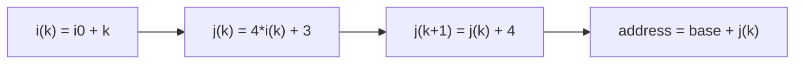

# Занятие 15. Индуктивные переменные и strength reduction

> Как распознать закономерно изменяющиеся значения внутри цикла

[← Карта курса](../course-map.md) · [Предыдущее занятие](../modules/14-havlak-and-loop-tree.md) · [Следующее занятие](../modules/16-licm.md)

## Результат занятия

| **К концу обязательной части.** Ты отличаешь basic и derived induction variables, выводишь их closed form и выполняешь простую strength reduction без изменения семантики. |
|----------------------------------------------------------------------------------------------------------------------------------------------------------------------------|

| **Параметр**          | **Значение**                                                         |
|-----------------------|----------------------------------------------------------------------|
| Сложность             | Средний                                                              |
| Обязательная нагрузка | 75–100 мин                                                           |
| Перед началом         | SSA-цикл, φ в header, loop structure.                                |
| Что подготовить      | классификацию IV, таблицу closed form и SSA после strength reduction |

| **Разрешённый режим.** Проверяй значения по номеру итерации. |
|--------------------------------------------------------------|

| **В этом занятии не требуется.** Не нужны Scalar Evolution и полиномиальные recurrence. |
|----------------------------------------------------------------------------------|

## Обязательный маршрут

| **Этап**           | **Время** | **Результат**                                           |
|--------------------|-----------|---------------------------------------------------------|
| Повторение         | 5–10 мин  | Не больше 3 коротких вопросов                           |
| Простое объяснение | 10–15 мин | Пересказать тему своими словами                         |
| Разобранный пример | 15–20 мин | Воспроизвести ключевые состояния                        |
| Задача A           | 20–25 мин | Обязательный минимум по образцу                         |
| Задача B           | 20–35 мин | Стандарт; можно завершить во второй короткой сессии     |
| Устный итог        | 5–10 мин  | 3 вопроса и самооценка светофором                       |
| Углубление         | 0–40 мин  | Задача C и профессиональные детали — только при ресурсе |

| **Когда запрашивать помощь.** После 10–15 минут честной попытки можно сразу зафиксировать точное место остановки и запросить разбор. Не нужно сначала мучительно завершать A и B. |
|----------------------------------------------------------------------------------------------------------------------------------------------------------|

## Короткое повторение

<table>
<colgroup>
<col style="width: 33%" />
<col style="width: 33%" />
<col style="width: 33%" />
</colgroup>
<thead>
<tr class="header">
<th><strong>Когда</strong></th>
<th><strong>Объём</strong></th>
<th><strong>Что сделать</strong></th>
</tr>
</thead>
<tbody>
<tr class="odd">
<td>Вчера</td>
<td>1–2 формулировки</td>
<td>• Хавлак использует DFS-нумерацию, классификацию predecessors и свёртку регионов. 
• Внутренние циклы обрабатываются раньше внешних.</td>
</tr>
<tr class="even">
<td>3 дня назад</td>
<td>1 формулировка</td>
<td>Каждый этап использует только проверенный результат предыдущего.</td>
</tr>
<tr class="odd">
<td>7 дней назад</td>
<td>1 мини-задача</td>
<td>Составь LVN key для `add i32 a,b` и `sub i32 a,b`.</td>
</tr>
</tbody>
</table>

| **Ограничение.** На повторение не трать больше 10 минут. Не вспомнил — сделай попытку, посмотри ответ и верни карточку на следующее повторение. |
|-----------------------------------------------------------------------------------------------------------------------------------|

## Сначала простыми словами

Индуктивная переменная меняется предсказуемо от итерации к итерации. Базовая обычно имеет вид i_next = i + c.

Производная выражается через базовую, например j = 4\*i + 3. Вместо умножения каждую итерацию можно поддерживать j прибавлением постоянного шага.

### Пять терминов занятия

| **Термин**         | **Моя формулировка одним предложением** |
|--------------------|-----------------------------------------|
| basic IV           |                                         |
| derived IV         |                                         |
| step               |                                         |
| strength reduction |                                         |
| affine expression  |                                         |

## Минимум для запоминания

- Basic IV меняется на постоянный шаг каждый проход.

- Derived IV — аффинная функция basic IV.

- Strength reduction заменяет дорогое выражение обновлением на постоянный шаг.

| **Не учи дословно без смысла.** Сначала объясни формулировку своими словами на маленьком примере. Точная версия нужна после понимания. |
|----------------------------------------------------------------------------------------------------------------------------------------|

## Визуальная модель

*Рабочее представление темы занятия*

## Разобранный пример — проход по шагам

<table>
<colgroup>
<col style="width: 100%" />
</colgroup>
<thead>
<tr class="header">
<th>pre: 
i0 = 0 
head: 
i1 = phi [pre:i0, latch:i2] 
j1 = 4 * i1 + 3 
use a[j1] 
latch: 
i2 = i1 + 1 
goto head</th>
</tr>
</thead>
<tbody>
</tbody>
</table>

i — basic IV с init 0 и step 1. j — derived IV, step 4. Strength reduction создаёт j0=3 в preheader, φ для j в header и j2=j1+4 в latch.

| **Проверка понимания.** Закрой пример и объясни не итог, а почему выполняется каждый следующий шаг. Если не можешь — зафиксируй именно этот переход и запроси разбор. |
|------------------------------------------------------------------------------------------------------------------------------------------------------|

## Обязательная практика

### Задача A — обязательная по образцу: Классификация

| **Параметр**     | **Значение**                      |
|------------------|-----------------------------------|
| Статус           | Обязательно в этом занятии               |
| Ориентир времени | 30 мин                            |
| Что сдать        | init; step invariant; зависимости |

Для переменных i=i+1, j=2\*i+5, k=k+j, m=load p, n=n+c классифицируй basic/derived/not proven IV и объясни условия.

| **Подсказка 1.** Сначала выпиши recurrence и первые значения, только затем closed form. |
|-----------------------------------------------------------------------------------------|

## Стандартная практика

### Задача B — стандартная для закрепления: Closed form

| **Параметр**     | **Значение**                                                        |
|------------------|---------------------------------------------------------------------|
| Статус           | Нужно выполнить до следующей зависимой темы; можно во второй сессии |
| Ориентир времени | 25 мин                                                              |
| Что сдать        | таблица k=0..3; формула; согласованность                            |

Выведи значения первых четырёх итераций и формулы для i и j из примера. Сверь recurrence с формулой.

| **Подсказка 1.** Сначала выпиши recurrence и первые значения, только затем closed form. |
|-----------------------------------------------------------------------------------------|

| **Подсказка 2.** Для derived IV обновление равно коэффициенту при basic IV, умноженному на её шаг. |
|----------------------------------------------------------------------------------------------------|

## Три вопроса на выходе

| **Вопрос**                              | **Результат retrieval**         |
|-----------------------------------------|---------------------------------|
| Что делает IV базовой?                  | □ ≤15 с □ с паузой □ не ответил |
| Как найти step производной IV?          | □ ≤15 с □ с паузой □ не ответил |
| Зачем preheader при strength reduction? | □ ≤15 с □ с паузой □ не ответил |

## Светофор понимания

| **Состояние** | **Что это означает**                                    | **Следующее действие**                                                  |
|---------------|---------------------------------------------------------|-------------------------------------------------------------------------|
| Зелёный       | Могу объяснить и решить A/B с незначительной проверкой. | Перейти дальше; C только по желанию.                                    |
| Жёлтый        | Понимаю идею, но теряю один шаг или термин.             | Разобрать уменьшенный пример с преподавателем или свериться с эталоном; B можно закончить во второй сессии. |
| Красный       | Не могу объяснить причинную модель или начать A.        | Не переходить дальше; зафиксировать попытку и запросить разбор после 10–15 минут.                   |

| **Минимум занятия.** Занятие засчитывается, если понятна причинная модель, воспроизведён пример и выполнена задача A. Задача B должна быть закрыта до следующей темы, которая на неё опирается. |
|------------------------------------------------------------------------------------------------------------------------------------------------------------------------------------------|

## Справочник и углубление — читать по необходимости

| **Это необязательная часть первого прохода.** Открывай её, если простого объяснения недостаточно, при проверке решения или когда остались силы. Профессиональные оговорки не являются обязательным минимумом занятия. |
|--------------------------------------------------------------------------------------------------------------------------------------------------------------------------------------------------------------|

### Подробная теория

#### Базовая индуктивная переменная

В SSA типичный basic IV имеет форму i = phi(init, i_next) и i_next = i + step, где step инвариантен относительно цикла. На k-й итерации значение выражается как init + k\*step при подходящей нумерации итераций.

Факт «переменная меняется каждый раз» недостаточен. Изменение должно иметь регулярную аффинную recurrence.

#### Производная IV

Если j = a\*i + b, где a и b loop-invariant, то j — derived induction variable. Она изменяется на a\*step за итерацию. Адрес base + 4\*i — типичный пример.

В более общем анализе рассматриваются семейства recurrence и выражения SCEV, но для зачёта достаточно базовых и линейных производных IV.

#### Strength reduction

Дорогое повторное вычисление j = 4\*i + 3 можно заменить собственной recurrence: в preheader вычислить j0 = 4\*init + 3, а в latch обновлять j_next = j + 4\*step. Это заменяет умножение на сложение.

Преобразование требует правильного init и порядка использования. При overflow semantics нужно сохранить точное поведение; не всякая алгебра допустима без флагов.

#### Elimination

После strength reduction исходная IV может стать ненужной, если она не участвует в условии выхода или других uses. Тогда DCE удалит её. Но если exit test использует i, удалить её нельзя без переписывания условия.

## Алгоритм на одной странице

| **Поле**          | **Содержание**                                                    |
|-------------------|-------------------------------------------------------------------|
| Название          | Strength reduction derived IV                                     |
| Вход              | Basic IV i и affine expression j=a\*i+b.                          |
| Результат         | Начальное j0 и recurrent update j_next=j+ a\*step.                |
| Инвариант         | На каждой итерации recurrent j равен исходному affine expression. |
| Условие остановки | Все uses заменены и equivalence проверена на base/inductive step. |
| Сложность         | Линейна по числу переписываемых uses.                             |

1.  Доказать i_next=i+step и invariance a,b,step.

2.  Вычислить j0=a\*i0+b в preheader.

3.  Вставить φ для j в header.

4.  Обновлять j на a\*step в latch.

5.  Заменить uses a\*i+b на текущий j.

6.  Проверить возможность удаления i.

### Допущения учебного IR на сегодня

- У каждого базового блока ровно один терминатор; терминатор является последней инструкцией блока.

- Деление может завершиться наблюдаемой ошибкой при нуле. Его нельзя безусловно удалять или выносить, пока не доказаны безопасность и допустимость спекуляции.

- print, store, volatile/atomic операции и неизвестный вызов имеют наблюдаемый эффект. Вызов считается чистым только при явной пометке pure/readonly в условии.

### Дополнительная задача

### Задача C — необязательный перенос: Strength reduction в SSA

| **Параметр**     | **Значение**                               |
|------------------|--------------------------------------------|
| Статус           | Только если осталось внимание              |
| Ориентир времени | 40 мин                                     |
| Что сдать        | правильный j_init; j_step=4; анализ uses i |

Перепиши пример с отдельной φ для j, инициализацией в preheader и обновлением в latch. Затем проверь, можно ли удалить i.

| **Подсказка 1.** Сначала выпиши recurrence и первые значения, только затем closed form. |
|-----------------------------------------------------------------------------------------|

| **Подсказка 2.** Для derived IV обновление равно коэффициенту при basic IV, умноженному на её шаг. |
|----------------------------------------------------------------------------------------------------|

### Полная устная проверка

| **Вопрос**                               | **Результат retrieval**         |
|------------------------------------------|---------------------------------|
| Что делает IV базовой?                   | □ ≤15 с □ с паузой □ не ответил |
| Как найти step производной IV?           | □ ≤15 с □ с паузой □ не ответил |
| Зачем preheader при strength reduction?  | □ ≤15 с □ с паузой □ не ответил |
| Когда исходную IV можно удалить?         | □ ≤15 с □ с паузой □ не ответил |
| Какие семантические риски даёт overflow? | □ ≤15 с □ с паузой □ не ответил |

### Журнал ошибок

| **Ошибка / сомнение** | **Первый нарушенный инвариант** | **Исправленное правило** | **Новый пример / итерация** |
|-----------------------|---------------------------------|--------------------------|-------------------------|
|                       |                                 |                          |                         |
|                       |                                 |                          |                         |
|                       |                                 |                          |                         |
|                       |                                 |                          |                         |
|                       |                                 |                          |                         |

### План повторения

| **Когда**    | **Что повторить**                                    |
|--------------|------------------------------------------------------|
| Завтра       | 3 пункта минимального блока и задача A.              |
| Через 3 дня  | Один алгоритм или стандартная задача B.              |
| Через 7 дней | Для \`i0=2, step=3, j=4i+1\` дай \`j0\` и increment. |

### Как получить обратную связь

**Сообщение для начала ежедневной сессии**

<table>
<colgroup>
<col style="width: 100%" />
</colgroup>
<thead>
<tr class="header">
<th>Я работаю по документу «Индуктивные переменные и strength reduction» (версия 3.0). Я могу обратиться уже после 10–15 минут честной попытки. 
 
Моя текущая зона: зелёная / жёлтая / красная. 
Моя попытка и точное место остановки: ... 
 
Работай так: 
1. Сначала проверь мою причинную модель простым вопросом, не выдавая решение. 
2. Если модель неверна, объясни тему на одном меньшем примере и попроси меня пересказать. 
3. Найди только первую существенную ошибку: место, нарушенный инвариант и минимальный контрпример. 
4. Дай мне исправить её самостоятельно. 
5. После исправления дай одну короткую задачу на перенос. 
6. В конце назови: что я уже понимаю, что пока понимаю с подсказкой и что повторить на следующей сессии.</th>
</tr>
</thead>
<tbody>
</tbody>
</table>

## Точечное чтение

- Cooper & Torczon — induction variables and strength reduction; LLVM Passes — loop-reduce.

| **Стоп чтения.** Прекрати чтение, когда можешь воспроизвести определение/алгоритм и решить задачу B. Дополнительные страницы не заменяют практику. |
|----------------------------------------------------------------------------------------------------------------------------------------------------|
