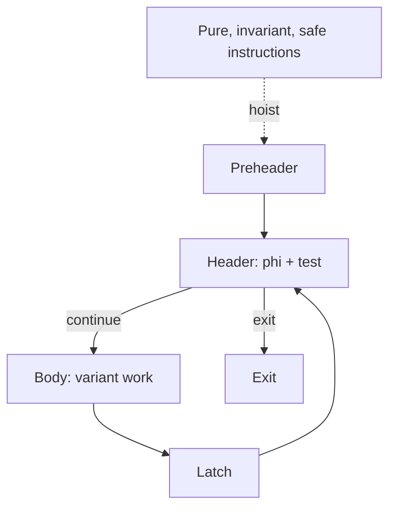

# Занятие 16. LICM

> Legality: неизменность операндов, безопасность исполнения и доминирование использований

[← Карта курса](../course-map.md) · [Предыдущее занятие](../modules/15-induction-variables.md) · [Следующее занятие](../modules/17-loop-transformations.md)

## Результат занятия

| **К концу обязательной части.** Ты отличаешь loop-invariant выражение от безопасно выносимой инструкции и размещаешь её в preheader с проверкой dominance и speculatability. |
|------------------------------------------------------------------------------------------------------------------------------------------------------------------------------|

| **Параметр**          | **Значение**                                                                    |
|-----------------------|---------------------------------------------------------------------------------|
| Сложность             | Сложный                                                                         |
| Обязательная нагрузка | 90–120 мин или 2 сессии                                                         |
| Перед началом         | Loop anatomy, dominance, side effects, SSA.                                     |
| Что подготовить      | матрицу кандидатов, CFG с созданным preheader и контрпример небезопасного hoist |

| **Разрешённый режим.** Инвариантность и безопасность — два разных вопроса. |
|----------------------------------------------------------------------------|

| **В этом занятии не требуется.** Не нужно полностью осваивать alias analysis; используй заданный контракт эффектов. |
|--------------------------------------------------------------------------------------------------------------|

## Обязательный маршрут

| **Этап**           | **Время** | **Результат**                                           |
|--------------------|-----------|---------------------------------------------------------|
| Повторение         | 5–10 мин  | Не больше 3 коротких вопросов                           |
| Простое объяснение | 10–15 мин | Пересказать тему своими словами                         |
| Разобранный пример | 15–20 мин | Воспроизвести ключевые состояния                        |
| Задача A           | 20–25 мин | Обязательный минимум по образцу                         |
| Задача B           | 20–35 мин | Стандарт; можно завершить во второй короткой сессии     |
| Устный итог        | 5–10 мин  | 3 вопроса и самооценка светофором                       |
| Углубление         | 0–40 мин  | Задача C и профессиональные детали — только при ресурсе |

| **Когда запрашивать помощь.** После 10–15 минут честной попытки можно сразу зафиксировать точное место остановки и запросить разбор. Не нужно сначала мучительно завершать A и B. |
|----------------------------------------------------------------------------------------------------------------------------------------------------------|

## Короткое повторение

<table>
<colgroup>
<col style="width: 33%" />
<col style="width: 33%" />
<col style="width: 33%" />
</colgroup>
<thead>
<tr class="header">
<th><strong>Когда</strong></th>
<th><strong>Объём</strong></th>
<th><strong>Что сделать</strong></th>
</tr>
</thead>
<tbody>
<tr class="odd">
<td>Вчера</td>
<td>1–2 формулировки</td>
<td>• Basic IV меняется на постоянный шаг каждый проход. 
• Derived IV — аффинная функция basic IV.</td>
</tr>
<tr class="even">
<td>3 дня назад</td>
<td>1 формулировка</td>
<td>Back edge n→h образует natural loop, если h доминирует n.</td>
</tr>
<tr class="odd">
<td>7 дней назад</td>
<td>1 мини-задача</td>
<td>Объедини lattice states двух входов φ: 3/3, 3/4, unknown/3.</td>
</tr>
</tbody>
</table>

| **Ограничение.** На повторение не трать больше 10 минут. Не вспомнил — сделай попытку, посмотри ответ и верни карточку на следующее повторение. |
|-----------------------------------------------------------------------------------------------------------------------------------|

## Сначала простыми словами

Если выражение даёт одно и то же значение на всех итерациях, оно инвариантно. Но этого недостаточно для переноса.

Нужно ещё доказать, что выполнить операцию раньше безопасно и что новое определение будет доступно всем использованиям. Деление, load и потенциальное исключение требуют особой осторожности.

### Пять терминов занятия

| **Термин**        | **Моя формулировка одним предложением** |
|-------------------|-----------------------------------------|
| loop invariant    |                                         |
| hoist             |                                         |
| speculation       |                                         |
| aliasing          |                                         |
| dominance of uses |                                         |

## Минимум для запоминания

- Инвариантность значения не доказывает безопасность hoist.

- Нужно проверить эффекты/исключения и dominance uses/exits.

- Preheader — место, выполняемое один раз перед входом в цикл.

| **Не учи дословно без смысла.** Сначала объясни формулировку своими словами на маленьком примере. Точная версия нужна после понимания. |
|----------------------------------------------------------------------------------------------------------------------------------------|

## Визуальная модель

*Рабочее представление темы занятия*

## Разобранный пример — проход по шагам

<table>
<colgroup>
<col style="width: 100%" />
</colgroup>
<thead>
<tr class="header">
<th>pre -&gt; head 
head: 
if i &gt;= n goto exit 
body: 
t1 = a + b ; a,b outside loop 
t2 = t1 * 4 
x = arr[i] + t2 
latch: 
i = i + 1 
goto head</th>
</tr>
</thead>
<tbody>
</tbody>
</table>

t1 и t2 invariant и чистые, их можно вынести в preheader в этом порядке. arr\[i\] не invariant из-за i; даже load arr_const потребовал бы alias/effect проверки.

1. Операнды определены вне цикла или уже признаны инвариантными?

2. Операция чистая или её эффекты доказанно безопасны?

3. Может ли раннее выполнение породить исключение/ошибку на пути, где операция раньше не выполнялась?

4. После hoist определение доминирует все uses и нужные exits?

5. Только четыре положительных ответа разрешают перенос в preheader.

| **Проверка понимания.** Закрой пример и объясни не итог, а почему выполняется каждый следующий шаг. Если не можешь — зафиксируй именно этот переход и запроси разбор. |
|------------------------------------------------------------------------------------------------------------------------------------------------------|

## Обязательная практика

### Задача A — обязательная по образцу: Кандидаты и причины

| **Параметр**     | **Значение**                                                  |
|------------------|---------------------------------------------------------------|
| Статус           | Обязательно в этом занятии                                           |
| Ориентир времени | 35 мин                                                        |
| Что сдать        | четыре отдельных свойства; не смешана инвариантность и safety |

Для операций в примере отметь: invariant? pure? speculatable? safe to hoist? Заполни матрицу с объяснениями.

| **Подсказка 1.** Разделяй две проверки: invariant и safe to execute earlier. |
|------------------------------------------------------------------------------|

## Стандартная практика

### Задача B — стандартная для закрепления: Создание preheader

| **Параметр**     | **Значение**                                                         |
|------------------|----------------------------------------------------------------------|
| Статус           | Нужно выполнить до следующей зависимой темы; можно во второй сессии  |
| Ориентир времени | 30 мин                                                               |
| Что сдать        | внешние рёбра объединены; внутренний back edge сохранён; φ корректна |

Нарисуй CFG, где у header два внешних predecessor. Вставь preheader, обнови рёбра и внешний вход φ.

| **Подсказка 1.** Разделяй две проверки: invariant и safe to execute earlier. |
|------------------------------------------------------------------------------|

| **Подсказка 2.** Придумай путь, где тело или условная инструкция раньше не выполнялась, а после hoist выполнится. |
|-------------------------------------------------------------------------------------------------------------------|

## Три вопроса на выходе

| **Вопрос**                               | **Результат retrieval**         |
|------------------------------------------|---------------------------------|
| Почему invariant недостаточно для hoist? | □ ≤15 с □ с паузой □ не ответил |
| Что значит speculatable?                 | □ ≤15 с □ с паузой □ не ответил |
| Зачем preheader?                         | □ ≤15 с □ с паузой □ не ответил |

## Светофор понимания

| **Состояние** | **Что это означает**                                    | **Следующее действие**                                                  |
|---------------|---------------------------------------------------------|-------------------------------------------------------------------------|
| Зелёный       | Могу объяснить и решить A/B с незначительной проверкой. | Перейти дальше; C только по желанию.                                    |
| Жёлтый        | Понимаю идею, но теряю один шаг или термин.             | Разобрать уменьшенный пример с преподавателем или свериться с эталоном; B можно закончить во второй сессии. |
| Красный       | Не могу объяснить причинную модель или начать A.        | Не переходить дальше; зафиксировать попытку и запросить разбор после 10–15 минут.                   |

| **Минимум занятия.** Занятие засчитывается, если понятна причинная модель, воспроизведён пример и выполнена задача A. Задача B должна быть закрыта до следующей темы, которая на неё опирается. |
|------------------------------------------------------------------------------------------------------------------------------------------------------------------------------------------|

## Справочник и углубление — читать по необходимости

| **Это необязательная часть первого прохода.** Открывай её, если простого объяснения недостаточно, при проверке решения или когда остались силы. Профессиональные оговорки не являются обязательным минимумом занятия. |
|--------------------------------------------------------------------------------------------------------------------------------------------------------------------------------------------------------------|

### Подробная теория

#### Инвариантность не равна безопасности

Инструкция loop-invariant, если её operands определены вне цикла или уже доказаны инвариантными. Но этого недостаточно для hoist. Если инструкция могла не выполняться на некоторых итерациях или вообще при нуле итераций, её перенос в preheader может добавить исключение или эффект.

Например, 10 / x с invariant x нельзя спекулятивно вынести, если деление могло быть пропущено и x может быть нулём.

#### Условия выноса

Обычно требуются: все operands invariant; нет записей/небезопасных эффектов; load не конфликтует с aliasing stores; инструкция speculatable либо исходный блок гарантированно выполняется на каждом пути к relevant exits/uses; определение после переноса доминирует все использования.

В SSA dominance проверяется явно. Для потенциально бросающих инструкций можно потребовать, чтобы блок доминировал все exits цикла или использовать более точный safety analysis.

#### Preheader

Инвариантные инструкции перемещают в preheader — блок, который выполняется ровно перед входом в header и находится вне цикла. Если у header несколько внешних predecessors, создаётся новый preheader и внешние рёбра перенаправляются в него.

φ header должны получить корректный единственный внешний вход после такого CFG rewrite.

#### Порядок обнаружения

Инвариантность распространяется транзитивно: если a invariant и b=f(a) чистая, то b тоже invariant. Поэтому используется worklist или повторные проходы. Перемещать нужно в порядке зависимостей.

#### Матрица legality

Для каждой инструкции отдельно ответь на четыре вопроса: operands invariant? операция без запрещающих эффектов? допустима спекуляция на всех новых путях? определение после переноса доминирует uses/нужные exits? Только четыре «да» дают право на hoist.

## Алгоритм на одной странице

| **Поле**          | **Содержание**                                                                   |
|-------------------|----------------------------------------------------------------------------------|
| Название          | LICM decision procedure                                                          |
| Вход              | Canonical loop с preheader и candidate instruction.                              |
| Результат         | Решение hoist/sink/leave и обоснование.                                          |
| Инвариант         | Перемещение не добавляет наблюдаемое выполнение и не меняет memory/effect order. |
| Условие остановки | Для каждого candidate есть verdict и доказательство всех условий.                |
| Сложность         | Зависит от loop size и доступных analyses.                                       |

6.  Проверить, что все operands loop-invariant или определены вне loop.

7.  Проверить purity, memory alias/mod-ref и volatile/atomic restrictions.

8.  Проверить, безопасно ли выполнять instruction на всех путях, которые теперь проходят через preheader.

9.  Проверить dominance uses и exits либо выбрать sink instead of hoist.

10. Переместить в preheader и обновить analyses.

### Допущения учебного IR на сегодня

- У каждого базового блока ровно один терминатор; терминатор является последней инструкцией блока.

- Деление может завершиться наблюдаемой ошибкой при нуле. Его нельзя безусловно удалять или выносить, пока не доказаны безопасность и допустимость спекуляции.

- print, store, volatile/atomic операции и неизвестный вызов имеют наблюдаемый эффект. Вызов считается чистым только при явной пометке pure/readonly в условии.

### Дополнительная задача

### Задача C — необязательный перенос: Опасный пример

| **Параметр**     | **Значение**                                                                                    |
|------------------|-------------------------------------------------------------------------------------------------|
| Статус           | Только если осталось внимание                                                                   |
| Ориентир времени | 30 мин                                                                                          |
| Что сдать        | нулевое число итераций/false flag; деление на ноль; доказанное nonzero или guaranteed execution |

Разбери if (flag) t=10/x внутри цикла, где flag и x invariant. Покажи сценарий, в котором hoist меняет поведение, и условие, при котором он станет безопасен.

| **Подсказка 1.** Разделяй две проверки: invariant и safe to execute earlier. |
|------------------------------------------------------------------------------|

| **Подсказка 2.** Придумай путь, где тело или условная инструкция раньше не выполнялась, а после hoist выполнится. |
|-------------------------------------------------------------------------------------------------------------------|

### Полная устная проверка

| **Вопрос**                               | **Результат retrieval**         |
|------------------------------------------|---------------------------------|
| Почему invariant недостаточно для hoist? | □ ≤15 с □ с паузой □ не ответил |
| Что значит speculatable?                 | □ ≤15 с □ с паузой □ не ответил |
| Зачем preheader?                         | □ ≤15 с □ с паузой □ не ответил |
| Как stores мешают выносу load?           | □ ≤15 с □ с паузой □ не ответил |
| Как dominance участвует в LICM?          | □ ≤15 с □ с паузой □ не ответил |

### Журнал ошибок

| **Ошибка / сомнение** | **Первый нарушенный инвариант** | **Исправленное правило** | **Новый пример / итерация** |
|-----------------------|---------------------------------|--------------------------|-------------------------|
|                       |                                 |                          |                         |
|                       |                                 |                          |                         |
|                       |                                 |                          |                         |
|                       |                                 |                          |                         |
|                       |                                 |                          |                         |

### План повторения

| **Когда**    | **Что повторить**                                                       |
|--------------|-------------------------------------------------------------------------|
| Завтра       | 3 пункта минимального блока и задача A.                                 |
| Через 3 дня  | Один алгоритм или стандартная задача B.                                 |
| Через 7 дней | Для одной инструкции заполни invariant/pure/speculatable/safe-to-hoist. |

### Как получить обратную связь

**Сообщение для начала ежедневной сессии**

<table>
<colgroup>
<col style="width: 100%" />
</colgroup>
<thead>
<tr class="header">
<th>Я работаю по документу «Вынос инвариантного кода из цикла» (версия 3.0). Я могу обратиться уже после 10–15 минут честной попытки. 
 
Моя текущая зона: зелёная / жёлтая / красная. 
Моя попытка и точное место остановки: ... 
 
Работай так: 
1. Сначала проверь мою причинную модель простым вопросом, не выдавая решение. 
2. Если модель неверна, объясни тему на одном меньшем примере и попроси меня пересказать. 
3. Найди только первую существенную ошибку: место, нарушенный инвариант и минимальный контрпример. 
4. Дай мне исправить её самостоятельно. 
5. После исправления дай одну короткую задачу на перенос. 
6. В конце назови: что я уже понимаю, что пока понимаю с подсказкой и что повторить на следующей сессии.</th>
</tr>
</thead>
<tbody>
</tbody>
</table>

## Точечное чтение

- LLVM Passes — licm and loop-simplify; LLVM Alias Analysis documentation.

| **Стоп чтения.** Прекрати чтение, когда можешь воспроизвести определение/алгоритм и решить задачу B. Дополнительные страницы не заменяют практику. |
|----------------------------------------------------------------------------------------------------------------------------------------------------|
