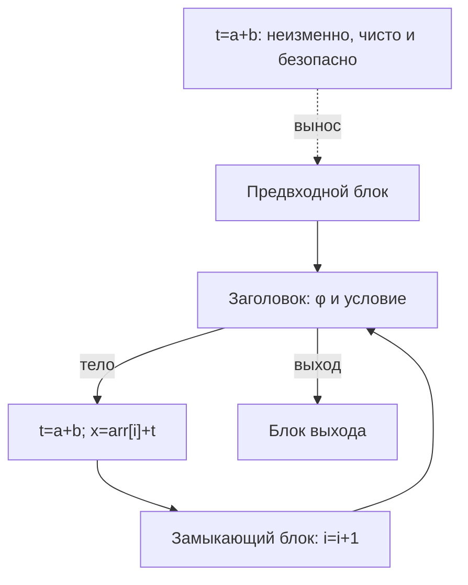

# Занятие 16. LICM

> Инвариантность ещё не означает безопасный перенос

[← Карта курса](../course-map.md) · [Предыдущее занятие](15-induction-variables.md) · [Следующее занятие](17-loop-transformations.md)

## Результат занятия

Ты отличаешь неизменное выражение от выражения, которое действительно можно вынести, проверяешь эффекты, безопасность раннего выполнения и доминирование, а затем при необходимости создаёшь предвходной блок.

**Перед началом:** каноническая форма цикла, доминирование в SSA и контракт эффектов IR.

## Зачем это вообще нужно

Повторное вычисление одного результата в каждой итерации расточительно. Но перенос в предвходной блок выполняет инструкцию раньше и, возможно, даже когда цикл не вошёл в тело. Значит, одинаковое значение — лишь первое из нескольких доказательств.

## Термины до заданий

| Термин | Простое объяснение | Точная опора |
|---|---|---|
| **Инвариант цикла** (*loop invariant*) | не меняется между итерациями | его операнды определены вне цикла или уже доказаны неизменными |
| **Вынос инструкции** (*hoisting*) | перемещает инструкцию в предвходной блок | должен сохранять значение, эффекты, исключения и доступность результата |
| **Раннее выполнение** (*speculation*) | выполняет операцию на пути, где раньше она могла не выполняться | допустимо только при доказанной безопасности |
| **Возможное совпадение адресов** (*aliasing*) | разные ссылки могут указывать на одну память | запись через одну ссылку способна изменить результат загрузки через другую |
| **Доминирование использований** (*dominance of uses*) | новое определение доступно каждому использованию | место выноса должно доминировать все точки, где нужен результат |

Сначала прочитай объяснения. Затем закрой таблицу и перескажи термины своими словами. Это проверка понимания, а не попытка угадать определение.

## Ключевая схема

## Пошаговый разбор

| Инструкция | Операнды неизменны? | Эффекты безопасны? | Можно выполнить раньше? | Доминирование сохранится? | Решение |
|---|---:|---:|---:|---:|---|
| `t1=a+b` | да | чистая операция | да | да | вынести |
| `t2=t1*4` | после выноса `t1` | чистая операция | да | да | вынести после `t1` |
| `q=10/d` | `d` определено вне цикла | нет побочного эффекта, но возможно исключение | нет без доказательства `d≠0` | да | оставить в цикле |
| `v=load p` | `p` определён вне цикла | результат зависит от памяти | только если доказано отсутствие опасных записей и совпадения адресов | да | обычно оставить в цикле |
| `print t1` | да | наблюдаемый вывод | нет | — | не выносить |

Порядок важен: сначала выносится `t1`, затем `t2`, потому что второй зависит от первого.

## Формальное правило

Перенос разрешён только при четырёх положительных доказательствах:

1. все операнды неизменны в цикле;
2. операция не меняет наблюдаемое поведение, а фактов о памяти достаточно;
3. раннее выполнение не добавляет исключение или ошибку на новом пути;
4. новое определение доминирует все использования, где требуется результат.

Если у заголовка несколько внешних предшественников, сначала создаётся отдельный предвходной блок и исправляется внешний вход φ-функции.

## Типичные ошибки

- Делать вывод «неизменно ⇒ можно вынести».
- Считать вызов `readonly` полностью чистым: он может читать изменяемую память.
- Игнорировать возможность нулевого числа итераций при раннем выполнении.
- Переносить зависимые инструкции в обратном порядке.

## Задача A — по образцу

Заполни четыре доказательства для пяти инструкций из таблицы и укажи первый блокирующий пункт.

Проверка задачи A

`t1` и `t2` проходят все проверки. Деление нельзя выполнить раньше без доказательства `d≠0`. Для загрузки нужны факты о памяти и возможном совпадении адресов. Вывод на экран имеет наблюдаемый эффект.

## Самостоятельная задача

У заголовка два внешних предшественника `P1,P2` и один замыкающий блок. Создай предвходной блок и перепиши `x=φ[P1:a,P2:b,L:x2]`.

Проверка задачи B

Перенаправь `P1,P2` в `PRE`; в `PRE` создай `x0=φ[P1:a,P2:b]`; заголовок получает `x=φ[PRE:x0,L:x2]`. Обратное ребро `L→H` не меняется.

## Проверь себя

**Почему одной неизменности недостаточно?**  
**Что проверяет безопасность раннего выполнения?**  
**Как меняется φ-функция при создании предвходного блока?**

Короткие ответы

Операция может иметь наблюдаемый эффект или вызвать исключение и начать выполняться на пути, где раньше не выполнялась. Поэтому нужно отдельно доказать безопасность раннего выполнения. Внешние входы φ-функции объединяются в предвходном блоке, а заголовок получает один внешний вход.

## Как это устроено в промышленном компиляторе

Промышленный LICM использует анализ возможного совпадения адресов, MemorySSA, сведения об обязательном и раннем выполнении, канонизацию цикла, LCSSA и модель стоимости. Учебная таблица сохраняет главное разделение доказательств.
