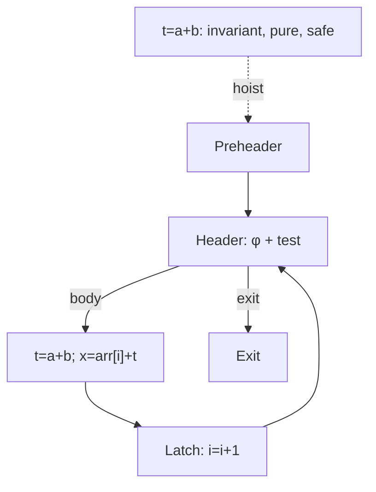

# Занятие 16. LICM

> Инвариантность ещё не означает безопасный перенос

[← Карта курса](../course-map.md) · [Предыдущее занятие](15-induction-variables.md) · [Следующее занятие](17-loop-transformations.md)

## Результат занятия

Ты отделяешь invariant от hoistable, проверяешь эффекты, speculation и dominance и корректно создаёшь preheader.

**Перед началом:** canonical loop form, SSA dominance и контракт эффектов IR.

## Зачем это вообще нужно

Повторное вычисление одного результата в каждой итерации расточительно. Но перенос в preheader выполняет инструкцию раньше и, возможно, даже когда цикл не вошёл в тело. Значит, одинаковое значение — лишь первое из нескольких доказательств.

## Термины до заданий

| Термин | Простое объяснение | Точная опора |
|---|---|---|
| **loop invariant — инвариант цикла** | значение не меняется между итерациями | operands определены вне цикла или уже доказаны invariant |
| **hoist — вынос** | перемещение инструкции в preheader | сохраняет value, effects, exceptions и dominance uses |
| **speculation — спекулятивное выполнение** | операция выполняется на пути, где раньше могла не выполняться | допустимо только при доказанной безопасности раннего выполнения |
| **aliasing — совпадение адресов** | разные ссылки могут обозначать одну память | store через alias способен изменить результат load |
| **dominance of uses — доминирование использований** | новое определение доступно каждому use | место hoist должно доминировать ordinary uses и нужные exit uses |

## Первая модель

## Разобранный пример: состояние за состоянием

| Инструкция | invariant operands? | effects safe? | speculatable? | dominance after move? | verdict |
|---|---:|---:|---:|---:|---|
| `t1=a+b` | да | pure | да | да | hoist |
| `t2=t1*4` | после t1 | pure | да | да | hoist после t1 |
| `q=10/d` | d outside | pure result, но trap | нет без `d≠0` | да | оставить |
| `v=load p` | p outside | зависит от memory | только при no-alias/no-write proof | да | обычно оставить |
| `print t1` | да | наблюдаемый I/O | нет | — | не выносить |

Порядок важен: сначала выносится `t1`, затем `t2`, потому что второй зависит от первого.

## Формальное правило

Перенос разрешён только при четырёх положительных доказательствах:

1. operands invariant;
2. операция не меняет наблюдаемое поведение и memory facts достаточны;
3. раннее выполнение не добавляет исключение или ошибку на новом пути;
4. новое определение доминирует все uses, где оно требуется.

Если у header несколько внешних predecessors, сначала создаётся отдельный preheader и корректируется внешний вход φ.

## Типичные ошибки

- Делать вывод `invariant ⇒ hoistable`.
- Считать `readonly` полностью pure: вызов может читать изменяемую память.
- Игнорировать нулевое число итераций при speculation.
- Переносить зависимые инструкции в обратном порядке.

## Задача A — по образцу

Заполни четыре доказательства для пяти инструкций из таблицы и укажи первый блокирующий пункт.

Проверка задачи A

`t1/t2` проходят все пункты; division блокируется speculation без `d≠0`; load — memory/effect proof; print — наблюдаемый эффект.

## Задача B — перенос на новый пример

У header два внешних predecessors `P1,P2` и один latch. Создай preheader и перепиши `x=φ[P1:a,P2:b,L:x2]`.

Проверка задачи B

Перенаправь `P1,P2` в `PRE`; в `PRE` создай `x0=φ[P1:a,P2:b]`; header получает `x=φ[PRE:x0,L:x2]`. Back edge L→header не меняется.

## Проверка на выходе

**Почему invariant недостаточно?**  
**Что проверяет speculation?**  
**Как меняется φ при создании preheader?**

Короткие ответы

Операция может иметь эффект или trap и начать выполняться на новом пути. Speculation проверяет безопасность этого раннего выполнения. Внешние входы φ объединяются в preheader, а header получает один внешний вход.

## Профессиональная граница

Реальный LICM использует alias analysis, MemorySSA, must-execute/speculation facts, loop-simplify/LCSSA и cost model. Учебная матрица сохраняет главное разделение доказательств.
