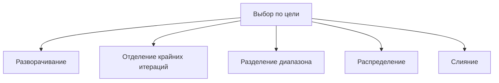

# Занятие 17. Преобразования циклов и зависимости

> Разворачивание, отделение итераций, разделение диапазона, распределение и слияние — разные инструменты

[← Карта курса](../course-map.md) · [Предыдущее занятие](../modules/16-licm.md) · [Следующее занятие](../modules/18-checkpoint-2.md)

## Результат занятия

Ты выбираешь преобразование по цели и доказываешь его допустимость через зависимости и эффекты.

**Перед началом:** индуктивные переменные, LICM и раздел предпосылок про межитерационные зависимости.

## Зачем это вообще нужно

Преобразование меняет порядок итераций или инструкций. Оно может ускорить код, но также нарушить порядок между производителем и потребителем значения, увеличить размер кода или ухудшить локальность обращений к памяти.

## Термины до заданий

| Термин | Простое объяснение | Точная опора |
|---|---|---|
| **Разворачивание цикла** (*unrolling*) | дублирует тело нескольких итераций | уменьшает расходы на управление циклом и может требовать остаточный цикл |
| **Отделение крайних итераций** (*peeling*) | выносит первые или последние итерации в отдельный код | убирает особый случай из основного цикла |
| **Разделение диапазона** (*loop splitting*) | делит диапазон итераций на части | например, до и после границы или условия |
| **Распределение цикла** (*loop distribution*) | разделяет инструкции одного цикла на несколько циклов | должно сохранять все зависимости |
| **Слияние циклов** (*loop fusion*) | объединяет соседние совместимые циклы | требует одинаковых диапазонов и безопасного порядка операций |

Сначала прочитай объяснения. Затем закрой таблицу и перескажи термины своими словами. Это проверка понимания, а не попытка угадать определение.

## Ключевая схема



Это альтернативные преобразования, а не обязательная последовательность.

## Пошаговый разбор

Исходный цикл:

```c
for (i=0; i<n; ++i) {
    a[i] = b[i] + 1;
    c[i] = a[i] * 2;
}
```

Распределение на два цикла сохраняет зависимость `a[i] → c[i]`, если первый цикл полностью выполняется до второго. Для `c[i]=a[i-1]` нужно отдельно проверить относительный порядок производителя и потребителя и эффекты памяти.

## Формальное правило

Для каждого преобразования выпиши: новый порядок; зависимости `(итерация-источник → итерация-потребитель)`; эффекты и возможное совпадение адресов; границы и остаточные итерации; ожидаемую выгоду; риск роста размера, давления на кэш и регистры.

## Типичные ошибки

- Учить преобразования как последовательную цепочку.
- Проверять только одинаковые индексы и забывать межитерационные зависимости.
- Не сохранять порядок вызовов и записей в память.
- Забывать остаточные итерации после разворачивания.

## Задача A — по образцу

Для одного простого цикла нарисуй отдельные версии: разворачивание в два раза, отдельная первая итерация, разделение диапазона, распределение инструкций и слияние с соседним циклом.

<details>
<summary>Проверка задачи A — открывать после попытки</summary>

У каждой версии должна быть своя форма. Разворачивание дублирует тело и увеличивает `i` на 2, оставляя обработку остатка. Отделение выполняет `i=0` отдельно. Разделение создаёт два диапазона. Распределение создаёт два цикла с разными инструкциями. Слияние объединяет тела циклов с одинаковым диапазоном итераций.

</details>

## Самостоятельная задача

Проанализируй распределение цикла для `a[i]=f(i); c[i]=a[i-1]` при `i` от `1` до `n-1`. Нарисуй зависимость и сформулируй вывод о допустимости.

<details>
<summary>Проверка задачи B — открывать после попытки</summary>

Зависимость идёт от `a[i-1]` к `c[i]`. Если цикл-производитель `a` целиком выполняется первым, нужные значения уже готовы. Поэтому такое распределение допустимо при отсутствии других эффектов и опасного совпадения адресов. Обратный порядок циклов был бы неверен.

</details>

## Проверь себя

**Зачем нужны остаточные итерации после разворачивания?**  


**Чем отделение крайних итераций отличается от разворачивания?**  


**Что доказывает анализ зависимостей?**  


<details>
<summary>Короткие ответы</summary>

**Зачем нужны остаточные итерации после разворачивания?**  
Число итераций может не делиться на коэффициент разворачивания; остаток всё равно нужно выполнить.

**Чем отделение крайних итераций отличается от разворачивания?**  
Отделение выполняет крайние итерации отдельно, а разворачивание группирует несколько обычных итераций в одном теле.

**Что доказывает анализ зависимостей?**  
Что новый порядок не заставит потребителя выполниться раньше производителя и не нарушит порядок эффектов и операций с памятью.

</details>

## Как это устроено в промышленном компиляторе

Векторизация и блочное разбиение требуют более сильного анализа зависимостей и модели стоимости. Здесь цель — научиться доказывать допустимость, а не угадывать её по виду цикла.
