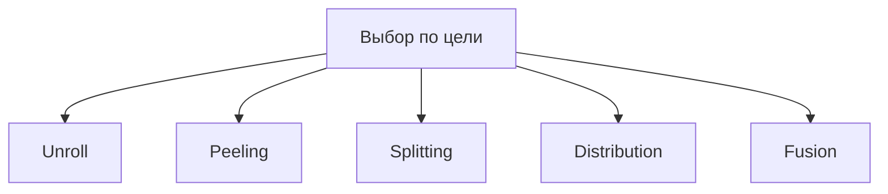

# Занятие 17. Преобразования циклов и зависимости

> Unroll, peeling, splitting, distribution и fusion — не цепочка, а разные инструменты

[← Карта курса](../course-map.md) · [Предыдущее занятие](../modules/16-licm.md) · [Следующее занятие](../modules/18-checkpoint-2.md)

## Результат занятия

Ты выбираешь преобразование по цели и доказываешь legality через зависимости и эффекты.

**Перед началом:** IV, LICM и раздел предпосылок про loop-carried dependence.

## Зачем это вообще нужно

Преобразование меняет порядок итераций или statements. Оно может ускорить код, но также нарушить producer-consumer порядок, увеличить размер кода или ухудшить locality.

## Термины до заданий

| Термин | Простое объяснение | Точная опора |
|---|---|---|
| **unroll** | дублирование тела нескольких итераций | уменьшает loop-control overhead и требует remainder |
| **peeling** | выделение первых/последних итераций | убирает особый случай из основного loop |
| **splitting** | деление диапазона итераций | например, до и после границы/условия |
| **distribution** | разделение statements одного loop на несколько loops | требует сохранения dependences |
| **fusion** | объединение соседних совместимых loops | требует одинаковых диапазонов и безопасного порядка |

Сначала прочитай готовые объяснения. Затем закрой таблицу и сформулируй каждый термин своими словами. Пустая формулировка ученика — это проверка после обучения, а не замена обучения.

## Первая модель



Это альтернативы, а не обязательный pipeline.

## Разобранный пример: состояние за состоянием

Исходный loop:

```c
for (i=0; i<n; ++i) {
    a[i] = b[i] + 1;
    c[i] = a[i] * 2;
}
```

Distribution в два loops сохраняет dependence `a[i] → c[i]`, если первый loop полностью выполняется до второго. Но для `c[i]=a[i-1]` нужно отдельно проверить, не меняется ли относительный порядок producer/consumer и эффекты памяти.

## Формальное правило

Для каждого преобразования выпиши: изменённый порядок; dependences `(source iteration → sink iteration)`; effects/aliasing; bounds/remainder; ожидаемую выгоду; риск размера/кэша/регистров.

## Типичные ошибки

- Учить преобразования как последовательную цепочку.
- Проверять только одинаковый индекс и забывать loop-carried dependence.
- Не сохранять порядок calls/stores.
- Забывать remainder после unroll.

## Задача A — по образцу

Для одного простого loop нарисуй отдельные версии unroll×2, peel first iteration, split range, distribute statements и fuse с соседним loop.

<details>
<summary>Проверка задачи A — открывать после попытки</summary>

У каждой версии должна быть своя форма. Unroll дублирует body и обновляет i на 2 с remainder; peel выполняет i=0 отдельно; split создаёт два диапазона; distribution создаёт два loops по statements; fusion объединяет тела одинакового iteration space.

</details>

## Задача B — перенос на новый пример

Проанализируй distribution для `a[i]=f(i); c[i]=a[i-1]` при i от 1 до n-1. Нарисуй dependence и дай вердикт.

<details>
<summary>Проверка задачи B — открывать после попытки</summary>

Dependence идёт от `a[i-1]` к `c[i]`. Если весь producer-loop `a` выполняется первым, значения готовы, поэтому такое distribution может быть legal при отсутствии других effects/aliasing. Обратный порядок loops был бы неверен.

</details>

## Проверка на выходе

**Зачем remainder после unroll?**  


**Чем peeling отличается от unroll?**  


**Что доказывает dependence analysis?**  


<details>
<summary>Короткие ответы</summary>

**Зачем remainder после unroll?**  
Trip count может не делиться на factor; оставшиеся итерации всё равно нужно выполнить.

**Чем peeling отличается от unroll?**  
Peeling выделяет крайние итерации отдельно, unroll группирует несколько обычных итераций в теле.

**Что доказывает dependence analysis?**  
Что новый порядок не заставит consumer выполниться до нужного producer и не нарушит memory/effect ordering.

</details>

## Профессиональная граница

Vectorization и tiling требуют более сильной dependence и cost model. Здесь цель — научиться формулировать legality, а не угадывать по виду loop.
