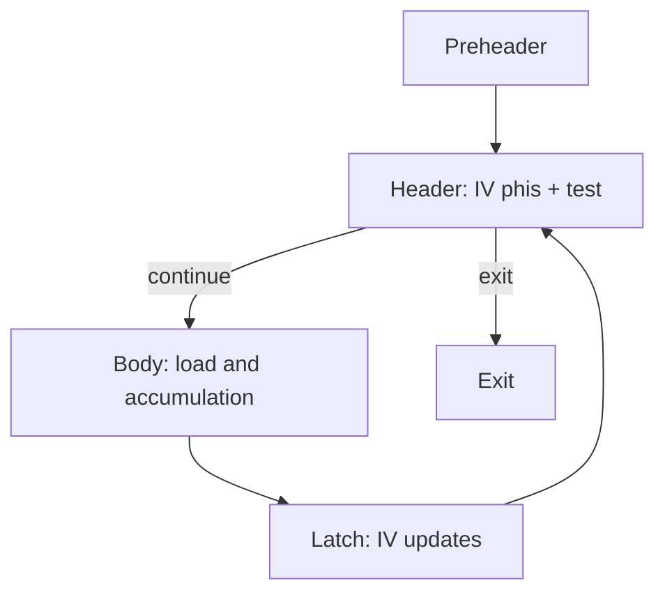

# Занятие 18. Комплексная работа №2

> Полная задача с SSA-циклом, IV, LICM и взаимодействием проходов

[← Карта курса](../course-map.md) · [Предыдущее занятие](../modules/17-loop-transformations.md) · [Следующее занятие](../modules/19-mock-exam-1.md)

## Сегодняшний результат

| **К концу обязательной части.** Ты проводишь полный анализ циклического IR, сохраняешь корректность SSA/CFG и аргументируешь legality цикловых оптимизаций. |
|-------------------------------------------------------------------------------------------------------------------------------------------------------------|

| **Параметр**          | **Значение**                                                                              |
|-----------------------|-------------------------------------------------------------------------------------------|
| Сложность             | Контрольный                                                                               |
| Обязательная нагрузка | 130–180 мин                                                                               |
| Перед началом         | Все темы до занятия 17. Первые 120 минут без помощи.                                         |
| Что подготовить      | полное решение второй комплексной работы, балл по рубрике и два повторных мини-упражнения |

| **Разрешённый режим.** Разрешено выполнить в две сессии. |
|----------------------------------------------------------|

| **В этом занятии не требуется.** Не применяй loop unswitching, vectorization и другие непрошенные passes. |
|----------------------------------------------------------------------------------------------------|

## Обязательный маршрут

| **Этап**   | **Время** | **Результат**                                        |
|------------|-----------|------------------------------------------------------|
| Подготовка | 10 мин    | Выписать порядок артефактов и таймбокс               |
| Часть 1    | 55–75 мин | CFG, dominance, SSA; можно сделать отдельной сессией |
| Пауза      | 10–20 мин | Не читать теорию; восстановить внимание              |
| Часть 2    | 55–75 мин | Оптимизации и проверка legality                      |
| Разбор     | 15–25 мин | Найти первый неверный инвариант                      |

| **Когда запрашивать помощь.** После 10–15 минут честной попытки можно сразу зафиксировать точное место остановки и запросить разбор. Не нужно сначала мучительно завершать A и B. |
|----------------------------------------------------------------------------------------------------------------------------------------------------------|

## Короткое повторение

<table>
<colgroup>
<col style="width: 33%" />
<col style="width: 33%" />
<col style="width: 33%" />
</colgroup>
<thead>
<tr class="header">
<th><strong>Когда</strong></th>
<th><strong>Объём</strong></th>
<th><strong>Что сделать</strong></th>
</tr>
</thead>
<tbody>
<tr class="odd">
<td>Вчера</td>
<td>1–2 формулировки</td>
<td>• Для каждого преобразования: цель, предусловие, результат, риск. 
• Distribution/fusion зависят от межитерационных зависимостей.</td>
</tr>
<tr class="even">
<td>3 дня назад</td>
<td>1 формулировка</td>
<td>Basic IV меняется на постоянный шаг каждый проход.</td>
</tr>
<tr class="odd">
<td>7 дней назад</td>
<td>1 мини-задача</td>
<td>Нарисуй continuation после inline функции с двумя returns.</td>
</tr>
</tbody>
</table>

| **Ограничение.** На повторение не трать больше 10 минут. Не вспомнил — сделай попытку, посмотри ответ и верни карточку на следующее повторение. |
|-----------------------------------------------------------------------------------------------------------------------------------|

## Сначала простыми словами

Вторая комплексная работа связывает SSA с анализом циклов. Сначала докажи структуру цикла, затем находи IV и только потом обсуждай LICM и strength reduction.

Не применяй оптимизацию потому, что она «похожа на подходящую»: укажи конкретное предусловие и покажи, что оно выполнено.

### Пять терминов занятия

| **Термин**         | **Моя формулировка одним предложением** |
|--------------------|-----------------------------------------|
| loop SSA           |                                         |
| legality           |                                         |
| preheader          |                                         |
| derived IV         |                                         |
| финальный verifier |                                         |

## Минимум для запоминания

- Сначала структура loop и SSA, затем IV и legality оптимизаций.

- Каждый pass сохраняет промежуточный IR.

- Финальная проверка охватывает CFG, φ, dominance, effects и uses.

| **Не учи дословно без смысла.** Сначала объясни формулировку своими словами на маленьком примере. Точная версия нужна после понимания. |
|----------------------------------------------------------------------------------------------------------------------------------------|

## Визуальная модель

*Рабочее представление темы занятия*

## Разобранный пример — проход по шагам

<table>
<colgroup>
<col style="width: 100%" />
</colgroup>
<thead>
<tr class="header">
<th>1: n = input() 
2: i = 0 
3: s = 0 
4: k = 4 * n + 1 
Lh: 
5: if i &gt;= n goto Lexit 
6: t = 4 * n + 1 
7: idx = 4 * i + 3 
8: v = load A[idx] 
9: s = s + v + t 
10: i = i + 1 
11: goto Lh 
Lexit: 
12: print s 
13: return</th>
</tr>
</thead>
<tbody>
</tbody>
</table>

Основная работа: построить CFG/SSA, распознать IV, найти invariant t, оценить load, выполнить LICM и strength reduction для idx. Обрати внимание, что k уже вычисляет то же инвариантное выражение вне цикла.

| **Проверка понимания.** Закрой пример и объясни не итог, а почему выполняется каждый следующий шаг. Если не можешь — зафиксируй именно этот переход и запроси разбор. |
|------------------------------------------------------------------------------------------------------------------------------------------------------|

## Обязательная практика

### Задача A — обязательная по образцу: Структура и SSA

| **Параметр**     | **Значение**                                                     |
|------------------|------------------------------------------------------------------|
| Статус           | Обязательно в этом занятии                                              |
| Ориентир времени | 65 мин                                                           |
| Что сдать        | header/latch/preheader/exits; φ с подписанными входами; verifier |

Построй blocks, CFG, Dom/idom/DF, natural loop, затем SSA для i и s.

| **Подсказка 1.** Сначала найди natural loop и canonical preheader. |
|--------------------------------------------------------------------|

## Стандартная практика

### Задача B — стандартная для закрепления: Ациклические оптимизации

| **Параметр**     | **Значение**                                                          |
|------------------|-----------------------------------------------------------------------|
| Статус           | Нужно выполнить до следующей зависимой темы; можно во второй сессии   |
| Ориентир времени | 35 мин                                                                |
| Что сдать        | эквивалентность выражений; семантические флаги; удаление мёртвого def |

Проведи value numbering/propagation/DCE там, где применимо. Укажи, можно ли заменить t на k и при каких типовых/overflow предпосылках.

| **Подсказка 1.** Сначала найди natural loop и canonical preheader. |
|--------------------------------------------------------------------|

| **Подсказка 2.** После strength reduction проверь base case и один inductive step. |
|------------------------------------------------------------------------------------|

## Три вопроса на выходе

| **Вопрос**                                                   | **Результат retrieval**         |
|--------------------------------------------------------------|---------------------------------|
| Какая информация стала недействительна после CFG rewrite?    | □ ≤15 с □ с паузой □ не ответил |
| Где нужен новый φ?                                           | □ ≤15 с □ с паузой □ не ответил |
| Почему одинаковый текст выражения ещё не гарантирует замену? | □ ≤15 с □ с паузой □ не ответил |

## Светофор понимания

| **Состояние** | **Что это означает**                                    | **Следующее действие**                                                  |
|---------------|---------------------------------------------------------|-------------------------------------------------------------------------|
| Зелёный       | Могу объяснить и решить A/B с незначительной проверкой. | Перейти дальше; C только по желанию.                                    |
| Жёлтый        | Понимаю идею, но теряю один шаг или термин.             | Разобрать со мной уменьшенный пример; B можно закончить второй сессией. |
| Красный       | Не могу объяснить причинную модель или начать A.        | Не читать дальше; прислать попытку после 10–15 минут.                   |

| **Минимум занятия.** Занятие засчитывается, если понятна причинная модель, воспроизведён пример и выполнена задача A. Задача B должна быть закрыта до следующей темы, которая на неё опирается. |
|------------------------------------------------------------------------------------------------------------------------------------------------------------------------------------------|

## Справочник и углубление — читать по необходимости

| **Это необязательная часть первого прохода.** Открывай её, если простого объяснения недостаточно, при проверке решения или когда остались силы. Профессиональные оговорки не являются обязательным минимумом занятия. |
|--------------------------------------------------------------------------------------------------------------------------------------------------------------------------------------------------------------|

### Подробная теория

#### Стратегия решения

Сначала стабилизируй структуру: blocks/CFG/reachability/dominance/loop. Затем SSA. Только после verifier выполняй passes. Для каждого loop transformation отдельно пиши **legality** и **profitability**.

Если порядок оптимизаций задан, не меняй его ради удобства: результат одного прохода формирует вход следующего, и это часть задания.

#### Рубрика

20% CFG и блоки; 15% dominance/DF; 20% SSA; 15% ациклические passes; 20% loop analysis/IV/LICM; 10% оформление инвариантов и промежуточных версий. Ошибка ранней стадии снижает балл последующих частей, но не прекращай решение: продолжай с явно исправленным допущением.

### Допущения учебного IR на сегодня

- У каждого базового блока ровно один терминатор; терминатор является последней инструкцией блока.

- Деление может завершиться наблюдаемой ошибкой при нуле. Его нельзя безусловно удалять или выносить, пока не доказаны безопасность и допустимость спекуляции.

- print, store, volatile/atomic операции и неизвестный вызов имеют наблюдаемый эффект. Вызов считается чистым только при явной пометке pure/readonly в условии.

### Дополнительная задача

### Задача C — необязательный перенос: Цикловые оптимизации

| **Параметр**     | **Значение**                                                  |
|------------------|---------------------------------------------------------------|
| Статус           | Только если осталось внимание                                 |
| Ориентир времени | 55 мин                                                        |
| Что сдать        | basic/derived IV; preheader init; latch update; LICM legality |

Найди IV, выполни strength reduction idx, вынеси безопасные инварианты, объясни, почему load A\[idx\] не выносится. Покажи итоговый SSA.

| **Подсказка 1.** Сначала найди natural loop и canonical preheader. |
|--------------------------------------------------------------------|

| **Подсказка 2.** После strength reduction проверь base case и один inductive step. |
|------------------------------------------------------------------------------------|

### Полная устная проверка

| **Вопрос**                                                   | **Результат retrieval**         |
|--------------------------------------------------------------|---------------------------------|
| Какая информация стала недействительна после CFG rewrite?    | □ ≤15 с □ с паузой □ не ответил |
| Где нужен новый φ?                                           | □ ≤15 с □ с паузой □ не ответил |
| Почему одинаковый текст выражения ещё не гарантирует замену? | □ ≤15 с □ с паузой □ не ответил |
| Как доказана безопасность LICM?                              | □ ≤15 с □ с паузой □ не ответил |
| Какие values остаются loop-carried?                          | □ ≤15 с □ с паузой □ не ответил |

### Журнал ошибок

| **Ошибка / сомнение** | **Первый нарушенный инвариант** | **Исправленное правило** | **Новый пример / итерация** |
|-----------------------|---------------------------------|--------------------------|-------------------------|
|                       |                                 |                          |                         |
|                       |                                 |                          |                         |
|                       |                                 |                          |                         |
|                       |                                 |                          |                         |
|                       |                                 |                          |                         |

### План повторения

| **Когда**    | **Что повторить**                                               |
|--------------|-----------------------------------------------------------------|
| Завтра       | 3 пункта минимального блока и задача A.                         |
| Через 3 дня  | Один алгоритм или стандартная задача B.                         |
| Через 7 дней | На мини-цикле найди basic IV, derived IV и один LICM candidate. |

### Как получить обратную связь

**Сообщение для начала ежедневной сессии**

<table>
<colgroup>
<col style="width: 100%" />
</colgroup>
<thead>
<tr class="header">
<th>Я работаю по документу «Комплексная работа №2» (версия 3.0). Я могу обратиться уже после 10–15 минут честной попытки. 
 
Моя текущая зона: зелёная / жёлтая / красная. 
Моя попытка и точное место остановки: ... 
 
Работай так: 
1. Сначала проверь мою причинную модель простым вопросом, не выдавая решение. 
2. Если модель неверна, объясни тему на одном меньшем примере и попроси меня пересказать. 
3. Найди только первую существенную ошибку: место, нарушенный инвариант и минимальный контрпример. 
4. Дай мне исправить её самостоятельно. 
5. После исправления дай одну короткую задачу на перенос. 
6. В конце назови: что я уже понимаю, что пока понимаю с подсказкой и что повторить на следующей сессии.</th>
</tr>
</thead>
<tbody>
</tbody>
</table>

## Точечное чтение

- Повтори SSA, LVN, IV и LICM; используй контракт IR из навигатора.

| **Стоп чтения.** Прекрати чтение, когда можешь воспроизвести определение/алгоритм и решить задачу B. Дополнительные страницы не заменяют практику. |
|----------------------------------------------------------------------------------------------------------------------------------------------------|
