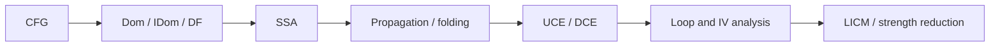

# Занятие 19. Пробный зачёт

> Теория + практическая задача в условиях, близких к реальным

[← Карта курса](../course-map.md) · [Предыдущее занятие](../modules/18-checkpoint-2.md) · [Следующее занятие](../modules/20-final-repair.md)

## Результат занятия

| **К концу обязательной части.** Ты получаешь честную оценку готовности и список только тех пробелов, которые реально могут сорвать итоговую проверку. |
|-------------------------------------------------------------------------------------------------------------------------------------------------------|

| **Параметр**          | **Значение**                                                                 |
|-----------------------|------------------------------------------------------------------------------|
| Сложность             | Пробный зачёт                                                                |
| Обязательная нагрузка | 150 мин                                                                      |
| Перед началом         | Убрать книги и старые решения. Подготовить бумагу и таймер.                  |
| Что подготовить      | ответы на билет, полное практическое решение, балл и три критических пробела |

| **Разрешённый режим.** Без новых тем; после работы только разбор ошибок. |
|--------------------------------------------------------------------------|

| **В этом занятии не требуется.** Не учи новую теорию после начала пробного зачёта. |
|-----------------------------------------------------------------------------|

## Обязательный маршрут

| **Этап**     | **Время** | **Результат**                          |
|--------------|-----------|----------------------------------------|
| Теория       | 30 мин    | Короткие ответы без конспекта          |
| Практика     | 100 мин   | Полный ход решения с промежуточными IR |
| Самопроверка | 20 мин    | Рубрика и список первых причин ошибок  |

| **Когда запрашивать помощь.** После 10–15 минут честной попытки можно сразу зафиксировать точное место остановки и запросить разбор. Не нужно сначала мучительно завершать A и B. |
|----------------------------------------------------------------------------------------------------------------------------------------------------------|

## Короткое повторение

<table>
<colgroup>
<col style="width: 33%" />
<col style="width: 33%" />
<col style="width: 33%" />
</colgroup>
<thead>
<tr class="header">
<th><strong>Когда</strong></th>
<th><strong>Объём</strong></th>
<th><strong>Что сделать</strong></th>
</tr>
</thead>
<tbody>
<tr class="odd">
<td>Вчера</td>
<td>1–2 формулировки</td>
<td>• Сначала структура loop и SSA, затем IV и legality оптимизаций. 
• Каждый pass сохраняет промежуточный IR.</td>
</tr>
<tr class="even">
<td>3 дня назад</td>
<td>1 формулировка</td>
<td>Инвариантность значения не доказывает безопасность hoist.</td>
</tr>
<tr class="odd">
<td>7 дней назад</td>
<td>1 мини-задача</td>
<td>Напиши полный pipeline комплексной задачи без подсказки.</td>
</tr>
</tbody>
</table>

| **Ограничение.** На повторение не трать больше 10 минут. Не вспомнил — сделай попытку, посмотри ответ и верни карточку на следующее повторение. |
|-----------------------------------------------------------------------------------------------------------------------------------|

## Сначала простыми словами

Пробный зачёт — измерение, а не ещё один учебный день. Его задача — показать, какие навыки воспроизводятся без подсказки и в ограниченное время.

После работы не перечитывай всё подряд. Составь список первых причин ошибок и исправь только самые дорогие пробелы.

### Пять терминов занятия

| **Термин**     | **Моя формулировка одним предложением** |
|----------------|-----------------------------------------|
| таймбокс       |                                         |
| рубрика        |                                         |
| перенос        |                                         |
| самопроверка   |                                         |
| completion gap |                                         |

## Минимум для запоминания

- Решение идёт в фиксированном порядке и по таймбоксу.

- Неполный артефакт отмечается, а не маскируется догадкой.

- После зачёта ошибки классифицируются по первому нарушенному инварианту.

| **Не учи дословно без смысла.** Сначала объясни формулировку своими словами на маленьком примере. Точная версия нужна после понимания. |
|----------------------------------------------------------------------------------------------------------------------------------------|

## Визуальная модель

*Рабочее представление темы занятия*

## Разобранный пример — проход по шагам

<table>
<colgroup>
<col style="width: 100%" />
</colgroup>
<thead>
<tr class="header">
<th>1: p = input() 
2: n = input() 
3: i = 0 
4: acc = 0 
5: base = 2 * n 
Lh: 
6: if i &gt;= n goto Lexit 
7: q = 2 * n 
8: if p goto Luse else Lskip 
Luse: 
9: idx = 2 * i 
10: v = load A[idx] 
11: acc = acc + v + q 
12: goto Lcont 
Lskip: 
13: dead = q * 0 
Lcont: 
14: i = i + 1 
15: goto Lh 
Lexit: 
16: print acc 
17: return</th>
</tr>
</thead>
<tbody>
</tbody>
</table>

Это экзаменационная задача. Требуемый порядок: CFG → Dom/idom/DF → SSA → propagation/folding → UCE при доказанных условиях → LVN → DCE → loop/IV → LICM/strength reduction. Если p неизвестно, не удаляй ветвь.

| **Проверка понимания.** Закрой пример и объясни не итог, а почему выполняется каждый следующий шаг. Если не можешь — зафиксируй именно этот переход и запроси разбор. |
|------------------------------------------------------------------------------------------------------------------------------------------------------|

## Обязательная практика

### Задача A — обязательная по образцу: Теоретическая часть

| **Параметр**     | **Значение**                                       |
|------------------|----------------------------------------------------|
| Статус           | Обязательно в этом занятии                                |
| Ориентир времени | 20 мин                                             |
| Что сдать        | точное определение; назначение; мини-пример/ошибка |

Письменно ответь на 7 вопросов из раздела «Теоретический билет».

| **Подсказка 1.** Используй один и тот же pipeline, не начинай с очевидной оптимизации. |
|----------------------------------------------------------------------------------------|

## Стандартная практика

### Задача B — стандартная для закрепления: Практическая часть

| **Параметр**     | **Значение**                                                        |
|------------------|---------------------------------------------------------------------|
| Статус           | Нужно выполнить до следующей зависимой темы; можно во второй сессии |
| Ориентир времени | 100 мин                                                             |
| Что сдать        | все промежуточные версии; legality пояснения; итоговый verifier     |

Выполни весь указанный pipeline для экзаменационного IR. Не используй подсказки.

| **Подсказка 1.** Используй один и тот же pipeline, не начинай с очевидной оптимизации. |
|----------------------------------------------------------------------------------------|

| **Подсказка 2.** Оценивай отдельно структуру, SSA, legality и финальные проверки. |
|-----------------------------------------------------------------------------------|

## Три вопроса на выходе

| **Вопрос**                                         | **Результат retrieval**         |
|----------------------------------------------------|---------------------------------|
| Можешь ли ты дать определение без примера-подмены? | □ ≤15 с □ с паузой □ не ответил |
| Где ты молча сделал допущение?                     | □ ≤15 с □ с паузой □ не ответил |
| Какая ошибка повлияла на большее число шагов?      | □ ≤15 с □ с паузой □ не ответил |

## Светофор понимания

| **Состояние** | **Что это означает**                                    | **Следующее действие**                                                  |
|---------------|---------------------------------------------------------|-------------------------------------------------------------------------|
| Зелёный       | Могу объяснить и решить A/B с незначительной проверкой. | Перейти дальше; C только по желанию.                                    |
| Жёлтый        | Понимаю идею, но теряю один шаг или термин.             | Разобрать уменьшенный пример с преподавателем или свериться с эталоном; B можно закончить во второй сессии. |
| Красный       | Не могу объяснить причинную модель или начать A.        | Не переходить дальше; зафиксировать попытку и запросить разбор после 10–15 минут.                   |

| **Минимум занятия.** Занятие засчитывается, если понятна причинная модель, воспроизведён пример и выполнена задача A. Задача B должна быть закрыта до следующей темы, которая на неё опирается. |
|------------------------------------------------------------------------------------------------------------------------------------------------------------------------------------------|

## Справочник и углубление — читать по необходимости

| **Это необязательная часть первого прохода.** Открывай её, если простого объяснения недостаточно, при проверке решения или когда остались силы. Профессиональные оговорки не являются обязательным минимумом занятия. |
|--------------------------------------------------------------------------------------------------------------------------------------------------------------------------------------------------------------|

### Подробная теория

#### Регламент

20 минут — теория; 100 минут — практическая задача; 10 минут — самостоятельная проверка инвариантов; затем перерыв и разбор по эталонам или с преподавателем. Не открывай предыдущие документы во время первых 130 минут.

Отвечай точными определениями, затем маленьким примером. Если не помнишь алгоритм полностью, опиши входы, выход, инвариант, основную итерацию и stop condition.

#### Теоретический билет

1\) путь исходника до executable; 2) dominance/idom/DF; 3) SSA construction; 4) difference DCE/UCE; 5) natural/irreducible loop; 6) IV и LICM; 7) одно из unroll/peeling/distribution/fusion.

На каждый вопрос максимум 2–3 минуты. Избегай ответа одной фразой: определение → зачем → мини-пример → типичная ошибка.

#### Самопроверка перед сдачей

Все leaders? Все терминаторы? pred/succ симметричны? Недостижимые блоки отмечены? Dom стабилизирован? Каждая φ имеет вход на predecessor? Все SSA defs уникальны? После UCE обновлены φ? Для LICM проверены эффекты и safety?

### Допущения учебного IR на сегодня

- У каждого базового блока ровно один терминатор; терминатор является последней инструкцией блока.

- Деление может завершиться наблюдаемой ошибкой при нуле. Его нельзя безусловно удалять или выносить, пока не доказаны безопасность и допустимость спекуляции.

- print, store, volatile/atomic операции и неизвестный вызов имеют наблюдаемый эффект. Пометка `pure` означает отсутствие чтения/записи памяти и иных эффектов по контракту; исключения проверяются отдельно. `readonly` запрещает запись, но разрешает чтение памяти и само по себе не делает вызов чистым.

### Дополнительная задача

### Задача C — необязательный перенос: Самопроверка и оценка

| **Параметр**     | **Значение**                              |
|------------------|-------------------------------------------|
| Статус           | Только если осталось внимание             |
| Ориентир времени | 30 мин                                    |
| Что сдать        | балл; 3 критических пробела; план ремонта |

Выполни самопроверку по локальной рубрике этого документа. Затем выдели три ошибки с максимальным произведением влияние × вероятность повторения и для каждой запиши новый проверочный пример.

| **Подсказка 1.** Используй один и тот же pipeline, не начинай с очевидной оптимизации. |
|----------------------------------------------------------------------------------------|

| **Подсказка 2.** Оценивай отдельно структуру, SSA, legality и финальные проверки. |
|-----------------------------------------------------------------------------------|

### Полная устная проверка

| **Вопрос**                                         | **Результат retrieval**         |
|----------------------------------------------------|---------------------------------|
| Можешь ли ты дать определение без примера-подмены? | □ ≤15 с □ с паузой □ не ответил |
| Где ты молча сделал допущение?                     | □ ≤15 с □ с паузой □ не ответил |
| Какая ошибка повлияла на большее число шагов?      | □ ≤15 с □ с паузой □ не ответил |
| Что проверил verifier?                             | □ ≤15 с □ с паузой □ не ответил |
| Какой вопрос вызвал паузу больше 30 секунд?        | □ ≤15 с □ с паузой □ не ответил |

### Журнал ошибок

| **Ошибка / сомнение** | **Первый нарушенный инвариант** | **Исправленное правило** | **Новый пример / итерация** |
|-----------------------|---------------------------------|--------------------------|-------------------------|
|                       |                                 |                          |                         |
|                       |                                 |                          |                         |
|                       |                                 |                          |                         |
|                       |                                 |                          |                         |
|                       |                                 |                          |                         |

### План повторения

| **Когда**    | **Что повторить**                                          |
|--------------|------------------------------------------------------------|
| Завтра       | 3 пункта минимального блока и задача A.                    |
| Через 3 дня  | Один алгоритм или стандартная задача B.                    |
| Через 7 дней | Письменно воспроизведи экзаменационный pipeline и рубрику. |

### Как получить обратную связь

**Сообщение для начала ежедневной сессии**

<table>
<colgroup>
<col style="width: 100%" />
</colgroup>
<thead>
<tr class="header">
<th>Я работаю по документу «Пробный зачёт» (версия 3.0). Я могу обратиться уже после 10–15 минут честной попытки. 
 
Моя текущая зона: зелёная / жёлтая / красная. 
Моя попытка и точное место остановки: ... 
 
Работай так: 
1. Сначала проверь мою причинную модель простым вопросом, не выдавая решение. 
2. Если модель неверна, объясни тему на одном меньшем примере и попроси меня пересказать. 
3. Найди только первую существенную ошибку: место, нарушенный инвариант и минимальный контрпример. 
4. Дай мне исправить её самостоятельно. 
5. После исправления дай одну короткую задачу на перенос. 
6. В конце назови: что я уже понимаю, что пока понимаю с подсказкой и что повторить на следующей сессии.</th>
</tr>
</thead>
<tbody>
</tbody>
</table>

## Точечное чтение

- Никакого нового чтения: только пробный билет и разбор ошибок.

| **Стоп чтения.** Прекрати чтение, когда можешь воспроизвести определение/алгоритм и решить задачу B. Дополнительные страницы не заменяют практику. |
|----------------------------------------------------------------------------------------------------------------------------------------------------|
