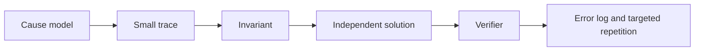

# Занятие 20. Финальный ремонт и карта курса

> Повторяем только доказанные пробелы и собираем устойчивую процедуру решения

[← Карта курса](../course-map.md) · [Предыдущее занятие](../modules/19-mock-exam-1.md) · [Эталоны и критерии](../practice/answers-and-rubrics.md)

## Сегодняшний результат

| **К концу обязательной части.** Ты закрываешь два главных пробела, воспроизводишь полный алгоритм решения и входишь в неделю зачёта без изучения новых тем. |
|-------------------------------------------------------------------------------------------------------------------------------------------------------------|

| **Параметр**          | **Значение**                                                                     |
|-----------------------|----------------------------------------------------------------------------------|
| Сложность             | Ремонт                                                                           |
| Обязательная нагрузка | 70–100 мин                                                                       |
| Перед началом         | Результаты пробного зачёта и журнал ошибок за весь комплект.                     |
| Что подготовить      | два исправленных мини-примера, финальную карту и список определений с задержками |

| **Разрешённый режим.** Исправляй два главных пробела, не перечитывай весь курс. |
|---------------------------------------------------------------------------------|

| **В этом занятии не требуется.** Не перечитывай весь комплект и не решай десять одинаковых задач. |
|--------------------------------------------------------------------------------------------|

## Обязательный маршрут

| **Этап**           | **Время** | **Результат**                     |
|--------------------|-----------|-----------------------------------|
| Retrieval          | 10 мин    | Определить два главных пробела    |
| Repair №1          | 25–35 мин | Уменьшенный пример и новый пример |
| Repair №2          | 25–35 мин | Уменьшенный пример и новый пример |
| Финальная фиксация | 10–15 мин | Правила и план лёгкого повторения |

| **Когда запрашивать помощь.** После 10–15 минут честной попытки можно сразу зафиксировать точное место остановки и запросить разбор. Не нужно сначала мучительно завершать A и B. |
|----------------------------------------------------------------------------------------------------------------------------------------------------------|

## Короткое повторение

<table>
<colgroup>
<col style="width: 33%" />
<col style="width: 33%" />
<col style="width: 33%" />
</colgroup>
<thead>
<tr class="header">
<th><strong>Когда</strong></th>
<th><strong>Объём</strong></th>
<th><strong>Что сделать</strong></th>
</tr>
</thead>
<tbody>
<tr class="odd">
<td>Вчера</td>
<td>1–2 формулировки</td>
<td>• Решение идёт в фиксированном порядке и по таймбоксу. 
• Неполный артефакт отмечается, а не маскируется догадкой.</td>
</tr>
<tr class="even">
<td>3 дня назад</td>
<td>1 формулировка</td>
<td>Для каждого преобразования: цель, предусловие, результат, риск.</td>
</tr>
<tr class="odd">
<td>7 дней назад</td>
<td>1 мини-задача</td>
<td>Собери natural loop по одному back edge.</td>
</tr>
</tbody>
</table>

| **Ограничение.** На повторение не трать больше 10 минут. Не вспомнил — сделай попытку, посмотри ответ и верни карточку на следующее повторение. |
|-----------------------------------------------------------------------------------------------------------------------------------|

## Сначала простыми словами

Финальный занятие нужен не для новой информации, а для ремонта. Для каждого пробела найди нарушенный инвариант, реши уменьшенный пример и затем новый пример на перенос.

Если правило вспоминается, но не применяется, проблема не в памяти — нужна короткая трасса. Если процедура работает, но формулировка неточна, нужна карточка и устный ответ.

### Пять терминов занятия

| **Термин**       | **Моя формулировка одним предложением** |
|------------------|-----------------------------------------|
| repair           |                                         |
| контрпример      |                                         |
| повторная трасса |                                         |
| retrieval        |                                         |
| стоп-правило     |                                         |

## Минимум для запоминания

- Repair: ошибка → нарушенный инвариант → исправленное правило → новый пример.

- Пробел закрыт только после переноса на незнакомый пример.

- За занятие ремонтируются максимум два критических пробела.

| **Не учи дословно без смысла.** Сначала объясни формулировку своими словами на маленьком примере. Точная версия нужна после понимания. |
|----------------------------------------------------------------------------------------------------------------------------------------|

## Визуальная модель

*Рабочее представление темы занятия*

## Разобранный пример — проход по шагам

<table>
<colgroup>
<col style="width: 100%" />
</colgroup>
<thead>
<tr class="header">
<th>Финальная карта: 
Linear IR 
→ leaders / basic blocks 
→ CFG + reachability 
→ Dom / idom / DF 
→ phi placement + renaming 
→ SSA verifier 
→ passes in required order 
→ loop tree / IV / LICM 
→ final CFG + SSA + effect checks</th>
</tr>
</thead>
<tbody>
</tbody>
</table>

Перепиши карту по памяти трижды: сразу, через 30 минут и вечером. Третья версия должна появиться без подглядывания.

| **Проверка понимания.** Закрой пример и объясни не итог, а почему выполняется каждый следующий шаг. Если не можешь — зафиксируй именно этот переход и запроси разбор. |
|------------------------------------------------------------------------------------------------------------------------------------------------------|

## Обязательная практика

### Задача A — обязательная по образцу: Ремонт пробела №1

| **Параметр**     | **Значение**                                                   |
|------------------|----------------------------------------------------------------|
| Статус           | Обязательно в этом занятии                                            |
| Ориентир времени | 35 мин                                                         |
| Что сдать        | правило своими словами; новый пример; отсутствие старой ошибки |

Возьми самый опасный пробел пробного зачёта. Сначала сформулируй правило, затем реши новый мини-пример, который я дам в нашей сессии.

| **Подсказка 1.** Выбери ошибку, которая ломает самый ранний этап pipeline. |
|----------------------------------------------------------------------------|

## Стандартная практика

### Задача B — стандартная для закрепления: Ремонт пробела №2

| **Параметр**     | **Значение**                                                        |
|------------------|---------------------------------------------------------------------|
| Статус           | Нужно выполнить до следующей зависимой темы; можно во второй сессии |
| Ориентир времени | 35 мин                                                              |
| Что сдать        | перенос на новый контекст; проверяемый артефакт                     |

Повтори процедуру для второго пробела. Если это определение, дай контрпример; если алгоритм — полную трассу состояния.

| **Подсказка 1.** Выбери ошибку, которая ломает самый ранний этап pipeline. |
|----------------------------------------------------------------------------|

| **Подсказка 2.** Проверяй исправление на новом, а не уже разобранном примере. |
|-------------------------------------------------------------------------------|

## Три вопроса на выходе

| **Вопрос**                                  | **Результат retrieval**         |
|---------------------------------------------|---------------------------------|
| Каков твой неизменный порядок решения?      | □ ≤15 с □ с паузой □ не ответил |
| После каких операций обязательно чинить φ?  | □ ≤15 с □ с паузой □ не ответил |
| Как быстро доказать/опровергнуть dominance? | □ ≤15 с □ с паузой □ не ответил |

## Светофор понимания

| **Состояние** | **Что это означает**                                    | **Следующее действие**                                                  |
|---------------|---------------------------------------------------------|-------------------------------------------------------------------------|
| Зелёный       | Могу объяснить и решить A/B с незначительной проверкой. | Перейти дальше; C только по желанию.                                    |
| Жёлтый        | Понимаю идею, но теряю один шаг или термин.             | Разобрать со мной уменьшенный пример; B можно закончить второй сессией. |
| Красный       | Не могу объяснить причинную модель или начать A.        | Не читать дальше; прислать попытку после 10–15 минут.                   |

| **Минимум занятия.** Занятие засчитывается, если понятна причинная модель, воспроизведён пример и выполнена задача A. Задача B должна быть закрыта до следующей темы, которая на неё опирается. |
|------------------------------------------------------------------------------------------------------------------------------------------------------------------------------------------|

## Справочник и углубление — читать по необходимости

| **Это необязательная часть первого прохода.** Открывай её, если простого объяснения недостаточно, при проверке решения или когда остались силы. Профессиональные оговорки не являются обязательным минимумом занятия. |
|--------------------------------------------------------------------------------------------------------------------------------------------------------------------------------------------------------------|

### Подробная теория

#### Новых тем сегодня нет

Последний занятие предназначен для **retrieval и repair**, а не для чтения ещё одной главы. Выбери две ошибки с наибольшим риском: высокая частота, раннее место в pipeline и большой каскад последствий.

Исправление считается завершённым только после новой задачи, отличающейся от исходной. Простое перечитывание правильного решения не доказывает навык.

#### Пятиминутная процедура

1\) leaders/blocks; 2) CFG/pred/succ/reachability; 3) Dom/idom/DF; 4) φ placement/renaming/verifier; 5) passes строго по условию; 6) loops/IV/LICM; 7) финальная проверка эффектов, φ и CFG.

Эту процедуру нужно уметь написать по памяти перед началом задачи. Она снижает когнитивную нагрузку и предотвращает пропуск ранних шагов.

#### Компактные определения

Сформулируй по 1–2 предложения для: basic block, CFG edge, dominance, idom, DF, SSA, φ, value numbering, DCE, UCE, back edge, natural loop, irreducible loop, basic IV, LICM. Затем для каждого добавь один антипример или типичную ошибку.

Точность важнее красивого слога. Избегай циклических определений вроде «доминатор — тот, кто доминирует».

#### Режим до реального зачёта

последнюю неделю перед итоговой проверкой не запускай новый большой учебный цикл. Каждый день: 10 минут retrieval definitions, одна мини-задача 20–30 минут, разбор одной ошибки. За занятие до выбранного времени — только лёгкое повторение и сон.

### Допущения учебного IR на сегодня

- У каждого базового блока ровно один терминатор; терминатор является последней инструкцией блока.

- Деление может завершиться наблюдаемой ошибкой при нуле. Его нельзя безусловно удалять или выносить, пока не доказаны безопасность и допустимость спекуляции.

- print, store, volatile/atomic операции и неизвестный вызов имеют наблюдаемый эффект. Вызов считается чистым только при явной пометке pure/readonly в условии.

### Дополнительная задача

### Задача C — необязательный перенос: Финальный retrieval

| **Параметр**     | **Значение**                                     |
|------------------|--------------------------------------------------|
| Статус           | Только если осталось внимание                    |
| Ориентир времени | 20 мин                                           |
| Что сдать        | полный pipeline; 15 определений; список задержек |

Без конспекта выпиши pipeline и 15 определений. Отметь ответы, где понадобилось больше 15 секунд.

| **Подсказка 1.** Выбери ошибку, которая ломает самый ранний этап pipeline. |
|----------------------------------------------------------------------------|

| **Подсказка 2.** Проверяй исправление на новом, а не уже разобранном примере. |
|-------------------------------------------------------------------------------|

### Полная устная проверка

| **Вопрос**                                       | **Результат retrieval**         |
|--------------------------------------------------|---------------------------------|
| Каков твой неизменный порядок решения?           | □ ≤15 с □ с паузой □ не ответил |
| После каких операций обязательно чинить φ?       | □ ≤15 с □ с паузой □ не ответил |
| Как быстро доказать/опровергнуть dominance?      | □ ≤15 с □ с паузой □ не ответил |
| Какие условия делают LICM безопасным?            | □ ≤15 с □ с паузой □ не ответил |
| Как отличить natural loop от irreducible region? | □ ≤15 с □ с паузой □ не ответил |

### Журнал ошибок

| **Ошибка / сомнение** | **Первый нарушенный инвариант** | **Исправленное правило** | **Новый пример / итерация** |
|-----------------------|---------------------------------|--------------------------|-------------------------|
|                       |                                 |                          |                         |
|                       |                                 |                          |                         |
|                       |                                 |                          |                         |
|                       |                                 |                          |                         |
|                       |                                 |                          |                         |

### План повторения

| **Когда**    | **Что повторить**                                                   |
|--------------|---------------------------------------------------------------------|
| Завтра       | 3 пункта минимального блока и задача A.                             |
| Через 3 дня  | Один алгоритм или стандартная задача B.                             |
| Через 7 дней | Ответь на 15 ключевых определений, не задерживаясь более 15 секунд. |

### Как получить обратную связь

**Сообщение для начала ежедневной сессии**

<table>
<colgroup>
<col style="width: 100%" />
</colgroup>
<thead>
<tr class="header">
<th>Я работаю по документу «Финальный ремонт и компактная карта зачёта» (версия 3.0). Я могу обратиться уже после 10–15 минут честной попытки. 
 
Моя текущая зона: зелёная / жёлтая / красная. 
Моя попытка и точное место остановки: ... 
 
Работай так: 
1. Сначала проверь мою причинную модель простым вопросом, не выдавая решение. 
2. Если модель неверна, объясни тему на одном меньшем примере и попроси меня пересказать. 
3. Найди только первую существенную ошибку: место, нарушенный инвариант и минимальный контрпример. 
4. Дай мне исправить её самостоятельно. 
5. После исправления дай одну короткую задачу на перенос. 
6. В конце назови: что я уже понимаю, что пока понимаю с подсказкой и что повторить на следующей сессии.</th>
</tr>
</thead>
<tbody>
</tbody>
</table>

## Точечное чтение

- Никакого нового чтения: retrieval, repair и сон перед зачётом.

| **Стоп чтения.** Прекрати чтение, когда можешь воспроизвести определение/алгоритм и решить задачу B. Дополнительные страницы не заменяют практику. |
|----------------------------------------------------------------------------------------------------------------------------------------------------|
